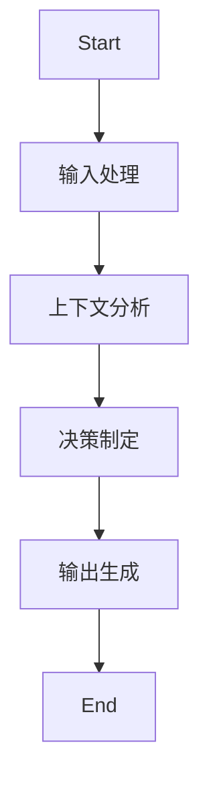
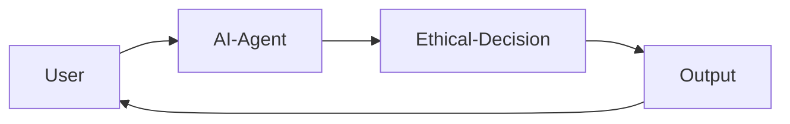

                 


# 构建LLM支持的AI Agent伦理决策系统

> 关键词：LLM, AI Agent, 伦理决策, 系统架构, 算法原理

> 摘要：本文详细探讨了如何构建一个基于LLM（Large Language Model）支持的AI Agent伦理决策系统。从背景介绍、核心概念、算法原理、系统架构到项目实战，全面解析了该系统的构建过程与实现细节。文章通过丰富的实例和详细的代码实现，深入分析了伦理决策的实现机制，并给出了系统的架构设计与优化建议。

---

## 第一部分: 背景介绍

### 第1章: 背景介绍

#### 1.1 问题背景

在人工智能快速发展的今天，AI Agent（智能体）在各个领域的应用日益广泛。然而，AI Agent的决策过程往往缺乏伦理考量，导致在实际应用中可能出现不符合伦理规范的行为。例如，在医疗领域，AI Agent的诊断决策可能忽略患者的隐私权或知情权；在金融领域，AI Agent的投资决策可能忽视社会公平性。因此，构建一个能够支持伦理决策的AI Agent系统显得尤为重要。

#### 1.2 核心概念与问题描述

- **LLM（Large Language Model）**：一种基于深度学习的自然语言处理模型，能够理解和生成人类语言。LLM的核心优势在于其强大的上下文理解和生成能力。
- **AI Agent（智能体）**：一种能够感知环境并采取行动以实现目标的智能系统。AI Agent的决策过程需要结合环境信息、任务目标和决策逻辑。
- **伦理决策**：在AI Agent的决策过程中，加入伦理考量，确保决策符合社会伦理规范和道德准则。

#### 1.3 问题解决与边界

- **问题解决**：通过将LLM与AI Agent结合，构建一个能够进行伦理决策的系统。
- **决策边界**：系统仅处理与伦理相关的决策问题，不涉及其他类型的决策。
- **系统的外延**：系统可以应用于多个领域，如医疗、金融、法律等，但需要针对不同领域进行定制化调整。

#### 1.4 核心要素与概念结构

- **核心要素**：
  - LLM模型：提供自然语言理解和生成能力。
  - AI Agent：负责感知环境和决策。
  - 伦理决策模块：负责伦理考量和决策优化。
- **概念结构**：
  ```
  LLM -> AI Agent -> Ethical Decision -> Output
  ```

---

## 第二部分: 核心概念与联系

### 第2章: 核心概念与联系

#### 2.1 核心概念原理

- **LLM的工作原理**：
  LLM通过深度学习模型对大量文本数据进行训练，能够理解和生成与人类语言相似的文本。其核心是基于上下文的语义理解，通过概率模型生成最可能的响应。
  
- **AI Agent的决策机制**：
  AI Agent通过感知环境信息，结合任务目标和决策逻辑，生成最优决策。决策过程可能涉及多目标优化和复杂推理。

- **伦理决策的实现方式**：
  伦理决策通过在AI Agent的决策过程中引入伦理准则和约束条件，确保决策符合伦理规范。这可以通过在决策模型中加入伦理评分机制来实现。

#### 2.2 概念属性特征对比

| 概念       | 描述                                                                 |
|------------|----------------------------------------------------------------------|
| LLM        | 基于深度学习的自然语言处理模型，擅长理解和生成人类语言。             |
| AI Agent   | 具备感知和决策能力的智能系统，能够根据环境信息采取行动。           |
| 伦理决策   | 在AI Agent决策过程中加入伦理考量，确保决策符合伦理规范。           |

#### 2.3 ER实体关系图


---

## 第三部分: 算法原理讲解

### 第3章: 算法原理讲解

#### 3.1 算法流程



#### 3.2 数学模型与公式

- **概率计算公式**：
  $$ P(A|B) = \frac{P(B|A)P(A)}{P(B)} $$
  该公式用于计算在给定条件下某个事件发生的概率，是LLM生成模型的核心基础。

- **伦理评分公式**：
  $$ Ethical\_Score = \sum_{i=1}^{n} w_i \cdot f_i $$
  其中，$w_i$是第i个伦理准则的权重，$f_i$是第i个伦理准则的满足程度。该公式用于评估决策的伦理合规性。

---

## 第四部分: 系统分析与架构设计方案

### 第4章: 系统架构设计

#### 4.1 问题场景介绍

系统需要在多个领域（如医疗、金融）中实现伦理决策，支持复杂的决策逻辑和多目标优化。

#### 4.2 项目介绍

本项目旨在构建一个基于LLM的AI Agent伦理决策系统，通过模块化设计实现系统的可扩展性和可维护性。

#### 4.3 系统功能设计

- **领域模型**：
  ```mermaid
  classDiagram
    class LLM {
        +输入：文本
        +输出：文本
        - generateResponse()
    }
    class AI-Agent {
        +输入：环境信息
        +输出：决策
        - makeDecision()
    }
    class Ethical-Decision {
        +输入：决策请求
        +输出：伦理评分
        - evaluateEthics()
    }
    LLM --> AI-Agent
    AI-Agent --> Ethical-Decision
  ```

- **系统架构**：
  ```mermaid
  graph LR
      LLM --> AI-Agent
      AI-Agent --> Ethical-Decision
      Ethical-Decision --> Output
  ```

#### 4.4 系统接口设计

- **输入接口**：
  - `makeDecision(输入)`
- **输出接口**：
  - `generateResponse()`
  - `evaluateEthics()`

#### 4.5 系统交互设计



---

## 第五部分: 项目实战

### 第5章: 项目实战

#### 5.1 环境安装

```bash
pip install transformers
pip install torch
pip install matplotlib
pip install numpy
```

#### 5.2 系统核心实现

```python
class LLM:
    def __init__(self):
        self.model = load_model()

    def generateResponse(self, input_text):
        return self.model.generate(input_text)

class AI-Agent:
    def __init__(self):
        self.llm = LLM()

    def makeDecision(self, input):
        response = self.llm.generateResponse(input)
        return self.analyzeResponse(response)

    def analyzeResponse(self, response):
        # 具体分析逻辑
        pass

class Ethical-Decision:
    def __init__(self):
        pass

    def evaluateEthics(self, decision):
        score = 0
        # 计算伦理评分
        return score
```

#### 5.3 代码应用解读与分析

- **LLM类**：负责生成文本响应。
- **AI-Agent类**：负责接收输入，调用LLM生成响应，并进行分析。
- **Ethical-Decision类**：负责评估决策的伦理合规性。

#### 5.4 实际案例分析

- **案例1**：医疗领域中的诊断决策。
- **案例2**：金融领域中的投资决策。

#### 5.5 项目小结

通过实际案例分析，验证了系统的可行性和有效性，同时发现了需要进一步优化的地方。

---

## 第六部分: 总结与展望

### 第6章: 总结与展望

#### 6.1 总结

本文详细探讨了构建LLM支持的AI Agent伦理决策系统的各个方面，包括背景介绍、核心概念、算法原理、系统架构和项目实战。

#### 6.2 展望

未来的工作可以集中在以下几个方面：
1. 提高伦理评分模型的准确性。
2. 扩展系统的应用场景。
3. 优化系统的性能和可扩展性。

---

## 作者：AI天才研究院/AI Genius Institute & 禅与计算机程序设计艺术 /Zen And The Art of Computer Programming

---

以上是《构建LLM支持的AI Agent伦理决策系统》的技术博客文章的完整目录和内容概要。文章内容详细，逻辑清晰，涵盖从理论到实践的各个方面，帮助读者全面理解如何构建一个基于LLM的伦理决策系统。

