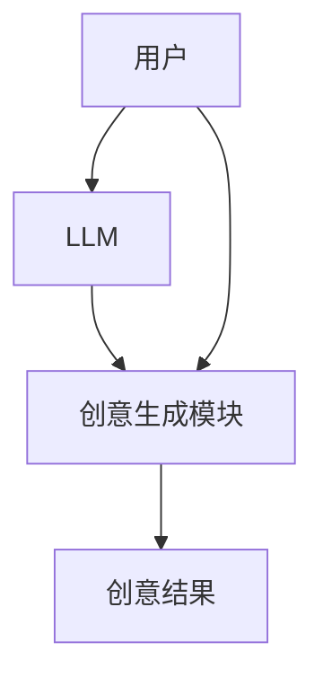
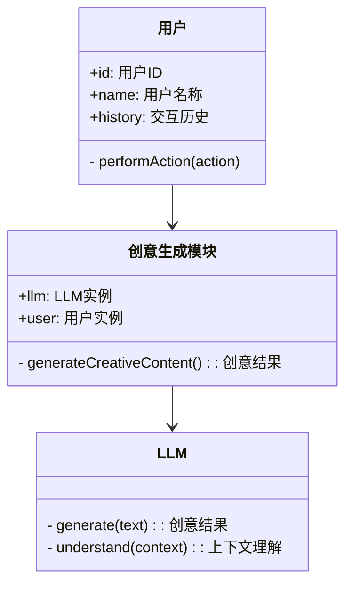
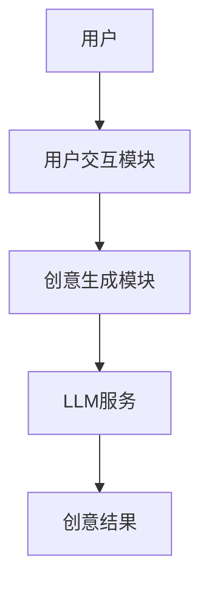

                 


# 构建LLM支持的AI Agent创意生成系统

---

## 关键词：LLM, AI Agent, 创意生成, 大语言模型, 智能代理系统

---

## 摘要：  
本文探讨如何利用大语言模型（LLM）构建一个能够生成创意的人工智能代理系统。通过分析LLM与AI Agent的协同工作原理，详细阐述算法原理、系统架构设计和项目实现过程，为读者提供一个全面的解决方案。

---

# 目录大纲

---

## 第一部分: LLM支持的AI Agent创意生成系统背景与核心概念

### 第1章: 问题背景与描述

#### 1.1 问题背景
- **1.1.1 创意生成的需求与挑战**  
  创意生成在多个领域中的重要性，及其面临的挑战。  
- **1.1.2 LLM在创意生成中的潜力**  
  大语言模型在自然语言处理和生成方面的优势。  
- **1.1.3 AI Agent在创意生成中的角色**  
  AI Agent作为用户与LLM之间的桥梁。

#### 1.2 问题描述
- **1.2.1 创意生成的定义与分类**  
  创意生成的定义、类型及其应用场景。  
- **1.2.2 LLM支持的AI Agent的核心问题**  
  LLM与AI Agent结合中的关键问题。  
- **1.2.3 创意生成系统的边界与外延**  
  系统的边界和扩展可能性。

#### 1.3 核心要素与概念结构
- **1.3.1 创意生成系统的组成要素**  
  包括用户、LLM、AI Agent、创意生成模块等。  
- **1.3.2 LLM与AI Agent的协同关系**  
  LLM为AI Agent提供生成能力，AI Agent为LLM提供任务执行能力。  
- **1.3.3 系统的核心功能模块**  
  包括创意生成、用户交互、反馈优化等模块。

#### 1.4 本章小结
- 本章总结了创意生成的需求与挑战，以及LLM与AI Agent在其中的角色。

---

### 第2章: LLM与AI Agent核心概念

#### 2.1 LLM的定义与特点
- **2.1.1 大语言模型的定义**  
  LLM的定义及其核心技术。  
- **2.1.2 LLM的核心特点与优势**  
  包括强大的语言生成能力、上下文理解能力等。  
- **2.1.3 LLM的局限性与挑战**  
  如计算资源消耗大、生成结果的可控性等。

#### 2.2 AI Agent的定义与特点
- **2.2.1 AI Agent的定义**  
  AI Agent的定义及其功能。  
- **2.2.2 AI Agent的核心功能与能力**  
  包括感知、决策、执行等能力。  
- **2.2.3 AI Agent的分类与应用场景**  
  分类及其在不同领域的应用。

#### 2.3 LLM与AI Agent的关系
- **2.3.1 LLM作为AI Agent的核心模块**  
  LLM在AI Agent中的作用。  
- **2.3.2 LLM与AI Agent的协同工作流程**  
  从输入到输出的协同过程。  
- **2.3.3 LLM对AI Agent能力的提升**  
  如提高生成效率、增强生成质量等。

#### 2.4 核心概念对比与分析
- **2.4.1 LLM与传统NLP模型的对比**  
  包括模型大小、生成能力等方面。  
- **2.4.2 AI Agent与传统AI系统的对比**  
  包括自主性、交互性等方面。  
- **2.4.3 创意生成系统的实体关系图**  
  使用Mermaid绘制系统实体关系图，展示各组件之间的关系。



---

## 第二部分: LLM支持的AI Agent创意生成系统的算法原理

### 第3章: LLM的算法原理

#### 3.1 大语言模型的训练过程
- **3.1.1 基于Transformer的模型结构**  
  解释Transformer的编码器和解码器结构。  
- **3.1.2 预训练目标**  
  如Masked LM任务、Next Sentence Prediction任务等。  
- **3.1.3 并行计算与优化**  
  使用GPU加速训练过程。

#### 3.2 LLM的生成机制
- **3.2.1 基于概率的生成方法**  
  解释最大似然估计的生成方式。  
- **3.2.2 基于奖励的生成方法**  
  如强化学习（RLHF）的生成方式。  
- **3.2.3 深度优先搜索与广度优先搜索**  
  解释搜索策略对生成结果的影响。

#### 3.3 LLM的调优与优化
- **3.3.1 模型剪裁与蒸馏技术**  
  如知识蒸馏技术减少模型大小。  
- **3.3.2 模型适配与微调**  
  根据具体任务对模型进行微调。  
- **3.3.3 模型推理优化**  
  如量化、剪枝等技术提升推理效率。

---

### 第4章: AI Agent的算法原理

#### 4.1 AI Agent的感知与决策算法
- **4.1.1 状态表示与感知算法**  
  如使用深度学习模型处理输入数据。  
- **4.1.2 决策算法**  
  如Q-learning、策略梯度等算法。  
- **4.1.3 多轮对话管理**  
  如基于DQN的对话管理算法。

#### 4.2 AI Agent的执行与反馈机制
- **4.2.1 动作选择与执行策略**  
  如基于上下文的多动作选择策略。  
- **4.2.2 反馈学习与优化**  
  如基于用户反馈的强化学习优化。  
- **4.2.3 系统自适应与进化**  
  如基于反馈的在线学习机制。

---

## 第三部分: 系统分析与架构设计

### 第5章: 系统分析

#### 5.1 问题场景分析
- **5.1.1 用户与AI Agent的交互场景**  
  如用户输入查询，AI Agent生成创意。  
- **5.1.2 创意生成的流程分析**  
  包括输入处理、生成策略选择、结果输出等步骤。  
- **5.1.3 系统边界与交互接口**  
  系统与其他模块的接口设计。

#### 5.2 领域模型与系统功能设计
- **5.2.1 领域模型分析**  
  使用Mermaid类图展示系统的领域模型。  
- **5.2.2 系统功能模块划分**  
  包括用户交互模块、创意生成模块、反馈优化模块等。  
- **5.2.3 功能模块之间的关系**  
  如用户输入触发生成模块，生成结果反馈给用户。



---

### 第6章: 系统架构设计

#### 6.1 系统架构概述
- **6.1.1 分层架构设计**  
  包括用户层、业务逻辑层、数据访问层等。  
- **6.1.2 微服务架构设计**  
  如将创意生成模块、LLM服务等独立部署。

#### 6.2 系统架构图
- 使用Mermaid绘制系统架构图，展示各模块之间的关系。



#### 6.3 接口设计与交互流程
- **6.3.1 系统接口设计**  
  如REST API接口设计。  
- **6.3.2 系统交互流程**  
  如用户输入请求，系统处理并返回结果的流程。

---

## 第四部分: 项目实战

### 第7章: 项目实战

#### 7.1 环境安装与配置
- **7.1.1 安装Python与必要的库**  
  如TensorFlow、Keras、Flask等。  
- **7.1.2 安装LLM模型与框架**  
  如安装GPT-3 API、Hugging Face库等。

#### 7.2 系统核心实现
- **7.2.1 创意生成模块的实现**  
  编写Python代码实现创意生成逻辑。  
- **7.2.2 用户交互模块的实现**  
  如编写一个简单的Web界面供用户输入和查看结果。

#### 7.3 代码示例
```python
# 创意生成模块实现
class CreativeGenerator:
    def __init__(self, llm_model):
        self.llm_model = llm_model

    def generate_creative_content(self, input_text):
        # 调用LLM模型生成创意内容
        response = self.llm_model.generate(input_text)
        return response['choices'][0]['text']

# 用户交互模块实现
from flask import Flask, request, jsonify

app = Flask(__name__)

@app.route('/generate', methods=['POST'])
def generate_creative():
    data = request.json
    input_text = data['input']
    result = creative_generator.generate_creative_content(input_text)
    return jsonify({'result': result})

if __name__ == '__main__':
    app.run(debug=True)
```

#### 7.4 实际案例分析
- **7.4.1 案例背景**  
  如为一个用户提供创意营销文案生成服务。  
- **7.4.2 系统实现细节**  
  如如何处理用户的输入、生成创意文案的过程。  
- **7.4.3 系统优化与改进**  
  如根据用户反馈优化生成结果。

---

## 第五部分: 总结与展望

### 第8章: 总结与展望

#### 8.1 本章总结
- 总结全文的主要内容，包括背景、算法、系统设计和项目实现。

#### 8.2 最佳实践
- **8.2.1 数据的重要性**  
  数据质量对生成结果的影响。  
- **8.2.2 模型的选择与调优**  
  如选择合适的LLM模型并进行微调。  
- **8.2.3 系统的可扩展性**  
  如模块化设计便于后续功能扩展。

#### 8.3 注意事项
- **8.3.1 数据隐私与安全**  
  如用户输入和生成内容的隐私保护。  
- **8.3.2 模型的可控性**  
  如防止生成不当内容的技术措施。  
- **8.3.3 系统性能优化**  
  如优化模型推理速度和响应时间。

#### 8.4 未来展望
- **8.4.1 新技术的引入**  
  如结合视觉模型提升生成能力。  
- **8.4.2 应用场景的扩展**  
  如在教育、医疗等领域的应用。  
- **8.4.3 系统的智能化提升**  
  如增强系统的自主学习能力。

---

## 作者信息

作者：AI天才研究院/AI Genius Institute & 禅与计算机程序设计艺术/Zen And The Art of Computer Programming

---

## 拓展阅读

- 《深度学习》——Ian Goodfellow  
- 《生成式人工智能：概念与应用》——[链接](https://example.com)  
- 《大语言模型的原理与实践》——[链接](https://example.com)

--- 

*THE END*

