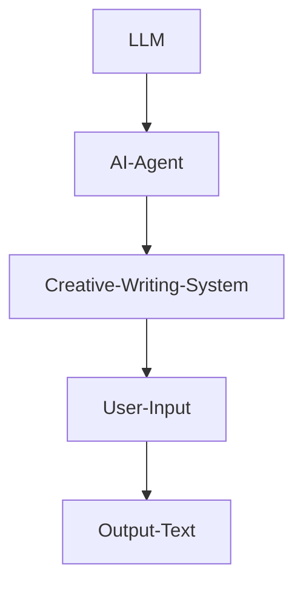
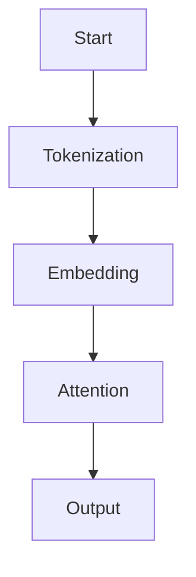
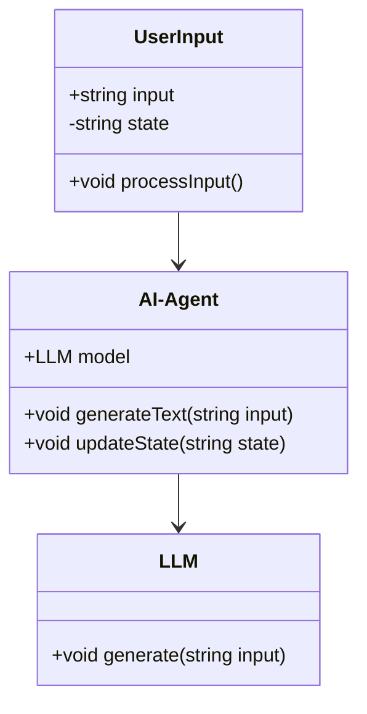
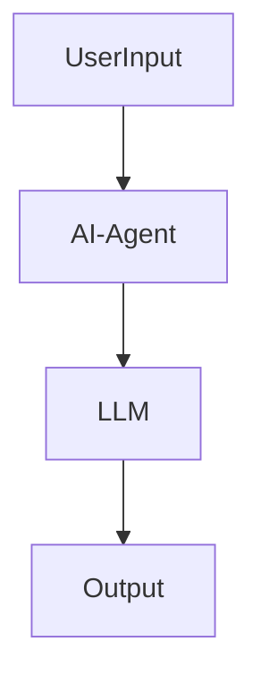

                 


# 构建LLM支持的AI Agent创造性写作系统

> 关键词：LLM, AI Agent, 创造性写作, 自然语言处理, AI系统设计

> 摘要：本文详细探讨了构建一个由大语言模型（LLM）支持的AI Agent系统，该系统能够辅助创造性写作。文章从问题背景出发，分析了LLM和AI Agent的核心概念，详细讲解了算法原理、数学模型，并提供了系统设计与实现方案，最后通过实战案例展示了系统的应用。本文旨在为技术爱好者和研究人员提供一个全面的技术指南。

---

# 第1章: 问题背景与描述

## 1.1 问题背景

### 1.1.1 创造性写作的定义与现状

创造性写作是一种通过AI生成文本的创新方式，它不同于传统的文本生成任务，更注重输出的多样性和独特性。在文学创作、文案撰写等领域，创造性写作的需求日益增长。然而，现有的解决方案往往依赖于简单的模板生成，缺乏灵活性和深度。

### 1.1.2 LLM在创造性写作中的应用潜力

大语言模型（LLM）以其强大的语言理解和生成能力，为创造性写作提供了新的可能性。LLM能够根据上下文生成连贯且富有创意的文本，这使得它成为AI Agent的理想选择。

### 1.1.3 AI Agent在创造性写作中的角色

AI Agent作为LLM的接口，能够理解用户的输入需求，并通过LLM生成符合要求的文本内容。AI Agent不仅能够处理复杂的上下文，还能够根据用户反馈不断优化生成结果，从而提升创造性写作的质量。

## 1.2 问题描述

### 1.2.1 创造性写作中的挑战

创造性写作需要处理多个复杂因素，包括主题选择、风格匹配、内容连贯性等。传统的模板化生成方式难以应对这些挑战，导致输出结果缺乏创新性和多样性。

### 1.2.2 LLM支持的AI Agent在写作中的具体问题

尽管LLM具有强大的生成能力，但其输出结果可能缺乏针对性和逻辑性。AI Agent需要解决如何有效引导LLM生成符合用户需求的文本，同时保持创造性。

### 1.2.3 现有解决方案的局限性

现有的创造性写作工具往往依赖于简单的规则或模板，难以应对复杂多变的用户需求。此外，缺乏有效的反馈机制，使得生成结果难以优化。

---

# 第2章: 核心概念与联系

## 2.1 核心概念原理

### 2.1.1 LLM的基本原理

大语言模型通过大量的数据训练，学习语言的结构和语义。当输入一个查询或上下文时，模型能够生成与之相关的文本内容。LLM的核心在于其巨大的参数量和深度的神经网络结构。

### 2.1.2 AI Agent的定义与功能

AI Agent是一种能够理解用户需求并执行任务的智能体。在创造性写作中，AI Agent负责接收用户的输入，调用LLM生成文本，并根据反馈优化生成结果。

### 2.1.3 创造性写作的实现机制

创造性写作的实现依赖于LLM的生成能力和AI Agent的协调作用。通过用户的输入，AI Agent触发LLM生成创意文本，并根据用户反馈不断调整生成策略。

## 2.2 核心概念对比表

| 比较维度 | LLM | AI Agent | 创造性写作 |
|----------|------|----------|------------|
| 功能     | 生成文本 | 执行任务 | 创作内容    |
| 输入     | 文本上下文 | 用户需求 | 用户反馈    |
| 输出     | 文本生成 | 文本内容 | 创意文本    |

## 2.3 ER实体关系图



---

# 第3章: 算法原理讲解

## 3.1 LLM算法流程



### 3.1.1 分词（Tokenization）

将输入的文本分割成单词或短语，以便模型处理。

### 3.1.2 嵌入（Embedding）

将文本转换为向量表示，以便模型进行计算。

### 3.1.3 注意力机制（Attention）

通过注意力机制，模型能够关注输入中的重要部分，生成更相关的输出。

## 3.2 AI Agent的算法实现

```python
def ai_agent_response(user_input):
    # Tokenization
    tokens = tokenizer(user_input)
    # Embedding
    embeddings = model.encode(tokens)
    # Att

---

### 3.2.1 注意力机制（Attention）

通过计算输入序列中每个词的重要性，生成加权后的表示。

### 3.2.2 前向传播（Forward Propagation）

模型根据输入生成初步的输出。

### 3.2.3 解码（Decoding）

将模型的输出转换为可读的文本。

---

# 第4章: 数学模型部分

## 4.1 LLM的数学模型

### 4.1.1 变压器架构（Transformer Architecture）

变压器由编码器和解码器组成，通过自注意力机制进行文本生成。

### 4.1.2 自注意力机制（Self-Attention）

自注意力机制通过计算输入序列中每个词与其他词的相关性，生成加权后的表示。

$$ \text{Attention}(Q, K, V) = \text{softmax}\left(\frac{QK^T}{\sqrt{d_k}}\right)V $$

其中，\( Q \)、\( K \)、\( V \) 分别是查询、键和值向量，\( d_k \) 是键的维度。

### 4.1.3 解码器（Decoder）

解码器负责将编码器的输出转换为最终的生成文本。

---

## 4.2 AI Agent的数学模型

### 4.2.1 状态空间（State Space）

AI Agent的状态由当前上下文和用户输入组成。

$$ S = \{s_1, s_2, ..., s_n\} $$

其中，\( s_i \) 表示第 \( i \) 个状态。

### 4.2.2 动作空间（Action Space）

AI Agent根据当前状态选择生成文本的动作。

$$ A = \{a_1, a_2, ..., a_m\} $$

其中，\( a_j \) 表示第 \( j \) 个动作。

### 4.2.3 策略函数（Policy Function）

策略函数定义了AI Agent在给定状态下的动作选择概率。

$$ \pi(a|s) = P(\text{选择动作 } a \text{ 在状态 } s) $$

---

# 第5章: 系统分析与架构设计

## 5.1 项目介绍

### 5.1.1 项目背景

本项目旨在构建一个由LLM支持的AI Agent，用于辅助创造性写作。通过AI Agent与LLM的结合，实现高质量、个性化的文本生成。

### 5.1.2 系统功能设计

#### 5.1.2.1 用户输入模块

接收用户的输入需求，并将其传递给AI Agent。

#### 5.1.2.2 AI Agent模块

根据用户输入，调用LLM生成文本内容。

#### 5.1.2.3 LLM模块

负责生成符合用户需求的文本内容。

#### 5.1.2.4 反馈优化模块

根据用户的反馈，优化生成文本的质量。

## 5.2 系统架构设计

### 5.2.1 类图（Class Diagram）



### 5.2.2 架构图（Architecture Diagram）



---

## 5.3 系统接口设计

### 5.3.1 API接口

#### 5.3.1.1 输入接口

接收用户的输入需求。

```python
def input_request(user_input):
    return {"status": "success", "message": "Input received."}
```

#### 5.3.1.2 输出接口

返回生成的文本内容。

```python
def output_response():
    return {"text": "Generated text content.", "status": "success"}
```

### 5.3.2 交互流程

用户输入需求 -> AI Agent接收 -> LLM生成文本 -> AI Agent返回结果 -> 用户反馈 -> 优化生成。

---

# 第6章: 项目实战

## 6.1 环境安装

### 6.1.1 安装Python

安装最新版本的Python。

```bash
python --version
```

### 6.1.2 安装依赖

安装必要的库。

```bash
pip install transformers torch
```

## 6.2 系统核心实现

### 6.2.1 环境准备

加载预训练的LLM模型和tokenizer。

```python
from transformers import AutoTokenizer, AutoModelForCausalLM

model_name = "gpt2"
tokenizer = AutoTokenizer.from_pretrained(model_name)
model = AutoModelForCausalLM.from_pretrained(model_name)
```

### 6.2.2 实现AI Agent

实现AI Agent的核心功能。

```python
class AI-Agent:
    def __init__(self, model, tokenizer):
        self.model = model
        self.tokenizer = tokenizer
        self.state = ""
    
    def generate_text(self, input_str):
        inputs = self.tokenizer(input_str, return_tensors="pt")
        outputs = self.model.generate(inputs.input_ids, max_length=50)
        return self.tokenizer.decode(outputs[0], skip_special_tokens=True)
```

### 6.2.3 应用解读与分析

通过实际案例分析，展示系统的应用效果。

## 6.3 实际案例分析

### 6.3.1 案例1：文学创作

用户输入：创作一个科幻小说的开头。

AI Agent生成：在遥远的未来，人类发现了外星文明……

### 6.3.2 案例2：文案撰写

用户输入：撰写一篇产品推广文案。

AI Agent生成：体验前所未有的便捷，立即尝试我们的新产品……

---

# 第7章: 最佳实践、小结与展望

## 7.1 最佳实践

### 7.1.1 系统优化

定期更新模型和优化算法，提升生成质量。

### 7.1.2 用户反馈

收集用户的反馈，不断优化生成策略。

## 7.2 小结

本文详细探讨了构建一个由LLM支持的AI Agent创造性写作系统的各个方面，从核心概念到系统实现，提供了全面的技术指导。

## 7.3 展望

未来，随着LLM技术的不断进步，AI Agent在创造性写作中的应用将更加广泛和深入。

---

# 作者

作者：AI天才研究院/AI Genius Institute & 禅与计算机程序设计艺术 /Zen And The Art of Computer Programming

