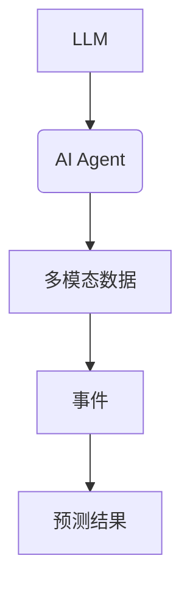
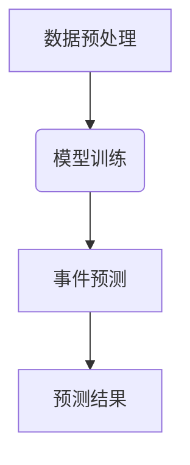
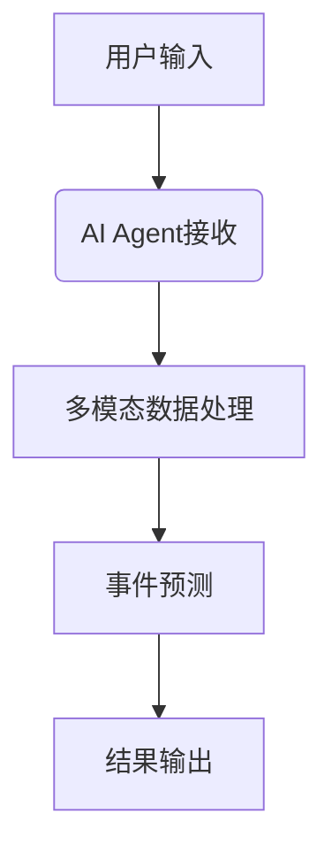

                 


# 构建LLM支持的AI Agent多模态事件预测

## 关键词：LLM、AI Agent、多模态事件预测、算法原理、系统架构、项目实战

## 摘要：  
本文将详细探讨如何构建一个基于大语言模型（LLM）的AI Agent，以支持多模态事件预测。通过分析多模态数据的融合方法、LLM与AI Agent的协同工作原理，以及系统架构设计，本文将为读者提供一个全面的解决方案。从背景介绍到实战代码，本文将逐步引导读者理解并实现这一复杂而强大的技术。

---

## 第一部分: 构建LLM支持的AI Agent多模态事件预测概述

### 第1章: LLM与AI Agent基础

#### 1.1 LLM与AI Agent的定义与特点
##### 1.1.1 大语言模型（LLM）的定义
大语言模型（LLM，Large Language Model）是指基于深度学习技术训练的大型神经网络模型，如GPT系列、BERT系列等。LLM能够理解和生成自然语言文本，并通过大量数据学习语言的模式和语义。

##### 1.1.2 AI Agent的核心特点
AI Agent（智能体）是指能够感知环境、执行任务并做出决策的智能系统。AI Agent可以通过传感器或其他输入方式获取数据，结合内部模型进行分析和推理，最终输出行动或结果。

##### 1.1.3 LLM与AI Agent的结合
LLM为AI Agent提供了强大的语言理解和生成能力，使其能够处理复杂且多样化的任务。通过LLM的支持，AI Agent可以更高效地进行信息处理、推理和决策。

#### 1.2 多模态事件预测的背景与意义
##### 1.2.1 事件预测的定义与分类
事件预测是指基于历史数据和当前状态，预测未来可能发生的事件。多模态事件预测涉及多种数据类型的融合，如文本、图像、语音等。

##### 1.2.2 多模态数据的定义与特点
多模态数据指的是来自不同感官或数据源的信息，具有多样性和互补性。通过多模态数据的融合，可以提高事件预测的准确性和鲁棒性。

##### 1.2.3 LLM支持的多模态事件预测的优势
LLM能够处理和生成自然语言文本，结合其他模态数据（如图像、语音），可以实现更全面的事件理解和预测。

---

### 第2章: LLM支持的AI Agent多模态事件预测的核心概念

#### 2.1 核心概念与联系
##### 2.1.1 LLM、AI Agent与多模态数据的关系
- LLM作为AI Agent的核心模块，负责处理和生成文本信息。
- AI Agent通过整合多模态数据（如图像、语音）进行事件预测。
- 多模态数据的融合为LLM提供了更丰富的上下文信息。

##### 2.1.2 多模态事件预测的实体关系图


#### 2.2 算法原理
##### 2.2.1 多模态数据的表示方法
- 文本数据可以通过词嵌入（如Word2Vec、BERT）进行表示。
- 图像数据可以通过卷积神经网络（CNN）提取特征。
- 语音数据可以通过循环神经网络（RNN）或变换模型（如Wav2Vec）进行处理。

##### 2.2.2 多模态融合的数学模型
$$p(y|x) = \prod_{i=1}^{n} p(y|x_i)$$

其中，$x_i$ 表示不同模态的数据，$y$ 是预测的事件。

---

## 第二部分: 算法原理与数学模型

### 第3章: 算法原理与数学模型

#### 3.1 多模态数据的融合方法
##### 3.1.1 多模态数据的表示方法
- 文本：使用预训练的LLM（如GPT、BERT）生成文本表示。
- 图像：使用CNN提取图像特征向量。
- 语音：使用Wav2Vec提取语音特征。

##### 3.1.2 多模态融合的数学模型
$$p(y|x) = \frac{p(y|x_1)p(y|x_2)...p(y|x_n)}{p(x_1)p(x_2)...p(x_n)}$$

其中，$x_i$ 是不同模态的数据，$y$ 是预测的事件。

#### 3.2 LLM在事件预测中的应用
##### 3.2.1 LLM的文本处理流程
1. 输入文本数据。
2. LLM生成文本表示。
3. 文本表示与其他模态数据融合。
4. 融合后的特征用于事件预测。

##### 3.2.2 多模态事件预测的联合概率模型
$$p(y|x) = \prod_{i=1}^{n} p(y|x_i)$$

---

## 第三部分: 系统架构与设计

### 第4章: 系统架构与设计

#### 4.1 系统架构设计
##### 4.1.1 系统模块
- 数据预处理模块：处理多模态数据，提取特征。
- 模型训练模块：训练LLM和其他模态模型。
- 事件预测模块：融合多模态特征，输出预测结果。

##### 4.1.2 系统功能设计


#### 4.2 系统架构设计
##### 4.2.1 系统架构图


---

## 第四部分: 项目实战与总结

### 第5章: 项目实战

#### 5.1 环境配置
- Python 3.8+
- PyTorch 1.9+
- Hugging Face Transformers库

#### 5.2 核心代码实现
##### 5.2.1 数据预处理
```python
import torch
from torch.utils.data import Dataset, DataLoader

class MultiModalDataset(Dataset):
    def __init__(self, texts, images, labels):
        self.texts = texts
        self.images = images
        self.labels = labels

    def __len__(self):
        return len(self.texts)

    def __getitem__(self, idx):
        text = self.texts[idx]
        image = self.images[idx]
        label = self.labels[idx]
        return text, image, label
```

##### 5.2.2 模型训练
```python
from transformers import AutoTokenizer, AutoModel
import torch.nn as nn

class MultiModalModel(nn.Module):
    def __init__(self, text_model_name, image_model_name):
        super().__init__()
        self.text_model = AutoModel.from_pretrained(text_model_name)
        self.image_model = AutoModel.from_pretrained(image_model_name)
        self.classifier = nn.Linear(2*768, 1)  # 假设输出维度为1

    def forward(self, text_input, image_input):
        text_feat = self.text_model(text_input)[0][:, 0, :]
        image_feat = self.image_model(image_input)[0][:, 0, :]
        combined_feat = torch.cat((text_feat, image_feat), dim=-1)
        output = self.classifier(combined_feat)
        return output
```

##### 5.2.3 系统交互流程


#### 5.3 项目小结
通过本项目的实现，我们可以看到，构建一个LLM支持的AI Agent多模态事件预测系统需要综合考虑数据处理、模型训练和系统设计等多个方面。实践过程中，需要注意不同模态数据的融合方式，以及模型的调优和优化。

---

## 第五部分: 展望与总结

### 第6章: 展望与总结

#### 6.1 未来展望
- 多模态模型的进一步融合：探索更高效的数据表示方法，如对比学习、自注意力机制。
- 多模态事件预测的实时性：优化模型推理速度，降低计算成本。
- 应用场景的扩展：将多模态事件预测应用于更多领域，如医疗、金融、教育等。

#### 6.2 最佳实践 Tips
- 数据预处理阶段：确保数据的多样性和质量，避免过拟合。
- 模型训练阶段：使用预训练模型，减少从头训练的时间和计算成本。
- 系统设计阶段：模块化设计，便于后续优化和扩展。

---

## 附录

### 附录A: 参考文献
1. Brown, T., et al. (2020). *Language models are few-shot learners*. arXiv preprint arXiv:2005.14167.
2. Radford, A., et al. (2022). *TheAWA2 dataset: A new resource for image-text matching*.

### 附录B: 工具包安装指南
```bash
pip install torch transformers
```

### 附录C: 术语表
- LLM: 大语言模型
- AI Agent: 智能体
- Multi-modal: 多模态
- Event prediction: 事件预测

---

## 作者：AI天才研究院/AI Genius Institute & 禅与计算机程序设计艺术 /Zen And The Art of Computer Programming

