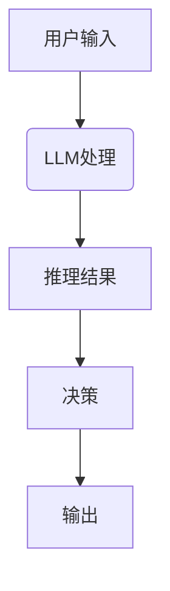
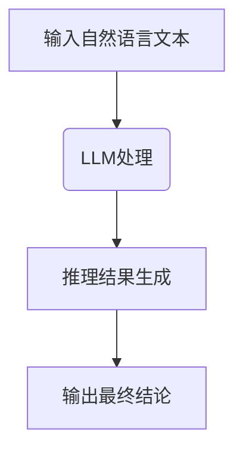

                 


# 构建LLM支持的AI Agent自然语言推理系统

## 关键词：LLM, AI Agent, 自然语言推理, 人工智能, 系统架构, 深度学习

## 摘要：本文将详细介绍如何构建一个基于大语言模型（LLM）支持的AI代理（AI Agent）自然语言推理系统。首先，我们从背景和核心概念入手，详细阐述了LLM与AI Agent的关系，以及自然语言推理的基本原理。接着，通过算法流程图、Python代码示例和数学公式，深入分析了系统的算法实现。最后，通过系统架构设计和项目实战，展示了如何将理论应用于实际场景，并提供了最佳实践建议。

---

# 第1章: 背景介绍

## 1.1 问题背景

### 1.1.1 当前自然语言处理的挑战

自然语言处理（NLP）是人工智能领域的重要分支，旨在让计算机能够理解、生成和处理人类语言。然而，传统的NLP方法在处理复杂语义、上下文理解和多语言支持方面存在诸多限制。近年来，大语言模型（LLM）的出现，如GPT-3、PaLM等，以其强大的生成能力和上下文理解能力，为自然语言处理带来了革命性的变化。

### 1.1.2 LLM在自然语言推理中的作用

大语言模型通过预训练海量文本数据，掌握了丰富的语言知识和推理能力。将LLM集成到AI Agent中，可以显著提升Agent在自然语言推理任务中的表现。LLM不仅能够理解用户输入的自然语言，还能基于上下文进行推理，生成符合逻辑的回答或决策。

### 1.1.3 AI Agent的定义与目标

AI Agent是一种智能体，能够在环境中感知、交互并采取行动以实现特定目标。在自然语言处理领域，AI Agent的目标是通过理解和生成自然语言，与人类用户进行有效交互，并根据用户的意图和上下文做出合理的推理和决策。

## 1.2 问题描述

### 1.2.1 自然语言推理的基本概念

自然语言推理是指基于自然语言文本进行逻辑推理，判断文本中的陈述是否成立，或者推断出文本中隐含的信息。例如，给定前提“所有鸟都会飞”和“鸵鸟是鸟”，推理出结论“鸵鸟会飞”。

### 1.2.2 LLM支持的AI Agent的核心问题

在构建LLM支持的AI Agent自然语言推理系统时，核心问题是如何将LLM的强大生成能力与AI Agent的推理能力结合，使其能够在复杂场景中准确理解和推理用户的意图。

### 1.2.3 系统构建的边界与外延

本系统专注于LLM支持的AI Agent在自然语言推理中的应用，边界包括输入输出接口、推理算法和系统架构设计。外延则涉及系统的部署、优化和扩展。

## 1.3 核心概念与联系

### 1.3.1 LLM与AI Agent的关系

LLM作为AI Agent的核心组件，负责处理自然语言输入并生成输出。AI Agent则通过调用LLM API，结合上下文和任务目标，做出推理和决策。

### 1.3.2 自然语言推理的关键属性对比

| 属性 | LLM | AI Agent |
|------|-----|----------|
| 输入 | 自然语言文本 | 用户指令和上下文 |
| 输出 | 推理结果或生成文本 | 行动或决策 |
| 能力 | 强大的生成和理解能力 | 综合推理和决策能力 |

### 1.3.3 ER实体关系图架构

```mermaid
erd
    user (用户)
    agent (AI Agent)
    llm (大语言模型)
    input_text (输入文本)
    output_text (输出文本)
    inference (推理过程)

    user --> input_text
    input_text --> llm
    llm --> inference
    inference --> output_text
    output_text --> agent
    agent --> user
```

---

# 第2章: 核心概念与联系

## 2.1 LLM与AI Agent的原理

### 2.1.1 LLM的基本原理

大语言模型通过Transformer架构进行预训练，利用自注意力机制捕捉文本中的语义信息。模型在处理输入时，会生成嵌入向量，并通过前馈网络计算出最终的输出。

### 2.1.2 AI Agent的决策机制

AI Agent通过接收输入、调用LLM进行推理、分析结果并做出决策。决策过程包括理解输入、生成候选方案、评估方案并选择最优方案。

### 2.1.3 两者结合的逻辑关系



## 2.2 自然语言推理的算法原理

### 2.2.1 基于LLM的推理流程

LLM支持的自然语言推理流程包括输入处理、模型调用、结果解析和推理验证。

### 2.2.2 推理算法的数学模型

自然语言推理的关键在于模型如何生成和处理嵌入向量。常用的模型包括BERT、GPT等，它们通过自注意力机制和前馈网络实现文本表示和生成。

### 2.2.3 推理结果的验证机制

验证机制包括交叉验证、逻辑一致性检查和人工校验，确保推理结果的准确性和合理性。

---

# 第3章: 算法原理与实现

## 3.1 LLM与自然语言推理的算法流程

### 3.1.1 Mermaid流程图展示



### 3.2 Python源代码实现

#### 3.2.1 LLM调用代码

```python
def call_llm(prompt):
    # 示例代码，具体实现取决于LLM框架
    return response
```

#### 3.2.2 推理算法代码

```python
def inference_algorithm(input_text):
    # 示例代码，具体实现取决于推理算法
    return result
```

### 3.3 数学模型与公式

#### 3.3.1 注意力机制公式

$$\text{Attention}(Q, K, V) = \text{softmax}\left(\frac{QK^T}{\sqrt{d_k}}\right)V$$

#### 3.3.2 损失函数公式

$$\text{Loss} = -\sum_{i=1}^{n} \text{log}(P

---

# 作者：AI天才研究院/AI Genius Institute & 禅与计算机程序设计艺术 /Zen And The Art of Computer Programming

