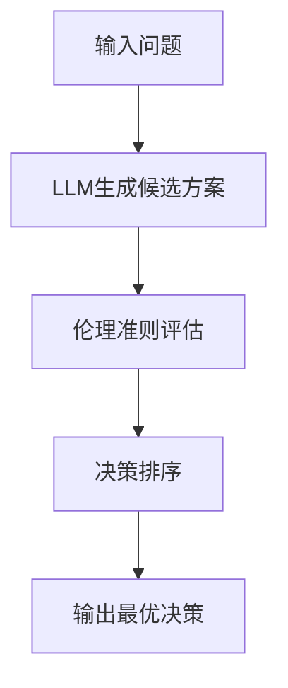
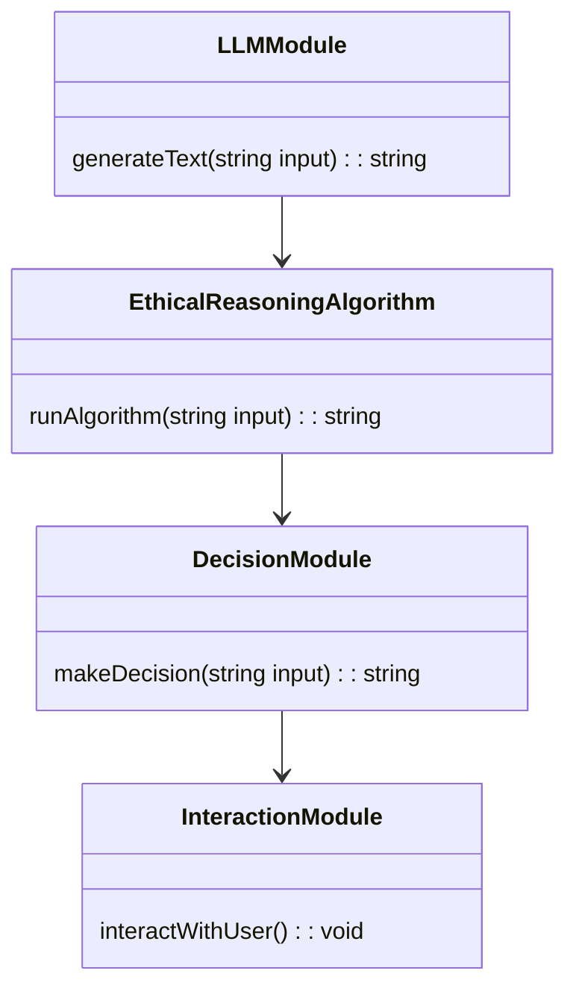

                 


# 构建LLM支持的AI Agent道德推理系统

> 关键词：LLM, AI Agent, 道德推理, 人工智能, 系统架构

> 摘要：本文详细探讨了如何构建一个基于大语言模型（LLM）的AI Agent道德推理系统。通过分析道德推理的核心概念、算法原理、系统架构以及实际项目中的应用，本文为读者提供了一个全面的技术框架，帮助理解如何利用LLM技术实现AI Agent的道德决策能力。

---

## 第一部分: 背景介绍

### 第1章: 构建LLM支持的AI Agent道德推理系统概述

#### 1.1 问题背景

- **1.1.1 AI Agent与LLM的结合**  
  AI Agent（人工智能代理）是能够感知环境、执行任务并做出决策的智能实体。随着大语言模型（LLM）技术的快速发展，AI Agent的能力得到了显著提升，尤其是在自然语言处理和复杂决策任务中。

- **1.1.2 道德推理的重要性**  
  道德推理是AI Agent在处理涉及伦理和价值观的问题时的核心能力。例如，在自动驾驶汽车中，AI Agent需要在紧急情况下做出符合伦理的决策，以避免或最小化伤害。

- **1.1.3 当前技术的局限性**  
  当前的AI系统在道德推理方面仍存在诸多挑战，例如缺乏对上下文的深度理解、难以处理模糊性和不确定性，以及难以兼顾不同文化背景下的伦理差异。

#### 1.2 问题描述

- **1.2.1 LLM在AI Agent中的作用**  
  LLM通过自然语言处理技术，帮助AI Agent理解和生成人类语言，从而更好地与人类交互并做出基于语言的决策。

- **1.2.2 道德推理的定义与目标**  
  道德推理是指AI Agent在面对复杂问题时，根据伦理准则、社会规范和上下文信息，做出符合道德标准的决策。

- **1.2.3 现有系统的主要挑战**  
  现有系统在道德推理方面的主要挑战包括：如何平衡不同利益相关者的利益、如何处理动态变化的伦理准则，以及如何确保决策的透明性和可解释性。

#### 1.3 问题解决

- **1.3.1 LLM支持的AI Agent设计思路**  
  通过将LLM与AI Agent相结合，可以利用大语言模型的强大能力来增强道德推理的准确性和效率。

- **1.3.2 道德推理系统的构建方法**  
  构建道德推理系统需要结合伦理学、人工智能和自然语言处理等多学科知识，设计合理的算法和架构。

- **1.3.3 系统的预期效果与应用场景**  
  预期效果包括提高AI Agent的决策透明性、可解释性和伦理合规性。应用场景包括医疗辅助决策、自动驾驶、智能客服等领域。

#### 1.4 边界与外延

- **1.4.1 系统的适用范围**  
  适用于需要道德决策的AI系统，尤其是涉及人类生命安全和伦理判断的领域。

- **1.4.2 系统的限制条件**  
  系统的决策能力受到LLM的训练数据和模型能力的限制，可能无法处理极端或未见过的伦理困境。

- **1.4.3 系统与其他技术的关联**  
  与自然语言处理、强化学习、知识图谱等技术密切相关，可以通过与其他技术的结合进一步提升系统的决策能力。

#### 1.5 概念结构与核心要素

- **1.5.1 系统的核心组成**  
  包括LLM模块、道德推理算法、决策模块和交互模块。

- **1.5.2 各要素之间的关系**  
  LLM模块负责理解和生成语言，道德推理算法负责基于伦理准则进行推理，决策模块根据推理结果做出最终决策，交互模块负责与用户或环境进行交互。

- **1.5.3 系统的整体架构**  
  整体架构包括数据输入、模型推理、决策输出和结果反馈四个部分。

#### 1.6 本章小结

本章通过对问题背景、问题描述和解决方案的分析，明确了构建LLM支持的AI Agent道德推理系统的必要性及其核心要素。

---

## 第二部分: 核心概念与联系

### 第2章: 道德推理的基本原理

#### 2.1 道德推理的定义与特点

- **2.1.1 道德推理的定义**  
  道德推理是指基于伦理准则和价值观，对问题进行分析、判断并做出决策的过程。

- **2.1.2 道德推理的特点**  
  包括情境依赖性、动态性、多利益相关性和文化多样性。

#### 2.2 LLM在道德推理中的作用

- **2.2.1 LLM的基本原理**  
  LLM通过大量数据训练，能够理解和生成人类语言，具备强大的文本处理能力。

- **2.2.2 LLM在道德推理中的优势**  
  包括语言理解能力强、知识覆盖面广和可扩展性高。

- **2.2.3 LLM的局限性**  
  包括难以处理复杂的情境和动态变化的伦理准则。

#### 2.3 AI Agent的决策机制

- **2.3.1 AI Agent的定义**  
  AI Agent是能够感知环境、执行任务并做出决策的智能实体。

- **2.3.2 AI Agent的决策过程**  
  包括感知、推理、决策和执行四个阶段。

- **2.3.3 道德推理在AI Agent中的位置**  
  道德推理是AI Agent决策过程中的核心环节，尤其是在涉及伦理判断的任务中。

#### 2.4 核心概念对比表格

| 对比项         | 道德推理       | 传统推理       |
|----------------|----------------|----------------|
| 基础           | 伦理准则       | 事实和逻辑     |
| 目标           | 符合道德标准   | 得出正确结论   |
| 复杂性         | 高             | 中             |
| 适用场景       | 医疗、法律等   | 科学、工程等   |

#### 2.5 ER实体关系图

```mermaid
erd
actor{
  id: integer
  name: string
  role: string
}
ethic_rule{
  id: integer
  content: string
  source: string
}
decision{
  id: integer
  content: string
  timestamp: datetime
}
// 关系
actor -[1..n]-> ethic_rule
ethic_rule -[1..n]-> decision
```

---

## 第三部分: 算法原理讲解

### 第3章: 道德推理算法的原理与实现

#### 3.1 基于LLM的道德推理算法

- **3.1.1 算法输入**  
  包括问题描述、相关背景信息和伦理准则。

- **3.1.2 算法步骤**  
  1. 使用LLM生成多个可能的解决方案。  
  2. 根据伦理准则对方案进行排序和筛选。  
  3. 输出最优解决方案。

- **3.1.3 算法输出**  
  最终的道德决策结果。

#### 3.2 算法的数学模型



- **数学公式**  
  道德推理算法可以通过交叉熵损失函数进行优化：

  $$ \text{Loss} = -\sum_{i=1}^{n} y_i \log p_i $$

  其中，\( y_i \) 是真实标签，\( p_i \) 是模型预测的概率。

#### 3.3 算法的优化与改进

- **3.3.1 参数调整**  
  调整LLM的超参数，如学习率和批次大小。

- **3.3.2 模型微调**  
  在特定领域数据上对模型进行微调，以提高道德推理的准确性。

---

## 第四部分: 系统分析与架构设计方案

### 第4章: 系统架构设计

#### 4.1 项目背景

- 系统旨在构建一个能够进行道德推理的AI Agent，用于辅助人类在复杂场景中做出伦理决策。

#### 4.2 系统功能设计



#### 4.3 系统架构设计


#### 4.4 系统接口设计

- **输入接口**  
  包括用户输入和环境反馈。

- **输出接口**  
  包括决策结果和交互反馈。

#### 4.5 系统交互设计

```mermaid
sequenceDiagram
    actor --> LLMModule: 提供输入
    LLMModule --> EthicalReasoningAlgorithm: 生成候选方案
    EthicalReasoningAlgorithm --> DecisionModule: 筛选最优方案
    DecisionModule --> actor: 输出决策结果
```

---

## 第五部分: 项目实战

### 第5章: 实战项目：构建道德推理系统

#### 5.1 环境安装

- 安装Python和必要的库，如TensorFlow和Hugging Face的Transformers库。

#### 5.2 核心代码实现

```python
def generate_text(prompt):
    # 使用LLM生成文本
    pass

def ethical_reasoning(input):
    # 道德推理算法
    pass

def make_decision(input):
    # 做出决策
    pass

def interact_with_user():
    # 与用户交互
    pass
```

#### 5.3 代码解读与分析

- `generate_text`函数用于生成候选方案，`ethical_reasoning`函数负责根据伦理准则筛选方案，`make_decision`函数做出最终决策，`interact_with_user`函数处理与用户的交互。

#### 5.4 实际案例分析

- 以自动驾驶中的伦理困境为例，展示系统的实际应用。

---

## 第六部分: 最佳实践

### 第6章: 最佳实践与总结

#### 6.1 小结

- 总结本文的主要内容和关键点。

#### 6.2 注意事项

- 提醒读者在实际应用中需要注意的问题，如数据隐私和伦理合规。

#### 6.3 未来展望

- 展望道德推理系统的未来发展方向，如多模态推理和人机协作。

---

## 作者

作者：AI天才研究院/AI Genius Institute & 禅与计算机程序设计艺术 /Zen And The Art of Computer Programming

