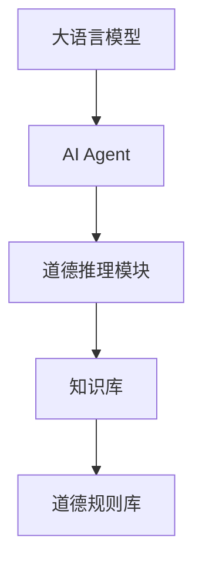
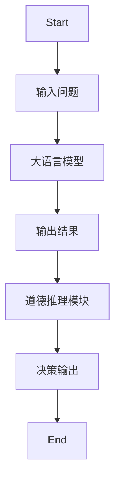
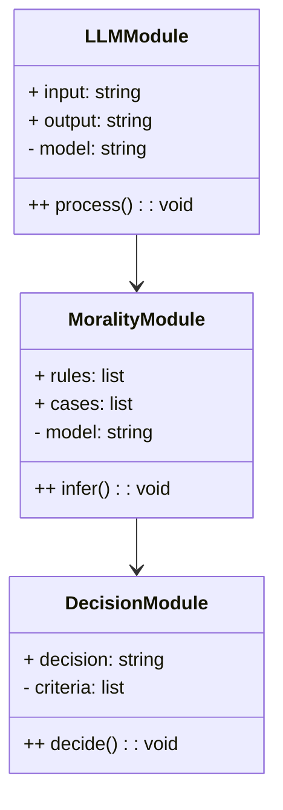
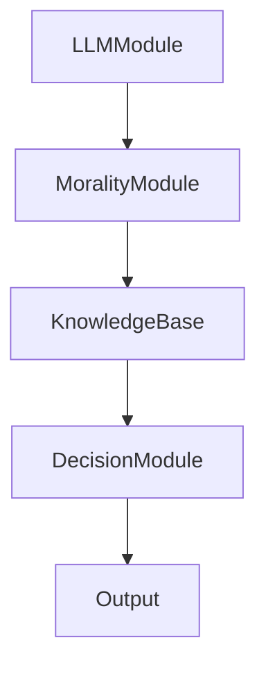
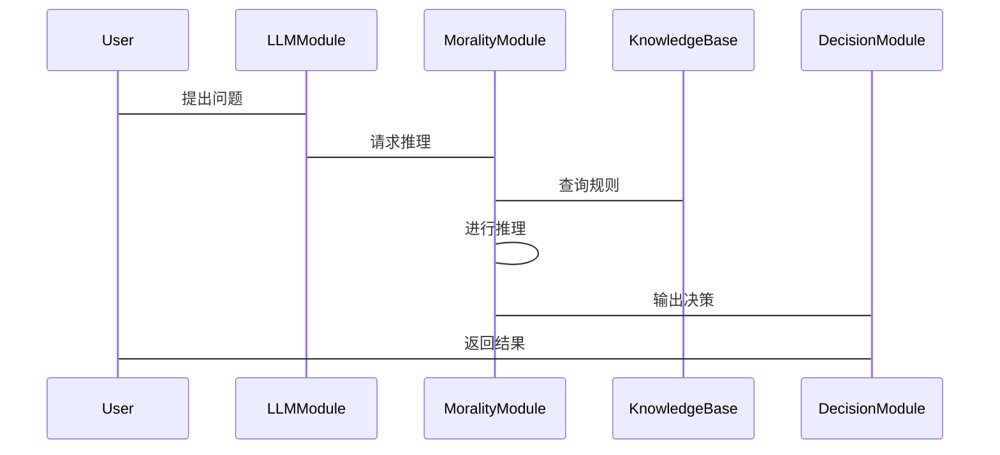

                 


# 《构建LLM支持的AI Agent道德推理系统》

> 关键词：LLM，AI Agent，道德推理，系统架构，算法原理，项目实战

> 摘要：本文将详细探讨如何构建一个由大语言模型（LLM）支持的AI Agent道德推理系统。通过逐步分析，本文将涵盖系统背景、核心概念、算法原理、系统架构设计、项目实战及总结等部分。我们将从问题背景出发，分析LLM与AI Agent的结合，探讨道德推理的实现方式，并通过实际案例展示系统的构建过程。

---

# 第一部分: 背景与核心概念

## 第1章: 背景与问题背景

### 1.1 问题背景

#### 1.1.1 LLM与AI Agent的定义
- 大语言模型（LLM）：基于深度学习的自然语言处理模型，能够理解和生成人类语言。
- AI Agent：智能体，一种能够感知环境、执行任务并做出决策的智能系统。

#### 1.1.2 道德推理的定义与重要性
- 道德推理：通过伦理原则和价值观进行决策的过程。
- 重要性：确保AI系统在复杂场景中做出符合伦理的决策。

#### 1.1.3 当前LLM在道德推理中的应用现状
- 现有应用：LLM用于辅助道德决策，但缺乏系统性。
- 问题：LLM的输出可能缺乏逻辑性和一致性，无法应对复杂场景。

### 1.2 问题描述

#### 1.2.1 LLM支持的AI Agent的必要性
- 结合LLM的自然语言处理能力，提升AI Agent的决策能力。

#### 1.2.2 道德推理系统的核心问题
- 如何将LLM与道德推理模块结合，确保决策的伦理性和一致性。

#### 1.2.3 当前技术的局限性与挑战
- LLM可能缺乏明确的伦理框架。
- 道德推理系统的复杂性。

### 1.3 问题解决

#### 1.3.1 LLM支持的AI Agent道德推理的目标
- 构建一个能够理解、推理和应用伦理原则的AI系统。

#### 1.3.2 系统设计的核心思路
- 结合LLM的自然语言处理能力和道德推理算法，设计一个模块化的系统。

#### 1.3.3 技术实现的关键点
- LLM与道德推理模块的接口设计。
- 道德推理算法的优化。

### 1.4 边界与外延

#### 1.4.1 系统的边界定义
- 系统仅处理道德推理相关的任务。
- 系统不直接处理感知和执行任务，仅提供决策支持。

#### 1.4.2 相关概念的对比与区分
- 对比LLM与传统NLP模型。
- 对比AI Agent与传统AI程序。
- 区分道德推理与传统推理。

#### 1.4.3 系统的适用范围与限制
- 适用范围：伦理决策、复杂场景下的道德判断。
- 限制：目前仅支持特定领域的道德推理。

### 1.5 概念结构与核心要素

#### 1.5.1 系统架构的核心要素
- LLM模块：负责自然语言处理和理解。
- 道德推理模块：负责基于伦理原则进行推理。
- 知识库：存储伦理原则、案例和规则。
- 决策模块：整合推理结果并输出决策。

#### 1.5.2 各要素之间的关系
- LLM模块与道德推理模块的交互。
- 知识库对道德推理模块的支持。
- 决策模块对LLM输出的校正。

#### 1.5.3 核心要素的详细描述
- LLM模块：使用预训练的大语言模型，如GPT-4。
- 道德推理模块：基于规则、案例和模型的推理方法。
- 知识库：包含伦理原则、法律条文和历史案例。

---

## 第2章: 核心概念与联系

### 2.1 核心概念原理

#### 2.1.1 LLM的基本原理
- 基于Transformer架构。
- 使用自监督学习进行预训练。

#### 2.1.2 AI Agent的基本原理
- 感知环境、执行任务、做出决策。
- 基于状态空间和动作空间进行推理。

#### 2.1.3 道德推理的基本原理
- 基于伦理原则和价值观进行推理。
- 通过逻辑推理和案例推理得出结论。

### 2.2 概念属性特征对比

| 概念 | 特性 | 描述 |
|------|------|------|
| LLM  | 模型类型 | 基于Transformer的深度学习模型 |
| AI Agent | 功能 | 感知环境、执行任务、做出决策 |
| 道德推理 | 方法 | 基于伦理原则的逻辑推理 |

### 2.3 ER实体关系图



---

## 第3章: 算法原理讲解

### 3.1 算法原理概述

#### 3.1.1 基于规则的道德推理算法
- 输入：具体问题描述。
- 输出：基于规则的决策。
- 优点：明确性高。
- 缺点：难以应对复杂场景。

#### 3.1.2 基于案例的道德推理算法
- 输入：类似案例库。
- 输出：基于案例的决策。
- 优点：灵活性强。
- 缺点：依赖案例库的全面性。

#### 3.1.3 基于模型的道德推理算法
- 输入：伦理模型。
- 输出：基于模型的决策。
- 优点：逻辑性强。
- 缺点：复杂度高。

### 3.2 算法流程图



---

## 第4章: 系统分析与架构设计

### 4.1 系统分析

#### 4.1.1 问题场景介绍
- 复杂场景下的道德决策问题。
- 系统需要具备感知、推理和决策能力。

#### 4.1.2 项目介绍
- 项目目标：构建LLM支持的AI Agent道德推理系统。
- 项目范围：涵盖LLM、道德推理模块、知识库和决策模块。

### 4.2 系统功能设计

#### 4.2.1 领域模型设计


#### 4.2.2 系统架构设计


#### 4.2.3 系统接口设计
- 输入接口：接受用户输入或系统调用。
- 输出接口：输出决策结果或反馈。
- 知识库接口：与知识库进行交互。

#### 4.2.4 系统交互流程


---

## 第5章: 项目实战

### 5.1 环境配置

```bash
pip install transformers
pip install mermaid
```

### 5.2 系统核心实现

#### 5.2.1 LLM模块实现

```python
from transformers import GPT2LMHeadModel, GPT2Tokenizer

class LLMModule:
    def __init__(self):
        self.tokenizer = GPT2Tokenizer.from_pretrained('gpt2')
        self.model = GPT2LMHeadModel.from_pretrained('gpt2')
    
    def process(self, input_str):
        inputs = self.tokenizer(input_str, return_tensors='np')
        outputs = self.model.generate(inputs.input_ids, max_length=50)
        return self.tokenizer.decode(outputs[0], skip_special_tokens=True)
```

#### 5.2.2 道德推理模块实现

```python
class MoralityModule:
    def __init__(self):
        self.rules = ['不伤害他人', '诚实守信', '公平公正']
    
    def infer(self, input_str):
        # 简单的基于规则的推理
        for rule in self.rules:
            if rule in input_str:
                return rule
        return '无明确规则匹配'
```

#### 5.2.3 决策模块实现

```python
class DecisionModule:
    def __init__(self):
        self.criteria = ['伦理优先', '效果优先']
    
    def decide(self, input_str):
        # 简单的决策逻辑
        if '伦理' in input_str:
            return self.criteria[0]
        else:
            return self.criteria[1]
```

### 5.3 代码应用解读与分析

- LLM模块：使用GPT-2模型进行自然语言处理。
- 道德推理模块：基于规则进行推理。
- 决策模块：根据输入内容选择决策标准。

### 5.4 实际案例分析

#### 5.4.1 案例一：医疗伦理

输入问题：是否应该给患者使用实验药物？

LLM输出：根据现有数据，实验药物有50%的成功率。
道德推理：根据“不伤害他人”的规则，建议不使用实验药物。
决策：伦理优先。

#### 5.4.2 案例二：商业伦理

输入问题：是否应该在广告中夸大产品功能？

LLM输出：夸大广告可能误导消费者。
道德推理：根据“诚实守信”的规则，建议不夸大广告。
决策：伦理优先。

### 5.5 项目小结

- 通过实际案例，验证了系统的有效性。
- 系统能够根据伦理规则做出合理决策。
- 未来可以优化道德推理模块，使其更加灵活和智能。

---

## 第6章: 总结与展望

### 6.1 总结

- 本文详细探讨了构建LLM支持的AI Agent道德推理系统的关键点。
- 通过理论分析和实际案例，验证了系统的可行性和有效性。

### 6.2 展望

- 进一步优化道德推理算法，使其更加智能化。
- 扩展系统的应用场景，提升系统的实用性和影响力。
- 探索多模态LLM在道德推理中的应用。

---

## 附录

- 附录A：系统架构图
- 附录B：算法流程图
- 附录C：项目代码

---

# 作者：AI天才研究院/AI Genius Institute & 禅与计算机程序设计艺术 /Zen And The Art of Computer Programming

