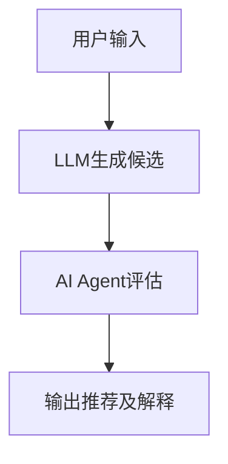
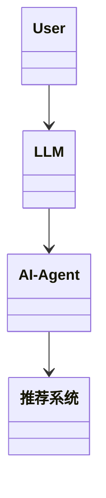
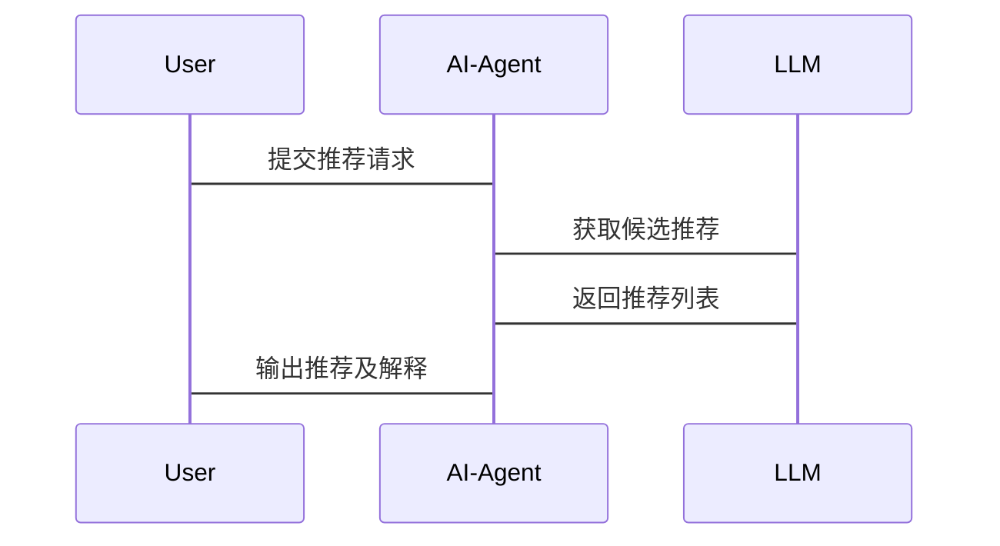

                 


# 构建LLM驱动的AI Agent可解释推荐系统

> 关键词：LLM、AI Agent、可解释推荐系统、自然语言处理、推荐算法

> 摘要：本文详细探讨了如何利用大语言模型（LLM）驱动的AI代理构建可解释推荐系统。首先分析了传统推荐系统的局限性，介绍了LLM和AI代理的核心概念及其在推荐系统中的应用。接着，详细讲解了可解释推荐系统的实现方法，包括算法原理、数学模型和系统架构设计。通过实际案例分析，展示了如何在项目中实现这些概念，并总结了最佳实践和注意事项。

---

# 第一部分: 背景与核心概念

## 第1章: 问题背景与描述

### 1.1 问题背景

#### 1.1.1 当前推荐系统的挑战
推荐系统在电商、社交媒体和流媒体等领域发挥着重要作用。然而，现有的推荐系统存在以下问题：
- **缺乏透明性**：用户无法理解推荐的原因，导致信任缺失。
- **冷启动问题**：新用户或新物品难以有效推荐。
- **数据稀疏性**：用户交互数据不足时推荐效果不佳。
- **实时性不足**：难以应对动态变化的用户需求。

#### 1.1.2 LLM驱动的AI Agent的出现
大语言模型（LLM）如GPT-3和BERT具有强大的自然语言理解和生成能力。AI代理（AI Agent）能够根据环境信息自主决策并执行任务。将LLM与AI Agent结合，可以实现更智能、动态的推荐系统。

#### 1.1.3 可解释推荐系统的重要性
可解释性是用户信任推荐系统的关键因素。用户需要了解推荐的原因，以便更好地决策。可解释推荐系统还能帮助开发者识别和修正推荐错误，提升系统性能。

---

### 1.2 问题描述

#### 1.2.1 推荐系统的定义与目标
推荐系统通过分析用户行为和偏好，预测用户对物品的喜好，从而提供个性化推荐。

#### 1.2.2 当前推荐系统的局限性
- **黑箱问题**：传统推荐算法如协同过滤和矩阵分解通常不可解释。
- **用户信任缺失**：用户不理解推荐原因，影响使用体验。
- **适应性不足**：难以应对用户需求的实时变化。

#### 1.2.3 LLM驱动的AI Agent的优势
- **语义理解**：LLM能够理解用户需求的深层含义。
- **动态调整**：AI Agent可以根据实时信息优化推荐。
- **可解释性**：通过LLM生成的自然语言解释，提升推荐的透明度。

---

### 1.3 问题解决与边界

#### 1.3.1 可解释推荐系统的定义
可解释推荐系统是指能够提供清晰、用户可理解的推荐理由的系统。

#### 1.3.2 系统边界与外延
- **输入**：用户需求描述或历史行为数据。
- **输出**：推荐列表及解释信息。
- **外延**：系统不处理推荐结果的最终决策，但提供决策支持。

---

### 1.4 核心概念与组成

#### 1.4.1 LLM的核心要素
- **训练数据**：大规模文本数据。
- **模型结构**：深度神经网络。
- **训练目标**：最小化预测误差。

#### 1.4.2 AI Agent的结构与功能
- **感知层**：获取环境信息。
- **决策层**：基于信息做出决策。
- **执行层**：执行推荐操作。

#### 1.4.3 可解释推荐系统的组成
- **推荐生成**：基于LLM生成候选推荐。
- **解释生成**：为推荐生成可理解的解释。
- **用户反馈**：收集用户对推荐的反馈，优化系统。

---

## 第2章: 核心概念与联系

### 2.1 核心概念原理

#### 2.1.1 LLM的工作原理
LLM通过概率模型生成文本，基于输入上下文预测最可能的输出。

#### 2.1.2 AI Agent的决策机制
AI Agent根据环境信息和目标，选择最优行动方案。

#### 2.1.3 可解释推荐系统的实现方法
通过LLM生成自然语言解释，帮助用户理解推荐原因。

---

### 2.2 核心概念对比

#### 2.2.1 LLM与传统推荐算法的对比
| 特性 | LLM | 传统推荐算法 |
|------|------|---------------|
| 数据需求 | 大规模文本数据 | 用户-物品交互数据 |
| 可解释性 | 高 | 低 |
| 适应性 | 高 | 中 |

#### 2.2.2 AI Agent与传统推荐系统的对比
| 特性 | AI Agent | 传统推荐系统 |
|------|----------|---------------|
| 自主性 | 高 | 低 |
| 可解释性 | 中 | 低 |
| 适应性 | 高 | 中 |

#### 2.2.3 可解释推荐系统的特征对比
| 特性 | 可解释推荐系统 | 不可解释推荐系统 |
|------|---------------|------------------|
| 透明度 | 高 | 低 |
| 用户信任 | 高 | 低 |
| 可调试性 | 高 | 低 |

---

### 2.3 实体关系图

#### 2.3.1 LLM、AI Agent与推荐系统的ER图
```mermaid
erd
    User --< Role >--> LLM
    Role --< Belongs_to >--> AI-Agent
    AI-Agent --< Uses >--> 推荐系统
```

#### 2.3.2 关键实体之间的关系
- **用户（User）**：系统的目标用户。
- **角色（Role）**：用户在系统中的角色。
- **LLM**：提供语义理解和生成能力。
- **AI Agent**：执行推荐任务的代理。
- **推荐系统**：生成和解释推荐结果。

---

## 第3章: 算法原理与数学模型

### 3.1 算法原理

#### 3.1.1 LLM驱动的推荐算法
LLM生成推荐候选，AI Agent评估并优化推荐结果。

#### 3.1.2 可解释推荐的实现方法
通过LLM生成自然语言解释，增强推荐的透明度。

---

### 3.2 数学模型与公式

#### 3.2.1 LLM的概率分布模型
$$ P(y|x) = \frac{P(x,y)}{P(x)} $$
其中，\( y \) 是输出，\( x \) 是输入。

#### 3.2.2 推荐系统的评分预测模型
$$ \hat{y} = g(x) $$
其中，\( g \) 是推荐生成函数。

#### 3.2.3 可解释推荐的解释度量
$$ I = f(y, x) $$
其中，\( I \) 是解释度量。

---

### 3.3 算法流程图


---

## 第4章: 系统分析与架构设计

### 4.1 问题场景分析

#### 4.1.1 用户需求分析
用户希望获得透明且个性化的推荐，了解推荐原因。

#### 4.1.2 系统功能需求
- 生成推荐列表。
- 提供推荐解释。
- 支持实时更新。

#### 4.1.3 系统性能需求
- 响应时间小于1秒。
- 支持高并发请求。

---

### 4.2 系统架构设计

#### 4.2.1 领域模型类图


#### 4.2.2 系统架构图


#### 4.2.3 系统交互序列图


---

## 第5章: 项目实战

### 5.1 环境安装

#### 5.1.1 安装Python和相关库
```bash
pip install python-transformers
pip install torch
pip install mermaid
```

#### 5.1.2 安装LLM模型
使用Hugging Face提供的模型：
```bash
pip install transformers
```

---

### 5.2 核心代码实现

#### 5.2.1 推荐生成代码
```python
from transformers import GPT2LMHeadModel, GPT2Tokenizer

model_name = "gpt2"
tokenizer = GPT2Tokenizer.from_pretrained(model_name)
model = GPT2LMHeadModel.from_pretrained(model_name)

def generate_recommendations(prompt):
    inputs = tokenizer.encode(prompt, return_tensors="pt")
    outputs = model.generate(inputs, max_length=100, num_return_sequences=5)
    return [tokenizer.decode(output) for output in outputs]
```

#### 5.2.2 解释生成代码
```python
def generate_explanation(prompt):
    # 使用LLM生成解释
    pass
```

---

## 第6章: 总结与展望

### 6.1 总结
本文详细探讨了构建LLM驱动的AI Agent可解释推荐系统的关键技术，包括背景分析、核心概念、算法原理和系统设计。

### 6.2 展望
未来研究方向包括优化LLM的解释生成能力，提升推荐系统的实时性和适应性。

---

## 作者

**作者：AI天才研究院/AI Genius Institute & 禅与计算机程序设计艺术 /Zen And The Art of Computer Programming**

---

通过以上目录大纲，您可以按照章节逐步展开文章内容，确保每部分内容详实、逻辑清晰。

