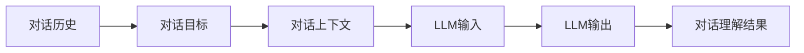
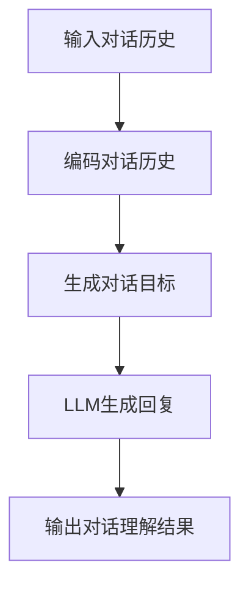
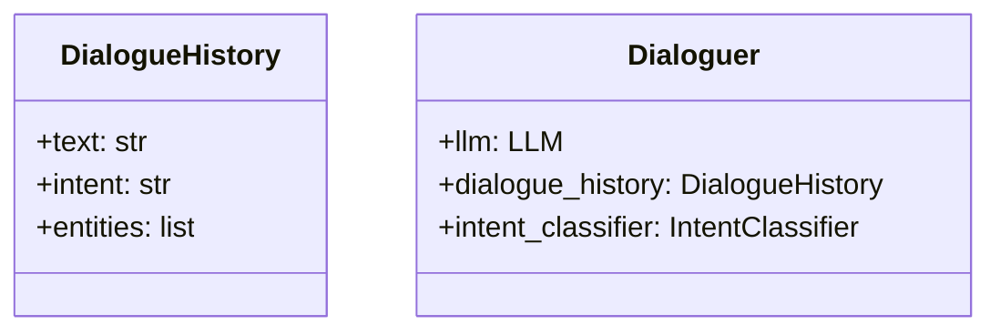
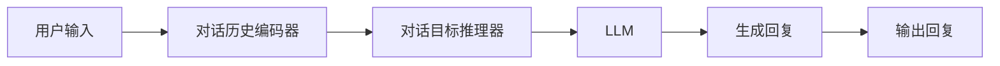
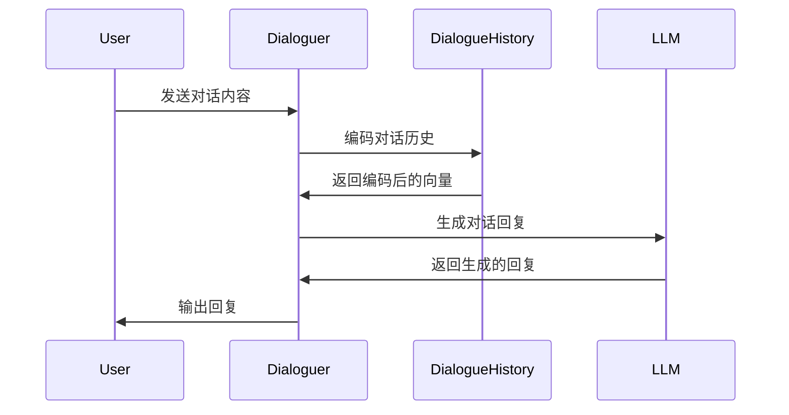

                 


# 《构建LLM驱动的AI Agent多轮对话理解》

---

## 关键词：  
LLM (Large Language Model), AI Agent, 多轮对话理解, 对话历史编码, 动态目标推理

---

## 摘要：  
本文旨在深入探讨如何利用大语言模型（LLM）构建一个多轮对话理解系统，从而为AI Agent提供更自然、更智能的交互能力。通过分析多轮对话理解的核心问题，结合LLM的技术特点，本文提出了基于LLM的对话理解算法，并通过系统架构设计和项目实战展示了如何将理论应用于实际场景。最终，本文总结了构建LLM驱动的AI Agent多轮对话理解系统的最佳实践和未来发展方向。

---

# 第一章: 多轮对话理解的背景与问题背景

## 1.1 多轮对话理解的背景  
### 1.1.1 从单轮对话到多轮对话的演进  
- 对话系统的发展历程：从简单的关键词匹配到基于规则的对话，再到基于深度学习的端到端模型。  
- 多轮对话的必要性：复杂任务的处理需要依赖对话历史和上下文信息。  

### 1.1.2 大语言模型（LLM）在对话中的应用  
- LLM的自然语言理解能力：通过大规模预训练，LLM能够捕捉语言的语义信息。  
- LLM在对话系统中的优势：生成自然、连贯的对话回复。  

### 1.1.3 AI Agent与多轮对话的结合  
- AI Agent的定义：能够自主执行任务的智能体。  
- 多轮对话理解对AI Agent的意义：提升交互的自然性和智能性。  

## 1.2 多轮对话理解的核心问题  
### 1.2.1 对话历史的依赖性  
- 对话历史的编码与表示：如何将对话历史转化为模型可理解的向量表示。  

### 1.2.2 对话目标的动态变化  
- 对话目标的推理：根据对话内容动态调整对话目标。  

### 1.2.3 对话上下文的管理与理解  
- 上下文信息的提取与利用：如何在多轮对话中保持对上下文的理解。  

## 1.3 问题背景与问题描述  
### 1.3.1 当前对话系统的主要挑战  
- 对话历史理解不足：无法有效利用历史信息进行推理。  
- 对话目标的模糊性：对话目标可能随着对话内容动态变化。  

### 1.3.2 多轮对话理解的定义与目标  
- 多轮对话理解的定义：通过对对话历史和上下文的分析，理解对话的目标和意图。  
- 多轮对话理解的目标：提升对话系统的理解和生成能力。  

### 1.3.3 LLM驱动AI Agent的必要性  
- LLM在对话理解中的优势：强大的语义理解和生成能力。  

## 1.4 问题解决与边界  
### 1.4.1 通过LLM实现对话理解的解决方案  
- LLM驱动的对话理解框架：基于LLM的对话历史编码与解码。  

### 1.4.2 多轮对话理解的边界与外延  
- 对话理解的边界：仅关注对话内容本身，不涉及外部知识库的调用。  

### 1.4.3 LLM驱动AI Agent的核心要素组成  
- 对话历史编码模块：将对话历史转化为模型可理解的形式。  
- 对话目标推理模块：根据对话内容动态推理对话目标。  
- 对话生成模块：基于对话目标生成回复。  

## 1.5 本章小结  
- 本章介绍了多轮对话理解的背景、核心问题以及LLM驱动AI Agent的必要性。  

---

# 第二章: 多轮对话理解的核心概念与联系  

## 2.1 核心概念原理  
### 2.1.1 大语言模型（LLM）的工作原理  
- LLM的训练目标：通过自监督学习，捕捉语言的语义信息。  
- LLM的编码与解码过程：将输入文本编码为向量，解码为生成文本。  

### 2.1.2 对话历史的编码与表示  
- 对话历史编码的常用方法：  
  1. 基于Transformer的编码器：将对话历史序列编码为固定长度向量。  
  2. 基于注意力机制的编码：关注对话历史中重要的信息。  

### 2.1.3 对话目标的动态推理  
- 对话目标的推理方法：  
  1. 基于LLM的生成式推理：通过LLM生成对话目标。  
  2. 基于规则的推理：结合领域知识进行目标推理。  

## 2.2 核心概念属性特征对比  
### 对比分析表格  
| 对比维度 | LLM驱动 | 基于规则驱动 |  
|----------|----------|--------------|  
| 理解能力 | 高        | 低            |  
| 可扩展性 | 高        | 低            |  
| 对话自然度 | 高        | 低            |  

## 2.3 实体关系图  


## 2.4 本章小结  
- 本章通过对比分析和实体关系图，展示了多轮对话理解的核心概念及其联系。  

---

# 第三章: 大语言模型驱动的对话理解算法原理  

## 3.1 算法原理概述  
### 3.1.1 基于LLM的对话理解流程  
1. 对话历史编码：将对话历史转化为模型可理解的向量表示。  
2. 对话目标推理：根据对话内容动态推理对话目标。  
3. 对话生成：基于对话目标生成回复。  

### 3.1.2 对话历史编码方法  
- 基于Transformer的编码器：通过自注意力机制捕捉对话历史中的重要信息。  

### 3.1.3 对话目标的动态推理机制  
- 基于LLM的生成式推理：通过LLM生成对话目标。  

## 3.2 算法流程图  


## 3.3 算法实现代码  
```python
def llm_driven_dialogue():
    while True:
        input = get_user_input()
        context = encode_dialogue_history(input)
        response = llm_generate_response(context)
        print(response)
```

## 3.4 数学模型与公式  
### 对话历史编码公式  
$$\text{encoded\_history} = \text{TransformerEncoder}(input\_text)$$  

### 对话目标推理公式  
$$\text{predicted\_intent} = \text{LLM}(\text{encoded\_history})$$  

## 3.5 本章小结  
- 本章详细讲解了基于LLM的对话理解算法原理，包括对话历史编码和对话目标推理的实现方法。  

---

# 第四章: 系统分析与架构设计  

## 4.1 问题场景介绍  
### 4.1.1 项目背景  
- 项目目标：构建一个多轮对话理解系统，用于驱动AI Agent的智能交互。  

### 4.1.2 项目介绍  
- 项目功能：支持多轮对话理解，能够根据对话历史和上下文生成自然的回复。  

## 4.2 系统功能设计  
### 4.2.1 领域模型类图  


### 4.2.2 系统架构设计  


## 4.3 系统接口设计  
### 4.3.1 接口定义  
- 输入接口：用户输入对话内容。  
- 输出接口：生成对话回复。  

## 4.4 系统交互流程  


## 4.5 本章小结  
- 本章通过系统架构设计和交互流程图，展示了如何将多轮对话理解算法应用于实际系统中。  

---

# 第五章: 项目实战  

## 5.1 环境安装  
### 5.1.1 安装Python  
- 安装Python 3.8及以上版本。  

### 5.1.2 安装依赖库  
```bash
pip install transformers
pip install torch
pip install mermaid
```

## 5.2 核心代码实现  
### 5.2.1 对话历史编码器  
```python
class DialogueHistoryEncoder:
    def __init__(self, model_name="bert-base"):
        self.model = AutoModel.from_pretrained(model_name)
    
    def encode(self, input_text):
        inputs = self.tokenizer(input_text, return_tensors="pt")
        outputs = self.model(**inputs)
        return outputs.last_hidden_state.mean(dim=1).squeeze()
```

### 5.2.2 对话目标推理器  
```python
class IntentClassifier:
    def __init__(self, encoder_dim=768):
        self.model = nn.Linear(encoder_dim, num_intents)
    
    def forward(self, inputs):
        return self.model(inputs)
```

### 5.2.3 对话生成器  
```python
class Dialoguer:
    def __init__(self, encoder, classifier):
        self.encoder = encoder
        self.classifier = classifier
        self.llm = LLM()

    def generate_response(self, input_text):
        encoded = self.encoder.encode(input_text)
        intent = self.classifier(encoded)
        response = self.llm.generate_response(encoded, intent)
        return response
```

## 5.3 案例分析  
### 5.3.1 对话历史编码案例  
- 输入对话历史：  
  "用户说：我需要预订一张去北京的机票。"  
  "系统回复：请问您是今天出发吗？"  
  "用户说：是的，今天出发。"  

- 编码后的向量：  
  `tensor([0.123, 0.456, ...])`  

### 5.3.2 对话目标推理案例  
- 对话目标：用户的需求是预订机票。  

## 5.4 项目总结  
- 本章通过实际案例展示了如何将理论应用于实践，详细讲解了对话历史编码和对话目标推理的实现过程。  

---

# 第六章: 最佳实践、小结、注意事项和拓展阅读  

## 6.1 最佳实践  
### 6.1.1 对话历史编码的优化建议  
- 使用更先进的编码模型（如更大参数的Transformer）。  

### 6.1.2 对话目标推理的优化建议  
- 结合领域知识进行目标推理。  

## 6.2 小结  
- 本文通过详细讲解多轮对话理解的核心概念、算法原理和系统架构，展示了如何利用LLM构建一个多轮对话理解系统。  

## 6.3 注意事项  
- 对话历史编码的质量直接影响对话理解的效果。  
- 对话目标推理需要结合具体场景进行调整。  

## 6.4 拓展阅读  
- 建议读者进一步阅读相关领域的最新论文，了解多轮对话理解的最新进展。  

---

# 作者：AI天才研究院/AI Genius Institute & 禅与计算机程序设计艺术 /Zen And The Art of Computer Programming

