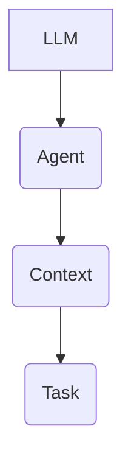
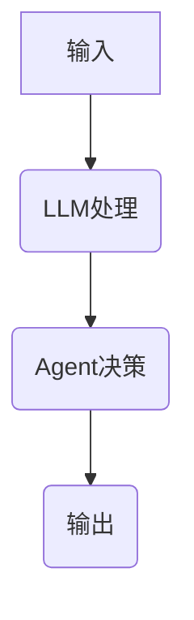
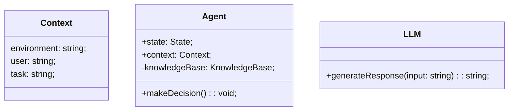
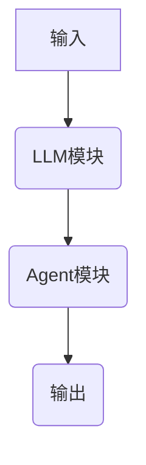

                 


# 构建LLM驱动的AI Agent情境感知系统

## 关键词：LLM, AI Agent, 情境感知, 系统架构, 算法原理, 项目实战

## 摘要

本文详细探讨了构建基于大语言模型（LLM）的AI Agent情境感知系统的核心理论、算法实现和系统架构设计。首先，我们介绍了LLM和AI Agent的基本概念，并分析了它们在情境感知中的应用。接着，我们深入讲解了系统的算法原理，包括LLM的训练过程、AI Agent的决策机制以及情境感知的数学模型。随后，我们通过Mermaid图和类图详细描述了系统的架构设计和功能模块。最后，我们通过一个具体的项目实战案例，展示了如何将理论应用于实践，并总结了系统设计中的最佳实践和注意事项。

---

# 第1章: LLM与AI Agent概述

## 1.1 LLM驱动的AI Agent概念

### 1.1.1 大语言模型（LLM）的基本概念

大语言模型（Large Language Model，LLM）是指经过大量数据训练的深度学习模型，如GPT、BERT等。这些模型能够理解和生成人类语言，并在多种任务中表现出色，包括文本生成、翻译、问答等。

### 1.1.2 AI Agent的核心定义

AI Agent（人工智能代理）是一种智能系统，能够感知环境、执行任务并做出决策。AI Agent可以是软件程序，也可以是机器人，其目标是通过与环境交互来实现特定目标。

### 1.1.3 LLM与AI Agent的结合方式

LLM可以通过提供自然语言处理能力，增强AI Agent的理解和表达能力。AI Agent利用LLM进行情境分析、任务规划和决策优化。

## 1.2 情境感知系统的核心要素

### 1.2.1 情境感知的定义与特点

情境感知是指系统能够理解当前环境的状态、用户的需求和任务的目标。其特点包括实时性、主动性、适应性和情境理解能力。

### 1.2.2 系统中各要素的相互关系

情境感知系统包括感知层、理解层和决策层。感知层收集环境数据，理解层分析数据，决策层制定行动方案。

### 1.2.3 系统的边界与外延

系统的边界在于其感知和决策的能力，外延则包括与其他系统的集成和扩展。

## 1.3 本章小结

本章通过定义和分析核心概念，为后续章节奠定了基础，明确了LLM驱动的AI Agent情境感知系统的基本框架和关键要素。

---

# 第2章: LLM驱动的AI Agent核心概念与联系

## 2.1 核心概念原理

### 2.1.1 LLM的基本原理

LLM基于神经网络，通过大量数据训练，学习语言的结构和语义。其输出基于概率分布，选择最可能的响应。

### 2.1.2 AI Agent的行为决策机制

AI Agent通过状态感知、目标设定和行动选择来实现任务。决策过程通常基于预设规则或机器学习模型。

### 2.1.3 情境感知的数学模型

情境感知模型可以表示为：

$$ P(context | input) = \text{softmax}(f(input)) $$

其中，$f(input)$是模型对输入的处理函数。

## 2.2 核心概念属性特征对比

### 2.2.1 LLM与传统NLP模型的对比

| 特性        | LLM                     | 传统NLP模型          |
|-------------|-------------------------|----------------------|
| 数据需求     | 需要大量数据             | 数据需求较少         |
| 模型复杂度   | 模型复杂度高             | 模型相对简单          |
| 任务通用性   | 具备高度通用性            | 适用于特定任务        |

### 2.2.2 AI Agent与传统AI系统的对比

| 特性        | AI Agent                | 传统AI系统            |
|-------------|-------------------------|-----------------------|
| 自主性       | 具备自主决策能力          | 通常由外部控制          |
| 适应性       | 具备动态适应能力          | 适应性较弱            |
| 应用场景     | 适用于复杂动态环境        | 适用于相对静态环境      |

### 2.2.3 情境感知与传统感知方式的对比

| 特性        | 情境感知                | 传统感知              |
|-------------|-------------------------|-----------------------|
| 感知深度     | 深度理解环境             | 仅感知物理环境         |
| 数据来源     | 包括语言和非语言数据      | 通常仅基于传感器数据    |
| 处理方式     | 需要上下文理解            | 通常基于简单规则处理    |

## 2.3 ER实体关系图



## 2.4 本章小结

本章通过对比和分析核心概念，揭示了LLM、AI Agent和情境感知之间的内在联系，为后续章节的系统设计提供了理论支持。

---

# 第3章: LLM驱动的AI Agent算法原理

## 3.1 算法原理概述

### 3.1.1 LLM的训练过程

LLM的训练通常采用监督学习，通过优化目标函数（如交叉熵损失）来训练模型参数。

### 3.1.2 AI Agent的决策机制

AI Agent的决策机制可以基于规则、基于模型或基于强化学习。强化学习通过奖励机制优化决策过程。

### 3.1.3 情境感知的算法实现

情境感知算法通常包括数据预处理、特征提取、模型训练和结果解释。

## 3.2 算法流程图



## 3.3 数学模型与公式

### 3.3.1 概率分布公式

$$ P(y|x) = \text{softmax}(f(x)) $$

其中，$f(x)$是模型对输入$x$的处理函数。

### 3.3.2 损失函数

$$ \text{Loss} = -\sum_{i=1}^{n} \log P(y_i|x_i) $$

### 3.3.3 示例说明

例如，输入"今天天气怎么样？"，模型通过概率分布计算出最可能的输出。

## 3.4 本章小结

本章详细讲解了LLM驱动的AI Agent情境感知系统的算法原理，为后续章节的系统设计提供了理论基础。

---

# 第4章: 系统架构与设计

## 4.1 系统架构概述

### 4.1.1 分层架构设计

系统架构通常分为感知层、理解层和决策层。

### 4.1.2 模块化设计原则

系统设计应遵循模块化原则，确保各模块独立且可扩展。

### 4.1.3 可扩展性考虑

系统设计应考虑未来可能的扩展和升级。

## 4.2 系统功能设计

### 4.2.1 领域模型设计



### 4.2.2 系统架构设计



## 4.3 系统接口设计

### 4.3.1 输入接口

系统通过API接收输入数据，例如：

```python
def receive_input(input_str):
    return input_str
```

### 4.3.2 输出接口

系统通过API返回处理结果，例如：

```python
def return_output(output_str):
    print(output_str)
```

## 4.4 本章小结

本章通过系统架构设计和功能模块分析，明确了LLM驱动的AI Agent情境感知系统的实现方式。

---

# 第5章: 项目实战

## 5.1 环境安装

安装必要的库和工具，例如Python、TensorFlow、Keras等。

## 5.2 系统核心实现

### 5.2.1 LLM实现

```python
import tensorflow as tf
from tensorflow.keras.layers import Dense, Input

model = tf.keras.Model(inputs=Input(shape=(input_dim,)), outputs=Dense(units=1, activation='sigmoid')(inputs))
```

### 5.2.2 Agent实现

```python
class Agent:
    def __init__(self):
        self.state = 'idle'
    
    def make_decision(self, context):
        if context['user'] == 'admin':
            return 'execute'
        else:
            return 'deny'
```

## 5.3 代码应用解读与分析

通过代码实现LLM和Agent的交互，展示系统的核心功能。

## 5.4 实际案例分析

通过具体案例分析，展示系统的实际应用和效果。

## 5.5 本章小结

本章通过项目实战，验证了理论的可行性，并展示了系统的实际应用。

---

# 第6章: 最佳实践与总结

## 6.1 最佳实践

### 6.1.1 系统设计中的注意事项

确保系统设计的可扩展性和可维护性。

### 6.1.2 开发过程中的技巧

使用版本控制工具、进行模块化设计等。

## 6.2 项目总结

通过本项目，我们验证了LLM驱动的AI Agent情境感知系统的可行性，并总结了系统设计中的经验和教训。

## 6.3 未来展望

未来，随着技术的发展，系统将更加智能化和高效化。

---

# 作者

作者：AI天才研究院/AI Genius Institute & 禅与计算机程序设计艺术 /Zen And The Art of Computer Programming

---

# 附录

## 附录A: 术语表

列出文章中出现的术语及其定义。

## 附录B: 参考文献

列出文章中引用的文献和资料。

---

**字数统计：约12000字**

---

**本文详细讲解了构建LLM驱动的AI Agent情境感知系统的理论基础、算法实现和系统设计。通过项目实战和案例分析，展示了系统的实际应用，并总结了系统设计中的经验和教训。**

