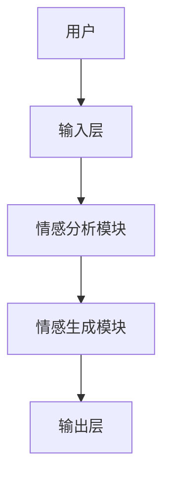
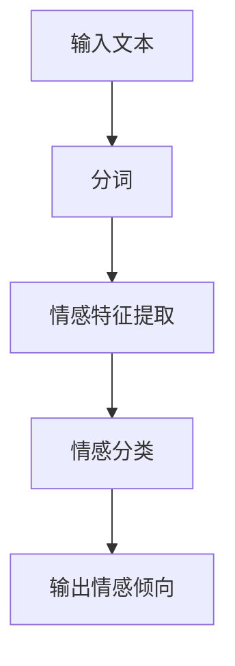
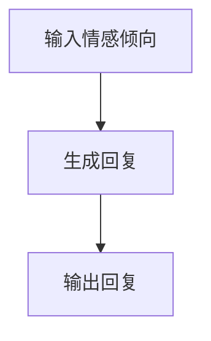
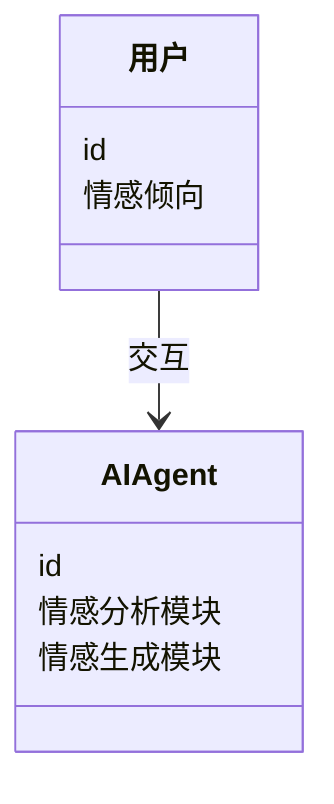
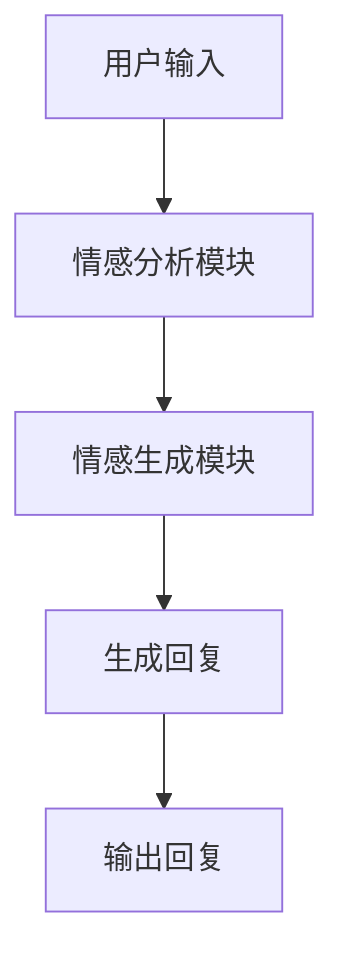

                 


# 构建LLM驱动的AI Agent情感智能交互

> 关键词：LLM，AI Agent，情感智能，自然语言处理，大语言模型，情感交互

> 摘要：本文详细探讨了如何利用大语言模型（LLM）构建具备情感智能的AI Agent。通过分析情感智能交互的核心概念、算法原理和系统架构，结合实际项目实战，为读者提供从理论到实践的全面指导，帮助理解并掌握构建情感智能AI Agent的关键技术。

---

## 第1章: 背景介绍

### 1.1 问题背景

#### 1.1.1 当前AI Agent的发展现状
随着人工智能技术的快速发展，AI Agent（智能代理）已经从简单的任务执行工具逐步演变为能够理解并处理复杂情感交互的智能实体。传统AI Agent主要基于规则或预设的逻辑进行操作，但在面对复杂的情感交互场景时，其表现显得力不从心。例如，在客服系统中，当用户表达负面情绪时，传统AI Agent可能无法准确识别并采取适当的应对措施。

#### 1.1.2 情感智能交互的需求与挑战
情感智能交互是AI Agent的一项高级功能，旨在通过理解用户的情感状态，提供更加个性化和贴心的服务。然而，情感智能交互的实现面临诸多挑战，包括如何准确识别用户的情感、如何生成符合情感语境的回复，以及如何在不同场景下动态调整交互策略等。

#### 1.1.3 大语言模型（LLM）在情感交互中的作用
大语言模型（LLM）凭借其强大的自然语言处理能力，能够理解上下文、识别情感倾向，并生成符合语境的回复。将LLM应用于AI Agent的情感智能交互，可以显著提升交互的自然性和智能化水平。

### 1.2 问题描述

#### 1.2.1 AI Agent在情感交互中的核心问题
传统AI Agent在情感交互中的核心问题包括：
1. **情感识别能力不足**：无法准确识别用户的情感状态。
2. **情感生成能力有限**：生成的回复缺乏情感色彩，难以满足用户的情感需求。
3. **动态调整能力不足**：在复杂情感场景中，无法灵活调整交互策略。

#### 1.2.2 情感智能交互的定义与目标
情感智能交互是指AI Agent能够理解和回应用户的情感状态，通过情感分析和情感生成技术，提供个性化的情感反馈。其目标是使AI Agent在与用户的交互过程中，能够自然地表达情感、理解和响应用户的情感需求。

#### 1.2.3 当前技术的局限性与改进方向
当前技术在情感智能交互方面的局限性主要体现在：
1. **情感识别精度不足**：现有情感识别算法在复杂场景下的准确率有待提高。
2. **情感生成的多样性有限**：生成的回复往往缺乏灵活性和多样性。
3. **动态调整能力不足**：在复杂情感场景中，AI Agent难以动态调整其交互策略。

### 1.3 问题解决

#### 1.3.1 LLM驱动AI Agent的优势
LLM（大语言模型）在情感智能交互中的优势包括：
1. **强大的自然语言理解能力**：LLM能够理解复杂的语义和情感信息。
2. **丰富的上下文记忆**：LLM可以基于上下文生成连贯的情感回复。
3. **动态调整能力**：LLM可以根据实时交互信息动态调整其生成策略。

#### 1.3.2 情感智能交互的技术实现路径
情感智能交互的技术实现路径包括：
1. **情感分析**：通过自然语言处理技术识别用户的情感倾向。
2. **情感生成**：基于情感分析结果，生成符合情感语境的回复。
3. **动态调整**：根据交互过程中的实时反馈，动态优化交互策略。

#### 1.3.3 问题解决的边界与外延
问题解决的边界在于，本文主要探讨如何利用LLM构建情感智能交互AI Agent，其外延则包括更广泛的人工智能技术应用。

### 1.4 核心要素与概念结构

#### 1.4.1 核心概念的组成与关系
情感智能交互的核心概念包括：
1. **情感分析**：识别用户的情感状态。
2. **情感生成**：生成符合情感语境的回复。
3. **动态调整**：根据实时反馈优化交互策略。

这些概念之间的关系是相互依赖且相互促进的，形成一个完整的交互闭环。

#### 1.4.2 情感智能交互的系统架构
情感智能交互的系统架构包括：
1. **输入层**：接收用户的输入信息。
2. **处理层**：包括情感分析和情感生成模块。
3. **输出层**：生成最终的交互回复。

#### 1.4.3 LLM与情感智能的结合方式
LLM与情感智能的结合方式主要体现在：
1. **情感分析**：利用LLM的强大自然语言处理能力，准确识别用户情感。
2. **情感生成**：基于LLM生成多样且连贯的情感回复。

---

## 第2章: 核心概念与联系

### 2.1 核心概念原理

#### 2.1.1 情感分析
情感分析是通过自然语言处理技术，识别文本中的情感倾向。常用的算法包括基于规则的方法、机器学习方法和深度学习方法。

#### 2.1.2 情感生成
情感生成是根据情感分析结果，生成符合情感语境的回复。常用的技术包括基于模板的生成、基于规则的生成和基于模型的生成。

### 2.2 概念属性特征对比

| 概念    | 属性              | 特征对比            |
|---------|-------------------|--------------------|
| 情感分析 | 输入：文本；输出：情感倾向 | 高准确性，依赖模型训练数据 |
| 情感生成 | 输入：情感倾向；输出：情感回复 | 多样性，依赖生成模型能力 |

### 2.3 ER实体关系图

```mermaid
er
actor: 用户
agent: AI Agent
action: 交互
```

### 2.4 情感智能交互的系统架构



---

## 第3章: 算法原理

### 3.1 算法概述

#### 3.1.1 模型训练
模型训练是利用大规模情感标注数据，训练情感分析和情感生成模型。

#### 3.1.2 情感识别
情感识别是通过预训练模型，准确识别用户的情感倾向。

#### 3.1.3 对话生成
对话生成是根据情感分析结果，生成符合情感语境的回复。

### 3.2 算法实现

#### 3.2.1 情感分析算法
以下是情感分析的流程图：



#### 3.2.2 情感生成算法
以下是情感生成的流程图：



### 3.3 数学模型与公式

#### 3.3.1 情感分析模型
情感分析模型常用的损失函数为交叉熵损失函数：
$$ \text{Loss} = -\sum_{i=1}^{n} y_i \log p_i + (1-y_i) \log (1-p_i) $$

其中，$y_i$ 是真实标签，$p_i$ 是模型预测的概率。

#### 3.3.2 情感生成模型
情感生成模型常用的生成策略是贪心算法：
$$ \text{选择概率最高的词} $$

---

## 第4章: 系统分析与架构设计

### 4.1 项目场景介绍
本项目旨在构建一个基于LLM的情感智能交互AI Agent，应用于客服系统和智能助手领域。

### 4.2 系统功能设计

#### 4.2.1 领域模型
以下是领域模型的类图：



### 4.3 系统架构设计

#### 4.3.1 系统架构
以下是系统架构图：


### 4.4 系统接口设计

#### 4.4.1 接口描述
1. **输入接口**：接收用户的输入文本。
2. **输出接口**：生成情感回复。

#### 4.4.2 交互流程
以下是交互流程图：



---

## 第5章: 项目实战

### 5.1 环境安装

```bash
pip install transformers
pip install torch
pip install numpy
```

### 5.2 核心实现

#### 5.2.1 情感分析实现

```python
from transformers import pipeline

sentiment_analyzer = pipeline("sentiment-analysis")
result = sentiment_analyzer("用户反馈：产品功能非常棒！")
print(result)
```

#### 5.2.2 情感生成实现

```python
from transformers import pipeline

text_generator = pipeline("text-generation")
result = text_generator("用户反馈：产品功能非常棒！")
print(result)
```

### 5.3 案例分析

#### 5.3.1 情感识别案例
输入文本：“我对这个产品非常不满意。”
输出结果：情感倾向为负面。

#### 5.3.2 情感生成案例
输入情感倾向：负面
生成回复：“非常抱歉给您带来不愉快的体验，我们会尽快改进。”

---

## 第6章: 总结与展望

### 6.1 总结
本文详细探讨了如何利用LLM构建情感智能交互AI Agent，从背景介绍、核心概念、算法原理到系统架构和项目实战，为读者提供了全面的技术指导。

### 6.2 展望
未来的研究方向包括：
1. 提高情感分析的准确性和鲁棒性。
2. 优化情感生成的多样性和灵活性。
3. 探索更高效的情感智能交互算法。

---

作者：AI天才研究院

