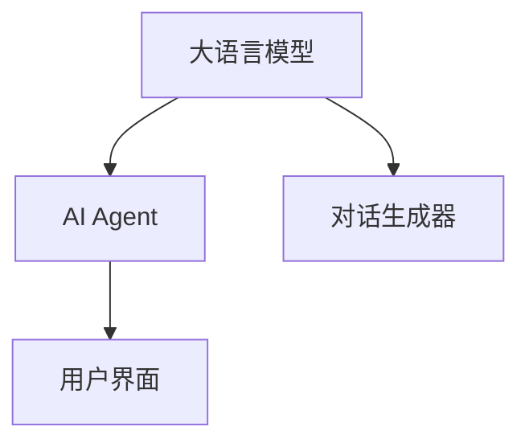
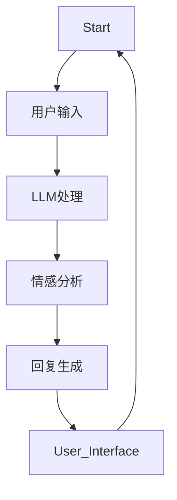
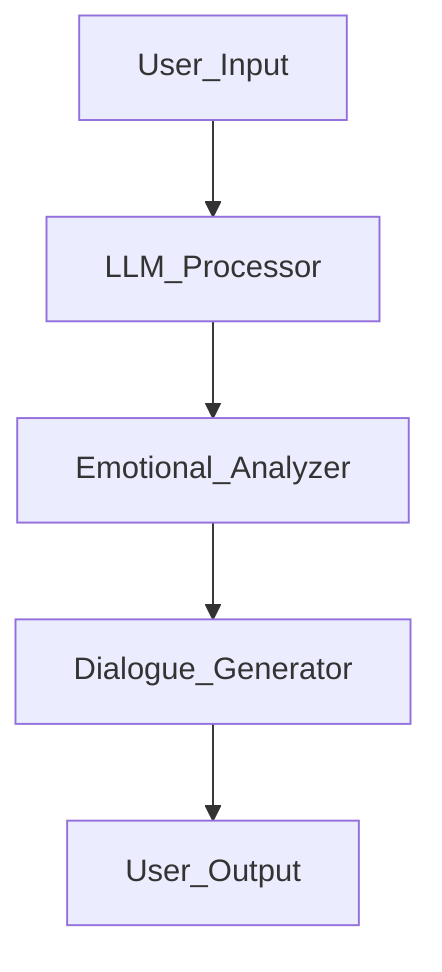
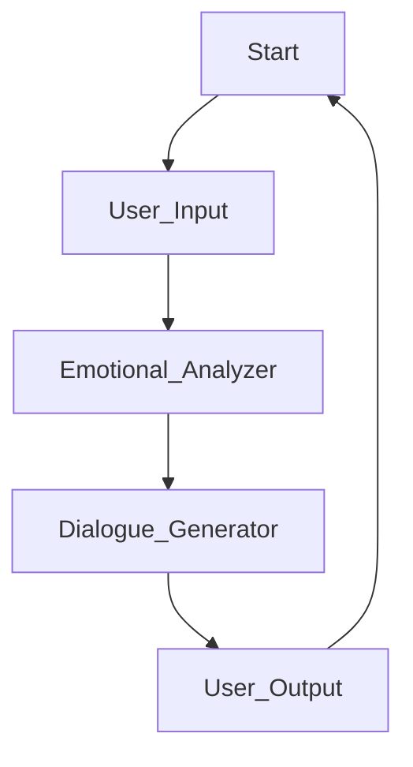

                 


---

# 《构建LLM驱动的AI Agent情感智能对话》

---

## 关键词：
- 大语言模型（LLM）
- AI Agent
- 情感智能对话
- 对话系统
- 人工智能

---

## 摘要：
本文详细探讨了如何利用大语言模型（LLM）构建具备情感智能的AI Agent，实现自然流畅的对话交互。文章从背景介绍、核心概念、算法原理、系统架构到项目实战，全面解析了LLM驱动的AI Agent在情感智能对话中的应用。通过理论分析和实践案例，本文为读者提供了构建情感智能对话系统的系统化方法和实用技巧。

---

# 第一部分: 背景介绍

---

# 第1章: 构建LLM驱动的AI Agent情感智能对话概述

## 1.1 LLM与AI Agent的定义与特点

### 1.1.1 大语言模型（LLM）的定义
大语言模型（Large Language Model，LLM）是指经过大量数据训练的深度学习模型，如GPT系列、BERT系列等。这些模型具有强大的自然语言处理能力，能够理解上下文、生成文本，并在多种任务上表现出色。

$$LLM = \text{大规模预训练语言模型}$$

### 1.1.2 AI Agent的核心概念
AI Agent（人工智能代理）是指能够感知环境、执行任务并做出决策的智能实体。它可以是一个软件程序，也可以是一个物理设备。

$$AI\ Agent = \text{具备感知和行动能力的智能实体}$$

### 1.1.3 情感智能对话的定义与重要性
情感智能对话是指AI Agent能够识别、理解和生成人类情感，从而实现更自然、更贴近人类的对话交互。

$$情感智能对话 = \text{具备情感理解与生成能力的对话系统}$$

### 1.1.4 情感智能对话的重要性
情感智能对话能够提升用户体验，使AI Agent更具人性化，从而在教育、客服、社交等领域发挥更大作用。

---

## 1.2 问题背景与目标

### 1.2.1 当前对话系统的主要挑战
传统对话系统存在以下问题：
1. 缺乏情感理解，对话生硬。
2. 对上下文理解不足，回答不够准确。
3. 对用户情感需求的响应不够及时。

### 1.2.2 情感智能对话的目标
目标是通过LLM驱动的AI Agent实现情感智能对话，提升用户体验。

---

## 1.3 问题解决与实现路径

### 1.3.1 LLM在情感智能对话中的作用
LLM通过大规模预训练，具备情感理解和生成能力，能够为AI Agent提供强大的语言处理能力。

### 1.3.2 AI Agent的构建方法
1. **情感分析**：识别用户情感。
2. **对话生成**：基于情感生成合适的回复。
3. **上下文理解**：保持对话连贯性。

---

## 1.4 边界与外延

### 1.4.1 情感智能对话的边界
1. 仅限于文本对话。
2. 不涉及视觉或听觉交互。

### 1.4.2 与其他对话系统的区别
传统对话系统注重功能实现，而情感智能对话系统注重用户体验。

---

## 1.5 概念结构与核心要素

### 1.5.1 情感智能对话的核心要素
1. **情感识别**：识别用户情感。
2. **情感生成**：生成情感化回复。
3. **上下文管理**：保持对话连贯。

### 1.5.2 LLM与AI Agent的结合方式
1. **直接调用**：AI Agent直接使用LLM进行对话生成。
2. **定制优化**：根据需求对LLM进行微调。

---

## 1.6 本章小结
本章介绍了LLM和AI Agent的基本概念，分析了情感智能对话的重要性和实现路径，为后续内容奠定了基础。

---

# 第二部分: 核心概念与联系

---

# 第2章: 核心概念与联系

## 2.1 LLM与AI Agent的核心概念

### 2.1.1 LLM的核心概念
1. **预训练**：利用大量数据进行无监督学习。
2. **微调**：根据特定任务进行有监督优化。

### 2.1.2 AI Agent的核心概念
1. **感知能力**：通过输入数据感知环境。
2. **决策能力**：基于感知做出决策。
3. **行动能力**：执行决策动作。

---

## 2.2 LLM与AI Agent的关系

### 2.2.1 实体关系图
以下是LLM与AI Agent的关系图：



### 2.2.2 功能流程图
以下是LLM驱动的AI Agent情感智能对话的功能流程图：



---

## 2.3 情感智能对话的核心要素

### 2.3.1 情感分析模型
1. **文本表示**：将文本转换为向量表示。
2. **情感分类**：分类器基于向量进行情感判断。

### 2.3.2 对话生成模型
1. **基于LLM的生成**：利用LLM生成回复。
2. **情感调整**：根据情感分析结果调整回复语气。

---

## 2.4 LLM与情感智能对话的关系

### 2.4.1 LLM在情感智能对话中的作用
1. **自然语言生成**：生成符合情感的回复。
2. **上下文理解**：保持对话连贯性。

### 2.4.2 情感智能对话对LLM的增强
1. **任务导向性**：使LLM专注于特定任务。
2. **情感增强**：提升LLM的情感生成能力。

---

## 2.5 本章小结
本章详细探讨了LLM和AI Agent的核心概念，分析了情感智能对话的核心要素，为后续实现提供了理论基础。

---

# 第三部分: 算法原理讲解

---

# 第3章: 算法原理讲解

## 3.1 情感分析算法

### 3.1.1 情感分析的数学模型
1. **文本表示**：使用词袋模型或词嵌入（如Word2Vec）。
2. **分类模型**：使用SVM或神经网络进行分类。

$$\text{文本表示} = \sum_{i=1}^{n} w_i \cdot x_i$$
$$\text{分类概率} = P(y|x) = \frac{e^{w \cdot x}}{\sum_{k} e^{w_k \cdot x}}$$

### 3.1.2 基于LLM的情感分析
1. **预训练模型**：利用如BERT的情感分析模型。
2. **微调模型**：根据特定任务调整模型。

---

## 3.2 对话生成算法

### 3.2.1 对话生成的数学模型
1. **序列生成模型**：使用RNN或Transformer生成回复。
2. **情感调节机制**：根据情感类别调整生成策略。

$$P(\text{回复}|x, y) = \prod_{i=1}^{m} P(y_i|\text{历史对话}, y_{i-1})$$

### 3.2.2 基于LLM的对话生成
1. **直接生成**：利用LLM的生成能力直接生成回复。
2. **情感指导**：结合情感分析结果进行生成控制。

---

## 3.3 本章小结
本章详细讲解了情感分析和对话生成的算法原理，为后续实现提供了理论支持。

---

# 第四部分: 系统分析与架构设计

---

# 第4章: 系统分析与架构设计

## 4.1 系统架构设计

### 4.1.1 系统模块划分
1. **输入模块**：接收用户输入。
2. **处理模块**：包括情感分析和对话生成。
3. **输出模块**：生成回复并返回给用户。

### 4.1.2 系统架构图
以下是系统架构图：



---

## 4.2 系统功能设计

### 4.2.1 系统功能模块
1. **情感分析模块**：识别用户情感。
2. **对话生成模块**：生成情感化的回复。
3. **上下文管理模块**：维护对话历史。

---

## 4.3 系统交互流程

### 4.3.1 交互流程图
以下是交互流程图：



---

## 4.4 本章小结
本章详细设计了系统的架构和交互流程，为后续实现提供了指导。

---

# 第五部分: 项目实战

---

# 第5章: 项目实战

## 5.1 环境安装

### 5.1.1 安装Python
安装Python 3.x版本。

### 5.1.2 安装依赖库
安装以下依赖库：
```bash
pip install transformers torch
```

---

## 5.2 核心代码实现

### 5.2.1 情感分析代码
```python
from transformers import pipeline

sentiment_analyzer = pipeline("sentiment-analysis")
result = sentiment_analyzer("I love this product.")
print(result)
```

### 5.2.2 对话生成代码
```python
from transformers import AutoModelForCausalLM, AutoTokenizer

model_name = "gpt2"
tokenizer = AutoTokenizer.from_pretrained(model_name)
model = AutoModelForCausalLM.from_pretrained(model_name)

input_text = "How are you?"
inputs = tokenizer(input_text, return_tensors="pt")
output = model.generate(inputs.input_ids, max_length=50)
print(tokenizer.decode(output[0]))
```

---

## 5.3 代码应用解读与分析

### 5.3.1 情感分析代码解读
1. **加载预训练模型**：使用Transformers库加载情感分析模型。
2. **输入文本分析**：返回情感结果。

### 5.3.2 对话生成代码解读
1. **加载预训练模型**：使用GPT-2模型。
2. **生成回复**：根据输入生成回复。

---

## 5.4 本章小结
本章通过实际代码实现了情感分析和对话生成，展示了如何利用LLM构建情感智能对话系统。

---

# 第六部分: 总结与展望

---

# 第6章: 总结与展望

## 6.1 本章总结

### 6.1.1 核心内容回顾
1. **背景介绍**：LLM和AI Agent的基本概念。
2. **核心概念**：情感智能对话的核心要素。
3. **算法原理**：情感分析和对话生成的实现。
4. **系统设计**：系统架构和交互流程。
5. **项目实战**：代码实现和应用解读。

### 6.1.2 总结与思考
情感智能对话是提升用户体验的重要方向，而LLM是实现这一目标的关键技术。

---

## 6.2 未来展望

### 6.2.1 技术发展
1. **模型优化**：更高效的情感分析和对话生成算法。
2. **多模态对话**：结合视觉和听觉信息。

### 6.2.2 应用场景扩展
1. **教育领域**：个性化学习辅导。
2. **医疗领域**：患者情感支持。

---

## 6.3 最佳实践Tips

### 6.3.1 开发建议
1. **选择合适的LLM模型**：根据需求选择预训练模型。
2. **优化对话流程**：简化不必要的步骤。

### 6.3.2 注意事项
1. **数据隐私**：保护用户数据。
2. **模型调优**：持续优化模型性能。

---

## 6.4 本章小结
本章总结了全文内容，并展望了情感智能对话技术的未来发展方向，提出了实际开发中的注意事项。

---

# 作者：AI天才研究院/AI Genius Institute & 禅与计算机程序设计艺术 /Zen And The Art of Computer Programming

---

