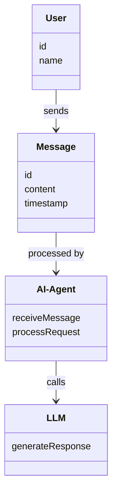
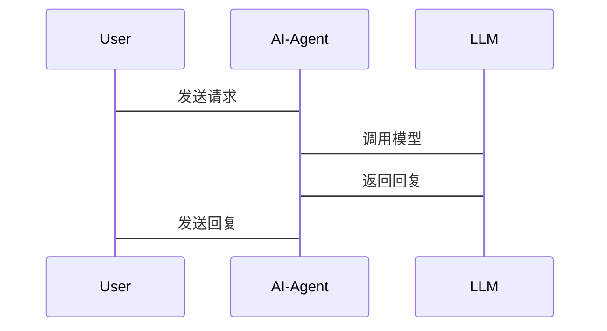

                 


# 构建LLM驱动的AI Agent隐私保护对话系统

> **关键词**：LLM, AI Agent, 隐私保护, 对话系统, 大语言模型, 隐私保护机制  
> 
> **摘要**：本文将详细介绍如何构建一个基于大语言模型（LLM）的AI Agent隐私保护对话系统。通过分析对话系统的发展现状、LLM和AI Agent的核心原理、隐私保护机制的设计与实现、系统架构设计、算法原理、系统实现以及实际案例，本文将为读者提供一个全面的视角，帮助读者理解并掌握构建此类系统的各项技术和方法。

---

## 第1章: 背景介绍与核心概念

### 1.1 问题背景
#### 1.1.1 当前对话系统的发展现状
随着人工智能技术的快速发展，对话系统已广泛应用于客服、教育、医疗等领域。然而，现有系统在隐私保护方面存在诸多挑战，特别是在数据收集和处理过程中容易泄露用户信息。

#### 1.1.2 LLM驱动的AI Agent的兴起
大语言模型（LLM）如GPT-3和BERT的出现，为对话系统带来了更强的自然语言处理能力。AI Agent作为一种智能体，能够根据上下文动态响应，进一步提升了对话系统的实用性。

#### 1.1.3 隐私保护的重要性
在数据驱动的AI系统中，隐私保护是构建可信系统的基石。如何在提升系统性能的同时保护用户隐私，是当前技术领域的核心问题之一。

### 1.2 核心概念
#### 1.2.1 LLM的定义与特点
- **定义**：LLM是一种基于深度学习的自然语言处理模型，能够理解和生成人类语言。
- **特点**：强大的上下文理解能力、可扩展性、多语言支持。

#### 1.2.2 AI Agent的定义与特点
- **定义**：AI Agent是一种智能体，能够在特定环境中执行任务，通过与用户交互完成目标。
- **特点**：自主性、反应性、目标导向。

#### 1.2.3 隐私保护的定义与目标
- **定义**：隐私保护是指在数据处理和传输过程中，保护用户信息不被未经授权的访问或泄露。
- **目标**：确保数据安全、合规性、用户信任。

### 1.3 问题描述
#### 1.3.1 当前对话系统中的隐私泄露问题
现有对话系统在处理用户输入时，可能泄露敏感信息，如个人身份、地址等。

#### 1.3.2 LLM驱动的AI Agent中的隐私保护需求
为了确保用户隐私，AI Agent需要在处理数据时采取有效的保护措施，如数据脱敏和加密。

#### 1.3.3 系统设计的目标与边界
- **目标**：构建一个既能提供高效对话服务，又能保护用户隐私的系统。
- **边界**：系统仅处理用户输入，不存储敏感信息。

### 1.4 核心概念与联系
#### 1.4.1 核心概念原理
- LLM通过深度学习处理语言数据，AI Agent利用LLM进行对话生成。

#### 1.4.2 核心概念属性特征对比表格

| 特性 | LLM | AI Agent |
|------|------|----------|
| 输入 | 文本数据 | 用户查询 |
| 输出 | 对文本的预测 | 对话回复 |
| 目标 | 提供语言理解 | 完成用户任务 |

#### 1.4.3 ER实体关系图架构
```mermaid
er
 entity User {
   id
   name
 }
 entity Message {
   id
   content
   timestamp
 }
 relationship: User sends Message
```

---

## 第2章: LLM与AI Agent的核心原理

### 2.1 LLM的基本原理
#### 2.1.1 大语言模型的训练过程
- **预训练**：使用大规模数据进行无监督学习。
- **微调**：根据具体任务调整模型参数。

#### 2.1.2 模型的输入输出机制
- 输入：文本序列。
- 输出：生成的文本序列。

#### 2.1.3 模型的可解释性
- 通过注意力机制分析模型决策过程。

### 2.2 AI Agent的工作原理
#### 2.2.1 任务分解与执行
- 将用户请求分解为多个子任务，逐一执行。

#### 2.2.2 知识库的构建与管理
- 使用结构化数据存储知识，支持快速检索。

#### 2.2.3 多轮对话的管理
- 维护对话上下文，确保连贯性。

### 2.3 LLM与AI Agent的结合
#### 2.3.1 LLM作为AI Agent的核心模块
- AI Agent调用LLM生成回复。

#### 2.3.2 AI Agent对LLM的扩展与增强
- 增加领域知识，提升专业性。

#### 2.3.3 LLM驱动的对话系统的优势
- 高效、智能、可扩展。

---

## 第3章: 隐私保护机制的设计与实现

### 3.1 隐私保护的基本原则
#### 3.1.1 数据最小化原则
- 只收集必要的数据。

#### 3.1.2 数据匿名化原则
- 去除或加密敏感信息。

#### 3.1.3 数据加密原则
- 使用加密技术保护数据传输。

### 3.2 数据脱敏技术
#### 3.2.1 数据脱敏的定义与方法
- 数据脱敏：将敏感信息转化为不可逆的格式。

#### 3.2.2 常见的数据脱敏技术
- 替换：将真实数据替换为虚拟数据。
- 打乱：重新排列数据顺序。

#### 3.2.3 数据脱敏在对话系统中的应用
- 对用户输入的敏感信息进行处理。

### 3.3 加密技术
#### 3.3.1 对称加密与非对称加密
- 对称加密：速度快，适用于小数据。
- 非对称加密：安全性高，适用于大数据。

#### 3.3.2 加密技术在对话系统中的应用
- 传输层加密：保护数据在网络中的传输安全。

---

## 第4章: 系统架构设计

### 4.1 需求分析
#### 4.1.1 功能需求
- 多轮对话、隐私保护、任务执行。

#### 4.1.2 性能需求
- 响应时间、并发处理能力。

### 4.2 系统功能设计
#### 4.2.1 领域模型设计


#### 4.2.2 系统架构设计


#### 4.2.3 系统接口设计
- API接口：处理用户请求，调用LLM生成回复。

#### 4.2.4 系统交互流程


---

## 第5章: 算法原理

### 5.1 LLM的训练和推理
#### 5.1.1 训练过程
- 预训练：使用大规模数据进行无监督学习。
- 微调：根据任务调整模型参数。

#### 5.1.2 推理过程
- 输入文本，生成输出文本。

### 5.2 隐私保护算法
#### 5.2.1 联邦学习
- 数据不集中，模型参数在节点间同步。

#### 5.2.2 模糊化处理
- 通过模糊逻辑处理数据，降低敏感性。

---

## 第6章: 系统实现

### 6.1 环境配置
- 安装Python、TensorFlow、Keras等工具。

### 6.2 核心代码实现
#### 6.2.1 数据脱敏模块
```python
def data_masking(data):
    # 简单的脱敏处理，例如替换身份证号的中间部分
    masked_data = data.replace("1234567890", "**********")
    return masked_data
```

#### 6.2.2 加密模块
```python
from cryptography.fernet import Fernet

def encrypt_data(key, data):
    cipher = Fernet(key)
    encrypted_data = cipher.encrypt(data.encode())
    return encrypted_data
```

### 6.3 测试与优化
- 测试系统性能，优化响应时间。

---

## 第7章: 实际案例分析

### 7.1 项目背景
- 开发一个医疗领域的AI对话系统，保护患者隐私。

### 7.2 需求分析
- 提供疾病咨询、预约挂号功能，保护患者信息。

### 7.3 设计与实现
- 使用LLM生成回复，数据脱敏处理敏感信息。

### 7.4 测试与结果
- 系统在测试中表现良好，隐私保护措施有效。

### 7.5 总结与优化
- 总结经验，优化系统性能和隐私保护措施。

---

## 第8章: 总结与展望

### 8.1 总结
本文详细介绍了构建LLM驱动的AI Agent隐私保护对话系统的过程，从理论到实践，全面覆盖了系统设计的各个方面。

### 8.2 未来展望
随着技术进步，隐私保护和对话系统将更加智能化，未来的研究方向包括更高效的加密算法和更智能的对话管理。

---

**作者**：AI天才研究院/AI Genius Institute & 禅与计算机程序设计艺术 /Zen And The Art of Computer Programming

