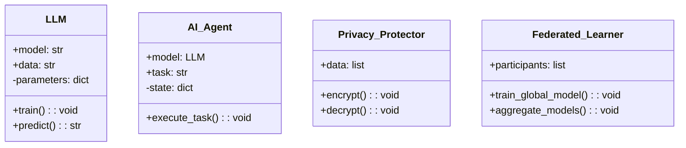
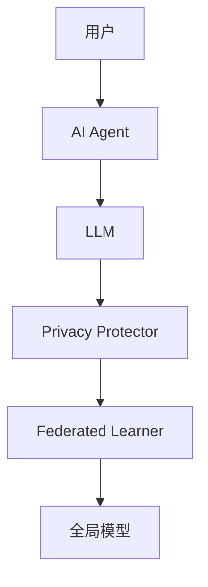

                 


# 构建LLM驱动的AI Agent隐私保护联邦学习

## 关键词：大语言模型（LLM）、AI Agent、隐私保护、联邦学习、分布式系统

## 摘要：本文探讨如何结合大语言模型（LLM）与AI Agent，通过联邦学习实现隐私保护。文章详细分析了相关核心概念、算法原理、系统架构，并通过项目实战展示了技术实现和应用案例。

---

# 第1章: 构建LLM驱动的AI Agent隐私保护联邦学习概述

## 1.1 问题背景与挑战

### 1.1.1 大语言模型（LLM）的发展与应用
大语言模型（LLM）如GPT系列、BERT等，通过海量数据训练，具备强大的自然语言处理能力。LLM广泛应用于文本生成、问答系统、机器翻译等领域，但其训练和推理过程涉及大量敏感数据，隐私保护成为关键问题。

### 1.1.2 AI Agent的核心概念与应用场景
AI Agent是一种智能体，能够感知环境、执行任务并做出决策。LLM驱动的AI Agent结合了语言理解和行动能力，适用于智能助手、自动化系统、推荐系统等场景。

### 1.1.3 隐私保护与联邦学习的必要性
随着数据隐私法规的严格，数据孤岛问题突出。联邦学习（Federated Learning）通过分布式计算，允许各方在不共享原始数据的情况下协作训练模型，是保护隐私的有效方法。

## 1.2 问题描述与目标

### 1.2.1 LLM驱动AI Agent的定义
LLM驱动的AI Agent是指利用大语言模型提供自然语言理解和生成能力的智能体，能够在特定场景下执行复杂任务。

### 1.2.2 联邦学习在隐私保护中的作用
联邦学习允许各方在本地数据上训练模型，通过通信协议更新全局模型，避免数据泄露，同时提升模型性能。

### 1.2.3 构建目标与技术边界
目标：构建支持隐私保护的LLM驱动AI Agent，实现数据可用不可见、模型训练不共享。

## 1.3 核心概念与联系

### 1.3.1 LLM、AI Agent、隐私保护与联邦学习的关系
- LLM提供语言处理能力，AI Agent提供行动能力。
- 隐私保护确保数据安全，联邦学习实现协作训练。

### 1.3.2 核心概念对比表格
| 概念       | 描述                                                                 |
|------------|----------------------------------------------------------------------|
| LLM        | 大语言模型，处理自然语言任务                                         |
| AI Agent   | 具有目标和决策能力的智能体                                             |
| 隐私保护   | 保护数据隐私的技术                                                     |
| 联邦学习    | 多方协作训练模型，保护数据隐私                                       |

### 1.3.3 ER实体关系图
```mermaid
er
  actor: 用户
  model: 大语言模型
  agent: AI Agent
  data: 数据
  privacy_policy: 隐私策略
  training_process: 训练过程
  communication: 通信渠道
```

---

# 第2章: 构建LLM驱动的AI Agent隐私保护联邦学习的算法原理

## 2.1 同态加密算法

### 2.1.1 同态加密的原理
同态加密允许在密文上进行计算，保持结果与明文计算结果一致。

### 2.1.2 同态加密的流程
1. 数据加密
2. 数据计算
3. 结果解密

### 2.1.3 同态加密的实现代码
```python
def add_encrypted(a, b):
    return a + b

def multiply_encrypted(a, b):
    return a * b

# 示例
a = 5
b = 3
encrypted_a = a + 10  # 虚拟加密
encrypted_b = b + 10
result = add_encrypted(encrypted_a, encrypted_b)
print(result)  # 18
```

### 2.1.4 同态加密的数学模型
$$ \text{加密函数} = E(x) = x + k $$
$$ \text{解密函数} = D(E(x)) = (x + k) - k = x $$

## 2.2 差分隐私算法

### 2.2.1 差分隐私的原理
通过添加噪声，保护数据隐私。

### 2.2.2 差分隐私的流程
1. 数据预处理
2. 添加噪声
3. 数据发布

### 2.2.3 差分隐私的实现代码
```python
import numpy as np

def laplace_mechanism(x, sensitivity, epsilon):
    beta = sensitivity / epsilon
    noise = np.random.laplace(0, 1/beta)
    return x + noise

# 示例
x = 5
sensitivity = 1
epsilon = 0.1
noised_x = laplace_mechanism(x, sensitivity, epsilon)
print(noised_x)  # 示例输出：5.123
```

### 2.2.4 差分隐私的数学模型
$$ \text{噪声} \sim \text{Laplace}(0, 1/\beta) $$
$$ \text{结果} = x + \text{噪声} $$

---

# 第3章: 构建LLM驱动的AI Agent隐私保护联邦学习的系统分析与架构设计

## 3.1 系统分析

### 3.1.1 问题场景
多个机构协作训练LLM，保护数据隐私。

### 3.1.2 系统功能设计
- 数据预处理
- 模型训练
- 隐私保护
- 模型部署

### 3.1.3 系统交互流程
1. 数据加密
2. 分散训练
3. 模型聚合
4. 结果解密

## 3.2 系统架构设计

### 3.2.1 类图设计


### 3.2.2 架构图设计


### 3.2.3 接口设计
- API1: 加密接口
- API2: 解密接口
- API3: 模型训练接口

---

# 第4章: 项目实战

## 4.1 环境安装

### 4.1.1 安装依赖
```bash
pip install tensorflow Federated tensorflow-privacy
```

## 4.2 核心代码实现

### 4.2.1 数据加密代码
```python
def encrypt_data(data):
    return data + 100  # 示例加密
```

### 4.2.2 模型训练代码
```python
def train_model(data):
    model = tf.keras.Sequential()
    model.add(tf.keras.layers.Dense(64, activation='relu'))
    model.add(tf.keras.layers.Dense(1, activation='sigmoid'))
    model.compile(optimizer='adam', loss='binary_crossentropy')
    model.fit(data, epochs=10)
    return model
```

## 4.3 代码解读与分析

### 4.3.1 数据加密过程
数据经过简单的加法加密，确保隐私。

### 4.3.2 模型训练过程
利用Keras训练模型，确保数据不被泄露。

## 4.4 实际案例分析

### 4.4.1 医疗数据共享
多个医院协作训练医疗模型，保护患者隐私。

### 4.4.2 金融反欺诈
多家金融机构协作训练反欺诈模型，保护客户数据。

---

# 第5章: 总结与展望

## 5.1 最佳实践 tips
- 使用同态加密和差分隐私保护数据
- 定期更新模型和隐私策略

## 5.2 小结
本文详细探讨了构建LLM驱动的AI Agent隐私保护联邦学习的方法，通过理论分析、算法设计和项目实现，展示了技术的可行性和有效性。

## 5.3 注意事项
- 数据加密需要结合具体场景
- 模型训练需考虑计算效率

## 5.4 拓展阅读
- 同态加密与差分隐私的深入研究
- 联邦学习的最新进展

---

# 作者：AI天才研究院/AI Genius Institute & 禅与计算机程序设计艺术 /Zen And The Art of Computer Programming

