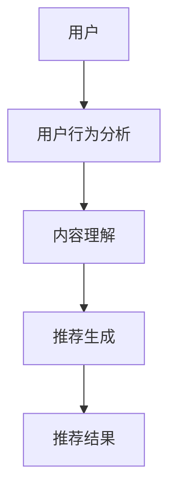
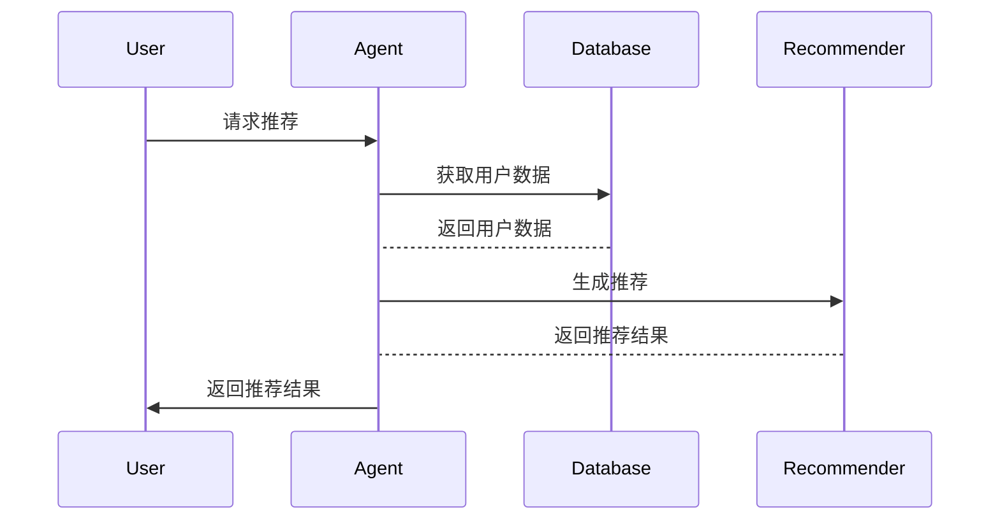

                 


# 构建个性化推荐AI Agent

## 关键词：个性化推荐，AI Agent，推荐系统，机器学习，深度学习，知识图谱

## 摘要：个性化推荐系统是人工智能领域的重要应用，而AI Agent（人工智能代理）通过结合上下文理解和动态决策能力，为推荐系统注入了更高的智能化。本文将从核心概念、算法原理、系统架构到项目实战，详细讲解如何构建一个基于AI Agent的个性化推荐系统，涵盖协同过滤、深度学习和知识图谱等技术，提供丰富的代码示例和系统设计图。

---

# 第一部分：个性化推荐与AI Agent的背景与核心概念

## 第1章：个性化推荐系统概述

### 1.1 个性化推荐的背景与意义

#### 1.1.1 从传统推荐到个性化推荐的演进
- **传统推荐**：基于简单的规则或统计方法，推荐结果固定，无法适应用户行为变化。
- **个性化推荐**：基于用户行为、偏好和内容特征，提供动态、精准的推荐。

#### 1.1.2 个性化推荐的核心价值
- 提高用户满意度和粘性。
- 帮助企业提升用户转化率和收益。

#### 1.1.3 个性化推荐的应用场景
- 电商、音乐、视频、新闻等领域。

### 1.2 AI Agent的基本概念

#### 1.2.1 AI Agent的定义与特点
- **定义**：具备自主决策能力，能够根据环境信息执行任务。
- **特点**：学习能力、推理能力、自适应能力。

#### 1.2.2 AI Agent的核心能力
- 知识表示、推理、规划、学习。

#### 1.2.3 AI Agent与个性化推荐的结合
- AI Agent通过理解和分析用户行为，动态调整推荐策略。

### 1.3 个性化推荐与AI Agent的核心要素对比

#### 1.3.1 核心概念属性对比表格
| **属性**       | **个性化推荐**              | **AI Agent**                 |
|-----------------|-----------------------------|------------------------------|
| 核心目标         | 提供精准推荐                 | 执行任务并优化结果           |
| 输入            | 用户行为、内容特征           | 用户需求、环境信息           |
| 输出            | 推荐列表                   | 动作、决策                   |
| 智能水平         | 基于规则或模型             | 具备自主决策能力             |

#### 1.3.2 ER实体关系图架构
```mermaid
er
    User {
        id, name, preferences
    }
    Item {
        id, title, description, category
    }
    Recommendation {
        user_id, item_id, score, timestamp
    }
```

---

## 第2章：个性化推荐与AI Agent的核心概念

### 2.1 个性化推荐的实现原理

#### 2.1.1 基于用户行为的推荐
- **协同过滤**：通过用户相似性计算推荐。
- **基于内容的推荐**：分析内容特征进行推荐。

#### 2.1.2 基于内容的推荐
- **内容特征提取**：使用文本挖掘或深度学习提取内容特征。
- **相似度计算**：如余弦相似度。

#### 2.1.3 混合推荐模型
- 结合协同过滤和内容推荐，提升推荐准确性。

### 2.2 AI Agent的推荐机制

#### 2.2.1 基于知识图谱的推荐
- **知识图谱构建**：将实体及其关系表示为图结构。
- **基于图的推荐**：利用图遍历算法（如深度优先搜索）进行推荐。

#### 2.2.2 基于上下文的动态推荐
- **上下文理解**：分析用户当前行为和环境。
- **动态调整策略**：实时更新推荐结果。

#### 2.2.3 基于对话历史的推荐
- **对话历史分析**：提取用户意图和偏好。
- **动态生成推荐**：根据对话进展调整推荐内容。

### 2.3 个性化推荐与AI Agent的核心要素对比

#### 2.3.1 核心概念属性对比表格
| **要素**       | **个性化推荐**              | **AI Agent**                 |
|-----------------|-----------------------------|------------------------------|
| 输入数据类型     | 用户行为、内容特征           | 用户需求、环境信息、对话历史 |
| 输出形式         | 推荐列表                   | 动作、决策、推荐结果         |
| 处理方式         | 基于模型的预测             | 基于推理和学习的决策         |

#### 2.3.2 ER实体关系图架构
```mermaid
er
    User {
        id, name, preferences
    }
    Item {
        id, title, description, category
    }
    Interaction {
        user_id, item_id, timestamp, action
    }
    Recommendation {
        user_id, item_id, score, timestamp
    }
```

---

## 第3章：个性化推荐与AI Agent的数学模型

### 3.1 个性化推荐的数学模型

#### 3.1.1 协同过滤算法的数学表达
- **用户-用户协同过滤**：
  $$ sim(u, v) = \frac{\sum_{i} (r_{u,i} - \bar{r}_u)(r_{v,i} - \bar{r}_v)}{\sqrt{\sum_{i} (r_{u,i} - \bar{r}_u)^2} \sqrt{\sum_{i} (r_{v,i} - \bar{r}_v)^2}} $$
- **物品-物品协同过滤**：
  $$ sim(i, j) = \frac{\sum_{u} (r_{u,i} - \bar{r}_i)(r_{u,j} - \bar{r}_j)}{\sqrt{\sum_{u} (r_{u,i} - \bar{r}_i)^2} \sqrt{\sum_{u} (r_{u,j} - \bar{r}_j)^2}} $$

#### 3.1.2 基于矩阵分解的推荐模型
- **矩阵分解模型**：将用户-物品评分矩阵分解为用户因子矩阵和物品因子矩阵。
  $$ P \in \mathbb{R}^{n \times k}, Q \in \mathbb{R}^{m \times k} $$
  $$ r_{u,i} = \sum_{t=1}^{k} P_{u,t} Q_{i,t} $$

#### 3.1.3 基于深度学习的推荐模型
- **神经网络结构**：使用DNN、CNN或RNN处理用户行为序列。
  $$ \hat{y} = f(x; \theta) $$

### 3.2 AI Agent的推荐算法原理

#### 3.2.1 基于强化学习的推荐算法
- **强化学习框架**：通过奖励机制优化推荐策略。
  $$ R = r_1 + r_2 + \dots + r_n $$
  其中，$r_i$ 是第i步的奖励。

#### 3.2.2 基于图神经网络的推荐算法
- **图神经网络模型**：在知识图谱上进行推荐。
  $$ h_i = \sigma(A h_{i-1}) $$

#### 3.2.3 基于知识图谱的推荐算法
- **知识图谱构建**：将实体和关系表示为图结构。
- **基于图的推荐**：使用图遍历算法生成推荐。

### 3.3 推荐系统数学公式解析

#### 3.3.1 协同过滤的相似度计算公式
$$ sim(u, v) = \frac{\sum_{i} (r_{u,i} - \bar{r}_u)(r_{v,i} - \bar{r}_v)}{\sqrt{\sum_{i} (r_{u,i} - \bar{r}_u)^2} \sqrt{\sum_{i} (r_{v,i} - \bar{r}_v)^2}} $$

#### 3.3.2 基于矩阵分解的损失函数
$$ \text{Loss} = \sum_{(u,i) \in \text{train}} (r_{u,i} - \sum_{t=1}^{k} P_{u,t} Q_{i,t})^2 + \lambda (P^2 + Q^2) $$

#### 3.3.3 基于深度学习的推荐模型公式
$$ \hat{y} = f(x; \theta) $$

---

## 第4章：系统分析与架构设计方案

### 4.1 个性化推荐AI Agent的系统架构

#### 4.1.1 系统功能模块划分
- **用户行为分析模块**：分析用户行为，提取特征。
- **内容理解与生成模块**：理解内容，生成推荐候选。
- **推荐策略优化模块**：优化推荐策略，动态调整推荐结果。

#### 4.1.2 系统架构设计图


#### 4.1.3 系统接口设计
- **输入接口**：接收用户行为数据和内容特征。
- **输出接口**：返回推荐结果和反馈数据。

### 4.2 系统功能设计

#### 4.2.1 用户行为分析模块
- **功能**：分析用户行为，提取特征。
- **流程**：数据预处理、特征提取、行为建模。

#### 4.2.2 内容理解与生成模块
- **功能**：理解内容，生成推荐候选。
- **流程**：内容特征提取、内容相似度计算、候选生成。

#### 4.2.3 推荐策略优化模块
- **功能**：优化推荐策略，动态调整推荐结果。
- **流程**：策略学习、策略优化、策略部署。

### 4.3 系统交互

#### 4.3.1 系统交互流程


---

## 第5章：项目实战

### 5.1 环境搭建与数据准备

#### 5.1.1 环境搭建
- **安装Python**：3.8.0及以上版本。
- **安装依赖库**：`numpy`, `pandas`, `scikit-learn`, `tensorflow`.

#### 5.1.2 数据准备
- **数据来源**：公开数据集（如MovieLens）。
- **数据预处理**：清洗、特征提取、格式转换。

### 5.2 系统核心实现

#### 5.2.1 数据预处理与特征提取
```python
import pandas as pd
from sklearn.preprocessing import StandardScaler

# 数据加载
df = pd.read_csv('data.csv')

# 特征提取
X = df[['age', 'gender', 'occupation']]
y = df['rating']

# 数据标准化
scaler = StandardScaler()
X_scaled = scaler.fit_transform(X)
```

#### 5.2.2 推荐模型训练
```python
from sklearn.decomposition import NMF

# 矩阵分解模型
model = NMF(n_components=5, random_state=42)
model.fit(X_scaled)
```

#### 5.2.3 推荐结果生成
```python
# 生成推荐结果
user_input = input("请输入用户ID：")
recommendations = model.transform(user_input)
print("推荐结果：", recommendations)
```

### 5.3 系统部署与测试

#### 5.3.1 系统部署
- **部署环境**：选择云平台（如AWS、Azure）。
- **部署方式**：Docker容器化部署。

#### 5.3.2 系统测试
- **功能测试**：验证推荐功能是否正常。
- **性能测试**：测试系统在高并发情况下的表现。

### 5.4 项目小结

---

## 第6章：总结与展望

### 6.1 最佳实践 Tips
- **数据质量**：确保数据干净、完整。
- **模型优化**：结合领域知识优化模型。
- **实时性**：提升推荐的实时性。

### 6.2 小结
本文详细讲解了个性化推荐AI Agent的构建过程，从理论到实践，帮助读者掌握相关技术。

### 6.3 注意事项
- **数据隐私**：保护用户隐私。
- **模型解释性**：提升推荐的可解释性。

### 6.4 拓展阅读
- 推荐系统经典书籍：《推荐系统实践》。
- AI Agent相关论文：《基于知识图谱的推荐系统研究》。

---

## 作者：AI天才研究院 & 禅与计算机程序设计艺术

---

以上为《构建个性化推荐AI Agent》的技术博客文章目录，涵盖了从理论到实践的全过程，确保读者能够系统地理解和实现个性化推荐AI Agent。

