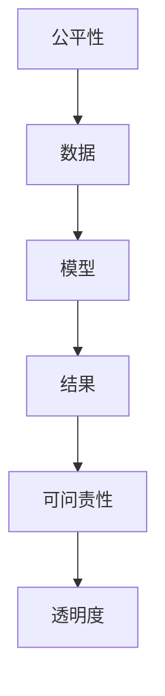
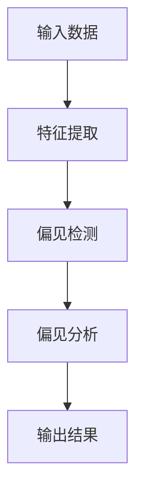
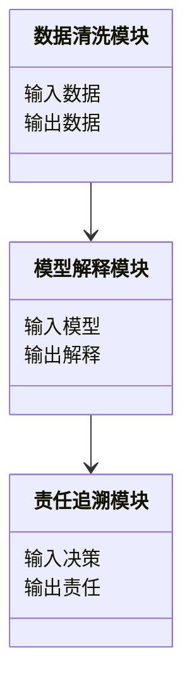
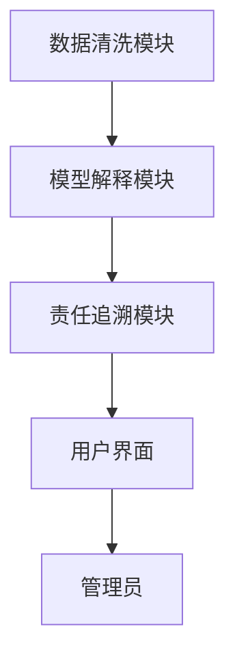
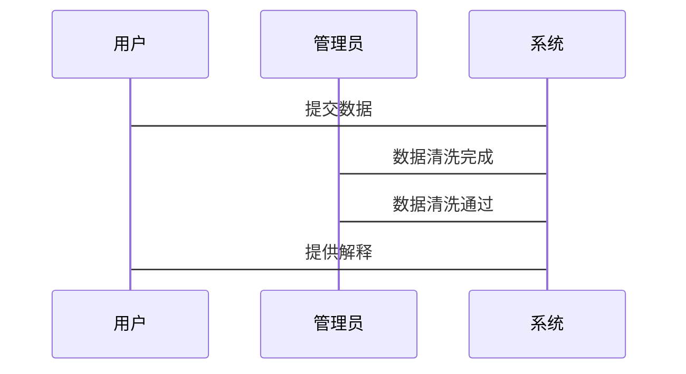

                 


# 构建企业级AI伦理审核框架：确保AI应用的公平性、透明度与可问责性

> 关键词：AI伦理审核框架，公平性，透明度，可问责性，企业级AI应用，伦理审核

> 摘要：本文将详细探讨如何构建一个企业级的AI伦理审核框架，以确保AI应用的公平性、透明度与可问责性。我们将从背景介绍、核心概念、算法原理、数学模型、系统架构设计到项目实战，逐步展开分析，帮助读者理解并掌握如何在企业中有效实施AI伦理审核框架。

---

## 第一部分: AI伦理审核框架的背景与核心概念

### 第1章: AI伦理审核框架的背景介绍

#### 1.1 人工智能与伦理问题的演进

- **1.1.1 人工智能技术的快速发展**
  - 人工智能技术在过去几十年里经历了指数级的发展，从简单的规则引擎到复杂的深度学习模型，AI技术已经渗透到各个行业。
  - 随着AI技术的普及，其应用范围不断扩大，从简单的数据分析到自动驾驶、医疗诊断、金融投资等领域。
  - 然而，AI技术的快速发展也带来了新的挑战，尤其是在伦理方面。

- **1.1.2 人工智能应用中的伦理问题**
  - AI系统的决策过程可能涉及偏见和不公平性，例如在招聘、贷款审批等场景中，算法可能因为训练数据中的偏差而产生不公平的结果。
  - 透明度问题：AI系统的决策过程往往是“黑箱”，用户和利益相关者无法理解AI的决策逻辑。
  - 可问责性问题：当AI系统出现问题时，责任归属往往不明确，导致企业和开发者在出现问题时难以承担相应的责任。

- **1.1.3 企业级AI应用的伦理挑战**
  - 企业级AI应用通常涉及大量用户数据，如何在保证业务目标的同时，确保数据的隐私和安全，是一个重要的伦理问题。
  - 在企业中，AI系统的决策可能直接影响到员工、客户和合作伙伴的利益，如何在这些方面做到公平和透明，是企业需要面对的重要挑战。

#### 1.2 企业级AI应用的伦理审核需求

- **1.2.1 企业AI应用的场景与问题**
  - 在企业中，AI应用通常涉及关键业务决策，例如供应链优化、市场营销、风险管理等。
  - 这些场景中，AI系统的决策可能直接影响企业的利润和声誉，同时也可能对员工和客户造成影响。

- **1.2.2 伦理审核的核心目标**
  - 确保AI应用的公平性：避免算法偏见，确保所有用户和利益相关者在AI系统面前享有平等的机会。
  - 提高透明度：让用户和利益相关者能够理解AI系统的决策过程，避免“黑箱”问题。
  - 提高可问责性：明确AI系统的责任归属，确保在出现问题时能够找到责任人并进行相应的处理。

- **1.2.3 伦理审核的边界与外延**
  - 伦理审核的边界：明确哪些场景需要进行伦理审核，哪些场景不需要。
  - 伦理审核的外延：伦理审核不仅仅是技术问题，还涉及到法律、政策、社会文化等多个方面。

#### 1.3 AI伦理审核框架的核心要素

- **1.3.1 公平性、透明度与可问责性的定义**
  - **公平性**：确保AI系统在决策过程中不偏袒任何特定的群体或个体，避免算法偏见。
  - **透明度**：让用户和利益相关者能够理解AI系统的决策过程，确保决策的可解释性。
  - **可问责性**：确保AI系统的决策能够被追踪和追责，明确责任归属。

- **1.3.2 核心概念的结构与组成**
  - **核心概念**：公平性、透明度、可问责性。
  - **结构**：三个核心概念相互关联，共同构成了AI伦理审核框架的基础。

- **1.3.3 框架的适用范围与应用场景**
  - **适用范围**：适用于所有企业级AI应用，包括但不限于金融、医疗、教育、交通等领域。
  - **应用场景**：从数据采集、模型训练到部署和监控的全生命周期。

---

## 第二部分: AI伦理审核框架的核心概念与联系

### 第2章: 公平性、透明度与可问责性的核心概念

#### 2.1 公平性、透明度与可问责性的属性对比

| 属性          | 公平性          | 透明度          | 可问责性          |
|---------------|----------------|----------------|------------------|
| 定义          | 避免算法偏见     | 保证决策可解释性 | 明确责任归属      |
| 关键问题      | 数据偏差、模型偏差 | 决策逻辑不透明 | 无法追溯责任      |
| 解决方法      | 数据清洗、模型优化 | 提供解释性工具 | 建立责任追溯机制  |

#### 2.2 核心概念的ER实体关系图



---

## 第三部分: AI伦理审核框架的算法原理

### 第3章: 基于公平性、透明度与可问责性的算法原理

#### 3.1 偏见分析算法

- **3.1.1 算法原理与流程**



- **3.1.2 使用Python实现偏见分析算法**

```python
import pandas as pd
from sklearn.metrics import classification_report

def bias_analysis(y_true, y_pred):
    report = classification_report(y_true, y_pred, output_dict=True)
    # 提取每个类别的召回率和精确率
    class_metrics = report['precision']
    # 计算整体偏见度
    bias_score = sum(class_metrics.values()) / len(class_metrics)
    return bias_score

# 示例数据
y_true = [0, 1, 0, 1, 0]
y_pred = [0, 1, 1, 1, 0]
print(bias_analysis(y_true, y_pred))  # 输出偏见度
```

---

## 第四部分: AI伦理审核框架的数学模型与公式

### 第4章: 公平性、透明度与可问责性的数学模型

#### 4.1 偏见度量公式

$$
\text{偏见度量} = \frac{\sum_{i=1}^{n} |p_i - p'_i|}{n}
$$

其中，$p_i$ 是真实标签的概率，$p'_i$ 是预测标签的概率，$n$ 是总样本数。

#### 4.2 可解释性评估公式

$$
\text{可解释性得分} = \frac{\sum_{i=1}^{m} \text{解释性权重}_i}{m}
$$

其中，$m$ 是解释性特征的数量，$\text{解释性权重}_i$ 是每个特征的解释性权重。

---

## 第五部分: AI伦理审核框架的系统分析与架构设计

### 第5章: 系统分析与架构设计方案

#### 5.1 问题场景介绍

- **问题场景**：企业级AI应用中的伦理审核问题，包括数据偏见、算法不透明、责任不清等问题。

#### 5.2 系统功能设计

- **功能模块**：
  - 数据清洗模块：用于消除数据中的偏见。
  - 模型解释模块：用于提高算法的透明度。
  - 责任追溯模块：用于明确AI系统的责任归属。

#### 5.3 领域模型设计



#### 5.4 系统架构设计



#### 5.5 系统接口设计与交互



---

## 第六部分: AI伦理审核框架的项目实战

### 第6章: 项目实战

#### 6.1 环境安装

```bash
pip install numpy pandas scikit-learn
```

#### 6.2 核心代码实现

```python
import pandas as pd
from sklearn.linear_model import LogisticRegression

# 数据清洗
def data_cleaning(df):
    # 处理缺失值
    df.dropna(inplace=True)
    return df

# 建模
def train_model(X, y):
    model = LogisticRegression()
    model.fit(X, y)
    return model

# 模型解释
def explain_model(model, X):
    # 使用SHAP进行解释
    import shap
    explainer = shap.Explainer(model)
    shap_values = explainer.shap_values(X)
    return shap_values

# 责任追溯
def trace Responsibility(model, X):
    # 记录每个决策的详细信息
    pass
```

#### 6.3 案例分析与详细解读

- **案例分析**：医疗领域的AI诊断系统
  - **背景**：某医院使用AI系统进行疾病诊断，但由于训练数据中女性患者较少，导致系统对女性患者的诊断准确性较低。
  - **问题**：算法偏见导致诊断不公。
  - **解决方案**：通过数据清洗模块增加女性患者的样本数量，并重新训练模型，提高模型的公平性。

---

## 第七部分: 总结与展望

### 第7章: 总结与展望

#### 7.1 内容回顾

- **核心内容**：
  - 公平性：避免算法偏见。
  - 透明度：提高决策的可解释性。
  - 可问责性：明确责任归属。

#### 7.2 当前挑战

- **技术挑战**：如何在保证性能的同时，提高模型的可解释性。
- **政策挑战**：如何制定统一的伦理审核标准。

#### 7.3 未来展望

- **技术方向**：发展更加高效的解释性算法，降低计算成本。
- **政策方向**：推动全球统一的伦理审核标准，促进AI技术的健康发展。

#### 7.4 最佳实践 tips

- 在企业中，AI伦理审核应该从数据采集阶段开始，贯穿整个模型生命周期。
- 定期进行伦理审核，确保AI系统的公平性、透明度和可问责性。

---

## 附录

### 附录1: 参考文献

- [1] 《机器学习实战》
- [2] 《深度学习》
- [3] 《伦理与人工智能》

### 附录2: 工具资源

- [1] SHAP：https://github.com/slundier/shap
- [2] LIME：https://github.com/marcotcr/lime

---

## 作者

作者：AI天才研究院/AI Genius Institute & 禅与计算机程序设计艺术 /Zen And The Art of Computer Programming

