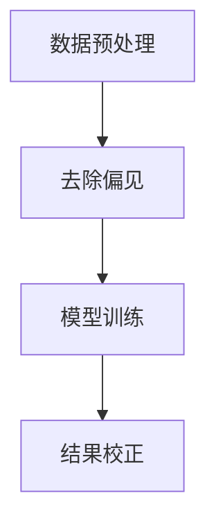
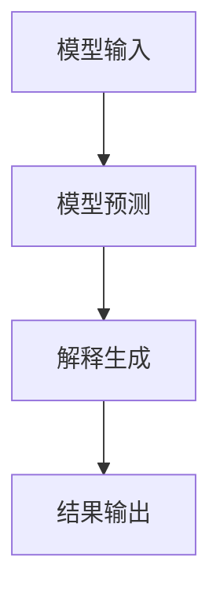
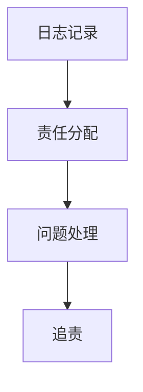
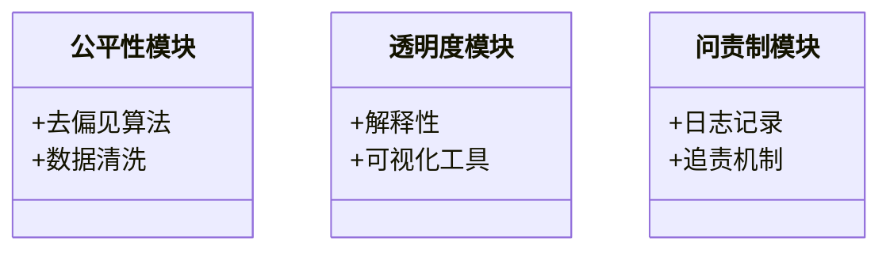
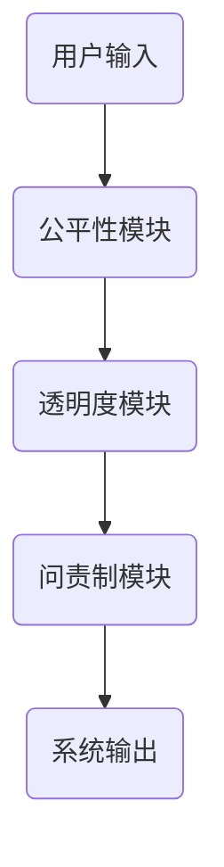

                 


# 构建企业级AI伦理框架：确保AI应用的公平性、透明度与问责制

## 关键词：AI伦理框架，公平性，透明度，问责制，企业级AI，技术博客

## 摘要：  
随着人工智能技术的快速发展，AI在企业中的应用越来越广泛，但随之而来的是公平性、透明度和问责制等方面的伦理问题。构建企业级AI伦理框架是确保AI应用符合伦理标准的关键。本文将从背景、核心概念、算法原理、系统架构、项目实战等方面详细阐述如何构建企业级AI伦理框架，确保AI应用的公平性、透明度与问责制。

---

## 第1章: AI伦理框架的背景与问题背景

### 1.1 AI技术的现状与挑战

#### 1.1.1 AI技术的快速发展  
人工智能（AI）技术近年来取得了突破性进展，广泛应用于各个行业，包括医疗、金融、教育、交通等。AI系统通过深度学习、自然语言处理（NLP）和计算机视觉等技术，为企业提供了高效的数据分析和决策支持能力。然而，随着AI技术的普及，其潜在的伦理问题也逐渐显现。

#### 1.1.2 AI应用中的伦理问题  
AI系统的决策过程通常是黑箱化的，这可能导致以下伦理问题：  
- **公平性问题**：AI算法可能因为数据偏见而导致不公平的结果，例如在招聘系统中歧视某些群体。  
- **透明度问题**：用户难以理解AI系统如何做出决策，缺乏透明性可能导致信任缺失。  
- **问责制问题**：当AI系统出现问题时，责任归属不明确，难以追责。  

#### 1.1.3 企业级AI应用的特殊性  
企业级AI应用通常涉及大量数据和复杂的业务逻辑，对系统的公平性、透明度和问责制要求更高。例如，在金融行业，AI系统用于信用评估和风险管理，任何决策失误都可能引发重大损失。

### 1.2 AI伦理框架的必要性

#### 1.2.1 伦理框架的核心作用  
AI伦理框架为企业提供了规范AI应用的指导原则和方法，确保AI系统的决策符合伦理标准。  
- **规范性**：明确AI系统的使用边界和行为准则。  
- **可操作性**：提供具体的技术手段和方法，帮助企业实现公平性、透明度和问责制。  

#### 1.2.2 企业级AI应用的伦理挑战  
企业级AI应用通常涉及敏感数据和高风险决策，伦理挑战更加复杂：  
- 数据偏见可能导致不公平的结果。  
- 系统复杂性使得透明性难以实现。  
- 问责制的缺失可能导致企业声誉受损。  

#### 1.2.3 伦理框架的边界与外延  
AI伦理框架不仅涵盖技术层面，还包括组织文化、政策法规等方面。企业需要在技术、管理和法律层面综合考虑，构建全面的伦理框架。

### 1.3 AI伦理框架的核心要素

#### 1.3.1 公平性  
公平性是AI伦理框架的核心要素之一，确保AI系统对所有用户一视同仁。  
- **定义**：公平性指AI系统在决策过程中不因种族、性别、年龄等因素而产生偏见。  
- **实现方法**：通过数据预处理、算法优化和结果后处理等技术减少偏见。  

#### 1.3.2 透明度  
透明度要求AI系统的决策过程可解释，用户能够理解AI系统如何做出决策。  
- **定义**：透明度是AI系统与用户之间信任的基础。  
- **实现方法**：通过模型解释技术（如LIME、SHAP）和用户友好的解释界面提升透明度。  

#### 1.3.3 问责制  
问责制确保当AI系统出现问题时，能够明确责任归属并进行追责。  
- **定义**：问责制要求企业在设计和部署AI系统时，明确责任分配和处理机制。  
- **实现方法**：通过日志记录、可追溯性技术和伦理审查机制实现问责制。  

---

## 第2章: AI伦理框架的核心概念与联系

### 2.1 核心概念原理

#### 2.1.1 公平性原理  
公平性原理强调AI系统在决策过程中不应歧视任何特定群体。通过数据清洗、算法优化和结果校正等技术手段，确保系统输出的公平性。  

#### 2.1.2 透明度原理  
透明度原理要求AI系统的决策过程必须可解释。通过模型解释技术和可视化工具，帮助用户理解AI系统的行为。  

#### 2.1.3 问责制原理  
问责制原理要求企业在设计和部署AI系统时，明确责任归属，并建立追责机制。通过日志记录和可追溯性技术，确保出现问题时能够追责。  

### 2.2 核心概念对比表格

| 核心概念 | 公平性 | 透明度 | 问责制 |
|----------|--------|---------|--------|
| 定义     | 防止偏见 | 可解释性 | 明确责任 |
| 技术实现 | 数据清洗 | 解释技术 | 日志记录 |
| 作用     | 减少歧视 | 建立信任 | 明确责任 |

### 2.3 ER实体关系图架构

```mermaid
erd
  entity 公平性 {
    key 属性: 去偏见算法
    attribute 数据清洗
    attribute 算法优化
  }
  
  entity 透明度 {
    key 属性: 解释性
    attribute 模型解释
    attribute 可视化工具
  }
  
  entity 问责制 {
    key 属性: 责任分配
    attribute 日志记录
    attribute 追责机制
  }
```

---

## 第3章: AI伦理框架的算法原理

### 3.1 算法原理概述

#### 3.1.1 公平性算法  
公平性算法通过去除数据中的偏见，确保AI系统输出的公平性。  
- **算法流程图**：  


#### 3.1.2 透明度算法  
透明度算法通过解释模型决策过程，提升AI系统的透明性。  
- **算法流程图**：  


#### 3.1.3 问责制算法  
问责制算法通过记录AI系统的决策过程，确保出现问题时能够追责。  
- **算法流程图**：  


### 3.2 算法实现

#### 3.2.1 公平性算法实现

```python
def remove_bias(data):
    # 数据清洗：去除偏见
    cleaned_data = data.drop(columns=['偏见特征'])
    return cleaned_data

def train_model(cleaned_data):
    # 模型训练
    model = train(cleaned_data)
    return model

def fairness_check(model, test_data):
    # 公平性校验
    predictions = model.predict(test_data)
    fairness_score = calculate_fairness_score(test_data, predictions)
    return fairness_score
```

#### 3.2.2 透明度算法实现

```python
def explain_model(model, instance):
    # 模型解释
    explanation = interpret_model(model, instance)
    return explanation

def visualize_explanation(explanation):
    # 可视化解释
    display_explanation(explanation)
```

#### 3.2.3 问责制算法实现

```python
def log_decision(model, instance):
    # 记录决策日志
    log = create_log_entry(model, instance)
    return log

def trace_responsibility(log, issue):
    # 追踪责任
    responsible_party = find_responsible_party(log, issue)
    return responsible_party
```

### 3.3 数学模型与公式

#### 3.3.1 公平性模型  
- **基于概率论的公平性模型**  
$$ P(y|x) = \frac{P(y|x, a)}{P(a)} $$  
其中，$a$ 表示敏感属性，$y$ 表示预测结果，$x$ 表示输入特征。  

#### 3.3.2 透明度模型  
- **基于线性回归的透明度模型**  
$$ y = \beta_0 + \beta_1x_1 + \beta_2x_2 + \dots + \beta_nx_n $$  
通过系数 $\beta_i$ 的大小，可以理解每个特征对预测结果的影响程度。  

#### 3.3.3 问责制模型  
- **基于因果关系的问责制模型**  
$$ P(a|do(x)) = \frac{P(a|x)}{P(a_0|x)} $$  
其中，$do(x)$ 表示干预变量 $x$，用于分析变量之间的因果关系。

---

## 第4章: 系统分析与架构设计方案

### 4.1 问题场景介绍

#### 4.1.1 公平性问题场景  
假设某企业使用AI系统进行招聘，但系统存在性别偏见，导致女性候选人的通过率低于男性。  

#### 4.1.2 透明度问题场景  
用户对AI系统的预测结果感到困惑，希望了解系统如何做出决策。  

#### 4.1.3 问责制问题场景  
当AI系统出现错误决策时，企业需要明确责任归属并进行追责。

### 4.2 系统功能设计

#### 4.2.1 领域模型设计



#### 4.2.2 系统架构设计



### 4.3 系统实现

#### 4.3.1 环境配置

```bash
pip install fairness-metrics
pip install interpretability
pip install logging
```

#### 4.3.2 核心实现代码

```python
def build_ethical_framework():
    # 初始化公平性模块
    fairness_module = FairnessModule()
    # 初始化透明度模块
    transparency_module = TransparencyModule()
    # 初始化问责制模块
    accountability_module = AccountabilityModule()
    return {
        'fairness': fairness_module,
        'transparency': transparency_module,
        'accountability': accountability_module
    }
```

---

## 第5章: 项目实战

### 5.1 环境安装

```bash
pip install numpy
pip install pandas
pip install scikit-learn
pip install fairness-metrics
```

### 5.2 系统核心实现

```python
def main():
    # 初始化伦理框架
    framework = build_ethical_framework()
    
    # 测试公平性
    test_fairness(framework['fairness'])
    
    # 测试透明度
    test_transparency(framework['transparency'])
    
    # 测试问责制
    test_accountability(framework['accountability'])
    
    # 输出结果
    print("伦理框架构建完成！")

if __name__ == "__main__":
    main()
```

### 5.3 案例分析

#### 5.3.1 案例背景  
某金融企业使用AI系统进行信用评估，但系统存在种族偏见，导致某些群体的贷款通过率较低。  

#### 5.3.2 实施步骤  
1. **数据清洗**：去除种族相关的敏感属性。  
2. **算法优化**：使用无偏见算法重新训练模型。  
3. **透明度提升**：通过解释性工具展示模型决策过程。  
4. **问责制建立**：记录每次决策日志，明确责任归属。  

#### 5.3.3 实施结果  
经过伦理框架的优化，信用评估系统的公平性、透明度和问责制均得到显著提升，贷款通过率趋于公平。

---

## 第6章: 最佳实践、小结与注意事项

### 6.1 最佳实践

#### 6.1.1 数据预处理  
- 清洗敏感属性，避免数据偏见。  

#### 6.1.2 模型解释  
- 使用可解释性工具（如SHAP、LIME）提升透明度。  

#### 6.1.3 日志记录  
- 记录AI系统的决策过程，便于追责。  

### 6.2 小结

本文详细介绍了构建企业级AI伦理框架的核心要素、算法原理和系统架构，为企业在公平性、透明度和问责制方面的实践提供了指导。

### 6.3 注意事项

- **数据隐私**：在处理数据时，需遵守相关法律法规，保护用户隐私。  
- **模型更新**：定期更新模型，避免因数据偏见导致的伦理问题。  
- **用户教育**：提升用户对AI系统的理解，增强信任感。  

---

## 结语

构建企业级AI伦理框架是一项复杂的系统工程，需要企业在技术、管理和法律等多个层面共同努力。通过本文提供的方法和实践，企业可以更好地应对AI应用中的伦理挑战，确保AI系统的公平性、透明度和问责制，推动AI技术的健康发展。

---

## 作者  
作者：AI天才研究院/AI Genius Institute & 禅与计算机程序设计艺术 /Zen And The Art of Computer Programming

