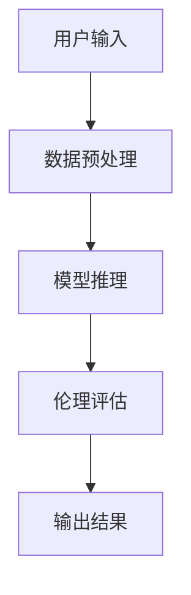

                 


```markdown
# 《构建企业级AI伦理顾问：确保AI应用的道德合规》

## # 关键词

- AI伦理顾问
- 企业级AI
- 道德合规
- 人工智能伦理
- 伦理评估系统

## # 摘要

随着人工智能技术的快速发展，企业在应用AI技术时面临越来越多的道德和合规问题。本文详细探讨了如何构建一个企业级AI伦理顾问系统，以确保AI应用的道德合规。文章从AI伦理的核心概念出发，分析了数据隐私保护、算法公平性评估等技术基础，并详细设计了AI伦理顾问系统的架构和功能模块。通过实际项目案例，展示了如何在企业中实现AI伦理顾问，并总结了最佳实践和未来发展方向。

---

## # 第一部分：引言

### ## 1.1 AI伦理的背景与重要性
#### ### 1.1.1 AI技术的快速发展与挑战
人工智能技术的快速发展为企业带来了巨大的机遇，但也引发了一系列伦理问题。例如，AI算法的偏见可能导致不公平的决策，数据隐私问题可能引发合规风险。

#### ### 1.1.2 企业AI应用中的伦理问题
企业在使用AI技术时，需要确保其算法和数据的公平性、透明性和隐私性。这些问题直接影响企业的声誉和法律责任。

#### ### 1.1.3 构建AI伦理顾问的意义
AI伦理顾问通过自动化评估和监控，帮助企业识别和解决AI应用中的伦理问题，确保合规性。

### ## 1.2 企业级AI伦理顾问的目标与范围
#### ### 1.2.1 问题背景与问题描述
企业需要在AI应用中嵌入伦理评估机制，确保其符合相关法规和企业价值观。

#### ### 1.2.2 问题解决的思路与方法
通过构建AI伦理顾问系统，企业可以自动化评估AI模型的伦理风险，并提供改进建议。

#### ### 1.2.3 边界与外延
AI伦理顾问系统的范围包括数据处理、算法评估和结果分析，但不涉及具体的AI模型训练。

---

## # 第二部分：AI伦理的核心概念与联系

### ## 2.1 AI伦理的核心概念
#### ### 2.1.1 AI伦理的定义与特点
AI伦理是指在设计和应用AI系统时，遵循道德原则和价值观，确保其对人类和环境产生积极影响。

#### ### 2.1.2 伦理框架的核心要素
- **透明性**：系统的行为和决策过程必须可解释。
- **公平性**：避免算法偏见，确保平等对待所有用户。
- **隐私性**：保护用户数据不被滥用。
- **责任性**：明确AI系统及相关方的责任归属。

### ## 2.2 AI伦理框架的实体关系图
```mermaid
er
    actor: 企业
    actor --> Model: 使用模型
    Model --> Data: 数据处理
    Model --> Rules: 伦理规则
    Rules --> Output: 输出结果
```

---

## # 第三部分：AI伦理的技术基础

### ## 3.1 数据隐私与保护
#### ### 3.1.1 数据隐私的基本原则
- **最小化数据收集**：仅收集必要的数据。
- **数据加密**：使用加密技术保护数据安全。
- **数据匿名化**：通过去标识化确保数据隐私。

#### ### 3.1.2 数据加密与匿名化技术
- **加密技术**：如AES加密用于保护数据传输。
- **匿名化技术**：如k-anonymity确保数据无法被还原到个人身份。

### ## 3.2 算法公平性与可解释性
#### ### 3.2.1 算法公平性的评估方法
- **偏见检测**：识别算法在不同群体中的表现差异。
- **公平性评估**：确保算法对所有用户一视同仁。

#### ### 3.2.2 可解释性模型的实现
- **线性回归模型**：因其简单可解释，常用于可解释性需求高的场景。

### ## 3.3 伦理评估的数学模型
#### ### 3.3.1 偏差度量的公式
$$ \text{偏差} = \frac{\text{实际负面结果} - \text{预期负面结果}}{\text{总样本}} $$

---

## # 第四部分：AI伦理顾问系统的设计与实现

### ## 4.1 系统架构设计


### ## 4.2 功能模块设计
#### ### 4.2.1 数据采集与处理
- **数据采集**：从数据库或API获取数据。
- **数据清洗**：去除噪声数据，确保数据质量。

#### ### 4.2.2 模型推理
- **模型调用**：使用预训练的AI模型进行推理。
- **结果解释**：将模型输出转化为人类可理解的形式。

#### ### 4.2.3 伦理评估
- **规则匹配**：将推理结果与伦理规则进行对比。
- **风险评分**：根据匹配结果生成风险评分。

---

## # 第五部分：项目实战

### ## 5.1 环境安装
```bash
pip install numpy pandas scikit-learn
```

### ## 5.2 系统核心实现源代码
```python
import numpy as np
from sklearn.linear_model import LinearRegression

def model_predict(data):
    model = LinearRegression()
    model.fit(data[['age', 'income']], data['score'])
    return model.predict([[30, 50000]])
```

### ## 5.3 代码应用解读与分析
- **数据预处理**：确保数据格式正确。
- **模型训练**：使用训练数据训练模型。
- **结果解释**：将模型输出转换为可理解的解释。

### ## 5.4 实际案例分析
- **案例背景**：企业使用AI招聘系统可能存在性别偏见。
- **解决方案**：通过AI伦理顾问系统检测并修正偏见。

---

## # 第六部分：最佳实践与未来展望

### ## 6.1 最佳实践
- **数据治理**：建立数据治理机制，确保数据合规。
- **模型监控**：持续监控模型表现，及时发现并解决问题。

### ## 6.2 未来展望
- **技术进步**：AI伦理评估技术将更加自动化和智能化。
- **行业标准**：更多行业将制定AI伦理标准，推动技术发展。

---

## # 作者

作者：AI天才研究院 & 禅与计算机程序设计艺术
```

