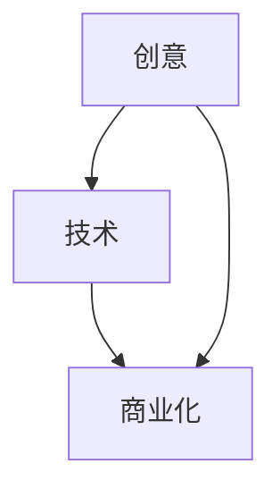
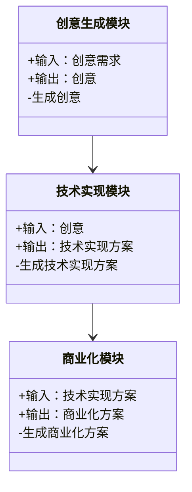
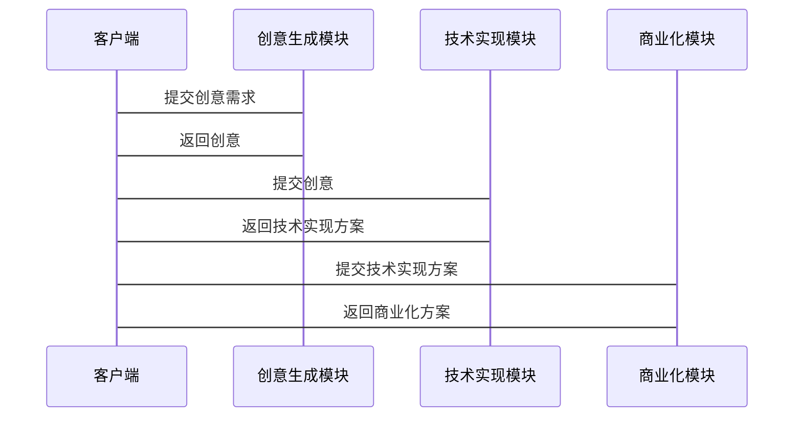

                 


# 构建企业级AI创新孵化器：从创意到商业化

## 关键词：企业级AI创新孵化器，人工智能，创意商业化，技术实现，创新模式

## 摘要：本文详细探讨了构建企业级AI创新孵化器的过程，从创意的生成与评估，到技术实现的路径，再到商业化落地的策略。文章通过系统化的分析和实例，揭示了AI技术在创新中的关键作用，并为企业提供了一套完整的AI创新孵化器建设方案。

---

# 第1章：AI创新孵化器的背景与概念

## 1.1 问题背景

### 1.1.1 企业创新面临的挑战
企业在创新过程中常常面临以下挑战：
- **创意来源不足**：企业内部缺乏有效的创意生成机制。
- **创意评估困难**：如何筛选出具有商业潜力的创意？
- **技术实现复杂**：创意转化为实际产品需要复杂的技术支持。
- **商业化路径不清**：如何将技术创新快速推向市场？

### 1.1.2 AI技术对企业创新的推动作用
AI技术在企业创新中的作用主要体现在：
- **加速创意生成**：通过自然语言处理和数据分析，AI能够帮助企业快速生成创意。
- **提高创意评估效率**：利用机器学习模型，AI可以快速评估创意的可行性和潜力。
- **降低技术实现成本**：AI技术可以简化技术实现过程，降低开发成本。
- **加速商业化**：AI可以帮助企业快速找到合适的商业化路径。

### 1.1.3 创新孵化器的定义与目标
创新孵化器是指为企业提供创意生成、技术实现和商业化支持的综合平台。其目标是通过系统化的支持，帮助企业将创意转化为实际产品，并推动其商业化。

## 1.2 AI创新孵化器的核心要素

### 1.2.1 创意生成与评估
- **创意生成**：通过AI技术生成创意，包括自然语言处理、数据分析等。
- **创意评估**：利用机器学习模型评估创意的可行性和潜力。

### 1.2.2 技术实现路径
- **技术实现**：将创意转化为实际产品，涉及算法设计、系统架构等。
- **技术评估**：评估技术实现的可行性和成本。

### 1.2.3 商业化可行性分析
- **商业模式设计**：设计可行的商业模式。
- **市场分析**：分析目标市场的潜力和竞争情况。

---

# 第2章：AI创新的关键概念

## 2.1 创意评估与筛选

### 2.1.1 创意来源分析
创意的来源包括：
- **内部员工**：员工的创意。
- **外部合作伙伴**：合作伙伴提供的创意。
- **市场调研**：通过市场调研获取创意。

### 2.1.2 创意筛选标准
筛选创意的标准包括：
- **市场需求**：创意是否符合市场需求。
- **技术可行性**：创意是否能够技术实现。
- **商业潜力**：创意的商业化潜力。

### 2.1.3 创意评估流程
创意评估流程包括：
1. **创意收集**：收集创意。
2. **初步筛选**：根据标准筛选创意。
3. **深度评估**：对筛选出的创意进行深度评估。
4. **最终决策**：决定是否支持该创意。

---

## 2.2 技术实现与创新

### 2.2.1 AI技术在创新中的应用
AI技术在创新中的应用包括：
- **自然语言处理**：用于创意生成和文本分析。
- **机器学习**：用于创意评估和预测。
- **深度学习**：用于复杂系统的建模和优化。

### 2.2.2 创新与技术实现的关系
创新是技术实现的目标，技术实现是创新的手段。两者相辅相成，共同推动企业的创新进程。

### 2.2.3 技术实现的边界与外延
技术实现的边界是创意的商业化，外延是技术的持续优化和创新。

---

## 2.3 商业化路径与创新模式

### 2.3.1 商业化的基本路径
商业化的路径包括：
1. **产品开发**：将创意转化为产品。
2. **市场推广**：推广产品。
3. **运营维护**：维护产品并持续优化。

### 2.3.2 创新模式的多样性
创新模式包括：
- **内部创新**：企业内部自行创新。
- **外部合作**：与外部合作伙伴共同创新。
- **开源创新**：通过开源社区进行创新。

### 2.3.3 商业化与创新的协同效应
商业化的成功离不开创新，而创新的成功也离不开商业化。两者协同效应能够显著提升企业的竞争力。

---

# 第3章：AI创新的核心要素与关系

## 3.1 核心要素分析

### 3.1.1 创意：创新的起点
创意是创新的起点，是整个创新过程的基础。

### 3.1.2 技术：创新的支撑
技术是创新的支撑，是将创意转化为实际产品的关键。

### 3.1.3 商业化：创新的目标
商业化是创新的目标，是实现创意价值的最终路径。

## 3.2 核心要素对比表

| 要素 | 定义 | 作用 | 关系 |
|------|------|------|------|
| 创意 | 创新想法 | 提供方向 | 创意→技术→商业化 |
| 技术 | 实现方法 | 支撑创新 | 技术连接创意与商业化 |
| 商业化 | 应用落地 | 实现价值 | 商业化是创新的最终目标 |

---

## 3.3 实体关系图（Mermaid）



---

# 第4章：AI创新的核心算法

## 4.1 大语言模型（LLM）的创新应用

### 4.1.1 LLM的定义与特点
大语言模型是一种基于深度学习的自然语言处理模型，具有以下特点：
- **大规模训练数据**：模型通过大量数据进行训练。
- **强大的生成能力**：模型能够生成高质量的文本。

### 4.1.2 LLM在创意生成中的作用
LLM在创意生成中的作用包括：
- **创意生成**：模型可以生成创意。
- **创意优化**：模型可以优化创意，使其更符合市场需求。

### 4.1.3 LLM的创新应用场景
创新应用场景包括：
- **产品描述生成**：生成产品的描述。
- **市场分析报告**：生成市场分析报告。
- **创意评估**：评估创意的潜力。

---

## 4.2 创意评估算法

### 4.2.1 创意评估流程
创意评估流程包括：
1. **数据收集**：收集创意相关的数据。
2. **特征提取**：提取创意的特征。
3. **模型训练**：训练创意评估模型。
4. **模型评估**：评估模型的性能。

### 4.2.2 创意评估模型
创意评估模型是一个基于机器学习的模型，用于评估创意的潜力。

### 4.2.3 案例分析
案例分析：假设我们有一个创意，可以通过模型评估其市场潜力。

---

## 4.3 创意生成算法

### 4.3.1 创意生成流程
创意生成流程包括：
1. **需求分析**：分析需求。
2. **创意生成**：生成创意。
3. **创意优化**：优化创意。

### 4.3.2 创意生成模型
创意生成模型是一个基于自然语言处理的模型，用于生成创意。

### 4.3.3 案例分析
案例分析：假设我们需要生成一个产品的创意，可以通过模型生成多个创意，然后选择最优的一个。

---

# 第5章：系统分析与架构设计

## 5.1 问题场景介绍

### 5.1.1 问题描述
企业在创新过程中，常常面临创意生成、技术实现和商业化落地的挑战。

### 5.1.2 问题解决
通过构建企业级AI创新孵化器，可以系统化地解决这些问题。

---

## 5.2 系统功能设计

### 5.2.1 领域模型（Mermaid 类图）



---

## 5.3 系统架构设计

### 5.3.1 系统架构（Mermaid 架构图）


---

## 5.4 系统接口设计

### 5.4.1 接口描述
- **创意生成接口**：生成创意。
- **技术实现接口**：生成技术实现方案。
- **商业化接口**：生成商业化方案。

---

## 5.5 系统交互设计

### 5.5.1 交互流程（Mermaid 序列图）



---

# 第6章：项目实战

## 6.1 环境安装

### 6.1.1 安装Python
```bash
python --version
pip install --upgrade pip
```

### 6.1.2 安装必要的库
```bash
pip install numpy
pip install scikit-learn
pip install transformers
```

---

## 6.2 系统核心实现

### 6.2.1 创意生成模块实现
```python
from transformers import pipeline

generator = pipeline('text-generation', model='gpt2')
creative = generator('创意：')[0]['generated_text']
```

### 6.2.2 技术实现模块实现
```python
from sklearn import linear_model

# 假设我们有创意和技术实现的数据
X = [[1, 2], [3, 4]]
y = [0, 1]
model = linear_model.LogisticRegression()
model.fit(X, y)
```

### 6.2.3 商业化模块实现
```python
import json

commercial = {
    '商业模式': '订阅制',
    '市场': '科技行业'
}
```

---

## 6.3 案例分析

### 6.3.1 案例背景
假设我们有一个创意，希望通过AI创新孵化器将其转化为产品。

### 6.3.2 案例实现
1. **创意生成**：生成创意。
2. **技术实现**：生成技术实现方案。
3. **商业化**：生成商业化方案。

---

## 6.4 项目小结

---

# 第7章：最佳实践与注意事项

## 7.1 最佳实践 tips

### 7.1.1 创意生成
- **多样化来源**：创意来源多样化。
- **定期更新**：定期更新创意生成模型。

### 7.1.2 技术实现
- **模块化设计**：技术实现模块化。
- **持续优化**：持续优化技术实现。

### 7.1.3 商业化
- **市场调研**：充分进行市场调研。
- **风险评估**：充分评估商业化风险。

---

## 7.2 小结

---

## 7.3 注意事项

### 7.3.1 创意评估
- **数据质量**：数据质量影响评估结果。
- **模型性能**：模型性能影响评估结果。

### 7.3.2 技术实现
- **技术可行性**：技术实现需要考虑可行性。
- **成本控制**：技术实现需要考虑成本。

### 7.3.3 商业化
- **市场需求**：商业化需要考虑市场需求。
- **竞争分析**：商业化需要考虑竞争情况。

---

## 7.4 拓展阅读

### 7.4.1 AI创新的未来趋势
AI技术在创新中的应用将更加广泛。

### 7.4.2 相关书籍推荐
- 《人工智能：一种现代的方法》
- 《创新者的窘境》

---

# 作者：AI天才研究院/AI Genius Institute & 禅与计算机程序设计艺术/Zen And The Art of Computer Programming

