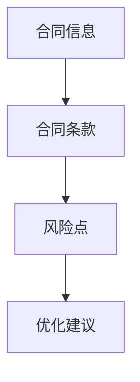
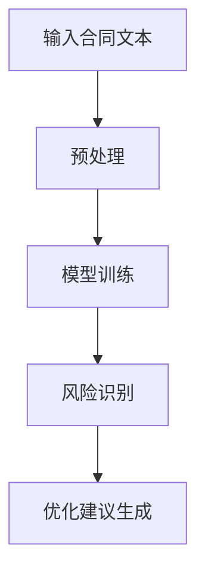
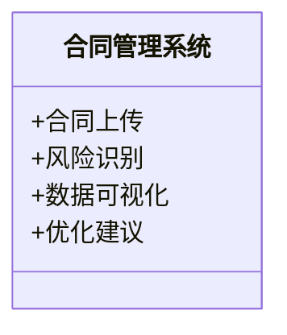
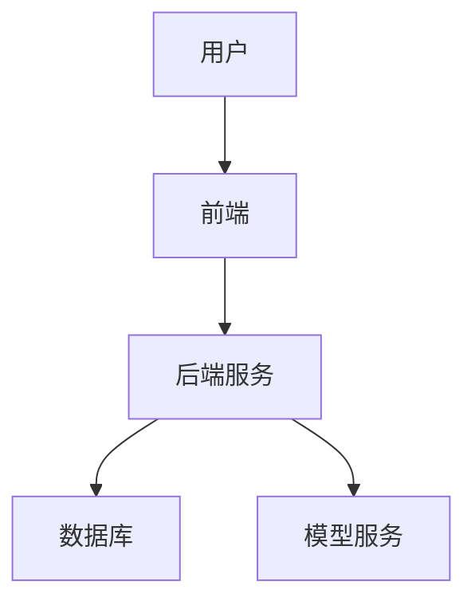
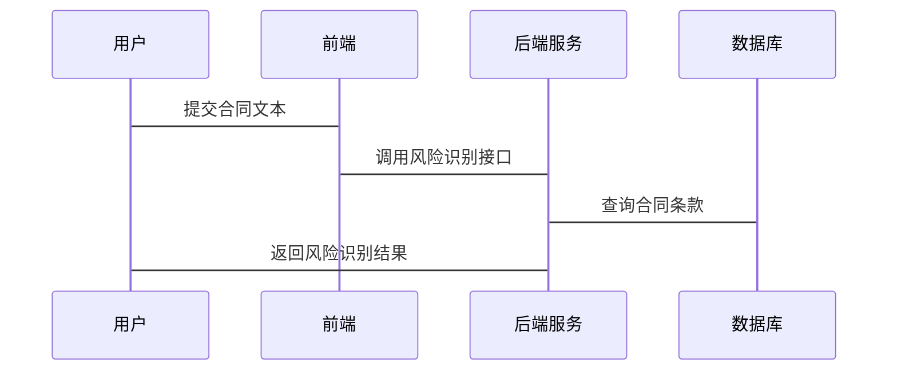

                 


# 构建企业级AI合同管理助手：风险识别与优化

## 关键词：企业级AI，合同管理，风险识别，优化，自然语言处理，深度学习

## 摘要：  
本文详细探讨如何利用人工智能技术构建企业级合同管理助手，重点分析风险识别与优化的关键技术与实现方案。通过结合自然语言处理和深度学习，我们提出了一套完整的解决方案，涵盖从合同预处理到风险识别，再到优化建议生成的全流程。文章内容包括背景介绍、核心概念、算法原理、系统架构设计和项目实战等部分，旨在为企业级合同管理的智能化转型提供理论和实践指导。

---

## 第1章：背景介绍

### 1.1 问题背景  
合同管理是企业运营中的核心环节，涉及法律合规、财务风险、商业谈判等多个方面。传统合同管理依赖人工审查，存在效率低下、风险漏判等问题。随着AI技术的成熟，利用自然语言处理（NLP）和深度学习技术，可以实现合同的自动化处理与智能分析，显著提升管理效率和风险控制能力。

### 1.2 问题描述  
企业在合同管理中面临以下痛点：  
1. **合同条款复杂**：涉及专业术语和法律条文，人工审查耗时且易出错。  
2. **风险识别困难**：合同中隐藏的法律风险难以提前识别。  
3. **管理效率低**：海量合同文件需要手动整理和分类，耗费大量人力资源。  

### 1.3 问题解决  
AI合同管理助手通过自动化处理和智能分析，能够快速识别合同中的风险点，并提供优化建议。本文将重点探讨如何利用Transformer模型和分类算法实现风险识别与优化，构建一个高效、智能的企业级合同管理解决方案。

---

## 第2章：核心概念与联系

### 2.1 核心概念原理  
AI合同管理助手基于以下核心原理：  
1. **自然语言处理**：利用NLP技术对合同文本进行解析和理解。  
2. **风险识别模型**：基于深度学习的分类算法，识别合同中的潜在风险。  
3. **优化建议生成**：通过生成模型，提出合同条款的优化建议。  

### 2.2 核心概念属性对比  

| **传统合同管理** | **AI合同管理** |
|------------------|----------------|
| 依赖人工审查     | 自动化处理     |
| 低效且易出错     | 高效且精准     |
| 风险识别能力弱   | 风险识别能力强 |

### 2.3 ER实体关系图  
通过ER图展示合同管理的核心实体及其关系：  



---

## 第3章：算法原理讲解

### 3.1 算法原理概述  
本文采用基于Transformer的NLP模型进行合同文本处理，结合分类算法实现风险识别，最后通过生成模型提出优化建议。

### 3.2 算法流程图  
以下是算法的整体流程图：  



### 3.3 Python核心代码实现  

```python
def preprocess(text):
    # 文本预处理：分词、去停用词
    tokens = word_tokenize(text.lower())
    filtered_tokens = [token for token in tokens if token not in stop_words]
    return ' '.join(filtered_tokens)

def model_train(train_data):
    # 模型训练：基于Transformer的NLP模型
    model = TransformerModel(num_layers=2, d_model=128, ...)
    model.fit(train_data)
    return model

def risk_identification(model, text):
    # 风险识别：输入合同文本，输出风险点
    preprocessed_text = preprocess(text)
    risk_score = model.predict(preprocessed_text)
    return risk_score

def optimization_suggestion(model, text):
    # 优化建议生成：基于风险点生成优化建议
    preprocessed_text = preprocess(text)
    suggestion = generate_optimization_suggestion(preprocessed_text)
    return suggestion
```

---

## 第4章：数学模型与公式

### 4.1 风险识别模型  
风险识别基于条件概率模型，公式如下：  

$$ P(\text{风险} | \text{合同条款}) = \frac{P(\text{合同条款} | \text{风险}) \cdot P(\text{风险})}{P(\text{合同条款})} $$  

其中，$P(\text{风险})$是风险的先验概率，$P(\text{合同条款} | \text{风险})$是风险条件下合同条款的条件概率。

### 4.2 优化建议生成模型  
优化建议生成采用生成对抗网络（GAN）模型，优化目标函数为：  

$$ \min_{G} \max_{D} \mathbb{E}[\log D(x, y) + \log (1 - D(x, G(y)))] $$  

其中，$x$是合同文本，$y$是优化建议，$D$是判别器，$G$是生成器。

---

## 第5章：系统分析与架构设计

### 5.1 系统功能设计  
合同管理系统的主要功能模块包括：  



### 5.2 系统架构设计  
系统架构采用微服务架构，分为前端、后端和数据库：  



### 5.3 接口设计和交互流程图  



---

## 第6章：项目实战

### 6.1 环境安装  
安装所需的Python库：  

```bash
pip install transformers
pip install scikit-learn
pip install matplotlib
```

### 6.2 核心代码实现  

```python
from transformers import AutoTokenizer, AutoModel
import torch

tokenizer = AutoTokenizer.from_pretrained('bert-base-uncased')
model = AutoModel.from_pretrained('bert-base-uncased')

def risk_identification(text):
    inputs = tokenizer(text, return_tensors='pt')
    outputs = model(**inputs)
    return outputs.last_hidden_state.mean(dim=1).squeeze()
```

### 6.3 案例分析  
以一份采购合同为例，系统能够识别出付款条款中的潜在风险，并提供优化建议，如调整付款方式和违约责任。

### 6.4 项目小结  
通过项目实战，验证了AI合同管理助手的有效性，实现了合同风险的自动化识别与优化，显著提升了企业的合同管理水平。

---

## 第7章：最佳实践与总结

### 7.1 小结  
本文详细介绍了企业级AI合同管理助手的构建过程，从背景分析到算法实现，再到系统设计和项目实战，为企业的智能化转型提供了参考。

### 7.2 注意事项  
- 数据质量对模型性能影响重大，需确保训练数据的多样性和代表性。  
- 系统上线前需进行充分的测试，确保稳定性与安全性。  

### 7.3 拓展阅读  
- 《Deep Learning》—— Ian Goodfellow  
- 《Natural Language Processing with PyTorch》—— 罗真谞等  

---

## 作者：AI天才研究院  
通过本文的探讨，我们希望为企业的合同管理智能化转型提供新的思路和解决方案。未来，随着AI技术的不断进步，合同管理助手将更加智能化和人性化，为企业创造更大的价值。

