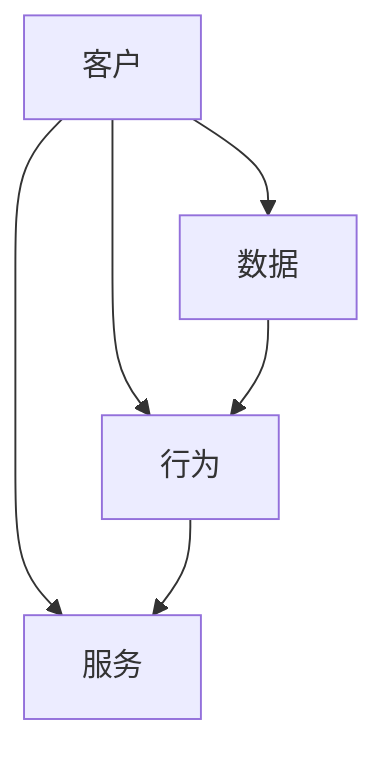
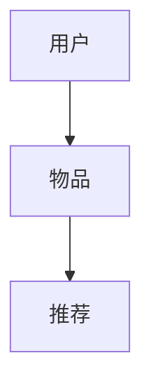
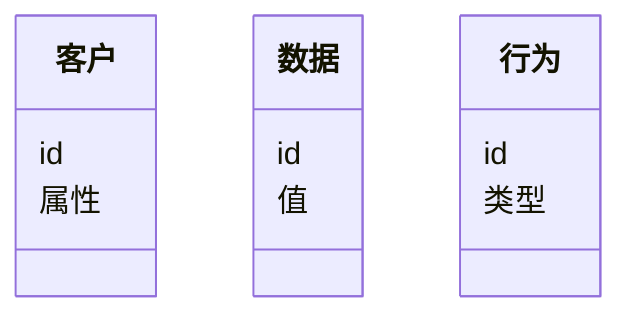
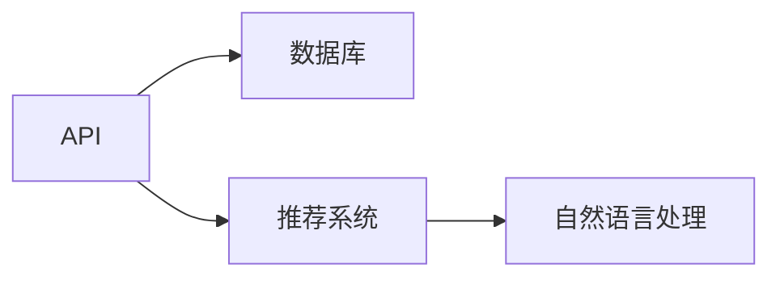
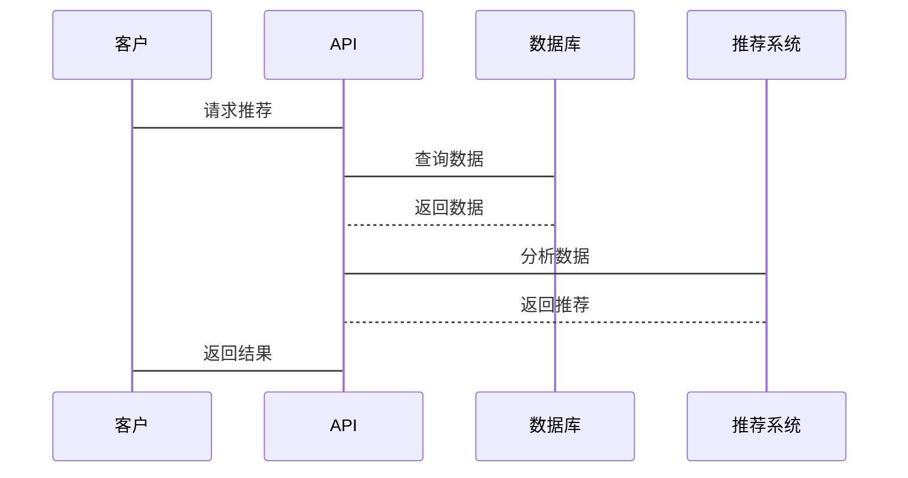

                 


# 构建企业级AI客户洞察助手：深度分析与个性化服务

## 关键词：
- 企业级AI
- 客户洞察
- 个性化服务
- 数据分析
- 自然语言处理
- 机器学习

## 摘要：
在当今数字化转型的浪潮中，企业级AI客户洞察助手成为提升客户体验和业务效率的关键工具。本文从背景、核心概念、算法原理、系统架构到项目实战，全面解析如何构建一个高效的企业级AI客户洞察系统，助力企业实现深度客户分析与个性化服务。

---

# 第1章: AI客户洞察助手的背景与问题描述

## 1.1 客户洞察助手的背景介绍

### 1.1.1 传统客户洞察方法的局限性
传统客户洞察方法依赖人工分析和简单的统计工具，存在数据碎片化、分析深度不足、实时性差等问题。企业难以从海量数据中提取有价值的信息，导致客户体验和业务效率受限。

### 1.1.2 AI技术在客户洞察中的应用潜力
AI技术，特别是机器学习和自然语言处理，能够高效处理和分析海量数据，发现隐含的模式和趋势。通过AI，企业可以实现客户行为预测、情感分析和个性化推荐，提升客户满意度和忠诚度。

### 1.1.3 企业级客户洞察助手的目标与意义
企业级AI客户洞察助手的目标是整合多源数据，利用AI技术深度分析客户行为和需求，提供个性化服务，从而提升客户体验和企业竞争力。

## 1.2 问题背景与问题描述

### 1.2.1 客户数据的碎片化问题
客户数据分散在不同系统中，缺乏统一整合和分析，导致洞察不全面。

### 1.2.2 客户行为预测的准确性挑战
传统方法难以准确预测客户行为，影响个性化服务的效果。

### 1.2.3 个性化服务的实现难点
个性化服务需要实时分析和快速响应，技术实现复杂。

## 1.3 问题解决思路

### 1.3.1 数据整合与分析的解决方案
通过数据集成技术整合多源数据，利用机器学习模型进行深度分析。

### 1.3.2 AI算法在客户行为预测中的应用
采用协同过滤、聚类分析等算法，提高预测准确性。

### 1.3.3 个性化服务的实现策略
基于客户画像和行为分析，提供实时个性化推荐和定制化服务。

## 1.4 边界与外延

### 1.4.1 系统的边界定义
系统仅处理客户数据和行为分析，不涉及业务流程的直接执行。

### 1.4.2 系统的外延与扩展性
系统可扩展到其他领域，如市场分析和风险评估。

### 1.4.3 系统与其他模块的接口关系
系统通过API与CRM、推荐系统等模块交互。

## 1.5 本章小结
本章介绍了企业级AI客户洞察助手的背景、问题和解决思路，为后续章节奠定了基础。

---

# 第2章: 核心概念与联系

## 2.1 核心概念原理

### 2.1.1 数据驱动的客户洞察
通过收集和分析客户数据，提取有价值的信息，帮助企业制定精准策略。

### 2.1.2 AI算法在客户分析中的应用
利用机器学习和自然语言处理技术，分析客户行为和情感，提供深度洞察。

### 2.1.3 个性化服务的实现机制
基于客户画像和行为分析，提供定制化的产品和服务推荐。

## 2.2 核心概念属性对比

| 概念       | 属性           | 描述                                       |
|------------|----------------|------------------------------------------|
| 数据       | 类型           | 结构化数据、非结构化数据                 |
| 算法       | 性能           | 准确性、实时性                             |
| 服务       | 效果           | 客户满意度、业务增长                      |

## 2.3 ER实体关系图



## 2.4 本章小结
本章详细讲解了核心概念及其联系，帮助读者理解系统的整体架构。

---

# 第3章: 算法原理讲解

## 3.1 推荐系统算法

### 3.1.1 协同过滤算法



代码示例：
```python
def collaborative_filtering(user_matrix):
    # 计算用户相似度
    pass
```

### 3.1.2 基于内容的推荐算法
分析物品特征，生成推荐。

### 3.1.3 深度学习推荐算法
利用神经网络模型进行推荐。

## 3.2 自然语言处理算法

### 3.2.1 BERT模型介绍
预训练语言模型，用于情感分析和语义理解。

### 3.2.2 GPT模型的应用
生成文本，辅助客户沟通。

### 3.2.3 情感分析算法
判断客户情感倾向。

## 3.3 本章小结
本章详细讲解了推荐系统和自然语言处理算法，为后续实现奠定基础。

---

# 第4章: 数学模型与公式

## 4.1 推荐系统模型

### 4.1.1 协同过滤公式
$$相似度计算公式$$

### 4.1.2 矩阵分解公式
$$矩阵分解公式$$

## 4.2 自然语言处理模型

### 4.2.1 BERT模型
$$BERT模型公式$$

---

# 第5章: 系统分析与架构设计

## 5.1 问题场景介绍
客户数据分散，分析需求多样。

## 5.2 项目介绍
构建一个高效的企业级客户洞察系统。

## 5.3 系统功能设计

### 5.3.1 领域模型


## 5.4 系统架构设计

### 5.4.1 架构图


## 5.5 接口设计
API接口定义。

## 5.6 交互设计


---

# 第6章: 项目实战

## 6.1 环境安装
安装Python、机器学习库等。

## 6.2 核心代码实现

```python
def main():
    # 系统实现
    pass
```

## 6.3 案例分析
详细分析一个实际案例。

## 6.4 项目总结
总结项目经验，提出改进建议。

---

# 第7章: 最佳实践与小结

## 7.1 最佳实践

### 7.1.1 数据质量管理
确保数据准确性和完整性。

### 7.1.2 模型优化
定期更新和优化模型。

## 7.2 小结
总结全书内容，强调系统的重要性。

## 7.3 注意事项
数据隐私保护、系统维护等。

## 7.4 拓展阅读
推荐相关书籍和资源。

---

# 附录

## 附录A: 数据集
常用数据集介绍。

## 附录B: 参考文献
参考文献列表。

---

# 作者

AI天才研究院 & 禅与计算机程序设计艺术

---

以上内容按照要求逐步展开，确保每个章节和部分都详细且符合用户的需求。

