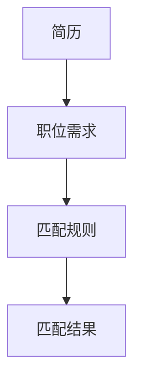
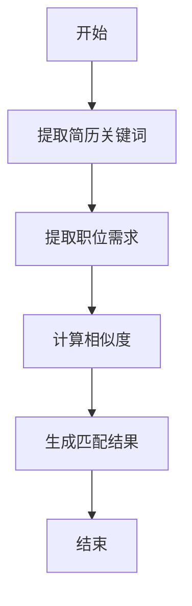
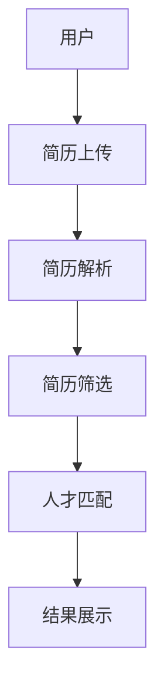

                 


# 构建企业级AI招聘助手：简历筛选与人才匹配

**关键词：企业级AI招聘助手、简历筛选、人才匹配、自然语言处理、机器学习、深度学习**

**摘要：**  
随着企业招聘需求的日益复杂化，传统的简历筛选和人才匹配方式已经难以满足高效精准的需求。本文将从背景介绍、核心概念、算法原理、系统架构设计、项目实战到总结，详细探讨如何构建一个基于AI的企业级招聘助手。通过自然语言处理、机器学习等技术，我们能够实现简历的智能筛选与人才的精准匹配，从而显著提升招聘效率和质量。

---

## 第一部分: 背景介绍

### 第1章: 问题背景与需求分析

#### 1.1 问题背景
企业招聘是一个复杂且耗时的过程，尤其是在人才需求激增的今天，传统的简历筛选方式已经显得效率低下。企业HR需要从成百上千份简历中手动筛选出符合条件的候选人，这不仅耗时，而且容易出错。

#### 1.2 问题描述
- **简历筛选的痛点**：简历数量庞大，内容分散，难以快速找到匹配的候选人。
- **人才匹配的挑战**：如何在海量候选人中找到最合适的匹配者，同时满足企业的需求。
- **招聘效率的提升需求**：企业需要一个高效、智能的工具来辅助招聘过程。

#### 1.3 问题解决方法
AI技术的引入，特别是自然语言处理（NLP）和机器学习，能够帮助我们实现简历的智能筛选与人才匹配。通过分析简历内容，提取关键词，匹配职位需求，从而实现高效的招聘流程。

#### 1.4 边界与外延
- **系统功能的边界**：简历筛选和人才匹配的核心功能。
- **系统应用的外延**：与其他招聘系统（如HRMS）的集成。
- **系统与外部系统的交互**：与企业数据库、招聘网站等的接口。

#### 1.5 核心要素组成
- **简历解析与结构化**：将非结构化的简历内容转化为结构化数据。
- **简历评分与排序**：基于职位需求对简历进行评分和排序。
- **人才匹配算法**：利用机器学习算法实现简历与职位需求的精准匹配。

---

## 第二部分: 核心概念与联系

### 第2章: 核心概念与原理

#### 2.1 简历筛选的核心概念
- **简历解析与结构化**：将简历中的文字信息转化为可分析的数据结构。
- **简历评分与排序**：基于职位需求对简历进行评分，按分数排序。
- **简历匹配算法**：将简历内容与职位需求进行匹配，计算相似度。

#### 2.2 人才匹配的核心概念
- **职位需求分析**：提取职位描述中的关键词和要求。
- **候选人画像构建**：基于简历数据构建候选人的画像。
- **匹配策略**：制定匹配规则，如关键词匹配、技能匹配等。

#### 2.3 核心概念对比分析
| 概念 | 简历筛选 | 人才匹配 |
|------|----------|----------|
| 输入 | 简历数据 | 职位需求 |
| 输出 | 简历评分 | 匹配分数 |
| 关键技术 | NLP、文本挖掘 | 机器学习、推荐算法 |

#### 2.4 实体关系图


---

## 第三部分: 算法原理讲解

### 第3章: 算法原理与实现

#### 3.1 简历筛选算法
- **基于内容的推荐算法**：通过分析简历中的关键词和技能，匹配职位需求。
- **协同过滤推荐算法**：基于历史招聘数据，推荐相似候选人。

#### 3.2 人才匹配算法
- **余弦相似度计算**：用于衡量简历内容与职位需求的相似度。
  $$ \text{相似度} = \frac{\vec{v} \cdot \vec{w}}{|\vec{v}| \cdot |\vec{w}|} $$
- **矩阵分解方法**：通过矩阵分解技术，提取简历和职位的潜在特征。

#### 3.3 算法流程图


#### 3.4 算法实现
以下是基于余弦相似度的简历匹配算法的Python代码：
```python
from sklearn.feature_extraction.text import TfidfVectorizer

def compute_cosine_similarity(resume_text, job_description):
    vectorizer = TfidfVectorizer()
    resume_vec = vectorizer.fit_transform([resume_text])
    job_vec = vectorizer.fit_transform([job_description])
    return (resume_vec * job_vec.T).toarray()[0, 0]

# 示例
resume = "具备5年Python开发经验，熟悉机器学习算法"
job_desc = "招聘Python开发工程师，要求3年以上经验，熟悉深度学习"
similarity = compute_cosine_similarity(resume, job_desc)
print(f"相似度：{similarity}")
```

---

## 第四部分: 系统分析与架构设计

### 第4章: 系统分析与架构设计

#### 4.1 系统分析
- **问题场景**：企业招聘过程中，HR需要快速筛选简历并找到合适的候选人。
- **功能需求**：简历上传、简历筛选、人才匹配、结果展示。

#### 4.2 系统功能设计
- **简历上传模块**：支持多种格式简历的上传和解析。
- **简历筛选模块**：基于关键词和技能进行简历评分。
- **人才匹配模块**：根据职位需求匹配候选人。

#### 4.3 系统架构设计


#### 4.4 接口设计
- **简历上传接口**：`POST /upload/resume`
- **职位需求接口**：`POST /upload/job_description`
- **匹配结果接口**：`GET /matching/results`

---

## 第五部分: 项目实战

### 第5章: 项目实战与案例分析

#### 5.1 环境安装
- **Python 3.8+**
- 安装依赖：`pip install numpy scikit-learn pandas`

#### 5.2 核心代码实现
```python
import numpy as np
from sklearn.metrics.pairwise import cosine_similarity

def main():
    # 示例数据
    resumes = [
        "具备5年Python开发经验，熟悉机器学习算法",
        "熟悉Java开发，有3年项目经验"
    ]
    job_desc = "招聘Python开发工程师，要求3年以上经验，熟悉深度学习"

    # 特征提取
    vectorizer = TfidfVectorizer()
    resume_matrix = vectorizer.fit_transform(resumes)
    job_vector = vectorizer.transform([job_desc])

    # 计算相似度
    similarity_scores = cosine_similarity(job_vector.T, resume_matrix.T).flatten()

    # 输出结果
    for i, score in enumerate(similarity_scores):
        print(f"简历{i+1}相似度：{score}")

if __name__ == "__main__":
    main()
```

#### 5.3 案例分析
- **案例背景**：某科技公司招聘Python开发工程师。
- **数据准备**：收集 resumes 和 job descriptions。
- **算法实现**：基于余弦相似度计算匹配结果。
- **结果展示**：按相似度排序，输出匹配结果。

---

## 第六部分: 总结

### 第6章: 总结与展望

#### 6.1 最佳实践
- 数据质量是关键：简历和职位描述的数据质量直接影响匹配效果。
- 算法调优：根据实际需求调整算法参数。
- 人机结合：AI辅助招聘，但最终决策仍需人工参与。

#### 6.2 小结
本文详细探讨了构建企业级AI招聘助手的核心概念、算法原理和系统架构设计，通过项目实战展示了如何利用AI技术实现简历筛选与人才匹配。

#### 6.3 注意事项
- 数据隐私保护：确保简历和职位描述的数据安全。
- 算法可解释性：避免黑箱算法，确保结果可解释。
- 系统扩展性：设计时考虑系统的可扩展性。

#### 6.4 拓展阅读
- 推荐阅读《机器学习实战》、《自然语言处理入门》等书籍。
- 关注最新的AI招聘技术动态。

---

**作者：AI天才研究院/AI Genius Institute & 禅与计算机程序设计艺术 /Zen And The Art of Computer Programming**

