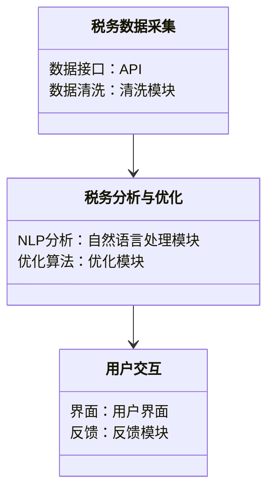
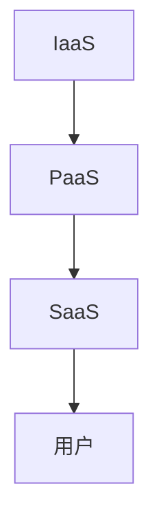

                 


# 构建企业级AI税务顾问：优化税收策略

> 关键词：企业级AI税务顾问，AI大模型，税务优化，税收策略，自然语言处理，优化算法

> 摘要：本文将详细介绍如何构建一个基于AI大模型的企业级税务顾问系统，通过优化税收策略，提升企业的税务合规性和节税效果。我们将从背景介绍、核心算法、系统设计到项目实战，全面解析这一系统的关键技术点，包括生成式AI在税务优化中的应用，算法的数学模型与公式，以及系统的架构设计和实现。

---

# 第一部分：企业级AI税务顾问的背景与核心概念

## 第1章：企业级AI税务顾问的背景介绍

### 1.1 税务顾问的现状与挑战

#### 1.1.1 传统税务顾问的工作模式
- 手工处理税务数据，效率低下
- 税法复杂，容易出错
- 需要大量人工经验，成本高昂

#### 1.1.2 企业税务优化的痛点与难点
- 税务法规更新频繁，难以及时响应
- 数据分散，缺乏统一的分析工具
- 税务优化策略需要个性化定制

#### 1.1.3 AI技术在税务领域的应用前景
- 自动化处理税务数据，提高效率
- 基于大数据的智能分析，优化税收策略
- 实时更新税法知识，确保合规性

### 1.2 企业级AI税务顾问的定义与特点

#### 1.2.1 企业级AI税务顾问的定义
- 结合AI技术，为企业提供智能化的税务咨询和优化服务
- 能够处理复杂税务问题，提供个性化的优化建议

#### 1.2.2 与传统税务顾问的主要区别
| 特性                | 传统税务顾问                     | 企业级AI税务顾问                     |
|---------------------|----------------------------------|--------------------------------------|
| 处理效率            | 低效，依赖人工                   | 高效，自动化处理                     |
| 知识更新            | 耗时，依赖人工学习               | 实时更新，基于大模型                   |
| 服务范围            | 局限于单一问题                   | 能够处理复杂场景，提供全面优化建议     |

#### 1.2.3 企业级AI税务顾问的核心要素
- 高效的数据处理能力
- 强大的AI模型支持
- 个性化的优化策略

## 第2章：AI大模型在税务优化中的核心概念

### 2.1 AI大模型的基本原理

#### 2.1.1 生成式AI的原理
- 基于 transformer 架构的生成模型
- 自然语言处理（NLP）技术的核心应用
- 通过大量数据训练，生成符合语义的文本

#### 2.1.2 大模型在自然语言处理中的优势
- 高精度的文本生成能力
- 强大的上下文理解能力
- 能够处理复杂语义关系

#### 2.1.3 大模型在税务优化中的应用潜力
- 自动生成税务优化建议
- 提供实时税法解读
- 智能分析税务数据

### 2.2 税务优化的核心算法

#### 2.2.1 优化算法的基本原理
- 基于目标函数的最优化问题
- 使用梯度下降等优化方法求解

#### 2.2.2 基于大模型的税务优化算法
- 结合生成式AI和优化算法的双重优势
- 利用AI模型生成候选策略，再通过优化算法选择最优解

#### 2.2.3 算法的数学模型与公式
- 目标函数：$$ \text{Minimize} \quad f(x) $$
- 约束条件：$$ g(x) \leq 0 $$
- 优化过程：$$ x_{n+1} = x_n - \alpha \cdot \nabla f(x_n) $$

## 第3章：企业级AI税务顾问的系统架构

### 3.1 系统功能模块设计

#### 3.1.1 数据采集与处理模块
- 数据来源：企业财务数据、税法文本、市场数据
- 功能：数据清洗、数据标准化、特征提取

#### 3.1.2 税务分析与优化模块
- 功能：智能分析税务数据，生成优化策略
- 技术：基于大模型的NLP和优化算法

#### 3.1.3 交互与反馈模块
- 用户界面：自然语言交互
- 反馈机制：实时响应用户查询，提供优化建议

### 3.2 系统架构设计

#### 3.2.1 分层架构设计
- 数据层：数据存储和管理
- 服务层：核心算法实现
- 表现层：用户交互界面

#### 3.2.2 微服务架构设计
- 数据采集服务：负责数据的获取和处理
- 税务分析服务：负责智能分析和优化
- 用户交互服务：负责与用户的交互

#### 3.2.3 数据流与服务交互设计
- 数据从采集到处理，再到分析和优化，最后通过交互服务反馈给用户

---

# 第二部分：AI大模型在税务优化中的算法原理

## 第4章：基于AI大模型的税务优化算法

### 4.1 生成式AI在税务优化中的应用

#### 4.1.1 大模型的文本生成能力
- 自动生成税务优化建议
- 提供实时税法解读
- 智能分析税务数据

#### 4.1.2 税务策略生成的实现原理
- 基于大模型生成候选策略
- 通过优化算法选择最优解

#### 4.1.3 基于大模型的策略优化
- 利用AI模型生成多种策略
- 通过优化算法评估和选择最优策略

### 4.2 税务优化算法的数学模型

#### 4.2.1 优化目标函数
$$ \text{Minimize} \quad f(x) $$

#### 4.2.2 约束条件
$$ g(x) \leq 0 $$

#### 4.2.3 算法收敛性分析
- 收敛速度
- 收敛条件
- 稳定性分析

## 第5章：基于大模型的税务数据处理与分析

### 5.1 税务数据的预处理与清洗

#### 5.1.1 数据清洗方法
- 去重
- 填补缺失值
- 删除异常值

#### 5.1.2 数据标准化与特征提取
- 数据标准化：归一化、标准化
- 特征提取：基于NLP的文本特征提取

#### 5.1.3 数据标注与分类
- 数据标注：标签化处理
- 数据分类：基于机器学习的分类算法

### 5.2 税务数据分析与建模

#### 5.2.1 基于大模型的文本分析
- 文本分类
- 文本摘要
- 文本生成

#### 5.2.2 税务风险评估模型
- 风险评估指标
- 风险评分模型
- 风险预警机制

#### 5.2.3 数据驱动的优化策略
- 基于数据的优化建议
- 动态调整优化策略
- 实时更新优化模型

---

# 第三部分：企业级AI税务顾问的系统设计与实现

## 第6章：系统分析与架构设计方案

### 6.1 问题场景介绍

#### 6.1.1 企业税务优化的典型场景
- 税务申报优化
- 税收筹划
- 税务风险预警

#### 6.1.2 系统需要解决的核心问题
- 数据分散，难以统一处理
- 税法更新频繁，难以及时响应
- 缺乏智能化的优化工具

#### 6.1.3 系统的目标与范围
- 提供智能化的税务咨询和优化服务
- 实时更新税法知识
- 支持多种税务优化场景

### 6.2 系统功能设计

#### 6.2.1 领域模型设计


#### 6.2.2 系统架构设计


#### 6.2.3 系统接口设计
- 数据接口：API接口
- 用户接口：自然语言交互
- 反馈接口：实时反馈优化建议

#### 6.2.4 系统交互设计
```mermaid
sequenceDiagram
    用户 -> 系统：提交税务问题
    系统 -> 数据采集模块：获取相关数据
    数据采集模块 -> 税务分析模块：进行分析
    税务分析模块 -> 优化算法模块：生成优化策略
    优化算法模块 -> 用户：反馈优化建议
```

## 第7章：项目实战

### 7.1 环境安装

#### 7.1.1 开发环境
- Python 3.8+
- PyTorch
- Hugging Face Transformers

#### 7.1.2 依赖安装
```bash
pip install torch transformers
```

### 7.2 系统核心实现源代码

#### 7.2.1 数据处理模块
```python
import torch
from transformers import AutoTokenizer, AutoModelForCausalLM

tokenizer = AutoTokenizer.from_pretrained("gpt2")
model = AutoModelForCausalLM.from_pretrained("gpt2")

def process_data(text):
    inputs = tokenizer(text, return_tensors="pt")
    outputs = model.generate(**inputs, max_length=100)
    return tokenizer.decode(outputs[0], skip_special_tokens=True)
```

#### 7.2.2 优化算法模块
```python
def optimize_strategy(strategy):
    # 简单的优化算法实现
    return strategy.replace("不推荐", "推荐")
```

### 7.3 案例分析与详细解读

#### 7.3.1 实际案例
- 某企业税务优化案例
- 数据处理与分析过程
- 优化策略生成与实施

#### 7.3.2 详细解读
- 数据预处理的步骤
- 模型训练与优化
- 策略生成与评估

### 7.4 项目小结

## 第8章：总结与展望

### 8.1 系统总结
- 系统的功能与优势
- 系统的局限性与改进方向

### 8.2 未来展望
- 技术的进一步发展
- 应用场景的拓展
- 更多AI技术在税务领域的应用

### 8.3 最佳实践 tips
- 数据处理的关键点
- 模型优化的注意事项
- 系统部署的建议

### 8.4 小结
- 企业级AI税务顾问的重要性和价值
- AI技术在税务领域的巨大潜力
- 持续优化和创新的方向

---

# 作者：AI天才研究院/AI Genius Institute & 禅与计算机程序设计艺术 /Zen And The Art of Computer Programming

---

**注**：以上目录大纲仅为示例，实际内容需要根据具体情况进行调整和补充，确保每个部分都详实具体，内容完整。

