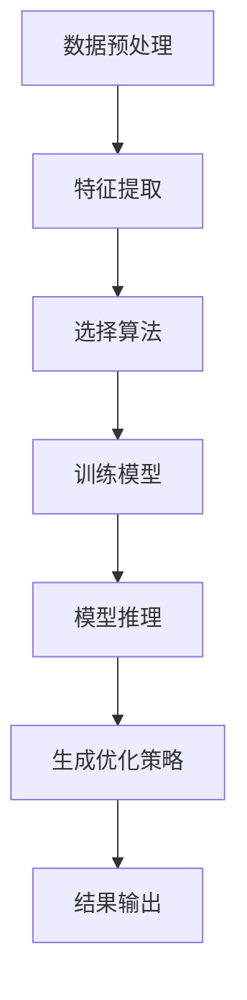
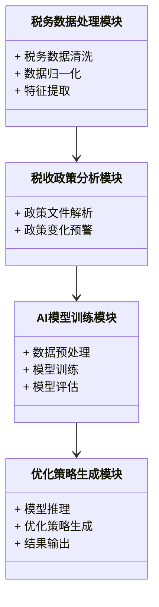
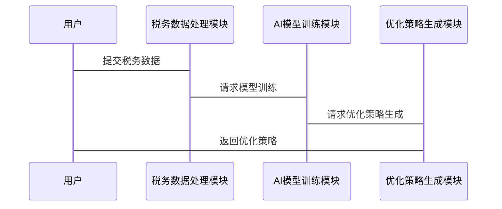

                 


# 构建企业级AI税务顾问：优化税收策略与合规

## 关键词
企业级AI税务顾问、税务合规、税收优化、AI算法、税务数据处理、系统架构设计

## 摘要
本文详细探讨了构建企业级AI税务顾问系统的各个方面，从问题背景到系统实现，再到项目实战，全面分析了AI在税务管理中的应用。文章首先介绍了企业税务管理的痛点和AI技术的优势，然后详细阐述了AI税务顾问的核心概念、算法原理、系统架构设计和项目实现过程。通过实际案例分析，展示了如何利用AI技术优化税收策略并确保合规性。本文旨在为技术人员和企业管理者提供理论支持和实践指导，帮助企业高效管理税务事务，降低运营成本，提升竞争力。

---

## 第一部分: 企业级AI税务顾问的背景与核心概念

### 第1章: 问题背景与描述

#### 1.1 问题背景
企业税务管理一直是企业管理中的重要组成部分，但由于税收政策的复杂性和变化的频繁性，传统的税务管理方式往往面临以下挑战：
- **数据分散**：企业的财务数据、发票信息、税务政策分散在不同的系统中，难以高效整合和分析。
- **合规风险**：税收政策的变化可能导致企业税务处理不合规，面临罚款和法律风险。
- **效率低下**：传统的人工审核和计算方式效率低，难以应对海量的税务数据和复杂的计算需求。
- **成本高昂**：聘请专业税务顾问成本高，且难以实现自动化和实时化管理。

AI技术的引入为企业税务管理带来了新的可能性。通过AI技术，企业可以实现税务数据的智能化处理、自动化分析和实时优化，从而提高管理效率、降低合规风险和运营成本。

#### 1.2 问题描述
企业税务顾问的目标是帮助企业优化税收策略，确保税务合规，同时提高管理效率。AI税务顾问需要解决以下问题：
- 如何高效处理和分析海量税务数据？
- 如何构建数学模型和算法，实现税收策略的优化？
- 如何确保AI系统能够实时适应税收政策的变化？

#### 1.3 问题解决与边界
AI税务顾问的核心解决方案是通过构建智能化的税务管理系统，利用机器学习和自然语言处理等技术，实现税务数据的自动分类、分析和优化建议生成。系统的边界包括：
- **数据输入**：税务数据、发票信息、政策文件等。
- **模型输出**：税收优化策略、合规建议、风险预警等。
- **系统功能**：数据处理、模型训练、结果生成、用户交互等。

#### 1.4 概念结构与核心要素
AI税务顾问系统的核心要素包括：
- **税务数据**：企业的财务数据、发票信息、交易记录等。
- **税收政策**：国家的税收法规、政策文件等。
- **AI模型**：用于数据分析和优化的机器学习模型。
- **优化策略**：基于AI分析生成的税收优化建议。

### 第2章: 核心概念与联系

#### 2.1 核心概念原理
AI税务顾问的核心原理是通过数据预处理、特征提取、模型训练和结果生成等步骤，实现税务数据的智能化分析和优化。以下是核心步骤的详细解释：
1. **数据预处理**：清洗、归一化和特征提取，确保数据质量和一致性。
2. **模型训练**：利用机器学习算法（如随机森林、支持向量机等）训练分类器或回归模型。
3. **结果生成**：基于训练好的模型，生成税收优化策略和合规建议。

#### 2.2 概念属性特征对比
以下是核心概念的属性特征对比表：

| 概念       | 属性       | 特征描述                                                                 |
|------------|------------|--------------------------------------------------------------------------|
| 税务数据    | 数据类型   | 结构化数据（如JSON、XML）和非结构化数据（如文本文件）                               |
| 税收政策    | 法律文件   | 国家和地方税收法规、政策文件                                                 |
| AI模型     | 算法类型   | 分类模型（如随机森林）、回归模型（如线性回归）、自然语言处理模型（如BERT）            |
| 优化策略   | 输出形式   | 文本形式的建议、数值形式的优化指标                                             |

#### 2.3 ER实体关系图
以下是AI税务顾问系统的ER实体关系图：

```mermaid
er
  entity 税务数据 {
    key 税务ID
    attribute 税务类型, 税务金额, 发票信息, 时间戳
  }
  entity 税收政策 {
    key 政策ID
    attribute 政策名称, 政策内容, 生效日期
  }
  entity AI模型 {
    key 模型ID
    attribute 模型类型, 训练数据, 模型参数
  }
  entity 优化策略 {
    key 策略ID
    attribute 策略内容, 策略效果, 实施建议
  }
  relation 税务数据 -[ belongsTo ]-> 税收政策
  relation 税务数据 -[ inputTo ]-> AI模型
  relation AI模型 -[ generates ]-> 优化策略
```

---

## 第二部分: AI税务顾问算法原理与数学模型

### 第3章: 算法原理与数学模型

#### 3.1 算法原理
AI税务顾问的核心算法包括数据预处理、模型训练和结果生成三个阶段。以下是详细步骤：

1. **数据预处理**：
   - **清洗数据**：去除重复数据、处理缺失值、标准化数据格式。
   - **特征提取**：从税务数据中提取关键特征（如收入、支出、税率等）。

2. **模型训练**：
   - **选择算法**：根据问题类型选择合适的算法（如随机森林用于分类，线性回归用于回归）。
   - **训练模型**：利用训练数据训练模型，调整模型参数以优化性能。

3. **结果生成**：
   - **模型推理**：输入新的税务数据，通过模型生成优化策略和合规建议。
   - **结果解释**：将模型输出结果转化为可理解的优化策略和实施建议。

#### 3.2 算法流程图
以下是算法的流程图：



#### 3.3 数学模型与公式
以下是常用的数学模型和公式：

1. **线性回归模型**：
   $$ y = \beta_0 + \beta_1x + \epsilon $$
   其中，$$ y $$ 是目标变量，$$ x $$ 是自变量，$$ \beta_0 $$ 和 $$ \beta_1 $$ 是模型参数，$$ \epsilon $$ 是误差项。

2. **随机森林模型**：
   随机森林通过构建多个决策树并对结果进行投票或平均，实现分类或回归。

---

## 第三部分: 系统分析与架构设计

### 第4章: 系统分析与架构设计

#### 4.1 问题场景介绍
企业税务管理的复杂性要求构建一个高效、智能的税务管理系统。AI税务顾问系统需要能够处理大量税务数据，实时分析税收政策，并生成优化策略。

#### 4.2 项目介绍
本项目旨在构建一个基于AI的税务顾问系统，实现以下功能：
- 数据采集与处理
- 税收政策分析
- 税务优化建议生成
- 系统监控与维护

#### 4.3 系统功能设计
以下是系统的功能模块设计：



#### 4.4 系统架构设计
以下是系统的架构设计：


#### 4.5 系统接口设计
以下是系统的接口设计：

- **输入接口**：
  - 税务数据输入接口
  - 政策文件输入接口
- **输出接口**：
  - 优化策略输出接口
  - 风险预警输出接口

#### 4.6 系统交互流程图
以下是系统的交互流程图：



---

## 第四部分: 项目实战

### 第5章: 项目实战

#### 5.1 环境配置
以下是项目所需的环境配置：
- **编程语言**：Python 3.8+
- **框架与库**：TensorFlow、Scikit-learn、NLTK
- **开发工具**：Jupyter Notebook、VS Code
- **依赖管理**：pip install tensorflow scikit-learn nltk

#### 5.2 系统核心实现源代码
以下是核心代码实现：

```python
import pandas as pd
from sklearn.ensemble import RandomForestClassifier
from sklearn.metrics import accuracy_score

# 数据加载
tax_data = pd.read_csv('tax_data.csv')

# 数据预处理
tax_data.dropna(inplace=True)
tax_data['label'] = tax_data['tax_status'].apply(lambda x: 1 if x == ' compliant' else 0)

# 特征提取
features = tax_data.drop('label', axis=1)
labels = tax_data['label']

# 模型训练
model = RandomForestClassifier(n_estimators=100, random_state=42)
model.fit(features, labels)

# 模型预测
new_data = pd.read_csv('new_tax_data.csv')
new_features = new_data.drop('label', axis=1)
predictions = model.predict(new_features)

# 结果评估
print(f'Accuracy: {accuracy_score(new_data["label"], predictions)}')
```

#### 5.3 代码应用解读与分析
上述代码实现了以下功能：
1. **数据加载与预处理**：读取税务数据并清洗缺失值。
2. **特征提取**：提取模型所需的特征。
3. **模型训练**：使用随机森林算法训练分类模型。
4. **模型预测**：对新的税务数据进行预测。
5. **结果评估**：计算模型的准确率。

#### 5.4 实际案例分析
以下是一个实际案例分析：
- **案例背景**：某企业需要优化增值税缴纳策略。
- **数据准备**：收集过去三年的增值税数据、销售收入、成本费用等。
- **模型训练**：使用随机森林模型训练增值税优化策略。
- **结果生成**：模型生成优化策略并实施。

#### 5.5 项目小结
通过本项目，我们成功构建了一个基于AI的税务顾问系统，实现了税务数据的智能化处理和优化策略的生成。系统的关键在于数据预处理和模型训练，这需要结合企业的实际需求进行调整和优化。

---

## 第五部分: 最佳实践

### 第6章: 最佳实践

#### 6.1 实施经验总结
- **数据质量**：确保数据的准确性和完整性。
- **模型选择**：根据具体问题选择合适的算法。
- **结果解释**：确保模型输出结果的可解释性。

#### 6.2 注意事项
- **数据隐私**：确保税务数据的安全性和隐私性。
- **模型维护**：定期更新模型以适应税收政策的变化。
- **用户交互**：设计友好的用户界面，方便用户使用。

#### 6.3 拓展阅读
- 《机器学习实战》
- 《深入浅出TensorFlow 2.0》
- 《Python机器学习》

---

## 作者

作者：AI天才研究院/AI Genius Institute & 禅与计算机程序设计艺术 /Zen And The Art of Computer Programming

