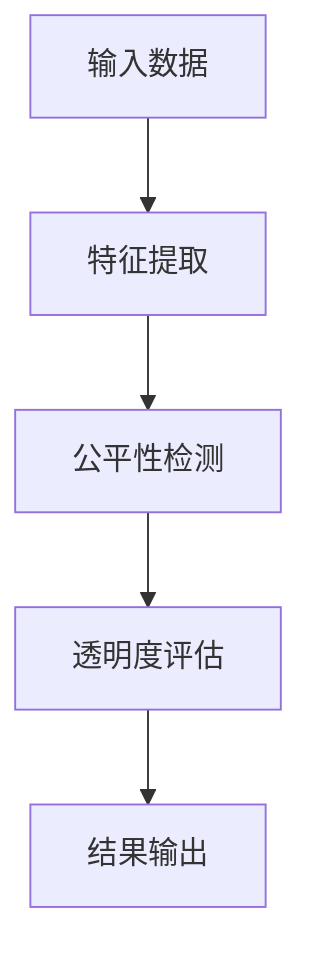

                 


# 构建企业级AI道德决策框架：确保AI系统的公平性与透明度

---

## 关键词：企业级AI、道德决策框架、公平性、透明度、因果推理、伦理算法、AI系统设计

---

## 摘要：  
随着人工智能技术在企业中的广泛应用，AI系统的决策过程正面临越来越大的伦理和法律挑战。本文将深入探讨如何构建企业级AI道德决策框架，确保AI系统的公平性与透明度。通过分析核心概念、算法原理、系统架构和实战案例，本文将为读者提供一套系统化的方法论，帮助企业在AI时代实现伦理合规的决策系统。

---

## 第一部分: 背景与核心概念

### 第1章: 企业级AI道德决策框架的背景与问题背景

#### 1.1 问题背景与问题描述  
随着AI技术的快速发展，企业级AI系统在决策、推荐、风控等领域得到了广泛应用。然而，AI系统的决策过程往往缺乏透明性，且容易受到数据偏见的影响，导致不公平的结果。例如，在招聘系统中，算法可能会因为历史数据中的性别偏见，导致对某一性别群体的招聘偏好。此外，AI系统的决策过程通常是一个“黑箱”，用户和相关利益方无法理解系统是如何做出决策的，这进一步加剧了信任问题。  

#### 1.2 问题解决与边界  
为了应对上述挑战，我们需要构建一个企业级AI道德决策框架，确保AI系统的决策过程既公平又透明。具体目标包括：  
- **公平性**：消除算法偏见，确保AI系统的决策不受性别、种族、年龄等敏感因素的影响。  
- **透明度**：让用户和相关利益方能够理解AI系统的决策逻辑，增强信任。  
- **可解释性**：提供清晰的决策理由，便于调试和优化。  

#### 1.3 核心概念与联系  
AI道德决策框架的核心概念包括公平性、透明度和可解释性。这三者相辅相成，共同构成了一个完整的伦理合规体系。  

---

### 第2章: AI道德决策框架的核心概念与联系

#### 2.1 公平性与透明度的定义  
- **公平性**：指AI系统在决策过程中对所有用户或群体一视同仁，避免因数据偏见或算法设计不当导致的不公平结果。  
- **透明度**：指AI系统的决策过程可以被用户或利益相关方理解和解释。  

#### 2.2 核心概念的属性特征对比  
下表展示了公平性和透明度的核心属性对比：  

| 属性 | 公平性 | 透明度 |
|------|--------|---------|
| 目标 | 消除偏见 | 提供解释 |
| 方法 | 基于因果推理 | 基于规则或模型解释 |
| 应用 | 招聘、信贷、司法 | 推荐、决策解释 |

#### 2.3 ER实体关系图架构  
通过ER图，我们可以清晰地理解AI道德决策框架中的实体关系：  

```mermaid
erd
    entity 用户 {
        用户ID
        属性：年龄、性别、职业
    }
    entity 数据源 {
        数据ID
        数据类型：招聘数据、信贷数据
    }
    entity AI模型 {
        模型ID
        模型类型：分类、回归
    }
    entity 决策框架 {
        框架ID
        公平性评分
        透明度评分
    }
    用户 --> 数据源
    数据源 --> AI模型
    AI模型 --> 决策框架
```

---

## 第二部分: 算法原理

### 第3章: AI道德决策框架的算法原理

#### 3.1 算法原理概述  
AI道德决策框架的核心算法包括：  
1. **公平性检测**：基于因果推理的方法，检测数据和模型中的偏见。  
2. **透明度评估**：通过可解释性技术（如LIME、SHAP）揭示AI决策的逻辑。  

#### 3.2 算法原理的数学模型与公式  
- **公平性检测的数学模型**：  
  $$P(y|x) = P(y|do(x))$$  
  其中，$P(y|x)$ 表示在给定特征$x$的情况下，结果$y$的概率；$P(y|do(x))$ 表示在干预$x$的情况下，结果$y$的概率。  

- **透明度评估的数学公式**：  
  $$T = \sum_{i=1}^{n} w_i \cdot f_i$$  
  其中，$w_i$ 是特征$f_i$的权重，$T$ 表示透明度评分。  

#### 3.3 算法实现的mermaid流程图  


---

## 第三部分: 系统分析与架构设计

### 第4章: 系统分析与架构设计

#### 4.1 问题场景介绍  
企业级AI系统通常涉及多个数据源和复杂的决策逻辑。例如，在金融领域，AI系统可能需要根据用户的信用记录、收入、消费习惯等信息，评估其信用风险。  

#### 4.2 系统功能设计  
- **领域模型**：通过类图展示系统的主要组件：  
  ```mermaid
  classDiagram
      class 用户
      class 数据源
      class AI模型
      class 决策框架
      用户 --> 数据源
      数据源 --> AI模型
      AI模型 --> 决策框架
      决策框架 --> 用户
  ```

- **系统架构设计**：  
  ```mermaid
  graph TD
      A[用户] --> B[数据源]
      B --> C[AI模型]
      C --> D[决策框架]
      D --> E[结果输出]
  ```

#### 4.3 系统接口设计  
- **接口定义**：  
  - 输入接口：用户信息、数据源接口  
  - 输出接口：决策结果、透明度评分  

- **系统交互流程**：  
  ```mermaid
  sequenceDiagram
      participant 用户
      participant 数据源
      participant AI模型
      participant 决策框架
      用户 -> 数据源: 获取数据
      数据源 -> AI模型: 训练模型
      AI模型 -> 决策框架: 生成决策
      决策框架 -> 用户: 返回结果
  ```

---

## 第四部分: 项目实战

### 第5章: 项目实战

#### 5.1 环境安装与配置  
- **开发环境**：建议使用Jupyter Notebook或PyCharm。  
- **依赖库安装**：安装Python库如`scikit-learn`、`xai`、`mermaid`。  

#### 5.2 系统核心实现源代码  
以下是一个简单的公平性检测代码示例：  

```python
from xai import FairnessMetrics

# 加载数据
data = load_data()

# 检测公平性
fairness = FairnessMetrics(data)
fairness_score = fairness.compute_bias()

# 输出结果
print(f"公平性评分：{fairness_score}")
```

#### 5.3 实际案例分析  
以招聘系统为例，假设我们发现女性候选人的通过率低于男性。通过AI道德决策框架，我们可以检测到性别偏见，并调整模型参数以消除偏见。  

#### 5.4 项目小结  
通过实战案例，我们可以看到AI道德决策框架在实际应用中的有效性。关键在于选择合适的算法和工具，同时确保数据的多样性和模型的可解释性。

---

## 结语：  
构建企业级AI道德决策框架是一个复杂但必要的任务。通过理解核心概念、掌握算法原理、设计合理架构并结合实际案例，我们可以确保AI系统的公平性和透明度，从而实现伦理合规的决策系统。

---

## 作者：  
AI天才研究院/AI Genius Institute  
禅与计算机程序设计艺术 /Zen And The Art of Computer Programming

