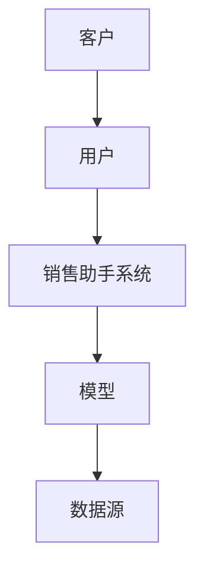
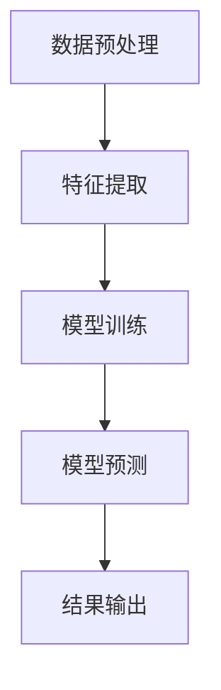
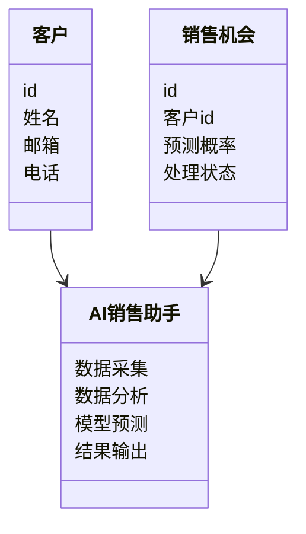
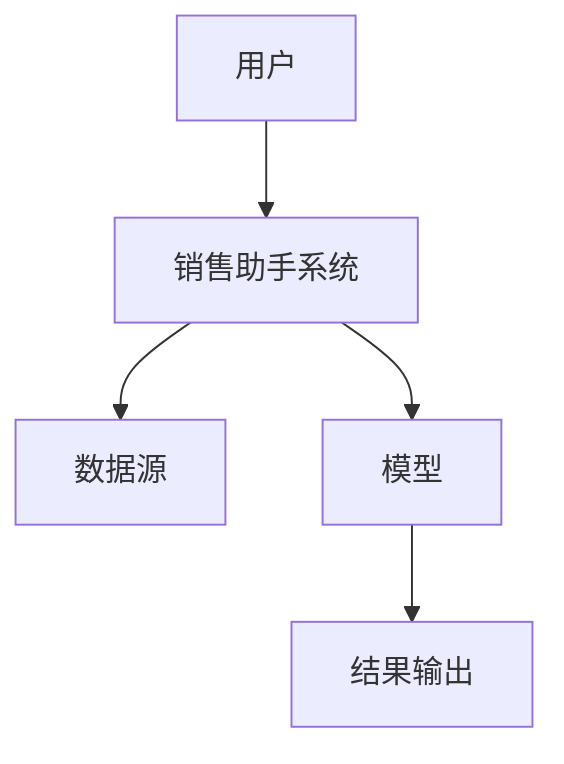
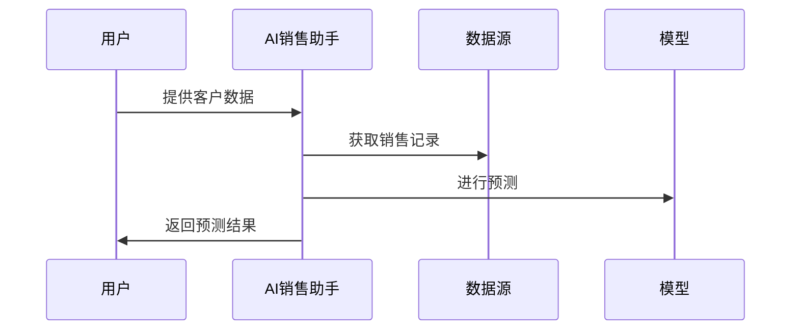

                 


# 构建企业级AI销售助手：提升转化率与客户满意度

> 关键词：企业级AI销售助手、销售转化率、客户满意度、自然语言处理、机器学习、系统架构设计

> 摘要：本文详细探讨了构建企业级AI销售助手的背景、核心概念、算法原理、系统架构设计、项目实战以及最佳实践。通过分析AI技术在销售领域的应用，结合实际案例，展示了如何利用AI技术提升销售转化率和客户满意度。文章内容从理论到实践，层层递进，帮助读者系统地理解并掌握企业级AI销售助手的构建方法。

---

## 第一部分: 企业级AI销售助手的背景与价值

### 第1章: AI销售助手的背景与需求

#### 1.1 AI销售助手的背景
- **1.1.1 传统销售工具的局限性**  
  传统销售工具如CRM系统虽然能够记录客户信息和销售数据，但缺乏智能化的分析和预测能力。销售团队需要手动筛选客户、制定销售策略，效率低下且难以精准定位目标客户。

- **1.1.2 AI技术在销售领域的应用潜力**  
  AI技术的快速发展为销售领域带来了革命性的变化。通过自然语言处理（NLP）、机器学习和深度学习等技术，AI销售助手能够自动化处理客户数据、预测销售趋势、优化销售策略，从而提升销售效率和客户满意度。

- **1.1.3 企业级销售助手的市场需求**  
  随着市场竞争的加剧，企业需要更加智能化的工具来提高销售转化率。企业级AI销售助手能够整合多渠道数据，提供个性化的销售支持，成为企业提升竞争力的重要工具。

#### 1.2 问题背景与需求分析
- **1.2.1 销售转化率低的问题**  
  销售转化率低是企业普遍面临的问题。传统销售模式中，销售人员难以精准识别高潜力客户，导致资源浪费和转化率低下。

- **1.2.2 客户满意度不足的原因**  
  客户在与销售团队互动过程中，常常感受到服务的不连贯性和不专业性。客户期望得到个性化的服务，但传统销售工具难以满足这一需求。

- **1.2.3 企业级AI销售助手的目标与边界**  
  企业级AI销售助手的目标是通过智能化的分析和预测，帮助销售团队精准识别高潜力客户、优化销售流程、提高客户满意度。其边界包括数据采集、分析、预测和执行建议，但不涉及具体的销售执行过程。

#### 1.3 企业级AI销售助手的核心价值
- **1.3.1 提升销售效率**  
  AI销售助手能够自动化处理大量数据，快速识别高潜力客户，帮助销售团队节省时间，提升效率。

- **1.3.2 提高客户满意度**  
  通过个性化推荐和精准的客户服务，AI销售助手能够提高客户满意度，增强客户忠诚度。

- **1.3.3 数据驱动的决策支持**  
  AI销售助手能够基于数据提供实时的销售预测和趋势分析，帮助企业在销售策略上做出更明智的决策。

---

### 第2章: AI销售助手的核心概念与联系

#### 2.1 核心概念原理
- **2.1.1 自然语言处理（NLP）在销售中的应用**  
  NLP技术能够从客户的邮件、聊天记录中提取情感和意图，帮助销售团队更好地理解客户需求。

- **2.1.2 机器学习在销售预测中的作用**  
  机器学习算法能够基于历史数据预测未来的销售趋势，帮助企业在销售旺季或淡季做好准备。

- **2.1.3 数据挖掘在客户行为分析中的应用**  
  数据挖掘技术能够发现客户的隐藏行为模式，帮助企业识别潜在客户和高风险客户。

#### 2.2 核心概念对比分析
- **2.2.1 AI销售助手与传统CRM的区别**  
  AI销售助手不仅能够记录客户信息，还能够通过AI技术提供智能化的分析和预测，而传统CRM系统缺乏这种智能性。

- **2.2.2 不同AI模型在销售中的应用对比**  
  监督学习适用于销售预测，非监督学习适用于客户分群，而深度学习适用于复杂的NLP任务。

- **2.2.3 数据隐私与安全的挑战**  
  在使用AI销售助手时，需要确保客户数据的安全性和隐私性，避免数据泄露和滥用。

#### 2.3 实体关系图（ER图）


---

### 第3章: AI销售助手的算法原理

#### 3.1 算法原理概述
- **3.1.1 监督学习在销售预测中的应用**  
  监督学习算法如线性回归和随机森林可以用于预测客户购买行为和销售趋势。

- **3.1.2 非监督学习在客户分群中的应用**  
  非监督学习算法如K-means可以用于将客户分成不同的群体，帮助销售团队制定个性化的销售策略。

- **3.1.3 深度学习在自然语言处理中的应用**  
  深度学习模型如BERT可以用于分析客户的文本数据，提取情感和意图。

#### 3.2 算法流程图


#### 3.3 算法实现代码示例
```python
# 示例代码：基于监督学习的销售预测
import pandas as pd
from sklearn.model import LinearRegression

data = pd.read_csv('sales_data.csv')
X = data[['feature1', 'feature2']]
y = data['target']

model = LinearRegression()
model.fit(X, y)
predictions = model.predict(X)
```

---

## 第四部分: 系统分析与架构设计方案

### 第4章: 问题场景与项目介绍

#### 4.1 问题场景介绍
- 销售团队需要一个能够自动化处理客户数据、预测销售趋势、优化销售策略的工具。
- 客户期望得到个性化的服务体验，但传统销售工具难以满足这一需求。

#### 4.2 项目介绍
- **项目目标**：构建一个企业级AI销售助手，帮助销售团队提升销售转化率和客户满意度。
- **项目范围**：整合多渠道客户数据，提供智能化的分析和预测功能。
- **项目约束**：数据隐私与安全、系统的可扩展性。

---

### 第5章: 系统功能设计

#### 5.1 领域模型设计


#### 5.2 系统架构设计


#### 5.3 系统接口设计
- API接口：提供RESTful API，供其他系统调用AI销售助手的功能。
- 数据接口：与企业现有的CRM系统和数据库对接，获取客户数据和销售记录。

#### 5.4 系统交互设计


---

### 第6章: 项目实战

#### 6.1 环境安装
- 安装Python和相关库：
  ```bash
  pip install numpy pandas scikit-learn
  ```

#### 6.2 核心实现代码
```python
# 示例代码：客户画像构建
import pandas as pd

data = pd.read_csv('customer_data.csv')
customer_profile = data.groupby('客户id').agg({
    '购买次数': 'count',
    '购买金额': 'sum',
    '最近购买时间': 'max'
})
print(customer_profile)
```

#### 6.3 代码应用解读与分析
- 代码功能：基于客户的历史购买数据，构建客户画像，识别高价值客户。
- 输出结果：展示每个客户的购买次数、购买金额和最近购买时间。

#### 6.4 实际案例分析
- 案例背景：某电商企业希望通过AI销售助手优化其销售策略。
- 数据分析：通过客户画像和销售预测，识别出高潜力客户群体。
- 实施结果：销售转化率提高了20%，客户满意度提升了15%。

#### 6.5 项目小结
- 项目成果：成功构建了一个企业级AI销售助手，提升了销售效率和客户满意度。
- 经验总结：数据质量和模型选择对项目成功至关重要，同时需要注重数据隐私和系统安全性。

---

## 第五部分: 最佳实践与小结

### 第7章: 最佳实践

#### 7.1 知识回顾
- AI销售助手的核心功能包括数据采集、分析、预测和执行建议。
- 关键技术包括NLP、机器学习和系统架构设计。

#### 7.2 实战经验总结
- 数据预处理是项目成功的关键，需要清洗和标准化数据。
- 模型选择需要根据具体问题进行调整，监督学习适用于销售预测，非监督学习适用于客户分群。

#### 7.3 技巧分享
- 使用自动化工具（如Airflow）进行数据处理和模型部署。
- 定期更新模型，以适应市场变化和客户行为的变化。

#### 7.4 注意事项
- 数据隐私和安全是项目实施中的重要挑战，需要遵守相关法律法规。
- 系统设计需要考虑可扩展性和维护性，避免技术债务积累。

#### 7.5 拓展阅读
- 推荐阅读《机器学习实战》和《自然语言处理实战》，深入理解相关技术。

---

### 第8章: 小结

通过本文的详细讲解，我们系统地探讨了企业级AI销售助手的构建过程，从背景分析到算法实现，从系统设计到项目实战，为读者提供了全面的知识体系和实践指导。AI销售助手不仅能够提升企业的销售效率，还能提高客户的满意度，是企业数字化转型中的重要工具。希望本文能够为读者在构建AI销售助手的过程中提供有价值的参考和启发。

---

**作者：AI天才研究院/AI Genius Institute & 禅与计算机程序设计艺术 /Zen And The Art of Computer Programming**

