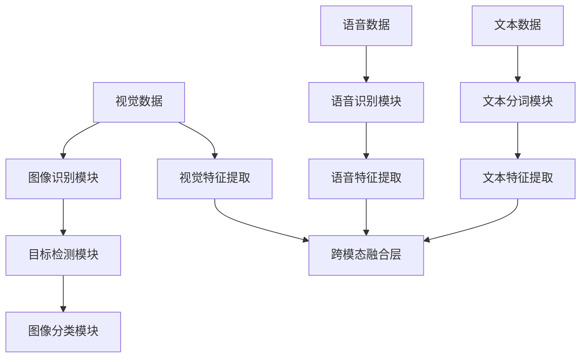
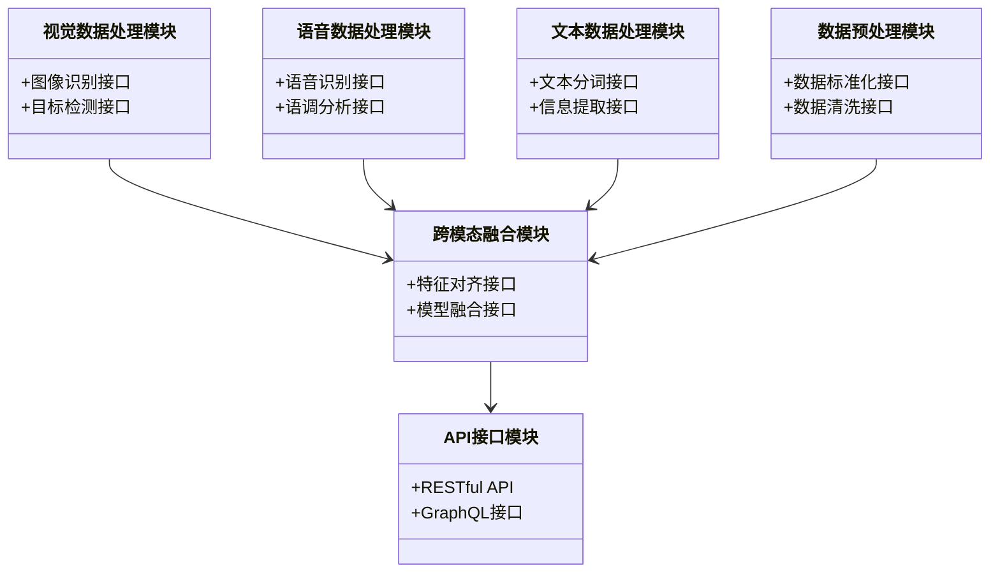
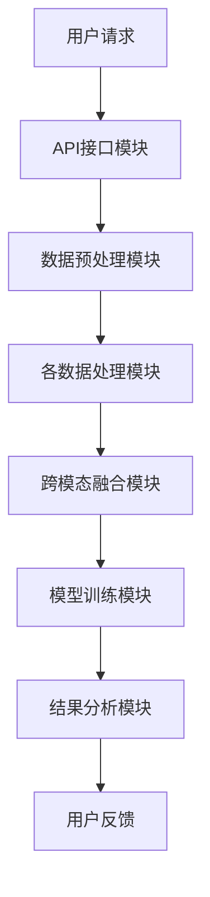
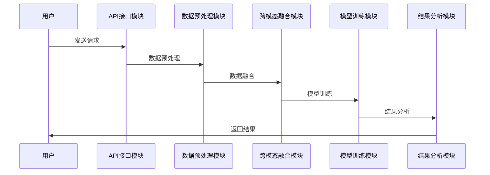

                 


# 构建企业级多模态AI平台：整合视觉、语音与文本的综合分析系统

## 关键词：企业级AI平台、多模态数据、视觉识别、语音处理、文本分析

## 摘要：本文详细探讨了如何构建一个整合视觉、语音与文本的综合分析系统，旨在为企业提供高效的数据处理和决策支持。文章从背景、技术原理、系统架构到实际案例，全面解析了构建该平台的关键步骤和核心要素。

---

## 第一部分：企业级多模态AI平台背景与概述

### 第1章：多模态AI平台的背景与价值

#### 1.1 问题背景

- **当前企业信息化的痛点**：企业在信息化过程中，面临数据来源多样、格式复杂的问题，难以实现跨模态数据的有效整合和分析。
- **多模态数据整合的需求**：企业需要从图像、语音、文本等多种数据源中提取有价值的信息，以支持更精准的决策。
- **企业级AI平台的必要性**：传统单一模态的AI系统难以满足企业对复杂场景的分析需求，亟需构建多模态AI平台。

#### 1.2 问题描述

- **多模态数据的复杂性**：不同模态的数据具有不同的特征和结构，如何实现有效的数据融合是关键挑战。
- **数据孤岛与信息割裂**：企业内部数据分散在不同系统中，缺乏统一的平台进行整合和分析。
- **AI技术在企业中的应用瓶颈**：现有的AI系统往往只处理单一模态数据，难以应对复杂的实际场景。

#### 1.3 解决方案与目标

- **多模态AI平台的核心目标**：构建一个能够整合视觉、语音和文本数据的平台，提供统一的数据处理和分析能力。
- **平台需要解决的关键问题**：实现跨模态数据的对齐、融合与分析，提供高效的API接口支持企业应用。
- **平台预期带来的价值**：提升企业的数据处理能力，优化决策过程，增强用户体验。

#### 1.4 边界与外延

- **平台的功能边界**：平台专注于多模态数据的整合与分析，不涉及具体业务逻辑的处理。
- **与现有系统的接口关系**：平台通过标准化接口与企业现有的业务系统对接，确保数据的流畅流通。
- **未来的扩展方向**：支持更多模态数据的接入，优化算法性能，拓展应用场景。

#### 1.5 核心要素与概念结构

- **平台的组成模块**：数据采集模块、数据预处理模块、特征提取模块、模型训练模块、结果分析模块。
- **各模块之间的关系**：数据采集模块负责获取多模态数据，预处理模块完成数据标准化，特征提取模块提取关键特征，模型训练模块进行多模态融合训练，结果分析模块输出分析结果。
- **核心技术栈的选择**：采用深度学习框架（如TensorFlow、PyTorch），结合分布式计算框架（如Kubernetes）。

---

## 第二部分：多模态AI的核心概念与技术原理

### 第2章：多模态数据的融合与分析

#### 2.1 多模态数据的特点

- **视觉数据**：高维、非结构化，需要通过图像识别、目标检测等技术进行处理。
- **语音数据**：时间序列、情感特征，需要通过语音识别、语调分析等技术进行处理。
- **文本数据**：结构化、语义丰富，需要通过分词、句法分析等技术进行处理。

#### 2.2 数据融合的原理

- **数据预处理与标准化**：对不同模态的数据进行归一化处理，确保数据格式一致。
- **多模态特征提取**：通过卷积神经网络（CNN）提取图像特征，通过循环神经网络（RNN）提取语音和文本特征。
- **跨模态对齐与融合**：利用注意力机制（Attention）实现跨模态对齐，通过融合网络（如图灵网络）进行特征融合。

#### 2.3 多模态模型的训练与优化

- **跨模态损失函数设计**：结合多种模态的特征，设计联合损失函数，提升模型的泛化能力。
- **模型训练策略**：采用迁移学习和数据增强技术，提升模型的鲁棒性和泛化能力。
- **模型调优与评估**：通过交叉验证和网格搜索优化模型参数，使用准确率、召回率等指标评估模型性能。

#### 2.4 核心概念对比表

| 模态类型 | 数据特点 | 处理方法 | 应用场景 |
|----------|----------|----------|----------|
| 视觉     | 高维、非结构化 | 图像识别、目标检测 | 图像分类、视频分析 |
| 语音     | 时间序列、情感特征 | 语音识别、语调分析 | 语音助手、情感分析 |
| 文本     | 结构化、语义丰富 | 分词、句法分析 | 文本分类、信息提取 |

#### 2.5 实体关系图（Mermaid）



---

## 第三部分：系统分析与架构设计

### 第3章：系统分析与架构设计方案

#### 3.1 问题场景介绍

- **项目背景**：企业需要构建一个能够处理视觉、语音和文本数据的综合分析平台，支持多种业务场景的应用。

#### 3.2 系统功能设计

- **领域模型类图**：展示系统各模块之间的关系和交互流程。



#### 3.3 系统架构设计

- **系统架构图**：展示系统的整体架构和各模块的交互流程。



#### 3.4 系统接口设计

- **接口描述**：
  - RESTful API：提供标准的HTTP接口，支持GET、POST、PUT、DELETE等操作。
  - GraphQL接口：支持自定义查询，灵活获取所需数据。

#### 3.5 系统交互设计

- **交互流程图**：



---

## 第四部分：项目实战

### 第4章：项目实战与代码实现

#### 4.1 环境安装与配置

- **安装Python环境**：建议使用Anaconda或virtualenv管理虚拟环境。
- **安装深度学习框架**：安装TensorFlow、PyTorch等深度学习框架。
- **安装NLP工具库**：安装spaCy、jieba等文本处理库。
- **安装语音处理库**：安装 librosa、pydub 等语音处理库。

#### 4.2 核心代码实现

- **数据预处理代码**（Python）：

```python
import numpy as np
import pandas as pd

def preprocess_data(data):
    # 数据标准化
    data = (data - np.mean(data)) / np.std(data)
    return data
```

- **特征提取代码**（Python）：

```python
import tensorflow as tf
from tensorflow.keras.layers import Dense, Activation

model = tf.keras.Sequential()
model.add(Dense(128, activation='relu', input_shape=(input_dim,)))
model.add(Dense(64, activation='relu'))
model.add(Dense(1, activation='sigmoid'))
model.compile(optimizer='adam', loss='binary_crossentropy', metrics=['accuracy'])
```

- **模型训练代码**（Python）：

```python
model.fit(x_train, y_train, epochs=10, batch_size=32, validation_data=(x_val, y_val))
```

#### 4.3 代码功能解读与分析

- **数据预处理**：对输入数据进行标准化处理，确保不同模态的数据具有可比性。
- **特征提取**：通过神经网络提取数据的深层特征，为后续的融合提供基础。
- **模型训练**：采用深度学习模型进行多模态数据的融合与训练，提升模型的性能。

#### 4.4 实际案例分析

- **案例背景**：某企业需要分析客户的行为数据，包括视觉、语音和文本数据。
- **数据处理**：对客户的图像、语音和文本数据进行预处理和特征提取。
- **模型训练**：构建一个多模态模型，融合客户的视觉、语音和文本特征，预测客户的购买行为。
- **结果分析**：通过模型输出结果，帮助企业优化营销策略。

#### 4.5 项目小结

- **项目总结**：通过实际案例，展示了如何构建一个多模态AI平台，整合不同模态的数据，提升企业的数据分析能力。
- **经验分享**：在项目中，数据预处理和特征提取是关键步骤，需要仔细设计和优化。

---

## 第五部分：最佳实践与总结

### 第5章：最佳实践与总结

#### 5.1 小结

- **核心知识点回顾**：本文详细介绍了构建企业级多模态AI平台的背景、技术原理、系统架构和项目实战。
- **关键点总结**：多模态数据的融合与分析是构建该平台的核心，需要结合深度学习技术和系统架构设计。

#### 5.2 注意事项

- **数据隐私与安全**：在处理企业数据时，需要注意数据的隐私和安全，避免数据泄露。
- **模型的可解释性**：在实际应用中，模型的可解释性非常重要，需要设计可解释的模型。
- **系统的可扩展性**：平台需要具备良好的扩展性，支持更多模态数据和应用场景的接入。

#### 5.3 拓展阅读

- **推荐阅读书籍**：
  - 《Deep Learning》
  - 《自然语言处理实战》
  - 《语音信号处理与模式识别》
- **推荐阅读论文**：
  - 多模态数据融合的经典论文
  - 最新的多模态模型研究

---

## 作者：AI天才研究院/AI Genius Institute & 禅与计算机程序设计艺术/Zen And The Art of Computer Programming

