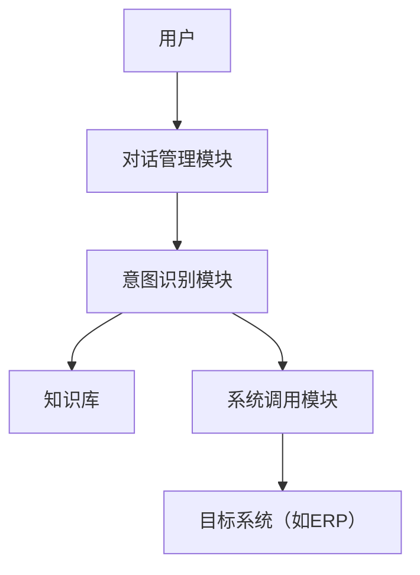

                 


# 构建企业级对话式AI助手：跨系统业务流程自动化与协调

## 关键词：企业级对话式AI助手、跨系统业务流程、自动化、系统集成、自然语言处理（NLP）、知识库

## 摘要：本文详细探讨了构建企业级对话式AI助手的关键技术与实践。从问题背景到系统架构，从算法原理到项目实战，系统性地分析了如何通过对话式AI实现跨系统的业务流程自动化与协调。内容涵盖核心概念、算法原理、系统架构设计、项目实战及最佳实践，为构建高效的企业级AI助手提供全面指导。

---

## 第一部分：背景介绍

### 第1章：问题背景与核心概念

#### 1.1 问题背景

企业级对话式AI助手旨在通过自然语言处理技术，帮助企业实现跨系统的业务流程自动化。传统企业系统孤岛化严重，数据分散，流程复杂，导致效率低下。对话式AI助手通过整合多个系统，提供统一的交互界面，提升用户体验和效率。

#### 1.2 核心概念与问题描述

**对话式AI助手**：基于NLP技术，能够理解并执行用户指令的智能系统，支持文本或语音交互。  
**跨系统业务流程**：涉及多个系统的协作流程，如ERP、CRM、HRM等。  
**自动化**：通过AI自动处理任务，减少人工干预，提升效率。

#### 1.3 问题解决与边界

对话式AI助手通过统一入口、智能路由、状态管理解决跨系统协作问题。边界包括外部系统调用、数据隐私和系统稳定性。

---

## 第二部分：核心概念与联系

### 第2章：对话式AI助手的原理

#### 2.1 对话管理机制

- 基于规则的对话管理：简单但缺乏灵活性。
- 统计模型：依赖数据，可能出错。
- 深度学习模型：准确但复杂。

#### 2.2 系统集成与知识库

- 知识库构建：通过爬取和标注数据，构建领域知识库。
- 实体识别：提取关键信息，如客户ID。
- 槽位填充：自动填写任务参数，如“创建工单”。

---

## 第三部分：算法原理讲解

### 第3章：算法原理与实现

#### 3.1 对话管理算法

- 基于规则的对话管理：适用于简单场景。
- 统计模型：基于历史数据预测下一步。
- 深度学习模型：学习复杂对话模式。

#### 3.2 意图识别与NLP

- 模型训练：使用标注数据训练分类器。
- 对话上下文：维护对话状态，处理多轮对话。
- 模型推理：解析用户输入，生成系统响应。

---

## 第四部分：数学模型与公式

### 第4章：数学模型与公式

#### 4.1 对话模型的概率计算

- 条件概率公式：$P(y|x) = \frac{P(x|y)P(y)}{P(x)}$
- 贝叶斯定理：用于意图识别。
- 损失函数：交叉熵损失函数。

---

## 第五部分：系统分析与架构设计

### 第5章：系统架构设计

#### 5.1 项目介绍与系统功能

- 功能模块：对话管理、意图识别、系统集成。
- 案例分析：创建工单流程。

#### 5.2 系统架构图



#### 5.3 接口设计与交互流程

- 接口定义：RESTful API。
- 交互流程：用户输入 → 解析 → 执行 → 返回结果。

---

## 第六部分：项目实战

### 第6章：环境安装与核心代码

#### 6.1 环境安装

- Python 3.8+
- Flask框架
- spaCy库

#### 6.2 核心代码实现

```python
from flask import Flask, request, jsonify
import spacy

nlp = spacy.load("en_core_web_sm")

def intent_classifier(text):
    doc = nlp(text)
    # 实体识别与槽位填充
    entities = [(ent.text, ent.label_) for ent in doc.ents]
    return entities

app = Flask(__name__)

@app.route('/process', methods=['POST'])
def process():
    data = request.json
    text = data['text']
    result = intent_classifier(text)
    return jsonify({'entities': result})

if __name__ == '__main__':
    app.run(debug=True)
```

#### 6.3 案例分析

创建工单流程：用户输入“创建一个技术支持工单”，系统解析意图，提取客户ID和问题描述，调用ERP系统创建工单。

---

## 第七部分：最佳实践与总结

### 第7章：总结与注意事项

- 最佳实践：保持知识库更新，确保数据隐私。
- 注意事项：处理系统异常，保证可用性。

---

## 第八部分：扩展阅读

### 第8章：拓展阅读与学习资源

- 推荐书籍：《深度学习入门》、《自然语言处理实战》。
- 在线课程：Coursera的NLP专项课程。

---

## 作者

作者：AI天才研究院/AI Genius Institute & 禅与计算机程序设计艺术 /Zen And The Art of Computer Programming

---

通过以上结构，文章系统性地介绍了构建企业级对话式AI助手的各个方面，从理论到实践，从算法到系统架构，为读者提供了全面的指导。

