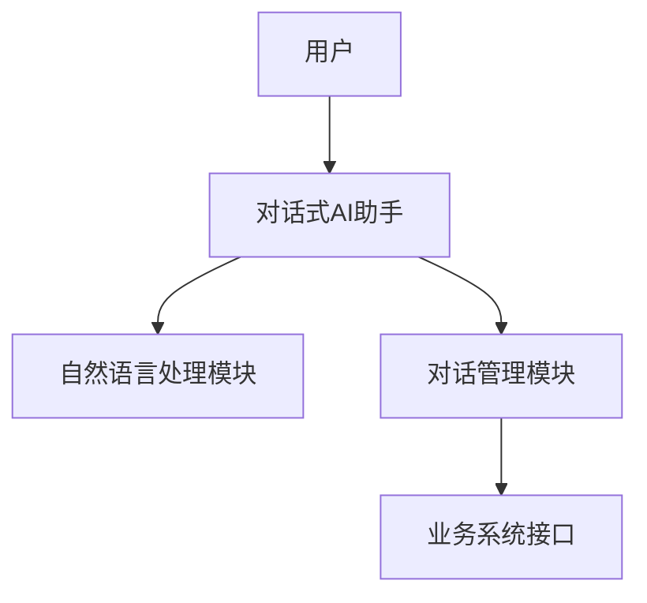
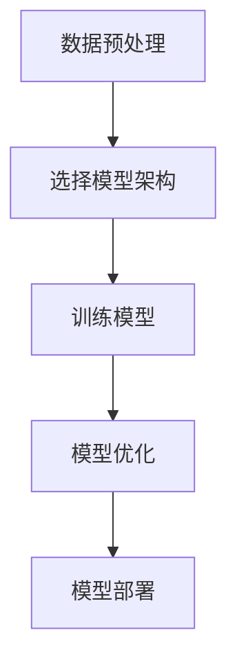
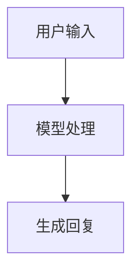
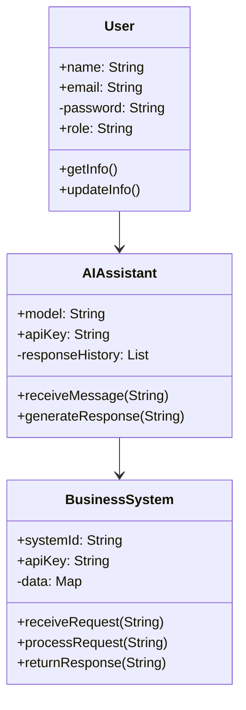
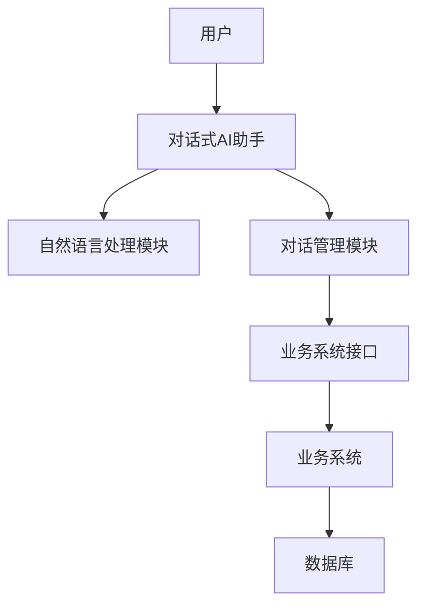
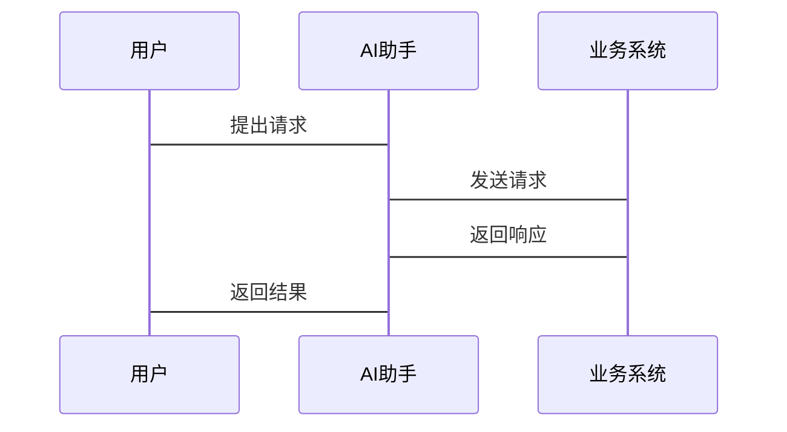

                 


# 构建企业级对话式AI助手：跨系统业务流程自动化与协调

## 关键词：企业级AI助手、对话式AI、业务流程自动化、系统集成、人工智能

## 摘要：  
本文详细探讨了构建企业级对话式AI助手的技术细节，涵盖跨系统业务流程自动化与协调的核心概念、算法原理、系统架构设计以及项目实战。通过系统化的分析和实践，展示了如何利用先进的人工智能技术提升企业效率和用户体验。

---

# 1. 背景与基础

## 1.1 问题背景

### 1.1.1 传统人机交互的局限性
传统的交互方式依赖菜单导航或固定关键词，用户体验较差，且难以处理复杂需求。例如，传统的客服系统通常需要用户选择多个选项才能解决问题，这增加了用户的操作负担。

### 1.1.2 对话式AI助手的出现及其优势
对话式AI助手通过自然语言处理技术，能够理解并生成人类语言，显著提升了交互的便捷性和智能性。例如，用户可以直接用口语化的表达提出需求，AI助手能够准确理解并执行相关操作。

### 1.1.3 企业级对话式AI助手的必要性
企业级AI助手能够集成多个业务系统，协调不同流程，实现自动化处理，从而提高效率、降低成本，并增强客户满意度。

## 1.2 对话式AI助手的定义与特点

### 1.2.1 对话式AI助手的定义
对话式AI助手是一种基于自然语言处理技术的智能系统，能够通过文本或语音与用户进行交互，理解用户需求并提供相应的服务或信息。

### 1.2.2 对话式AI助手的核心特点
- **自然语言处理能力**：支持多种语言理解和生成。
- **学习能力**：能够通过数据优化回答质量。
- **上下文理解**：能够根据对话历史调整回答。

### 1.2.3 与传统聊天机器人的区别
传统聊天机器人通常基于规则库，而对话式AI助手则基于机器学习模型，能够处理更复杂的语义理解和生成。

## 1.3 主流对话式AI模型简介

### 1.3.1 GPT系列模型
GPT（Generative Pre-trained Transformer）模型通过大量文本数据的预训练，能够生成连贯且有意义的文本。

### 1.3.2 BERT及其变体
BERT（Bidirectional Encoder Representations from Transformers）模型擅长理解上下文关系，常用于问答系统。

### 1.3.3 其他知名对话式AI模型
- **PaLM**：Google的开源模型，支持多语言对话。
- **Llama**：Meta开源的高效对话模型。

## 1.4 对话式AI在企业中的技术优势

### 1.4.1 提升用户体验
通过自然语言处理，对话式AI助手能够提供更贴近人类交流的交互体验。

### 1.4.2 实现跨系统集成
AI助手可以作为桥梁，连接企业内部的多个系统，实现数据和流程的自动化处理。

### 1.4.3 降低运营成本
自动化处理常见问题和任务，减少人工干预，降低运营成本。

---

# 2. 核心概念与联系

## 2.1 对话式AI助手的核心原理

### 2.1.1 模型训练过程
模型通过监督学习和强化学习优化回答质量，学习如何在特定领域内生成准确和相关的回答。

### 2.1.2 对话管理机制
对话管理负责根据用户输入和系统状态，决定下一步的交互策略。

### 2.1.3 自然语言处理技术
NLP技术用于理解用户输入和生成自然语言回复。

## 2.2 对话式AI助手的核心概念与联系

### 2.2.1 核心概念与属性特征对比

| **概念**       | **属性特征**                     |
|----------------|----------------------------------|
| 对话式AI助手   | 基于NLP技术，支持多轮对话         |
| 模型训练       | 预训练和微调，优化回答质量       |
| 对话管理       | 基于规则或机器学习，协调对话流程 |

### 2.2.2 实体关系图



---

# 3. 算法原理

## 3.1 大语言模型的训练与推理过程

### 3.1.1 模型训练过程



#### Python代码示例：训练过程

```python
import torch
from torch import nn

# 定义模型架构
class SimpleModel(nn.Module):
    def __init__(self, input_dim, output_dim):
        super(SimpleModel, self).__init__()
        self.fc = nn.Linear(input_dim, output_dim)

    def forward(self, x):
        return self.fc(x)

# 初始化模型
model = SimpleModel(input_dim=10, output_dim=5)
# 定义损失函数和优化器
criterion = nn.MSELoss()
optimizer = torch.optim.Adam(model.parameters(), lr=0.001)
```

### 3.1.2 推理过程



#### Python代码示例：推理过程

```python
def generate_response(model, input_tensor):
    with torch.no_grad():
        output = model(input_tensor)
    return output
```

---

## 3.2 对话管理算法

### 3.2.1 基于规则的对话管理
通过预定义的规则来决定对话的下一步，适用于简单场景。

### 3.2.2 基于机器学习的对话管理
使用历史对话数据训练模型，预测最佳的下一步操作。

---

# 4. 系统分析与架构设计

## 4.1 系统功能设计

### 4.1.1 领域模型类图



### 4.1.2 系统架构设计



---

## 4.2 系统接口与交互设计

### 4.2.1 系统交互流程



---

# 5. 项目实战

## 5.1 环境安装与配置

### 5.1.1 安装Python和必要的库

```bash
python -m pip install torch transformers
```

## 5.2 核心功能实现

### 5.2.1 自然语言处理模块

```python
from transformers import AutoTokenizer, AutoModelForMaskedLM

tokenizer = AutoTokenizer.from_pretrained('bert-base-uncased')
model = AutoModelForMaskedLM.from_pretrained('bert-base-uncased')
```

### 5.2.2 对话管理模块

```python
def manage_dialogue(history, model):
    # 处理逻辑
    pass
```

## 5.3 实际案例分析

### 5.3.1 案例背景

企业需要一个AI助手来处理客户咨询和订单跟踪。

### 5.3.2 系统实现

```python
def process_order_status(order_id):
    # 调用业务系统接口获取订单状态
    pass
```

---

# 6. 总结与未来展望

## 6.1 核心要点回顾

对话式AI助手的构建需要结合自然语言处理、对话管理和系统架构设计，实现跨系统业务流程的自动化协调。

## 6.2 最佳实践与注意事项

- 定期更新模型以保持最佳性能。
- 保护用户数据隐私和安全。
- 与现有业务系统无缝集成。

## 6.3 未来发展趋势

对话式AI助手将向多模态方向发展，结合视觉和语音等多种交互方式，提供更智能的服务。

---

# 作者信息

作者：AI天才研究院/AI Genius Institute & 禅与计算机程序设计艺术 /Zen And The Art of Computer Programming

---

通过本文的详细分析和实践，读者可以全面理解构建企业级对话式AI助手的技术要点，并能够实际操作，为企业业务流程的自动化与协调提供有力支持。

