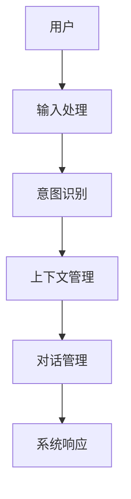

                 


# 构建企业级对话意图识别系统：上下文理解与多轮对话管理

> 关键词：对话意图识别，上下文理解，多轮对话管理，自然语言处理，机器学习，系统架构

> 摘要：  
本文详细探讨了构建企业级对话意图识别系统的各个方面，包括上下文理解与多轮对话管理的核心原理、算法实现、系统架构设计及项目实战。文章从问题背景出发，分析了对话意图识别的挑战与解决方案，深入讲解了意图识别与上下文理解的原理，结合实际案例展示了系统设计与实现过程，并提供了最佳实践建议。

---

## 第一部分: 背景介绍

### 第1章: 对话意图识别系统概述

#### 1.1 问题背景
对话意图识别是自然语言处理（NLP）领域的重要任务，旨在理解用户在多轮对话中的意图。随着企业级应用（如智能客服、智能助手）的普及，对话意图识别的需求日益增长。

- **问题背景**  
  在企业级对话系统中，用户的需求通常复杂且多样化。例如，用户可能需要查询订单状态、预约服务或解决问题。传统基于规则的系统难以应对复杂场景，而基于机器学习的意图识别技术能够更好地满足需求。

- **问题描述**  
  对话意图识别的核心挑战在于：  
  1. 多轮对话中的上下文理解。  
  2. 不同用户的表达习惯差异。  
  3. 对话目标的动态调整。

- **解决方案**  
  使用深度学习模型（如循环神经网络RNN、长短期记忆网络LSTM）结合上下文信息，实现对用户意图的精准识别。

- **上下文理解与多轮对话管理**  
  上下文理解是意图识别的基础，而多轮对话管理则是实现流畅对话的关键。

---

### 第2章: 对话意图识别的核心原理

#### 2.1 对话意图识别的原理
对话意图识别的过程可以分为以下步骤：  
1. **输入处理**：将用户的输入（文本或语音）转换为结构化的数据。  
2. **意图识别**：通过模型分析用户输入，提取意图信息。  
3. **上下文关联**：结合对话历史，更新上下文信息。  
4. **输出生成**：根据意图和上下文，生成合适的响应。

- **输入处理**  
  输入处理的关键是将非结构化的文本转化为结构化的数据。例如，将用户输入的文本分词、词性标注，并提取关键词。

- **意图识别**  
  意图识别的核心是模型训练。通过监督学习，模型从标注的数据中学习意图分类的规律。

- **上下文关联**  
  上下文关联需要维护一个状态机，记录对话历史和当前状态。例如，用户提到“订单”，系统需要记录订单ID、状态等信息。

- **输出生成**  
  输出生成需要结合意图和上下文，生成符合用户需求的响应。例如，用户询问订单状态，系统根据订单ID查询数据库，返回状态信息。

---

### 第3章: 上下文理解与多轮对话管理

#### 3.1 上下文理解的实现方法
上下文理解是对话系统的核心，需要考虑以下几点：  
1. **上下文表示**：如何将对话历史表示为模型可以理解的形式。  
2. **上下文关联**：如何将当前输入与对话历史关联起来。  
3. **上下文更新**：如何根据新输入更新上下文信息。

- **上下文表示**  
  上下文可以表示为一个序列，记录用户的历史输入和系统响应。例如，对话历史可以表示为一个列表：  
  ```python
  context = ["用户：查询订单状态", "系统：请提供订单ID"]
  ```

- **上下文关联**  
  通过关键词匹配或向量相似度，将当前输入与对话历史关联起来。例如，当用户提到“订单ID”，系统可以匹配到历史中的订单ID字段。

- **上下文更新**  
  根据新输入更新上下文信息。例如，用户提供订单ID后，系统将订单ID加入到上下文中。

#### 3.2 多轮对话管理的策略
多轮对话管理需要考虑以下几点：  
1. **对话状态管理**：记录对话的当前状态。  
2. **对话目标调整**：根据用户输入动态调整对话目标。  
3. **对话策略优化**：优化对话流程，提高对话效率。

- **对话状态管理**  
  对话状态可以表示为一个状态机，记录当前对话的阶段。例如：  
  ```python
  state = {
      "intent": "order_status",
      "context": {"order_id": "12345"}
  }
  ```

- **对话目标调整**  
  根据用户的输入，动态调整对话目标。例如，用户提到“取消订单”，系统需要调整目标为“处理取消订单”。

- **对话策略优化**  
  通过机器学习算法优化对话策略，例如使用强化学习（Reinforcement Learning）来训练对话模型。

---

### 第4章: 系统架构设计

#### 4.1 系统功能设计
企业级对话意图识别系统的功能模块包括：  
1. **用户输入处理**：接收用户的输入并进行预处理。  
2. **意图识别**：通过模型识别用户的意图。  
3. **上下文管理**：维护对话历史和上下文信息。  
4. **对话管理**：根据意图和上下文生成响应。

- **用户输入处理**  
  用户输入可以通过多种方式接收，例如文本输入、语音识别等。预处理步骤包括分词、词性标注等。

- **意图识别**  
  使用深度学习模型（如LSTM）对用户输入进行分类，识别用户的意图。

- **上下文管理**  
  维护一个上下文数据库，记录对话历史和当前状态。

- **对话管理**  
  根据意图和上下文，生成合适的响应，并调用相应的服务（如订单查询、预约服务）。

#### 4.2 系统架构图
使用 Mermaid 绘制的系统架构图如下：



---

### 第5章: 系统实现与优化

#### 5.1 系统实现
实现企业级对话意图识别系统需要完成以下步骤：  
1. **环境搭建**：安装必要的库（如Python、TensorFlow、Keras）。  
2. **数据准备**：收集和标注训练数据。  
3. **模型训练**：训练意图识别模型。  
4. **系统集成**：将模型集成到对话系统中。  

- **环境搭建**  
  安装必要的库：  
  ```bash
  pip install numpy tensorflow keras scikit-learn
  ```

- **数据准备**  
  数据可以包括用户输入和标注的意图。例如：  
  ```python
  dataset = [
      {"text": "查询订单状态", "intent": "order_status"},
      {"text": "取消订单", "intent": "cancel_order"}
  ]
  ```

- **模型训练**  
  使用LSTM模型训练意图识别模型：  
  ```python
  model = Sequential()
  model.add(LSTM(128, input_shape=(None, 1)))
  model.add(Dense(num_intents, activation='softmax'))
  model.compile(loss='sparse_categorical_crossentropy', optimizer='adam', metrics=['accuracy'])
  model.fit(X_train, y_train, epochs=10, batch_size=32)
  ```

- **系统集成**  
  将训练好的模型集成到对话系统中，处理用户输入并生成响应。

#### 5.2 系统优化
优化系统性能和用户体验：  
1. **模型优化**：使用更复杂的模型（如Transformer）提高准确率。  
2. **上下文优化**：引入领域知识，优化上下文表示。  
3. **对话优化**：通过强化学习优化对话策略。

---

### 第6章: 项目实战

#### 6.1 环境搭建
安装必要的库：  
```bash
pip install numpy tensorflow scikit-learn
```

#### 6.2 核心代码实现
实现意图识别和上下文管理的核心代码：  

```python
import numpy as np
from tensorflow import keras

# 意图识别模型
model = keras.Sequential()
model.add(keras.layers.LSTM(128, input_shape=(None, 1)))
model.add(keras.layers.Dense(5, activation='softmax'))

# 上下文管理
class ContextManager:
    def __init__(self):
        self.context = {}

    def update_context(self, key, value):
        self.context[key] = value

    def get_context(self, key):
        return self.context.get(key, None)
```

#### 6.3 案例分析
以客服系统为例，分析如何实现订单状态查询：  
1. 用户输入“查询订单状态”，系统识别意图“order_status”。  
2. 系统询问“请提供订单ID”。  
3. 用户输入“12345”，系统查询数据库并返回“订单已完成”。  

---

## 第二部分: 系统分析与优化

### 第7章: 系统分析与优化

#### 7.1 系统分析
分析系统性能和用户体验：  
1. **性能分析**：模型训练时间、推理速度。  
2. **用户体验**：对话流畅性、准确率。

#### 7.2 系统优化
优化系统性能和用户体验：  
1. **模型优化**：使用更高效的数据结构和算法。  
2. **对话优化**：引入领域知识，提高意图识别的准确率。

---

### 第8章: 最佳实践

#### 8.1 小结
总结全文内容，强调上下文理解与多轮对话管理的重要性。

#### 8.2 注意事项
- 数据质量对模型性能的影响。  
- 对话系统需要结合业务场景进行优化。  

#### 8.3 拓展阅读
推荐相关领域的书籍和论文，供读者深入学习。

---

## 作者简介

作者：AI天才研究院/AI Genius Institute & 禅与计算机程序设计艺术/Zen And The Art of Computer Programming

---

本文通过详细讲解企业级对话意图识别系统的构建过程，从背景介绍到系统实现，再到优化与实战，为读者提供了全面的指导。希望读者能够通过本文，掌握对话意图识别的核心原理和实现方法，并能够在实际项目中灵活应用。

