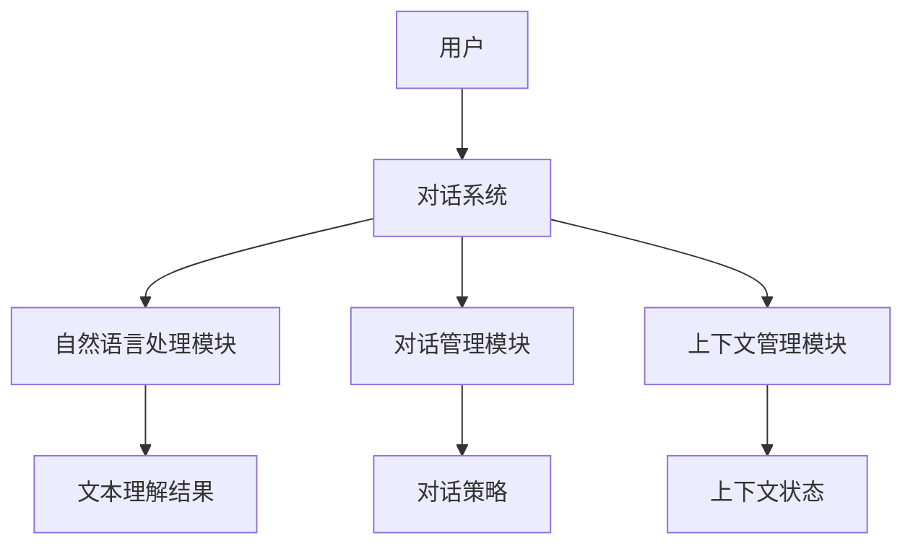
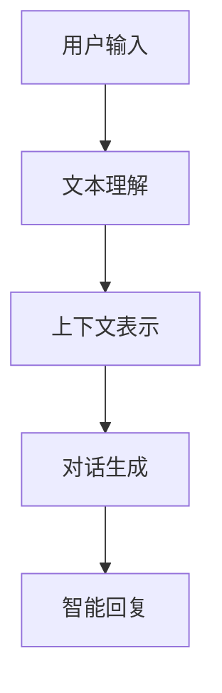
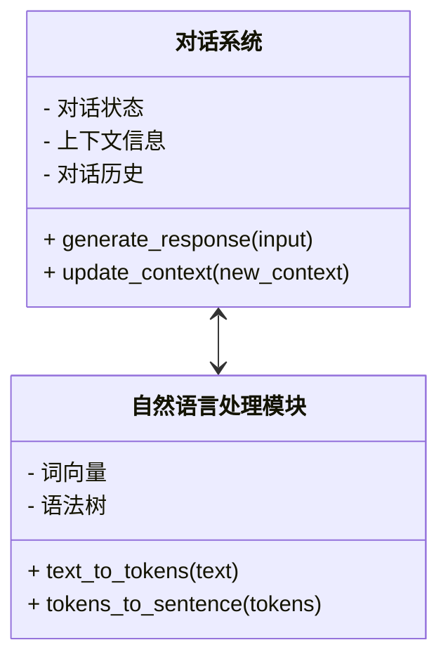

                 


# 构建企业级对话系统：上下文感知与多轮交互管理

> 关键词：企业级对话系统，上下文感知，多轮交互管理，自然语言处理，对话系统架构，对话管理

> 摘要：本文系统地探讨了企业级对话系统的核心概念、设计原则和实现方法，重点分析了上下文感知与多轮交互管理的关键技术。文章从背景出发，深入解析了对话系统的组成、上下文管理机制、多轮交互算法，结合实际案例，详细讲解了系统设计与实现，并提供了最佳实践建议。

---

# 第一部分: 背景与概念

# 第1章: 对话系统的发展与挑战

## 1.1 对话系统的发展历程
### 1.1.1 自然语言处理的演进
- 自然语言处理（NLP）从规则驱动到深度学习的转变
- 从简单的文本分类到复杂的对话生成
- 从单轮对话到多轮对话的发展

### 1.1.2 对话系统的起源与演变
- 早期基于规则的对话系统
- 统计学习方法的应用
- 基于深度学习的对话模型（如Seq2Seq、Transformer）

### 1.1.3 企业级对话系统的独特需求
- 企业级对话系统的定义
- 企业级对话系统的应用场景（客户服务、内部协作、业务流程自动化）
- 企业级对话系统的挑战（高效性、准确性、稳定性）

## 1.2 企业级对话系统的背景
### 1.2.1 企业级对话系统的定义
- 对话系统的核心功能：理解用户输入、生成智能回复、维护对话上下文
- 企业级对话系统的特征：高可用性、可扩展性、可定制性

### 1.2.2 企业级对话系统的应用场景
- 客户服务：在线客服、售后支持
- 内部协作：员工之间的信息传递与协作
- 业务流程自动化：订单处理、物流跟踪

### 1.2.3 企业级对话系统的挑战与机遇
- 挑战：对话上下文的维护、多轮交互的复杂性、系统的可扩展性
- 机遇：智能化转型、提升用户体验、降低人工成本

## 1.3 上下文感知的重要性
### 1.3.1 上下文感知的定义
- 上下文感知：通过理解对话历史、用户意图和场景信息，提供更精准的回复
- 上下文管理：维护对话过程中相关信息的状态

### 1.3.2 上下文感知在对话系统中的作用
- 提高对话的连贯性
- 增强对话的准确性
- 优化用户体验

### 1.3.3 上下文感知的实现方式
- 基于规则的上下文管理
- 基于统计的上下文建模
- 基于深度学习的上下文理解

## 1.4 多轮交互管理的核心问题
### 1.4.1 多轮对话的基本概念
- 多轮对话：用户与系统之间进行多轮交互的过程
- 对话状态：对话中的当前上下文信息

### 1.4.2 多轮对话的复杂性
- 用户意图的多样性
- 对话历史的依赖性
- 环境信息的动态变化

### 1.4.3 多轮对话中的状态管理
- 对话状态的表示
- 对话状态的更新
- 对话状态的恢复

## 1.5 本章小结
- 本章总结了对话系统的发展历程、企业级对话系统的定义与应用场景，重点分析了上下文感知与多轮交互管理的核心问题。

---

# 第二部分: 核心概念与原理

# 第2章: 对话系统的组成与核心要素

## 2.1 对话系统的组成
### 2.1.1 对话管理模块
- 对话流程控制
- 对话状态管理
- 对话策略选择

### 2.1.2 自然语言处理模块
- 文本理解（NLU）
- 文本生成（NLG）
- 对话模型训练

### 2.1.3 上下文管理模块
- 上下文表示
- 上下文存储
- 上下文更新

## 2.2 对话系统的属性特征对比
### 2.2.1 对比表格展示
| 特性           | 基于规则的对话系统 | 基于统计的对话系统 | 基于深度学习的对话系统 |
|----------------|---------------------|--------------------|-------------------------|
| 理解能力       | 有限                | 较强               | 更强                   |
| 对话连贯性     | 差                  | 中等               | 较好                   |
| 系统扩展性     | 低                  | 中等               | 较高                   |

## 2.3 对话系统的ER实体关系图
### 2.3.1 Mermaid流程图展示


---

# 第3章: 上下文感知的核心原理

## 3.1 上下文感知的基本原理
### 3.1.1 上下文的表示方法
- 基于向量的表示
- 基于序列的表示
- 基于图结构的表示

### 3.1.2 上下文的存储与更新
- 使用数据库存储上下文信息
- 基于缓存技术优化上下文访问
- 动态更新上下文状态

## 3.2 多轮交互中的上下文管理
### 3.2.1 上下文的关联性分析
- 基于相似度计算的上下文关联
- 基于语义理解的上下文关联
- 基于对话历史的上下文关联

### 3.2.2 上下文的冲突与协调
- 上下文冲突的检测
- 上下文冲突的解决策略
- 上下文协调的实现方法

## 3.3 上下文感知的算法实现
### 3.3.1 Mermaid流程图展示


---

# 第4章: 对话系统的算法原理

## 4.1 对话系统的算法概述
### 4.1.1 基于规则的对话系统
- 基于规则的对话系统实现简单，但灵活性差
- 适用于简单的对话场景

### 4.1.2 基于统计的对话系统
- 使用统计模型（如马尔可夫链）进行对话生成
- 基于频次和概率的对话策略

### 4.1.3 基于深度学习的对话系统
- 使用深度学习模型（如Transformer）进行对话生成
- 基于上下文的对话策略优化

## 4.2 基于Transformer的对话模型
### 4.2.1 Transformer模型的基本原理
- 基于自注意力机制的文本表示
- 基于解码器的对话生成

### 4.2.2 对话系统的改进与优化
- 增加上下文感知模块
- 引入领域知识的增强
- 使用多任务学习优化对话质量

## 4.3 对话系统的数学模型
### 4.3.1 对话模型的数学公式
$$ P(y|x) = \text{Transformer}(x) $$

### 4.3.2 对话系统的损失函数
$$ \text{Loss} = -\sum_{i=1}^{n} \log P(y_i|x_i) $$

---

# 第三部分: 系统分析与架构设计

# 第5章: 对话系统的系统分析

## 5.1 问题场景介绍
### 5.1.1 企业级对话系统的典型场景
- 客户服务场景：用户咨询产品信息
- 内部协作场景：员工之间的任务分配
- 业务流程自动化场景：订单处理流程

### 5.1.2 多轮对话中的问题分析
- 对话上下文的维护问题
- 对话状态的恢复问题
- 对话策略的优化问题

## 5.2 系统功能设计
### 5.2.1 领域模型Mermaid类图


## 5.3 系统架构设计
### 5.3.1 系统架构图


---

# 第四部分: 项目实战

# 第6章: 对话系统的项目实战

## 6.1 环境安装
- 安装Python
- 安装深度学习框架（如TensorFlow、PyTorch）
- 安装NLP工具（如spaCy、NLTK）

## 6.2 系统核心实现
### 6.2.1 对话管理模块实现
```python
class DialogManager:
    def __init__(self):
        self.context = {}
        self.dialog_history = []

    def generate_response(self, input_text):
        # 实现对话生成逻辑
        pass

    def update_context(self, new_context):
        self.context.update(new_context)
```

### 6.2.2 自然语言处理模块实现
```python
import spacy

nlp = spacy.load("en_core_web_sm")

def text_to_tokens(text):
    return [token.text for token in nlp(text)]
```

## 6.3 案例分析
### 6.3.1 案例一：客户服务对话
- 用户输入：我遇到了一个问题，产品无法正常运行。
- 系统回复：请提供更多信息，以便我们更好地帮助您。

### 6.3.2 案例二：内部协作对话
- 用户输入：请安排明天的会议。
- 系统回复：已为您安排明天下午2点的会议，需要其他参与者吗？

## 6.4 项目小结
- 项目实现的关键点：上下文管理、对话生成、系统集成
- 项目实现的经验总结：优化对话策略、提升上下文感知能力

---

# 第五部分: 最佳实践

# 第7章: 对话系统的最佳实践

## 7.1 小结
- 企业级对话系统的建设需要结合上下文感知与多轮交互管理
- 对话系统的优化需要从算法、架构和实现三个维度入手

## 7.2 注意事项
- 确保对话系统的可扩展性
- 优化对话系统的响应速度
- 提升对话系统的容错能力

## 7.3 拓展阅读
- 建议阅读《对话系统入门》、《深度学习与自然语言处理》等书籍
- 关注最新的对话系统研究论文

---

作者：AI天才研究院/AI Genius Institute & 禅与计算机程序设计艺术 /Zen And The Art of Computer Programming

