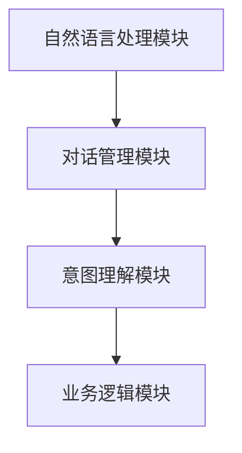
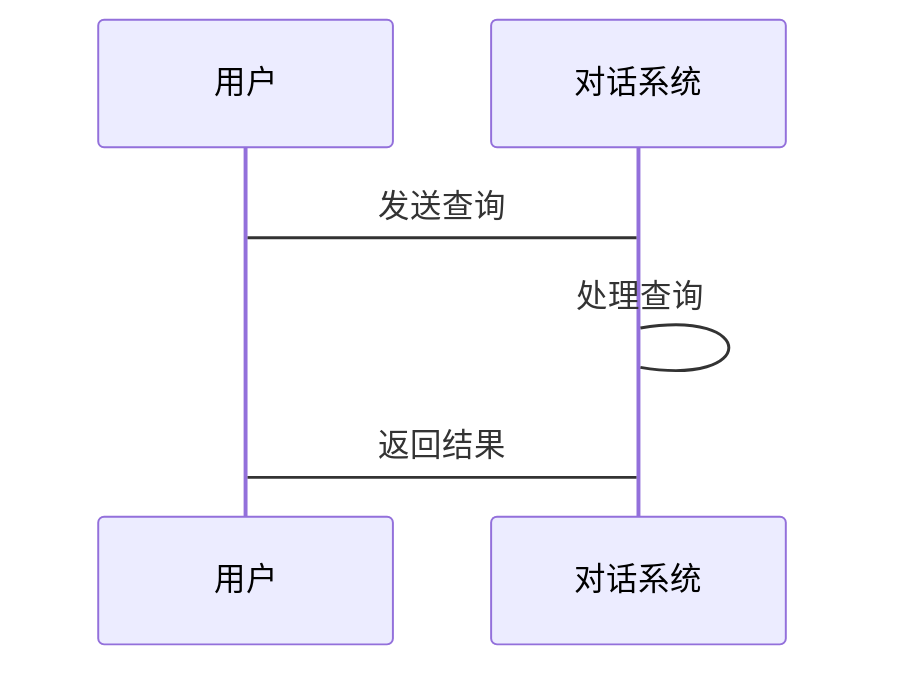

                 


# 构建企业级对话系统：多轮对话管理与意图理解

> 关键词：企业级对话系统，多轮对话管理，意图理解，深度学习，自然语言处理，系统架构设计

> 摘要：本文详细探讨了构建企业级对话系统的多轮对话管理与意图理解的关键技术。首先，我们介绍了对话系统的背景与挑战，包括多轮对话管理和意图理解的核心概念。接着，我们深入分析了多轮对话管理与意图理解的算法原理，包括基于规则和深度学习的方法。然后，我们从系统架构设计的角度，详细阐述了企业级对话系统的整体架构与模块设计。最后，我们通过一个实际项目案例，展示了如何将这些技术应用于实际场景中，并总结了最佳实践与未来发展趋势。

---

# 第一部分: 背景与核心概念

## 第1章: 企业级对话系统的背景与挑战

### 1.1 对话系统的概念与分类

#### 1.1.1 对话系统的定义
对话系统是一种能够与用户进行自然语言交互的计算机系统，它通过理解和生成人类语言来实现人机对话。对话系统可以分为单轮对话和多轮对话系统，其中多轮对话系统能够维护对话上下文，支持连续的交互。

#### 1.1.2 单轮对话与多轮对话的对比
| 特性             | 单轮对话                     | 多轮对话                     |
|------------------|------------------------------|------------------------------|
| 对话上下文       | 无                          | 有                          |
| 对话历史         | 不需要                      | 需要                      |
| 对话状态          | 无                          | 需要维护                  |
| 适用场景         | 简单查询，如天气预报         | 复杂任务，如在线客服          |

#### 1.1.3 企业级对话系统的特征
- **高可用性**：需要7×24小时稳定运行。
- **高准确性**：在复杂场景下仍能准确理解用户意图。
- **可扩展性**：支持大规模用户和多种业务场景。
- **定制化能力**：能够根据企业需求进行定制化配置。

### 1.2 多轮对话管理的背景与挑战

#### 1.2.1 多轮对话管理的定义
多轮对话管理是指在连续的对话过程中，系统能够根据当前对话状态和用户输入，动态调整对话策略，以实现对话目标。

#### 1.2.2 企业级对话系统的核心问题
- **对话上下文管理**：如何有效存储和更新对话历史信息。
- **对话状态跟踪**：如何准确捕捉和表示对话状态。
- **对话策略制定**：如何根据对话状态和业务目标生成合适的回复。

#### 1.2.3 当前技术的局限性与未来趋势
- **局限性**：现有技术在复杂场景下的准确性和流畅性仍有不足。
- **未来趋势**：结合强化学习和生成式模型，提升对话的自然性和智能性。

### 1.3 意图理解的重要性

#### 1.3.1 意图理解的定义与作用
意图理解是指系统通过分析用户输入，识别用户的潜在需求和目标。它是实现自然语言交互的核心技术之一。

#### 1.3.2 意图理解的挑战与解决方案
- **挑战**：用户表达的多样性和歧义性。
- **解决方案**：结合规则和深度学习模型，提高意图识别的准确率。

#### 1.3.3 企业级应用中的意图理解场景
- **客服系统**：帮助用户解决问题。
- **智能助手**：提供个性化服务。
- **电子商务**：推荐产品和服务。

## 1.4 本章小结
本章介绍了企业级对话系统的背景，分析了多轮对话管理和意图理解的核心概念，探讨了相关技术的挑战与未来发展趋势。

---

## 第2章: 多轮对话管理与意图理解的核心概念

### 2.1 多轮对话管理的原理

#### 2.1.1 对话上下文的构建与维护
对话上下文是多轮对话管理的基础，它包含了对话历史、用户信息和业务数据。上下文可以通过数据库或缓存技术进行存储和管理。

#### 2.1.2 对话状态的表示与更新
对话状态通常通过状态表示向量来表示，向量的每个元素代表一个状态特征。对话过程中，系统根据用户输入更新状态向量。

#### 2.1.3 对话策略的制定与执行
对话策略包括规则驱动和数据驱动两种类型。规则驱动策略基于预定义的规则，数据驱动策略基于机器学习模型。

### 2.2 意图理解的原理

#### 2.2.1 意图识别的基本流程
1. **文本预处理**：分词、去停用词。
2. **特征提取**：提取文本特征。
3. **模型训练**：训练意图分类模型。
4. **意图预测**：根据模型预测意图。

#### 2.2.2 基于规则的意图理解与基于模型的意图理解对比
| 特性           | 基于规则        | 基于模型        |
|----------------|-----------------|-----------------|
| 实现复杂度     | 低              | 高              |
| 灵活性         | 低              | 高              |
| 精准度         | 中              | 高              |

#### 2.2.3 意图理解的评估指标
- **准确率**：正确识别的意图占总意图的比例。
- **召回率**：实际属于某一意图的样本中被正确识别的比例。
- **F1值**：准确率和召回率的调和平均数。

### 2.3 多轮对话与意图理解的关联

#### 2.3.1 对话历史对意图理解的影响
对话历史提供了上下文信息，有助于更准确地理解用户的当前意图。

#### 2.3.2 意图链与对话上下文的关系
意图链描述了对话中意图的演变过程，对话上下文记录了意图链的具体内容。

#### 2.3.3 多轮对话中的意图修正与反馈机制
系统根据用户反馈调整对话策略，确保对话朝着正确的方向发展。

### 2.4 本章小结
本章详细讲解了多轮对话管理和意图理解的核心概念，分析了它们的相互关系和实际应用。

---

## 第3章: 多轮对话管理与意图理解的算法原理

### 3.1 对话状态跟踪的算法

#### 3.1.1 基于统计的对话状态跟踪
基于统计的方法通过分析对话历史，利用概率模型预测对话状态。

#### 3.1.2 基于深度学习的对话状态跟踪
深度学习模型（如LSTM和Transformer）能够捕捉对话的全局信息，提升状态跟踪的准确率。

#### 3.1.3 基于强化学习的对话状态跟踪
强化学习通过奖励机制优化对话策略，提升对话的流畅性和智能性。

### 3.2 意图理解的算法

#### 3.2.1 基于传统机器学习的意图分类
常用的算法包括SVM、决策树和随机森林。这些方法适用于数据量较小的场景。

#### 3.2.2 基于深度学习的意图分类
深度学习模型（如CNN和RNN）能够处理复杂的文本特征，提升分类准确率。

#### 3.2.3 基于预训练模型的意图分类
预训练模型（如BERT和GPT）通过大规模微调，能够实现高性能的意图分类。

### 3.3 对话策略的算法

#### 3.3.1 基于规则的对话策略
规则驱动的策略适用于简单场景，通过预定义的规则生成回复。

#### 3.3.2 基于检索的对话策略
检索模型通过匹配对话历史，生成合适的回复。

#### 3.3.3 基于生成的对话策略
生成模型（如GPT）能够生成多样化的回复，适用于复杂场景。

### 3.4 本章小结
本章详细分析了多轮对话管理和意图理解的算法原理，探讨了不同方法的优缺点。

---

## 第4章: 系统架构与设计

### 4.1 企业级对话系统的整体架构

#### 4.1.1 系统功能模块划分
- **自然语言处理模块**：负责文本理解和生成。
- **对话管理模块**：负责对话上下文和状态跟踪。
- **意图理解模块**：负责意图识别和分类。
- **业务逻辑模块**：负责业务逻辑处理和数据交互。

#### 4.1.2 系统组件之间的关系


#### 4.1.3 系统的可扩展性与可维护性
通过模块化设计和接口标准化，提升系统的可扩展性和可维护性。

### 4.2 多轮对话管理模块的设计

#### 4.2.1 对话上下文的存储与管理
使用数据库或缓存技术存储对话上下文，确保数据的安全性和一致性。

#### 4.2.2 对话状态的跟踪与更新
通过状态表示向量和更新规则，动态维护对话状态。

#### 4.2.3 对话策略的实现与优化
结合规则和机器学习模型，优化对话策略的准确性和流畅性。

### 4.3 意图理解模块的设计

#### 4.3.1 意图识别模型的选型与实现
选择合适的模型（如BERT）进行意图分类，确保分类的准确率和召回率。

#### 4.3.2 意图理解的动态调整与优化
根据对话历史和用户反馈，动态调整意图理解模型。

#### 4.3.3 意图理解结果的反馈与修正
通过用户反馈，不断优化意图理解模型，提升准确率。

### 4.4 系统接口设计与交互流程

#### 4.4.1 系统接口的设计规范
- **输入接口**：接收用户输入和对话历史。
- **输出接口**：返回对话结果和状态信息。

#### 4.4.2 对话流程的交互设计


### 4.5 本章小结
本章详细讨论了企业级对话系统的整体架构和各模块的设计，强调了系统接口和交互流程的重要性。

---

## 第5章: 项目实战

### 5.1 环境安装与配置

#### 5.1.1 安装Python环境
安装Python 3.8以上版本，并配置虚拟环境。

#### 5.1.2 安装依赖库
安装必要的库，如TensorFlow、Keras和NLTK。

### 5.2 核心代码实现

#### 5.2.1 对话上下文管理
```python
class DialogContext:
    def __init__(self):
        self.history = []
        self.state = {}
```

#### 5.2.2 意图理解模型
```python
import tensorflow as tf
from tensorflow.keras import layers

model = tf.keras.Sequential([
    layers.Embedding(input_dim=10000, output_dim=16),
    layers.LSTM(64),
    layers.Dense(1, activation='sigmoid')
])
```

### 5.3 实际案例分析与实现解读

#### 5.3.1 案例场景
- 用户与系统进行多轮对话，系统根据对话历史理解用户的意图。

#### 5.3.2 代码实现
```python
def process_dialogue(user_input, context):
    # 更新对话上下文
    context.history.append(user_input)
    # 预处理用户输入
    # 分析意图
    # 返回回复
```

### 5.4 项目小结
本章通过一个实际项目案例，展示了如何将多轮对话管理和意图理解技术应用于实际场景中。

---

## 第6章: 最佳实践与未来趋势

### 6.1 最佳实践

#### 6.1.1 模型优化
- 使用预训练模型提升准确率。
- 通过数据增强技术增加训练数据。

#### 6.1.2 系统调优
- 优化对话策略，提升用户体验。
- 通过日志分析，发现和解决系统问题。

### 6.2 未来趋势

#### 6.2.1 技术融合
- 结合强化学习和生成式模型，提升对话的自然性和智能性。

#### 6.2.2 应用场景扩展
- 在教育、医疗和金融等领域进一步扩展应用。

### 6.3 本章小结
本章总结了构建企业级对话系统的最佳实践，并展望了未来的发展趋势。

---

## 作者：AI天才研究院/AI Genius Institute & 禅与计算机程序设计艺术 /Zen And The Art of Computer Programming

---

以上是《构建企业级对话系统：多轮对话管理与意图理解》的技术博客文章的完整内容，涵盖了从背景到实现的各个方面，旨在为企业级对话系统的开发提供系统的指导和参考。

