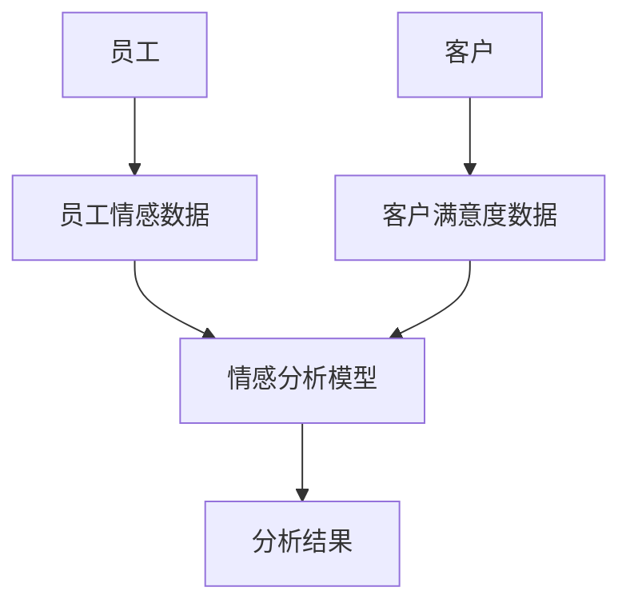
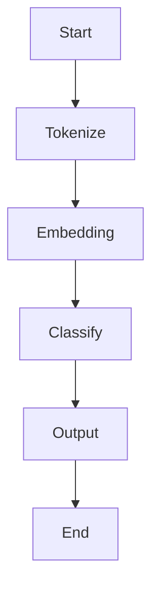
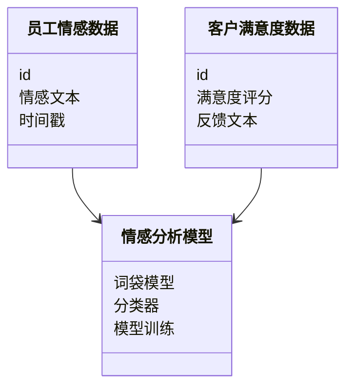
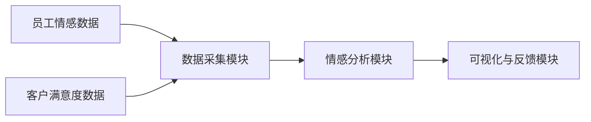
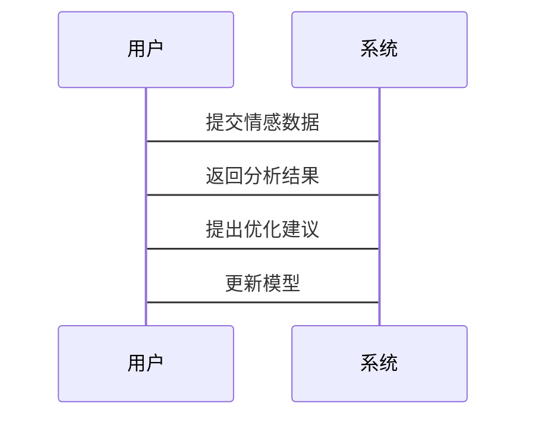

                 


# 构建企业级情感计算平台：员工幸福感与客户满意度分析

> 关键词：情感计算、员工幸福感、客户满意度、机器学习、深度学习、NLP

> 摘要：本文系统地探讨了构建企业级情感计算平台的关键技术与方法，重点分析了员工幸福感与客户满意度的计算模型与应用场景。通过理论与实践相结合的方式，详细介绍了情感计算的核心概念、算法原理、系统架构设计及项目实现过程，为企业管理者和技术开发者提供了深入的技术指导与实践参考。

---

## 第一部分：情感计算与企业级应用背景

### 第1章：问题背景与描述

#### 1.1 情感计算的定义与重要性
- 情感计算的基本概念与研究领域
- 情感计算在企业管理中的应用价值
- 员工幸福感与客户满意度对企业绩效的影响

#### 1.2 问题描述与目标
- 企业情感管理的现状与挑战
- 情感计算的目标与核心任务
- 数据采集、分析与反馈的闭环需求

#### 1.3 解决方案与技术路线
- 情感计算的技术路线与实现方法
- 数据采集与预处理的关键步骤
- 模型构建与优化策略

---

### 第2章：核心概念与联系

#### 2.1 情感计算的原理与方法
- 基于文本的情感分析原理
- 情感计算的关键技术与实现方法
- 员工幸福感与客户满意度的特征分析

#### 2.2 核心概念的特征对比
- 情感计算与传统数据分析的对比
- 员工幸福感与客户满意度的特征差异
- 数据特征与情感强度的关联分析

#### 2.3 实体关系图（ER图）


---

## 第二部分：算法原理与实现

### 第3章：情感分析算法概述

#### 3.1 常用情感分析算法介绍
- 基于规则的情感分析
- 传统机器学习模型（如SVM、NB）
- 深度学习模型（如LSTM、BERT）

#### 3.2 情感计算的实现流程


#### 3.3 情感分类的数学模型
- 基于朴素贝叶斯的分类模型
- 基于词袋模型的向量表示
- 深度学习模型的损失函数与优化方法

---

### 第4章：情感计算的数学模型与公式

#### 4.1 朴素贝叶斯分类器
$$ P(y|x) = \frac{P(x|y)P(y)}{P(x)} $$

#### 4.2 词袋模型表示
$$ x = \{w_1, w_2, ..., w_n\} $$

#### 4.3 深度学习模型的优化
$$ \text{损失函数} = \text{交叉熵损失} + \text{正则化项} $$

---

## 第三部分：系统分析与架构设计

### 第5章：系统分析与功能设计

#### 5.1 问题场景介绍
- 员工与客户情感数据的采集场景
- 情感分析系统的功能需求
- 数据分析与反馈的业务流程

#### 5.2 系统功能设计
- 数据采集模块：文本数据的获取与预处理
- 情感分析模块：模型训练与结果输出
- 可视化与反馈模块：结果展示与优化建议

#### 5.3 领域模型设计


---

### 第6章：系统架构与交互设计

#### 6.1 系统架构设计


#### 6.2 系统接口设计
- 数据接口：RESTful API设计
- 模型接口：训练与推理接口规范

#### 6.3 系统交互设计


---

## 第四部分：项目实战与应用案例

### 第7章：项目实战

#### 7.1 环境安装与配置
- Python版本与库依赖管理
- 数据处理工具与机器学习框架安装

#### 7.2 核心代码实现
```python
from sklearn.feature_extraction.text import TfidfVectorizer
from sklearn.svm import SVC

# 数据预处理
vectorizer = TfidfVectorizer()
X = vectorizer.fit_transform(texts)
y = labels

# 模型训练
model = SVC()
model.fit(X, y)

# 模型预测
test_X = vectorizer.transform(["今天的工作很愉快！"])
print(model.predict(test_X))
```

#### 7.3 案例分析与结果解读
- 员工幸福感分析的案例
- 客户满意度提升的具体应用

---

### 第8章：项目优化与结果分析

#### 8.1 模型优化策略
- 调参与网格搜索
- 数据增强与迁移学习

#### 8.2 案例分析与结果解读
- 情感计算在实际业务中的应用效果
- 数据分析结果对管理决策的支持

---

## 第五部分：总结与展望

### 第9章：最佳实践与小结

#### 9.1 总结
- 情感计算的核心价值与实现路径
- 项目中的关键点与实践经验

#### 9.2 小结
- 情感计算的未来发展方向
- 技术在企业管理中的潜力与挑战

---

## 作者信息

作者：AI天才研究院/AI Genius Institute & 禅与计算机程序设计艺术 /Zen And The Art of Computer Programming

