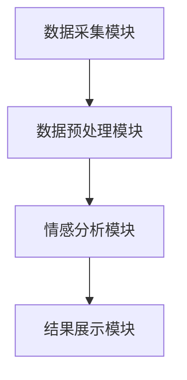
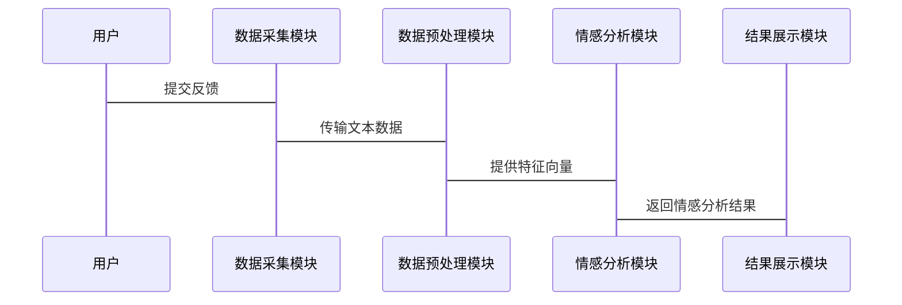

                 


# 构建企业级情感计算平台：员工满意度与客户情绪的综合分析

> 关键词：情感计算，员工满意度，客户情绪，自然语言处理，深度学习，系统架构

> 摘要：本文详细探讨了构建企业级情感计算平台的背景、核心技术、算法实现、系统架构及项目实战。通过分析员工满意度与客户情绪的综合数据，结合自然语言处理和深度学习技术，本文为读者提供了从理论到实践的完整指导，帮助企业在数字化转型中更好地理解和优化员工与客户的情绪管理。

---

## 第一部分: 情感计算平台背景与概述

### 第1章: 情感计算平台的基本概念

#### 1.1 情感计算的定义与背景
##### 1.1.1 什么是情感计算
情感计算（Affective Computing）是通过计算机技术来识别、分析、理解和模拟人类情感的过程。它结合了自然语言处理、机器学习和数据挖掘等技术，旨在从文本、语音或图像中提取情感信息。

##### 1.1.2 情感计算的应用场景
情感计算广泛应用于多个领域，包括社交媒体情感分析、客户情绪监控、员工满意度管理、智能客服等。其中，员工满意度和客户情绪分析是企业级情感计算的核心应用场景。

##### 1.1.3 情感计算的核心价值
通过情感计算，企业可以实时了解员工和客户的情绪状态，及时发现潜在问题并采取措施，从而提升员工满意度和客户忠诚度。

#### 1.2 员工满意度与客户情绪分析的重要性
##### 1.2.1 员工满意度对企业的影响
员工满意度直接关系到员工的工作效率和创造力。通过分析员工情绪，企业可以优化管理策略，降低员工流失率，提升团队整体绩效。

##### 1.2.2 客户情绪对企业决策的作用
客户情绪是企业产品和服务质量的重要反馈。通过分析客户情绪，企业可以快速识别市场趋势，优化产品设计，提升客户体验。

##### 1.2.3 综合分析的必要性
员工和客户的情绪数据往往存在关联性。例如，员工的不满可能影响服务质量，进而影响客户情绪。综合分析这两种情绪数据，可以帮助企业从整体上优化管理策略。

#### 1.3 企业级情感计算平台的目标与边界
##### 1.3.1 平台的目标
构建一个能够同时分析员工满意度和客户情绪的企业级平台，提供实时监控、预警和优化建议。

##### 1.3.2 平台的边界与外延
平台专注于情感数据的采集、处理和分析，不涉及具体业务流程的优化，但可以与其他企业管理系统（如CRM、HRM）进行数据集成。

##### 1.3.3 核心要素与组成结构
企业级情感计算平台的核心要素包括数据采集模块、特征提取模块、情感分析模块和结果展示模块。

---

### 第2章: 情感计算的技术基础

#### 2.1 自然语言处理（NLP）简介
##### 2.1.1 NLP的基本概念
自然语言处理是计算机科学与人工智能的交叉领域，旨在让计算机理解和处理人类语言。

##### 2.1.2 NLP的核心技术
- 分词（Tokenization）
- 词性标注（Part-of-Speech Tagging）
- 命名实体识别（Named Entity Recognition）
- 情感分析（Sentiment Analysis）

##### 2.1.3 NLP在情感计算中的应用
通过NLP技术，可以从文本中提取情感特征，为情感分析提供基础。

#### 2.2 情感分析算法概述
##### 2.2.1 基于规则的情感分析
通过预定义的情感词典和规则，对文本进行情感分类。例如，将包含“满意”、“高兴”等词汇的文本标记为正面情感。

##### 2.2.2 基于统计模型的情感分析
使用机器学习算法（如SVM、随机森林）对文本进行分类，特征通常包括词袋模型（Bag of Words）或TF-IDF向量。

##### 2.2.3 深度学习在情感分析中的应用
基于深度学习的模型（如CNN、RNN、BERT）可以自动提取文本特征，具有更高的准确性和鲁棒性。

#### 2.3 数据挖掘与机器学习基础
##### 2.3.1 数据挖掘的基本概念
数据挖掘是从大量数据中提取有用信息的过程，常用于发现数据中的模式和关联。

##### 2.3.2 机器学习在情感计算中的作用
机器学习算法（如SVM、XGBoost）可以对情感数据进行分类和预测。

##### 2.3.3 常见的情感分析算法对比
| 算法类型       | 优点                     | 缺点                     |
|----------------|--------------------------|--------------------------|
| 基于规则       | 实现简单                 | 需要大量人工规则         |
| 基于统计模型    | 高准确性                 | 特征工程复杂             |
| 基于深度学习    | 自动提取特征             | 计算资源需求高           |

---

### 第3章: 情感计算平台的应用价值

#### 3.1 提高员工满意度
##### 3.1.1 员工满意度分析的实现
通过分析员工反馈文本，识别员工情绪中的负面关键词，例如“压力大”、“不满”。

##### 3.1.2 员工情绪预警机制
实时监控员工情绪，当负面情绪达到阈值时，触发预警，及时采取管理措施。

##### 3.1.3 员工满意度与企业绩效的关系
研究表明，高员工满意度通常与企业绩效密切相关。通过情感计算，企业可以量化员工情绪对绩效的影响。

#### 3.2 客户情绪分析的商业价值
##### 3.2.1 客户情绪分析的实现
通过分析客户评价、投诉文本，识别客户情绪中的正面和负面情感。

##### 3.2.2 客户情绪预警机制
实时监控客户情绪，当负面情绪激增时，触发客服介入，避免客户流失。

##### 3.2.3 客户情绪与企业决策的关系
客户情绪数据可以作为企业产品优化、市场策略调整的重要依据。

#### 3.3 综合分析的创新价值
##### 3.3.1 综合分析的实现方式
将员工和客户的情绪数据进行关联分析，识别潜在的管理问题。

##### 3.3.2 综合分析对企业管理的优化作用
例如，发现某部门员工的负面情绪与客户投诉激增之间的关联，从而采取针对性的管理措施。

##### 3.3.3 综合分析的未来发展趋势
随着AI技术的进步，情感计算将更加智能化，分析维度也将更加多样化。

---

## 第二部分: 情感计算的核心技术与算法

### 第4章: 情感计算的核心算法原理

#### 4.1 情感分析的特征提取
##### 4.1.1 文本特征提取方法
- 词袋模型（Bag of Words）
- TF-IDF（Term Frequency-Inverse Document Frequency）
- 词嵌入（Word Embedding，如Word2Vec、GloVe）

##### 4.1.2 基于词袋模型的特征提取
将文本转化为词袋向量，例如，“我今天很高兴”可以表示为一个包含“我”、“今天”、“很高兴”的向量。

##### 4.1.3 基于词嵌入的特征提取
通过预训练的词嵌入模型（如Word2Vec）提取词语的语义表示。

#### 4.2 情感分类算法
##### 4.2.1 常见的情感分类算法对比
| 算法类型       | 优点                     | 缺点                     |
|----------------|--------------------------|--------------------------|
| SVM            | 分类性能好               | 对高维数据敏感           |
| 随机森林       | 抗过拟合能力强            | 需要较多参数调优         |
| CNN            | 可以自动提取特征           | 需要大量标注数据         |

##### 4.2.2 支持向量机（SVM）在情感分类中的应用
使用SVM对情感数据进行分类，例如：

$$
\text{输入: } x = [x_1, x_2, ..., x_n] \\
\text{输出: } y = \text{positive或negative}
$$

##### 4.2.3 随机森林在情感分类中的应用
随机森林通过集成多个决策树模型，提高分类准确率。

##### 4.2.4 基于深度学习的情感分类模型
使用深度学习模型（如BERT）进行情感分类，模型可以自动提取文本的语义特征。

#### 4.3 情感强度分析
##### 4.3.1 情感强度分析的定义
情感强度分析是对情感的强度进行量化，例如，将情感分为“轻微正面”、“中等正面”、“强烈正面”等。

##### 4.3.2 情感强度分析的实现方法
基于情感词典和情感强度词典（如SentiWordNet）进行情感强度计算。

##### 4.3.3 情感强度分析的应用场景
例如，分析客户投诉的强度，帮助企业优先处理高强度负面情绪的客户。

---

## 第三部分: 项目实战与优化

### 第5章: 情感计算平台的系统架构与实现

#### 5.1 系统架构设计
##### 5.1.1 系统模块划分
- 数据采集模块：负责采集员工和客户的文本数据。
- 数据预处理模块：对文本进行清洗、分词和特征提取。
- 情感分析模块：使用机器学习或深度学习模型对文本进行情感分类。
- 结果展示模块：将分析结果可视化，提供预警和优化建议。

##### 5.1.2 系统架构图


#### 5.2 系统接口设计
##### 5.2.1 数据接口
- 数据采集模块需要与企业内部系统（如HRM、CRM）进行数据对接。
- 数据接口可以采用RESTful API或WebSocket协议。

##### 5.2.2 模型接口
- 情感分析模块可以对外提供API接口，供其他系统调用情感分析结果。

#### 5.3 系统交互流程
##### 5.3.1 交互流程图


---

### 第6章: 项目实战与优化

#### 6.1 项目实战
##### 6.1.1 环境安装
- 安装Python、TensorFlow、Keras、NLTK等依赖库。
- 安装可视化工具如Matplotlib、Seaborn。

##### 6.1.2 核心代码实现
```python
import nltk
from sklearn.feature_extraction.text import TfidfVectorizer
from sklearn.svm import SVC

# 数据预处理
corpus = ["我今天很高兴", "这个产品很糟糕"]
vectorizer = TfidfVectorizer()
X = vectorizer.fit_transform(corpus)
y = [1, 0]  # 1表示正面，0表示负面

# 训练模型
model = SVC()
model.fit(X, y)

# 预测
test_corpus = ["这是一个好产品"]
test_X = vectorizer.transform(test_corpus)
print(model.predict(test_X))  # 输出：[[1]]
```

##### 6.1.3 案例分析
分析某企业员工满意度数据，发现某部门员工情绪负面，进一步挖掘原因并提出优化建议。

#### 6.2 模型优化与调参
##### 6.2.1 调整模型参数
例如，调整SVM的C参数或随机森林的n_estimators参数，以提高分类准确率。

##### 6.2.2 使用更复杂的模型
尝试使用深度学习模型（如BERT）进行情感分类，进一步提高准确率。

#### 6.3 结果可视化
##### 6.3.1 情感分布图
使用Matplotlib绘制员工和客户情绪的分布图。

##### 6.3.2 预警图
绘制情绪预警图，实时监控负面情绪的变化。

---

## 第七部分: 总结与展望

### 第7章: 总结与展望

#### 7.1 本章总结
本文详细探讨了构建企业级情感计算平台的背景、核心技术、算法实现和系统架构。通过分析员工满意度与客户情绪的综合数据，结合自然语言处理和深度学习技术，为企业提供了从理论到实践的完整指导。

#### 7.2 未来展望
随着AI技术的不断发展，情感计算将更加智能化和多样化。未来，情感计算可以结合更多的数据源（如语音、图像）进行综合分析，为企业提供更全面的情绪管理解决方案。

---

## 作者信息

作者：AI天才研究院/AI Genius Institute & 禅与计算机程序设计艺术 /Zen And The Art of Computer Programming

---

本文内容涵盖情感计算的核心概念、算法实现和系统设计，结合实际案例进行详细分析，为读者提供了从理论到实践的完整指导。希望本文能为企业的数字化转型和情绪管理提供有价值的参考。

