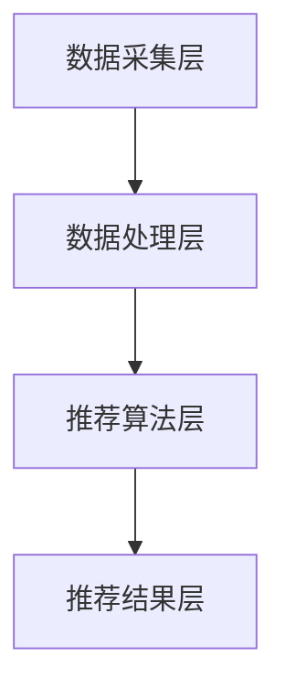
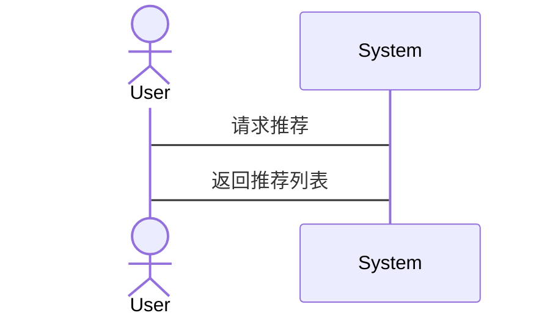

                 


```markdown
# 构建企业级推荐引擎：跨平台用户行为分析与个性化推荐

## 关键词
企业级推荐引擎，跨平台用户行为分析，个性化推荐，机器学习，推荐系统

## 摘要
本文详细探讨了构建企业级推荐引擎的核心方法，涵盖跨平台用户行为分析与个性化推荐的实现。文章首先介绍推荐引擎的基本概念与应用场景，然后深入分析推荐系统的算法原理、系统架构设计，最后通过实际案例展示推荐引擎的实现过程，并总结最佳实践。

---

## 第一部分: 背景与核心概念

## 第1章: 推荐引擎概述

### 1.1 推荐引擎的基本概念
#### 1.1.1 推荐引擎的定义
推荐引擎是一种基于用户行为和偏好，自动向用户推荐相关内容或产品的技术。它是人工智能和机器学习的典型应用，广泛应用于电商、影视、音乐、新闻等领域。

#### 1.1.2 推荐引擎的核心目标
推荐引擎的目标是通过分析用户行为、偏好和内容特征，为用户提供个性化的内容或产品推荐，从而提高用户满意度、增加用户粘性和提升业务转化率。

#### 1.1.3 推荐引擎的分类与特点
推荐引擎主要分为两类：
- **协同过滤推荐**：基于用户行为数据，通过用户相似性或物品相似性进行推荐。
- **基于内容的推荐**：基于物品的特征（如文本、图像）进行推荐。
- **混合推荐模型**：结合协同过滤和内容推荐的混合模型。

推荐引擎的特点包括实时性、个性化、可扩展性和数据驱动性。

### 1.2 企业级推荐引擎的背景与需求
#### 1.2.1 企业级推荐引擎的背景
在企业级应用中，推荐引擎是提升用户体验和业务效率的重要工具。随着数据量的快速增长，企业需要一种高效、可靠的推荐系统来处理跨平台的用户行为数据。

#### 1.2.2 企业级推荐引擎的核心需求
- **实时性**：推荐结果需要快速生成，满足用户的实时需求。
- **准确性**：推荐结果需要精准，减少错误推荐。
- **可扩展性**：支持大规模数据和用户量。
- **个性化**：根据用户行为和偏好进行个性化推荐。

#### 1.2.3 企业级推荐引擎的边界与外延
推荐引擎的边界包括用户行为数据的采集、处理和推荐结果的生成。外延则包括数据存储、推荐策略优化和效果评估。

### 1.3 跨平台用户行为分析的重要性
#### 1.3.1 跨平台用户行为分析的定义
跨平台用户行为分析是指在多个平台上（如PC、手机、平板等）收集和分析用户的交互数据，以理解用户的行为模式和偏好。

#### 1.3.2 跨平台用户行为分析的核心要素
- **用户标识**：唯一标识用户，如用户ID。
- **行为数据**：用户的点击、浏览、购买等行为数据。
- **时间戳**：行为发生的时间。
- **设备信息**：用户的设备类型、操作系统等。

#### 1.3.3 跨平台用户行为分析与推荐引擎的关系
跨平台用户行为分析是推荐引擎的核心输入，推荐引擎通过分析这些行为数据，生成个性化推荐结果。

## 第2章: 推荐系统的核心概念与联系

### 2.1 推荐系统的核心原理
#### 2.1.1 协同过滤推荐
协同过滤推荐是基于用户之间的相似性，通过相似用户的评分数据进行推荐。

#### 2.1.2 基于内容的推荐
基于内容的推荐是通过分析物品的特征（如文本、图像）进行推荐。

#### 2.1.3 混合推荐模型
混合推荐模型结合了协同过滤和内容推荐的优势，能够提高推荐的准确性和多样性。

### 2.2 推荐系统的核心要素对比
| 核心要素 | 协同过滤 | 基于内容的推荐 | 混合推荐 |
|----------|----------|----------------|----------|
| 数据来源 | 用户行为数据 | 物品特征数据 | 用户行为和物品特征数据 |
| 计算方式 | 用户相似性或物品相似性 | 物品特征相似性 | 综合相似性 |
| 优点 | 高准确性 | 高可解释性 | 高准确性和可解释性 |
| 缺点 | 对冷启动问题敏感 | 需要大量特征数据 | 实现复杂 |

### 2.3 推荐系统的ER实体关系图
```mermaid
er
  actor User {
    id
    name
  }
  actor Item {
    id
    name
  }
  relation User_Item {
    user_id
    item_id
    rating
    timestamp
  }
```

---

## 第三部分: 算法原理与数学模型

## 第3章: 协同过滤算法原理

### 3.1 协同过滤的核心思想
协同过滤的核心思想是通过用户之间的相似性，找到与目标用户相似的用户，然后基于这些相似用户的评分数据进行推荐。

### 3.2 协同过滤的数学模型
#### 3.2.1 用户相似度计算公式
$$\text{相似度} = \frac{\sum (r_{u,i} - \bar{r}_u)(r_{u,j} - \bar{r}_j)}{\sqrt{\sum (r_{u,i} - \bar{r}_u)^2} \cdot \sqrt{\sum (r_{u,j} - \bar{r}_j)^2}}$$

其中：
- $r_{u,i}$ 表示用户 $u$ 对物品 $i$ 的评分
- $\bar{r}_u$ 表示用户 $u$ 的平均评分

#### 3.2.2 物品相似度计算公式
$$\text{相似度} = \frac{\sum (r_{u,i} - \bar{r}_i)(r_{u,j} - \bar{r}_j)}{\sqrt{\sum (r_{u,i} - \bar{r}_i)^2} \cdot \sqrt{\sum (r_{u,j} - \bar{r}_j)^2}}$$

---

## 第四部分: 系统分析与架构设计

## 第4章: 企业级推荐引擎系统架构

### 4.1 系统架构设计
推荐引擎的系统架构包括数据采集层、数据处理层、推荐算法层和推荐结果层。



### 4.2 数据处理与特征提取
#### 4.2.1 数据预处理
- 数据清洗：去除噪声数据
- 数据标准化：统一数据格式
- 数据增强：补充缺失数据

#### 4.2.2 特征提取
- 用户特征：年龄、性别、兴趣爱好
- 物品特征：类别、标签、属性
- 行为特征：点击、浏览、购买

### 4.3 系统接口设计
#### 4.3.1 接口描述
- 输入：用户ID、时间戳
- 输出：推荐列表

#### 4.3.2 接口实现
```python
def get_recommendations(user_id, timestamp):
    # 获取用户行为数据
    user_behavior = get_user_behavior(user_id, timestamp)
    # 计算用户相似度
    user_similarity = compute_similarity(user_behavior)
    # 生成推荐列表
    recommendations = generate_recommendations(user_similarity)
    return recommendations
```

### 4.4 系统交互流程


---

## 第五部分: 项目实战

## 第5章: 推荐引擎的实现与案例分析

### 5.1 环境搭建
- Python 3.8+
- 数据库：MySQL或MongoDB
- 开发工具：PyCharm或VSCode

### 5.2 核心实现代码
```python
from sklearn.metrics.pairwise import cosine_similarity

def collaborative_filtering(user_item_matrix):
    # 计算用户相似度
    user_similarity = cosine_similarity(user_item_matrix)
    # 找出相似度最高的用户
    top_k_users = user_similarity.argsort()[:, -k:]
    # 返回推荐列表
    recommendations = []
    for user in top_k_users:
        recommendations.extend(user_item_matrix[user])
    return recommendations
```

### 5.3 实际案例分析
以电商推荐系统为例，分析用户的购买行为，利用协同过滤算法生成推荐列表。

---

## 第六部分: 最佳实践与总结

## 第6章: 最佳实践与总结

### 6.1 最佳实践
- 数据预处理是关键
- 选择合适的推荐算法
- 定期更新模型

### 6.2 总结
本文详细介绍了构建企业级推荐引擎的核心方法，包括跨平台用户行为分析、推荐算法原理和系统架构设计。通过实际案例展示了推荐引擎的实现过程，并总结了最佳实践。

---

## 作者：AI天才研究院 & 禅与计算机程序设计艺术
```

