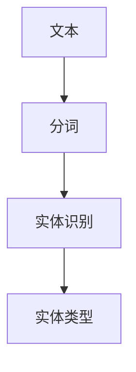
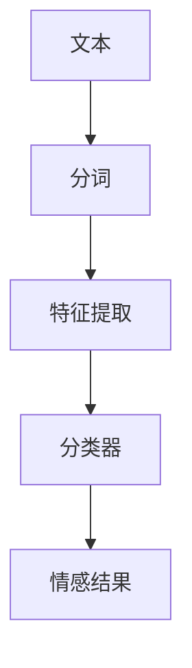
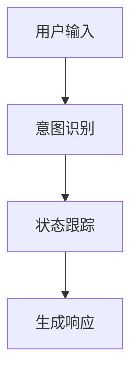
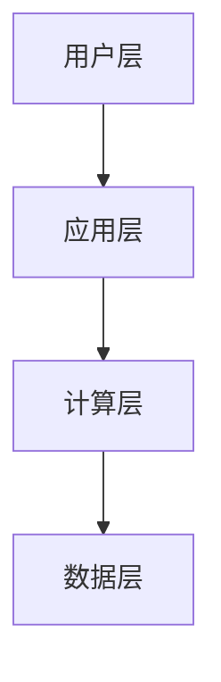

                 


# 《构建企业级自然语言处理平台：从文本分析到对话系统》

## 关键词：自然语言处理（NLP）、企业级平台、文本分析、对话系统、算法原理、系统架构、项目实战

## 摘要：本文详细探讨构建企业级自然语言处理平台的全过程，从文本分析到对话系统的实现。通过分析NLP的核心技术、系统架构设计和项目实战，帮助读者掌握构建高效NLP平台的方法。

---

## 第1章: 自然语言处理概述

### 1.1 自然语言处理的定义与应用

自然语言处理（NLP）是计算机科学、人工智能领域的重要分支，旨在让计算机能够理解、处理和生成人类语言。随着深度学习的发展，NLP技术在企业中的应用日益广泛，如智能客服、舆情分析、机器翻译等。

#### 核心概念与联系

- **分词**：将连续的文本分割成单词或短语，是NLP的基础步骤。
- **实体识别**：从文本中识别出人名、地名、组织名等实体，用于信息抽取。
- **情感分析**：判断文本中的情感倾向，帮助企业了解用户反馈。

#### 实体识别与分词的ER实体关系图



### 1.2 企业级自然语言处理平台的背景

企业级NLP平台需要处理海量数据，具备高可用性和扩展性。其核心功能包括文本预处理、模型训练与部署，以及对话系统的设计。

---

## 第2章: 企业级自然语言处理平台的需求与挑战

### 2.1 企业级应用的特殊需求

企业需要NLP平台具备高可用性、实时性和可扩展性。例如，电商企业需要实时处理大量客户咨询，要求系统快速响应。

### 2.2 自然语言处理的挑战

- **数据隐私**：企业数据敏感，需确保处理过程中的数据安全。
- **模型训练**：需要大量标注数据，训练成本高。
- **多语言支持**：企业可能涉及多种语言，需处理跨语言问题。

---

## 第3章: 文本分析的关键技术

### 3.1 分词技术

分词是文本处理的第一步，常用算法包括基于规则和统计模型的方法。例如，中文分词常用jieba库。

#### 分词算法的对比

| 技术 | 优点 | 缺点 |
|------|------|------|
| 基于规则 | 易处理已知语言 | 难应对未知语言变化 |
| 统计模型 | 数据驱动，效果好 | 需大量标注数据 |

### 3.2 实体识别与抽取

实体识别通过模式匹配和机器学习实现，常用工具如spaCy和Stanford NLP。

#### 实体识别的流程图


### 3.3 情感分析与文本分类

情感分析通过机器学习算法（如SVM、随机森林）或深度学习模型（如LSTM）实现。常用数据集如IMDB情感分类。

#### 情感分析的算法流程



---

## 第4章: 对话系统的构建

### 4.1 对话管理

对话管理涉及状态跟踪和意图识别，常用技术包括马尔可夫链和深度学习模型。

#### 对话管理的流程图



### 4.2 自然语言理解与生成

自然语言理解（NLU）通过词袋模型、TF-IDF和深度学习实现，自然语言生成（NLG）则基于模板和生成模型。

---

## 第5章: 企业级NLP平台的系统架构设计

### 5.1 系统架构

企业级NLP平台通常采用分层架构，包括数据层、计算层、应用层和用户层。

#### 系统架构图



### 5.2 接口设计

系统接口包括文本预处理接口、模型训练接口和对话系统接口，确保模块间的高效通信。

---

## 第6章: 项目实战

### 6.1 环境搭建

安装Python、TensorFlow、Keras等库，配置开发环境。

### 6.2 核心实现

编写文本预处理、模型训练和对话系统代码，实现简单的NLP平台。

#### 文本预处理代码

```python
import jieba

text = "我需要帮助处理订单问题"
tokens = jieba.lcut(text)
print(tokens)
```

### 6.3 测试与优化

测试平台性能，优化模型参数，提升处理速度和准确性。

---

## 第7章: 扩展与优化

### 7.1 模型优化

通过参数调整和模型压缩，优化NLP模型的性能和效率。

### 7.2 多语言支持

集成多语言处理库，支持多种语言的文本分析和对话系统。

---

## 小结

本文系统介绍了构建企业级自然语言处理平台的过程，从核心概念到系统架构，再到项目实战，为读者提供了全面的指导。通过实际案例和代码实现，帮助读者掌握NLP平台的构建方法。

---

## 作者

**作者：AI天才研究院/AI Genius Institute & 禅与计算机程序设计艺术 /Zen And The Art of Computer Programming**

