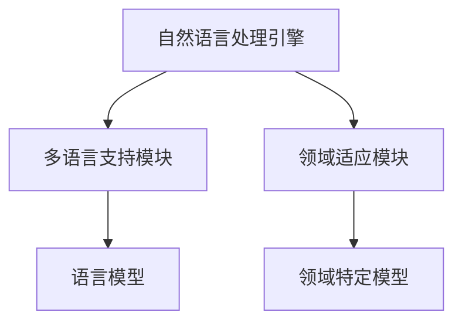
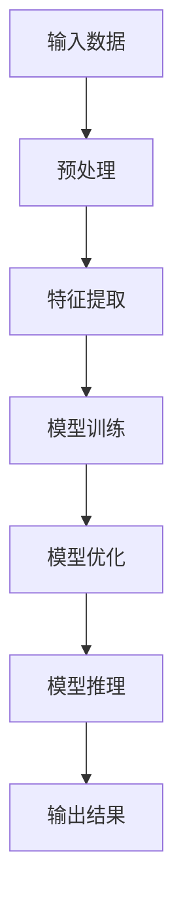
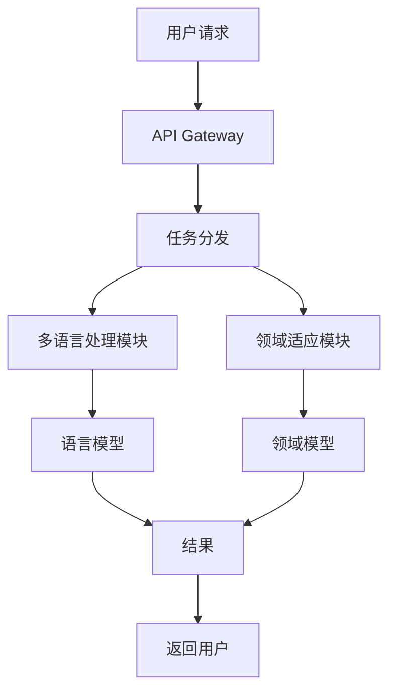
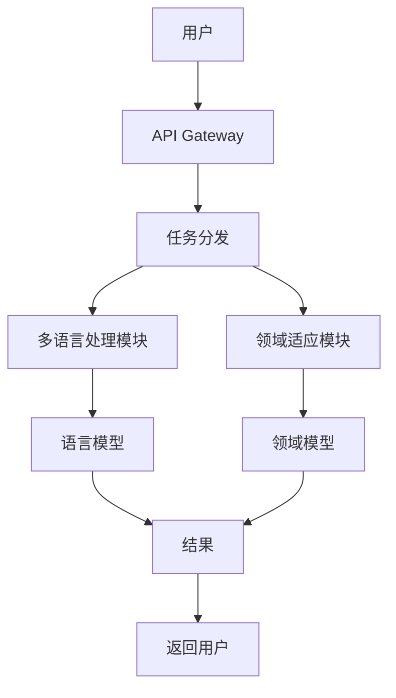

                 

# 构建企业级自然语言处理引擎：多语言支持与领域适应

> 关键词：企业级NLP引擎、多语言支持、领域适应、自然语言处理、深度学习、算法原理、系统架构

> 摘要：本文详细探讨了构建企业级自然语言处理引擎的关键技术，重点分析了多语言支持与领域适应的核心原理和实现方法。文章从背景介绍、核心概念、算法原理、系统架构设计到项目实战，全面阐述了企业级NLP引擎的构建过程，并提供了丰富的案例和代码实现，帮助读者深入理解相关技术原理和实际应用。

---

## 第一部分：企业级自然语言处理引擎概述

### 第1章：自然语言处理引擎的背景与挑战

#### 1.1 问题背景
自然语言处理（NLP）技术近年来取得了显著进展，但在企业级应用中仍面临诸多挑战。企业级NLP引擎需要支持多种语言，并在特定领域内实现高效适应，以满足复杂业务需求。

#### 1.2 问题描述
企业级NLP引擎的核心任务是理解、处理和生成自然语言文本。然而，多语言支持和领域适应的技术实现存在以下难点：
- 多语言支持需要处理不同语言的语法、语义和文化差异。
- 领域适应要求模型在特定领域内进行优化，以提高准确性。

#### 1.3 问题解决
通过引入深度学习模型（如BERT、Transformer）和领域自适应技术，可以有效解决多语言支持和领域适应的问题。企业级NLP引擎的构建需要结合这些技术，设计高效的系统架构。

#### 1.4 问题的边界与外延
企业级NLP引擎的边界包括文本处理的输入输出范围，以及支持的语言种类和领域范围。外延则涉及NLP技术在不同场景中的扩展应用。

#### 1.5 核心概念与组成
企业级NLP引擎由以下核心模块组成：
- 多语言处理模块：支持多种语言的文本处理。
- 领域适应模块：针对特定领域优化模型性能。
- 模型训练模块：负责模型的训练和优化。
- 接口模块：与外部系统进行交互。

---

### 第2章：自然语言处理引擎的核心概念与联系

#### 2.1 核心概念原理
企业级NLP引擎的工作原理包括文本预处理、特征提取、模型训练和推理。多语言支持依赖于跨语言模型，领域适应则通过领域特定数据进行微调。

#### 2.2 核心概念属性对比
下表对比了多语言支持和领域适应的关键属性：

| 属性 | 多语言支持 | 领域适应 |
|------|------------|----------|
| 输入 | 多种语言文本 | 特定领域文本 |
| 输出 | 统一格式结果 | 领域优化结果 |
| 挑战 | 跨语言差异 | 数据稀缺性 |

#### 2.3 ER实体关系图

---

## 第二部分：多语言支持与领域适应的算法原理

### 第3章：多语言支持的算法原理

#### 3.1 多语言模型的训练流程
多语言模型的训练流程包括跨语言预训练和领域微调。预训练阶段使用多语言数据，微调阶段在特定领域数据上进行优化。

#### 3.2 多语言模型的编码机制
多语言模型通过共享词嵌入和跨语言注意力机制，实现不同语言文本的联合表示。

#### 3.3 多语言模型的推理过程
推理阶段通过统一的编码器对输入文本进行编码，并生成目标输出。

### 第4章：领域适应的算法原理

#### 4.1 领域适应的核心算法
领域适应算法通过领域数据的特征提取和模型微调，提升模型在特定领域的性能。

#### 4.2 领域适应的训练策略
训练策略包括对抗训练和领域特定损失函数设计，以减少领域偏移。

#### 4.3 领域适应的优化方法
优化方法包括学习率调整和正则化技术，以提高模型的泛化能力。

### 第5章：算法流程图与数学模型

#### 5.1 算法流程图

#### 5.2 数学模型与公式
- 损失函数：$$ \text{损失函数} = \sum_{i=1}^{n} \text{交叉熵}(y_i, \hat{y}_i) $$
- 优化目标：$$ \text{优化目标} = \min_{\theta} \sum_{i=1}^{m} \text{领域损失}(x_i, y_i) $$

---

## 第三部分：企业级NLP引擎的系统分析与架构设计

### 第6章：系统分析与架构设计

#### 6.1 问题场景介绍
企业级NLP引擎需要在多语言环境下处理特定领域的文本数据，满足企业内部多种业务需求。

#### 6.2 项目介绍
项目目标是构建一个支持多语言和领域适应的企业级NLP引擎，提供高效、准确的文本处理能力。

#### 6.3 系统功能设计
系统功能包括文本分类、信息抽取、问答系统等，适用于多个领域。

#### 6.4 系统架构设计

#### 6.5 系统接口设计
系统接口包括API接口和命令行接口，支持多种输入输出格式。

#### 6.6 系统交互流程图

---

## 第四部分：项目实战

### 第7章：项目实战

#### 7.1 环境安装
安装必要的Python库，如TensorFlow、Keras、Transformers等。

#### 7.2 核心代码实现
实现多语言支持和领域适应的核心模块，包括模型训练和推理代码。

#### 7.3 代码应用解读与分析
解读代码实现，分析其在项目中的作用和优化点。

#### 7.4 案例分析和详细讲解
通过具体案例分析，展示企业级NLP引擎的实际应用效果。

---

## 第五部分：最佳实践、小结、注意事项与拓展阅读

### 第8章：最佳实践

#### 8.1 最佳实践
- 数据预处理是关键，需注意数据清洗和特征提取。
- 领域适应需结合领域知识，优化模型性能。
- 系统架构设计需考虑扩展性和可维护性。

#### 8.2 小结
企业级NLP引擎的构建需要结合多语言支持和领域适应技术，通过合理的系统架构设计和算法优化，实现高效、准确的文本处理能力。

#### 8.3 注意事项
- 数据质量和多样性直接影响模型性能。
- 领域适应需结合领域知识，避免过拟合。
- 系统安全性和稳定性需高度重视。

#### 8.4 拓展阅读
推荐阅读《Deep Learning for NLP》和《Multi-language NLP with Transformers》等书籍，深入理解相关技术原理。

---

## 作者

作者：AI天才研究院/AI Genius Institute & 禅与计算机程序设计艺术 /Zen And The Art of Computer Programming

---

通过以上内容，您可以逐步构建一篇完整的关于企业级自然语言处理引擎的技术博客文章。每个部分都包含了详细的技术分析和代码实现，帮助读者深入理解相关技术原理和实际应用。

