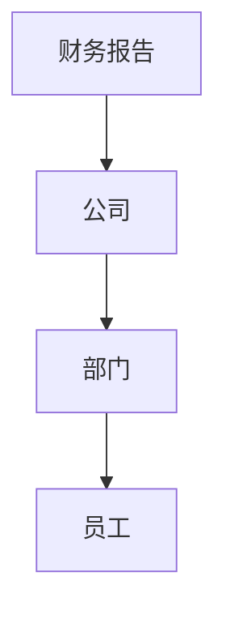
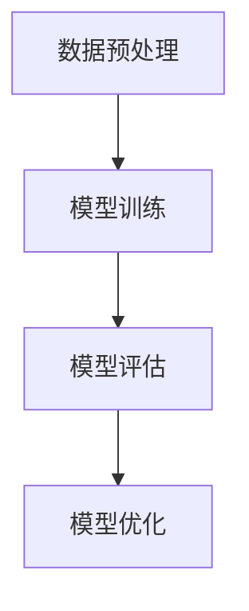
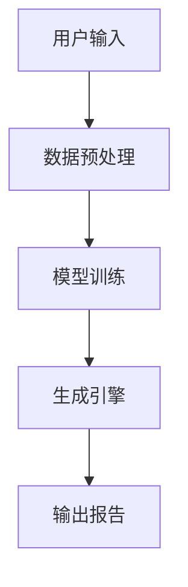

                 


# 构建企业级自然语言生成报告系统：多语言财务报告自动化

> **关键词**：自然语言生成，企业级系统，多语言支持，财务报告自动化，机器学习，深度学习，NLP技术  
>
> **摘要**：本文探讨了如何利用自然语言生成技术构建企业级多语言财务报告系统。通过分析技术背景、核心概念、算法原理、系统架构设计以及实际项目案例，本文详细阐述了如何实现高效的多语言财务报告自动化，克服了传统方法的局限性，为企业提供了智能化的解决方案。

---

## 第一部分：背景介绍与核心概念

### 第1章：问题背景与目标

#### 1.1 问题背景
随着全球化的发展，企业在跨国经营中需要处理多语言的财务报告。传统的财务报告生成依赖人工操作，效率低下且容易出错。自然语言生成（Natural Language Generation, NLP）技术的出现，为自动化生成财务报告提供了可能。

#### 1.2 问题描述
- **痛点分析**：传统财务报告生成过程繁琐，依赖人工编写，耗时且成本高。
- **技术挑战**：需要支持多种语言，同时保证报告的准确性和专业性。
- **目标**：构建一个能够自动生成多语言财务报告的企业级系统。

#### 1.3 问题解决思路
- 利用自然语言生成技术，结合机器学习和深度学习模型，构建一个多语言NLP模型。
- 设计企业级系统架构，确保系统的高效性和可扩展性。

#### 1.4 边界与外延
- **边界**：系统仅专注于财务报告的生成，不涉及其他业务模块。
- **外延**：模型可以扩展到其他类型的报告生成，如市场分析报告等。

---

### 第2章：核心概念与联系

#### 2.1 自然语言生成技术原理
- **NLP基础**：介绍词袋模型、TF-IDF等传统方法。
- **深度学习模型**：讲解Transformer、BERT等模型的工作原理。

#### 2.2 机器学习与深度学习在NLP中的应用
- **传统NLP vs 深度学习NLP**：对比分析两种方法的优劣。
- **深度学习模型的训练与优化**：介绍模型调优技巧。

#### 2.3 多语言模型的构建与优化
- **多语言模型的特点**：支持多种语言的同时保持模型性能。
- **模型训练策略**：数据预处理、模型初始化等技巧。

#### 2.4 核心概念对比表格
| 概念         | 单语言模型                     | 多语言模型                     |
|--------------|-------------------------------|-------------------------------|
| 数据需求     | 需要大量单语言数据             | 需要多语言数据                 |
| 模型复杂度   | 模型较简单                   | 模型较复杂                   |
| 应用场景     | 单一语言环境                 | 多语言环境                   |

#### 2.5 ER图（实体关系图）


---

## 第二部分：算法原理

### 第3章：自然语言生成模型

#### 3.1 模型选择与训练
- **模型选择**：基于Transformer的模型更适合自然语言生成任务。
- **训练策略**：采用预训练和微调相结合的方式。

#### 3.2 模型训练流程


#### 3.3 模型实现代码
```python
import torch
import torch.nn as nn

class TransformerModel(nn.Module):
    def __init__(self, vocab_size, embedding_dim, num_heads, num_layers):
        super(TransformerModel, self).__init__()
        self.embedding = nn.Embedding(vocab_size, embedding_dim)
        self.transformer = nn.Transformer(embedding_dim, num_heads, num_layers)
        self.fc = nn.Linear(embedding_dim, vocab_size)
    
    def forward(self, x):
        x = self.embedding(x)
        x = self.transformer(x)
        x = self.fc(x)
        return x
```

#### 3.4 损失函数与优化器
- **损失函数**：交叉熵损失函数。
- **优化器**：Adam优化器。

$$
\text{交叉熵损失} = -\sum_{y_i} y_{\text{真实}} \log(y_{\text{预测}})
$$

---

## 第三部分：系统分析与架构设计

### 第4章：系统功能设计

#### 4.1 功能模块
- **数据预处理模块**：处理原始数据，提取关键信息。
- **模型训练模块**：训练NLP模型。
- **生成引擎模块**：根据输入生成财务报告。

#### 4.2 系统架构设计


#### 4.3 接口设计
- **输入接口**：接收财务数据和目标语言。
- **输出接口**：生成结构化报告和自然语言报告。

---

## 第四部分：项目实战

### 第5章：环境安装与代码实现

#### 5.1 环境安装
```bash
pip install torch transformers
```

#### 5.2 核心代码实现
```python
from transformers import AutoTokenizer, AutoModelForMaskedLM

tokenizer = AutoTokenizer.from_pretrained("bert-base-multilingual")
model = AutoModelForMaskedLM.from_pretrained("bert-base-multilingual")
```

#### 5.3 代码解读
- 使用多语言模型生成报告。
- 通过微调提升模型在财务报告生成中的表现。

---

## 第五部分：总结与展望

### 第6章：总结与展望

#### 6.1 核心总结
- 成功构建了多语言财务报告生成系统。
- 系统具备高效性、准确性和可扩展性。

#### 6.2 未来展望
- 结合实时数据源，进一步提升报告的准确性。
- 研究更复杂的NLP模型，如大语言模型（LLM）。

---

**作者：AI天才研究院/AI Genius Institute & 禅与计算机程序设计艺术 /Zen And The Art of Computer Programming**

