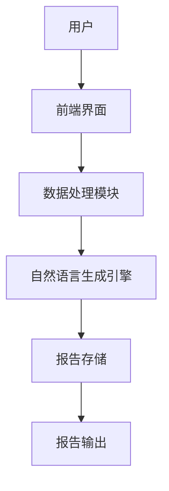
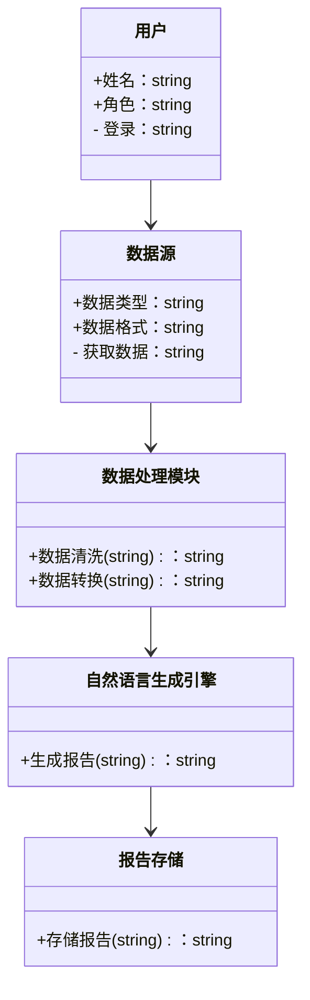

                 


# 构建企业级自然语言生成报告系统：自动化业务报告

---

## 关键词：
- 企业级自然语言生成
- 业务报告自动化
- AI驱动报告系统
- 技术实现与应用
- 系统架构设计

---

## 摘要：
随着企业数字化转型的加速，自动化生成业务报告的需求日益增长。本文旨在探讨如何构建一个高效、准确的企业级自然语言生成（NLG）系统，以实现业务报告的自动化。通过分析系统的背景、核心概念、算法原理、系统架构以及项目实战，本文将为读者提供从理论到实践的全面指导，帮助企业在数字化转型中提升效率和竞争力。

---

## 目录大纲

### 第一部分：背景与概述

#### 第1章：问题背景与系统概述

##### 1.1 问题背景
- 传统业务报告的痛点
  - 数据处理效率低下
  - 人工撰写耗时且成本高
  - 标准化程度不足
- 企业级报告系统的必要性
  - 提升效率
  - 降低成本
  - 提高报告的准确性和一致性

##### 1.2 系统目标与范围
- 系统目标
  - 实现业务数据的自动化报告生成
  - 提供多语言支持
  - 支持多种报告格式（PDF、Word、HTML等）
- 边界与外延
  - 数据源范围：仅限于企业内部系统
  - 报告类型：财务报告、销售报告、运营报告等
  - 安全性边界：确保数据隐私和系统安全

##### 1.3 核心概念与系统架构
- 核心概念
  - 自然语言生成（NLG）：将结构化数据转化为自然语言文本的技术
  - 生成式AI：基于深度学习模型的生成技术
  - 报告模板：定义报告的结构和内容的模板
- 系统架构
  - 数据源：数据库、API接口
  - 数据处理模块：数据清洗、数据转换
  - 自然语言生成引擎：文本生成、格式化
  - 报告存储与输出：存储生成的报告并提供下载或分发

##### 1.4 需求分析与系统边界
- 用户需求
  - 简化报告生成流程
  - 提高报告的准确性和一致性
  - 支持定制化报告模板
- 系统边界
  - 数据输入：仅支持结构化数据
  - 报告输出：仅支持预定义格式

---

### 第二部分：核心概念与系统架构

#### 第2章：自然语言生成原理

##### 2.1 自然语言生成（NLG）的核心概念
- NLG的基本流程
  - 数据输入
  - 数据解析
  - 文本生成
- NLG与NLU（自然语言理解）的区别与联系
  - NLU：将自然语言文本转化为结构化数据
  - NLG：将结构化数据转化为自然语言文本
  - 联系：两者都是NLP的重要组成部分，但方向相反

##### 2.2 系统架构图


##### 2.3 领域模型类图


##### 2.4 核心技术点
- 数据预处理
  - 数据清洗：去除无效数据
  - 数据转换：将结构化数据转换为文本
- 模板引擎
  - 定义报告模板
  - 支持动态替换
- 文本生成
  - 基于预训练模型的生成
  - 支持多种语言

---

### 第三部分：算法原理与实现

#### 第3章：生成模型算法

##### 3.1 Transformer架构
- 基本结构
  - 编码器：处理输入数据，生成上下文表示
  - 解码器：根据编码器的输出生成目标文本
  - 注意力机制：捕捉输入数据中的重要部分
- 数学公式
  $$\text{Attention}(Q, K, V) = \text{softmax}\left(\frac{QK^T}{\sqrt{d_k}}\right)V$$
  其中，$Q$ 是查询向量，$K$ 是键向量，$V$ 是值向量，$d_k$ 是键的维度。

##### 3.2 训练方法
- 监督学习
  - 损失函数：交叉熵损失
  - 优化器：Adam优化器
- 增强学习
  - 策略梯度
  - 奖励函数：基于生成文本的质量评估

##### 3.3 算法实现细节
- 预训练模型的选择
  - 使用开源模型（如GPT、BERT）
  - 根据任务需求进行微调
- 文本生成的控制
  - 温度参数：控制生成的随机性
  - 最大长度限制：防止生成过长的文本

---

### 第四部分：系统分析与设计

#### 第4章：系统功能设计

##### 4.1 系统功能模块
- 数据输入模块
  - 支持数据库和API接口
  - 数据清洗和转换
- 文本生成模块
  - 支持多种语言
  - 支持模板定制
- 报告输出模块
  - 支持多种格式（PDF、Word、HTML等）
  - 支持分发和存储

##### 4.2 系统架构设计


##### 4.3 接口与交互设计
- API接口
  - 输入数据接口
  - 输出报告接口
- 交互流程
  - 用户提交请求
  - 系统处理数据并生成报告
  - 用户下载或查看报告

---

### 第五部分：项目实战

#### 第5章：环境搭建与核心实现

##### 5.1 环境搭建
- 安装Python
  - 版本要求：Python 3.8及以上
- 安装依赖库
  - 使用pip安装：numpy、pandas、transformers、tensorflow

##### 5.2 核心功能实现
- 数据处理模块
  ```python
  import pandas as pd
  def data_cleaning(data):
      # 去除空值
      data = data.dropna()
      # 转换数据格式
      data = data.astype('float64')
      return data
  ```
- 文本生成模块
  ```python
  from transformers import GPT2LMHeadModel, GPT2Tokenizer
  tokenizer = GPT2Tokenizer.from_pretrained('gpt2')
  model = GPT2LMHeadModel.from_pretrained('gpt2')
  def generate_text(prompt):
      inputs = tokenizer.encode(prompt, return_tensors='pt')
      outputs = model.generate(inputs, max_length=100)
      return tokenizer.decode(outputs[0])
  ```

##### 5.3 案例分析
- 案例背景
  - 某公司销售数据
  - 需要生成销售报告
- 实现步骤
  1. 数据清洗与转换
  2. 使用生成模型生成文本
  3. 生成报告并存储

---

### 第六部分：最佳实践与优化

#### 第6章：系统优化与维护

##### 6.1 系统优化建议
- 模型优化
  - 使用更小的模型以减少计算成本
  - 增加缓存机制
- 性能优化
  - 并行处理
  - 增加队列管理

##### 6.2 系统维护
- 定期更新模型
- 监控系统性能
- 处理异常情况

##### 6.3 未来发展方向
- 支持更多语言
- 提供更多报告模板
- 增加用户自定义功能

---

## 结语

企业级自然语言生成报告系统的构建是一个复杂但 rewarding 的过程。通过本文的详细讲解，读者可以深入了解系统的背景、核心概念、算法原理、系统架构以及项目实战。未来，随着生成式AI技术的不断进步，企业级报告系统将更加智能化和高效化。

---

## 作者

作者：AI天才研究院/AI Genius Institute & 禅与计算机程序设计艺术 /Zen And The Art of Computer Programming

