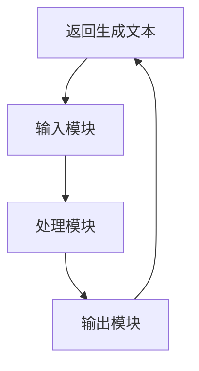
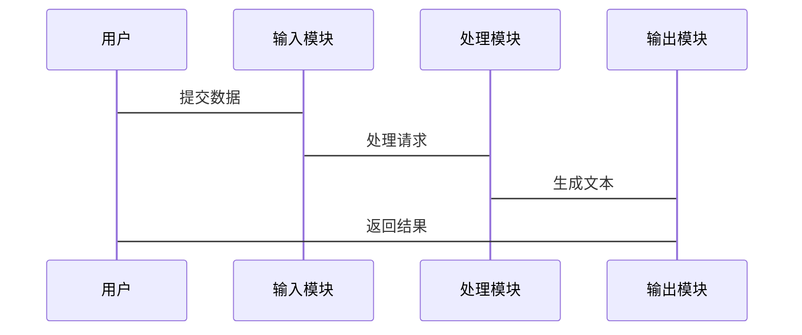

                 


# 构建企业级自然语言生成系统：多语种、多风格报告自动化

> **关键词**：自然语言生成，企业级系统，多语种，多风格，深度学习，生成式AI，自然语言处理

> **摘要**：本文详细探讨了构建企业级自然语言生成系统的各个方面，从背景、核心概念到算法原理、系统架构设计，再到项目实战。文章首先介绍了自然语言生成的基本概念和企业级系统的特点，接着深入讲解了多语种和多风格生成的实现原理，包括基于Transformer的模型及其数学公式。随后，详细分析了系统的架构设计和接口设计，并通过实际案例展示了如何在企业环境中部署和优化自然语言生成系统。最后，总结了构建此类系统的关键点和未来的发展方向。

---

# 第1章 自然语言生成系统概述

## 1.1 自然语言生成的定义与背景

### 1.1.1 自然语言生成的定义
自然语言生成（Natural Language Generation, NLG）是人工智能领域的重要分支，旨在使计算机能够生成符合人类语言习惯的文本。它通过处理结构化数据或特定输入，生成自然流畅的文本输出。

### 1.1.2 自然语言生成的发展历程
自然语言生成技术经历了从简单模板生成到复杂的深度学习模型的演变。早期基于规则的系统逐渐被数据驱动的深度学习模型取代，如循环神经网络（RNN）和Transformer模型。

### 1.1.3 自然语言生成在企业中的应用价值
在企业环境中，NLG技术可以用于自动生成报告、营销文案、客服回复等，显著提高效率，降低成本，并提升用户体验。

---

## 1.2 企业级自然语言生成系统的特点

### 1.2.1 企业级系统的核心特征
企业级系统要求高可用性、可扩展性和稳定性，能够支持大规模数据处理和多用户同时访问。

### 1.2.2 多语种支持的重要性
全球化背景下，企业需要支持多种语言，以满足不同地区用户的需求。

### 1.2.3 多风格生成的必要性
根据不同的场景和用户需求，生成风格多样的文本，如正式报告、口语化文案等。

---

## 1.3 多语种与多风格生成的背景

### 1.3.1 多语种生成的需求场景
国际化企业需要在不同市场使用当地语言进行沟通，如跨国公司的多语言报告生成。

### 1.3.2 多风格生成的挑战与机遇
不同场景下，文本风格需求多样，如营销文案需要吸引眼球，而技术报告则要求严谨专业。

### 1.3.3 企业级系统的核心目标
构建一个能够根据输入数据和需求，生成多语言、多风格文本的智能系统，提升企业效率和竞争力。

---

# 第2章 自然语言生成系统的核心概念与原理

## 2.1 自然语言生成系统的组成

### 2.1.1 输入模块
处理结构化或非结构化输入数据，如JSON格式的数据或用户查询。

### 2.1.2 处理模块
使用深度学习模型（如Transformer）对输入数据进行理解和生成。

### 2.1.3 输出模块
将生成的文本输出为可读的格式，如PDF或直接发送给用户。

---

## 2.2 多语种生成的实现原理

### 2.2.1 多语种模型的训练方法
采用多任务学习或跨语言迁移学习，共享语言间的特征。

### 2.2.2 多语种生成的策略选择
通过多语言词表和共享参数机制，实现不同语言间的高效生成。

### 2.2.3 多语种生成的评估指标
使用BLEU、ROUGE等指标评估生成文本的质量。

---

## 2.3 多风格生成的实现机制

### 2.3.1 风格编码的引入
通过风格向量对不同风格进行编码，指导生成过程。

### 2.3.2 风格切换的控制机制
在生成过程中动态调整风格向量，实现风格切换。

### 2.3.3 风格一致性的保障措施
通过反馈机制和风格保持训练，确保生成文本风格一致。

---

# 第3章 自然语言生成系统的算法原理

## 3.1 基于Transformer的自然语言生成模型

### 3.1.1 Transformer模型的基本结构
Transformer模型由编码器和解码器组成，采用自注意力机制处理序列数据。

### 3.1.2 自注意力机制的实现原理
通过计算序列中每个词与其他词的相关性，生成位置相关的表示。

### 3.1.3 解码器的生成过程
解码器逐步生成目标文本，每一步都利用自注意力机制捕捉上下文信息。

---

## 3.2 多语种生成的算法优化

### 3.2.1 多任务学习的优化策略
在单个模型中同时学习多种语言的任务，共享语言间的特征。

### 3.2.2 跨语言迁移学习的方法
利用一种语言的预训练模型，快速适应其他语言的任务。

### 3.2.3 多语种模型的训练技巧
采用数据增强、学习率调整等方法，提升模型的多语种生成能力。

---

## 3.3 多风格生成的算法创新

### 3.3.1 风格编码的引入
为每种风格定义一个编码向量，指导生成过程。

### 3.3.2 风格切换的控制机制
通过调节风格编码向量的权重，实现不同风格的生成。

### 3.3.3 风格一致性的评估与优化
通过引入风格保持损失，优化生成文本的风格一致性。

---

# 第4章 自然语言生成系统的数学模型与公式

## 4.1 Transformer模型的数学表达

### 4.1.1 自注意力机制的公式推导
自注意力机制的计算公式：
$$
\text{Attention}(Q, K, V) = \text{softmax}\left(\frac{QK^T}{\sqrt{d_k}}\right)V
$$
其中，\( Q \) 是查询向量，\( K \) 是键向量，\( V \) 是值向量。

### 4.1.2 解码器的前向网络公式
解码器的前向网络由多层感知机组成：
$$
f(x) = \text{relu}(Wx + b)
$$

### 4.1.3 模型的损失函数计算
使用交叉熵损失函数计算生成文本的概率：
$$
\text{Loss} = -\sum_{i=1}^{n} \log P(y_i | y_{<i}, x)
$$

---

## 4.2 多语种生成的数学模型

### 4.2.1 多任务学习的损失函数
多任务学习的损失函数为各个任务损失的加权和：
$$
\text{Loss} = \lambda_1 L_1 + \lambda_2 L_2 + \dots + \lambda_k L_k
$$
其中，\( \lambda_i \) 是任务 \( i \) 的权重。

### 4.2.2 跨语言迁移学习的数学表达
通过共享参数矩阵，跨语言模型的表示为：
$$
f_{\text{shared}}(x_i) = Wx_i + b
$$
其中，\( x_i \) 是不同语言的输入向量。

---

## 4.3 多风格生成的数学公式

### 4.3.1 风格编码的表示方法
风格编码向量为：
$$
s = \text{softmax}(W_s z)
$$
其中，\( z \) 是输入的隐层表示。

### 4.3.2 风格切换的控制机制
通过加权平均风格编码向量生成最终的表示：
$$
f(x) = \sum_{i=1}^{k} \alpha_i s_i
$$
其中，\( \alpha_i \) 是风格编码向量的权重。

---

# 第5章 自然语言生成系统的系统分析与架构设计

## 5.1 问题场景介绍

### 5.1.1 企业级系统的应用场景
企业需要自动生成多语言、多风格的报告，如财务报告、市场分析报告等。

### 5.1.2 多语种生成的典型需求
跨国企业需要生成多种语言的营销文案和客户沟通信函。

### 5.1.3 多风格生成的实际挑战
不同业务部门对文本风格的需求差异大，如何统一管理和生成是关键。

---

## 5.2 系统功能设计

### 5.2.1 领域模型设计
通过ER图展示系统实体及关系。

```mermaid
erDiagram
    actor 用户角色 {
        用户类型: 用户, 管理员
        权限: 读写, 管理
    }
    actor 输入数据 {
        数据类型: 结构化数据, 文本数据
        格式: JSON, CSV
    }
    actor 输出模块 {
        输出格式: 文本, PDF, Word
        目标系统: 本地, 网站, 应用程序
    }
    用户角色 --> 输入模块: 提交数据
    输入模块 --> 处理模块: 处理数据
    处理模块 --> 输出模块: 输出结果
    输出模块 --> 用户角色: 返回生成文本
```

---

## 5.3 系统架构设计

### 5.3.1 系统架构图
展示系统的分层架构，包括数据层、处理层和应用层。



---

## 5.4 系统接口设计

### 5.4.1 输入接口
支持多种数据格式的输入，如JSON和CSV。

### 5.4.2 输出接口
支持多种输出格式，如文本、PDF和Word文档。

---

## 5.5 系统交互设计

### 5.5.1 交互流程图
展示用户提交请求、系统处理和返回结果的流程。



---

# 第6章 项目实战

## 6.1 环境安装

### 6.1.1 安装Python和依赖库
```bash
pip install transformers torch
```

## 6.2 系统核心实现源代码

### 6.2.1 Transformer模型实现

```python
import torch
from torch import nn

class MultiHeadAttention(nn.Module):
    def __init__(self, embed_dim, num_heads):
        super().__init__()
        self.embed_dim = embed_dim
        self.num_heads = num_heads
        self.head_dim = embed_dim // num_heads
        self.qkv = nn.Linear(embed_dim, embed_dim)
        self.out = nn.Linear(embed_dim, embed_dim)
    
    def forward(self, x, mask=None):
        batch_size, seq_len, embed_dim = x.size()
        qkv = self.qkv(x).view(batch_size, seq_len, self.num_heads, self.head_dim)
        qkv = qkv.permute(0, 2, 1, 3)
        q, k, v = qkv.chunk(3, dim=1)
        
        attention = (q @ k.transpose(-2, -1)) * (1 / (self.head_dim ** 0.5))
        if mask is not None:
            attention = attention.masked_fill(mask == 0, float('-inf'))
        attention = torch.softmax(attention, dim=-1)
        out = attention @ v
        out = out.permute(0, 2, 1, 3).contiguous().view(batch_size, seq_len, embed_dim)
        out = self.out(out)
        return out
```

---

## 6.3 代码应用解读与分析

### 6.3.1 代码功能说明
上述代码实现了一个多头注意力机制，用于处理输入序列，生成上下文相关的表示。

---

## 6.4 实际案例分析

### 6.4.1 案例背景
某跨国企业需要生成多语言的营销报告。

### 6.4.2 案例实现
使用上述模型生成不同语言和风格的营销文案。

---

## 6.5 项目小结

### 6.5.1 核心代码实现
详细分析了Transformer模型的实现及其在多语种生成中的应用。

### 6.5.2 系统优化建议
建议采用分布式训练和模型压缩技术，提升系统的性能和可扩展性。

---

# 总结

构建企业级自然语言生成系统是一个复杂的工程，涉及多语种和多风格生成的实现。通过深度学习技术和巧妙的架构设计，可以显著提升企业的自动化能力。未来，随着技术的进步，自然语言生成系统将在企业应用中发挥更重要的作用。

---

**作者：AI天才研究院/AI Genius Institute & 禅与计算机程序设计艺术 /Zen And The Art of Computer Programming**

