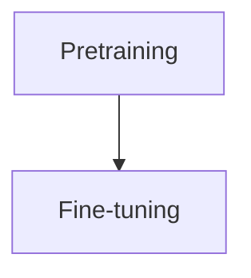

                 


# 构建企业级自然语言生成系统：多语言、多场景报告自动化

## 关键词：自然语言生成，多语言，多场景，企业级系统，深度学习，生成模型

## 摘要：  
企业级自然语言生成系统是将结构化数据转化为高质量自然语言文本的关键技术，广泛应用于报告生成、自动化客服、内容创作等领域。本文从企业级应用的视角，详细探讨了自然语言生成系统的构建，特别是多语言、多场景报告自动化的实现。通过分析核心概念、算法原理、系统架构设计，结合实际项目案例，为读者提供从理论到实践的全面指导。

---

## 目录

1. [企业级自然语言生成系统概述](#企业级自然语言生成系统概述)
2. [自然语言生成系统的核心概念与原理](#自然语言生成系统的核心概念与原理)
3. [企业级自然语言生成系统的架构与设计](#企业级自然语言生成系统的架构与设计)
4. [自然语言生成系统的算法与数学模型](#自然语言生成系统的算法与数学模型)
5. [企业级自然语言生成系统的项目实战](#企业级自然语言生成系统的项目实战)
6. [最佳实践与总结](#最佳实践与总结)

---

## 1. 企业级自然语言生成系统概述

### 1.1 自然语言生成的背景与意义

自然语言生成（Natural Language Generation, NLG）是人工智能领域的重要分支，旨在将结构化数据转化为自然语言文本。随着深度学习技术的快速发展，NLG在企业级应用中的价值日益凸显，尤其是在报告生成、自动化客服、内容创作等领域。

#### 1.1.1 自然语言生成的核心概念  
- **生成模型**：基于概率模型，通过训练数据学习语言的统计规律，生成符合语法规则的文本。  
- **多语言生成**：支持多种语言的文本生成，需要处理不同语言的语法、词汇和文化差异。  
- **场景化生成**：针对不同场景（如财务报告、市场分析）生成符合需求的文本。

#### 1.1.2 企业级应用中的自然语言生成需求  
- **高可用性**：企业级系统需要7×24小时稳定运行，支持大规模并发请求。  
- **多语言支持**：跨国企业需要生成多种语言的报告，满足全球化需求。  
- **场景化定制**：不同部门或业务场景需要生成不同类型的文本，系统需支持灵活配置。

#### 1.1.3 多语言与多场景生成的挑战  
- **技术复杂性**：多语言生成需要处理不同语言的语法和词汇差异，模型需要具备跨语言理解能力。  
- **场景多样性**：不同场景对生成文本的要求不同，系统需要动态调整生成策略。  
- **性能优化**：在复杂场景下，生成效率和文本质量需要平衡。

---

### 1.2 企业级自然语言生成系统的特点

企业级系统注重高可用性、扩展性和安全性，这些特点同样适用于自然语言生成系统。

#### 1.2.1 高可用性与稳定性  
- 采用分布式架构，支持故障容错和负载均衡。  
- 使用容器化技术（如Docker）部署，确保系统的可扩展性和灵活性。

#### 1.2.2 多语言支持的实现  
- 使用预训练的多语言模型（如Marian、_mBART）进行微调。  
- 支持动态语言切换，根据输入的语言参数选择合适的生成模型。

#### 1.2.3 场景化定制能力  
- 提供可配置的参数，支持不同场景下的生成需求。  
- 结合领域知识，优化生成模型的性能。

---

## 2. 自然语言生成系统的核心概念与原理

### 2.1 自然语言生成的原理与模型

#### 2.1.1 生成模型的分类  
- **基于规则的生成模型**：通过预定义的语法规则生成文本，适用于简单场景，但难以处理复杂语言现象。  
- **基于统计的生成模型**：通过概率模型（如n-gram）学习语言的统计规律，生成文本。  
- **基于深度学习的生成模型**：采用神经网络（如RNN、Transformer）构建生成模型，生成高质量文本。

#### 2.1.2 基于深度学习的生成模型  
- **Transformer模型**：通过自注意力机制捕捉长距离依赖关系，生成高质量文本。  
- **解码器**：生成文本的过程，通过解码器逐词生成，支持动态生成策略（如贪心搜索、随机采样）。  

#### 2.1.3 多语言生成的实现  
- **多语言模型**：在预训练阶段使用多种语言数据，构建共享的语义表示。  
- **语言嵌入**：在生成阶段，根据输入语言添加语言嵌入，调整生成策略。  

---

### 2.2 大语言模型在自然语言生成中的应用

#### 2.2.1 大语言模型的定义与特点  
- **大语言模型**：通过大量数据预训练的大型语言模型，具备强大的上下文理解和生成能力。  
- **特点**：通用性强、生成质量高，但计算资源消耗大。

#### 2.2.2 大语言模型的训练与优化  
- **预训练**：在大规模通用数据上进行无监督预训练，学习语言的分布规律。  
- **微调**：针对特定任务或领域进行有监督微调，优化生成性能。  

#### 2.2.3 大语言模型的生成机制  
- **解码器**：通过自注意力机制生成上下文相关的文本，支持动态调整生成策略。  

---

### 2.3 多语言生成的实现原理

#### 2.3.1 多语言模型的构建  
- **多语言预训练**：在多种语言数据上进行预训练，构建共享的语义表示。  
- **语言嵌入**：在生成阶段，根据输入语言添加语言嵌入，调整生成策略。  

#### 2.3.2 多语言生成的策略  
- **统一生成**：使用单个多语言模型生成多种语言的文本。  
- **动态切换**：根据输入语言切换生成模型或参数。  

---

## 3. 企业级自然语言生成系统的架构与设计

### 3.1 系统架构的总体设计

企业级系统通常采用分层架构，包括数据层、业务逻辑层和表现层。

#### 3.1.1 分层架构设计  
- **数据层**：负责数据的存储和管理，支持多种数据格式和接口。  
- **业务逻辑层**：处理生成请求，调用生成模型生成文本。  
- **表现层**：提供用户界面或API接口，接收请求并返回生成结果。  

---

### 3.2 多语言支持的系统架构

#### 3.2.1 多语言模型的集成  
- **模型共享**：在预训练阶段使用多种语言数据，构建共享的语义表示。  
- **语言切换**：在生成阶段，根据输入语言切换生成模型或调整参数。  

#### 3.2.2 多语言生成的流程设计  
1. 接收生成请求，提取语言参数。  
2. 根据语言参数选择合适的生成模型。  
3. 调用生成接口，生成目标语言的文本。  

#### 3.2.3 多语言资源的管理  
- **语言库**：管理支持的语言列表，包括语言代码、模型参数等。  
- **资源加载**：动态加载生成模型和相关资源，减少资源消耗。  

---

### 3.3 多场景生成的系统架构

#### 3.3.1 场景化定制的实现  
- **场景参数**：定义场景参数，如生成长度、语气风格等。  
- **生成策略**：根据场景参数调整生成策略，优化生成质量。  

#### 3.3.2 场景切换的机制  
- **动态调整**：根据输入的场景参数，动态调整生成模型或参数。  
- **场景优化**：针对特定场景进行微调，提升生成效果。  

#### 3.3.3 场景化生成的优化  
- **领域知识**：结合领域知识，优化生成结果。  
- **生成后处理**：对生成文本进行校对和优化，确保符合场景需求。  

---

## 4. 自然语言生成系统的算法与数学模型

### 4.1 自然语言生成的算法原理

#### 4.1.1 Transformer模型的结构

```mermaid
graph TD
    Encoder -> Sublayer 1
    Sublayer 1 -> Sublayer 2
    Sublayer 2 -> Sublayer 3
    Decoder -> Sublayer 1
    Sublayer 1 -> Sublayer 2
    Sublayer 2 -> Sublayer 3
```

#### 4.1.2 解码器的生成机制

```mermaid
graph TD
    Decoder_Input --> Multi-Head Attention --> Output
    Output --> FFN --> Final_Output
```

---

### 4.2 大语言模型的训练算法

#### 4.2.1 预训练与微调



#### 4.2.2 生成任务的损失函数

$$\text{损失函数} = -\sum_{i=1}^{n} \log P(y_i|x_{<i})$$

#### 4.2.3 生成策略的优化

- **贪心搜索**：逐词生成，选择概率最高的词。  
- **随机采样**：随机选择生成词，增加文本多样性。  
- **束搜索**：生成多个候选文本，选择最优解。  

---

### 4.3 多语言生成的算法优化

#### 4.3.1 多语言模型的训练策略

$$\text{损失函数} = \sum_{i=1}^{n} \sum_{j=1}^{m} \text{交叉熵}(y_{ij}|x_{ij})$$

#### 4.3.2 多语言生成的解码策略

- **语言嵌入**：在解码器中添加语言嵌入，调整生成策略。  
- **动态调整**：根据输入语言调整生成参数，优化生成效果。  

---

## 5. 企业级自然语言生成系统的项目实战

### 5.1 环境搭建与工具安装

#### 5.1.1 开发环境的配置  
- **操作系统**：推荐使用Linux或macOS，支持多线程和多进程。  
- **编程语言**：Python 3.8及以上版本。  
- **深度学习框架**：TensorFlow或PyTorch。  

#### 5.1.2 依赖库的安装  
- **Python库**：transformers、numpy、torch。  
- **其他工具**：Jupyter Notebook用于开发和调试。  

---

### 5.2 系统核心功能的实现

#### 5.2.1 多语言生成的代码实现

```python
from transformers import MarianTokenizer, MarianMTModel

# 加载多语言模型
model_name = "facebook/marian-nmt-de-en"
tokenizer = MarianTokenizer.from_pretrained(model_name)
model = MarianMTModel.from_pretrained(model_name)

# 生成文本
def generate_text(input_text, language):
    inputs = tokenizer(input_text, return_tensors="pt")
    outputs = model.generate(**inputs, forced_bos_token_id=tokenizer.get_special_tokens_mask("en", return_tensors="pt")[0])
    return tokenizer.decode(outputs[0], skip_special_tokens=True)
```

#### 5.2.2 多场景生成的代码实现

```python
def generate_scene_report(input_data, scene_params):
    # 根据场景参数选择生成模型
    if scene_params['scene_type'] == 'financial':
        model = financial_model
    elif scene_params['scene_type'] == 'market':
        model = market_model
    # 调用生成接口
    return model.generate(input_data)
```

---

### 5.3 项目案例分析与解读

#### 5.3.1 案例分析  
- **案例背景**：某企业需要生成多语言的财务报告。  
- **实现步骤**：  
  1. 数据准备：收集多语言的财务报告样本。  
  2. 模型训练：使用多语言模型进行微调。  
  3. 接口开发：开发API接口，支持多种语言的生成请求。  
- **结果展示**：生成多种语言的财务报告，验证系统的准确性和稳定性。  

---

## 6. 最佳实践与总结

### 6.1 最佳实践 tips  
- **数据质量**：高质量的数据是生成系统的核心，确保数据的多样性和代表性。  
- **模型选择**：根据具体需求选择合适的生成模型，平衡生成质量和计算资源。  
- **系统优化**：采用分布式架构和容器化技术，提升系统的扩展性和稳定性。  

### 6.2 小结  
企业级自然语言生成系统是一个复杂的系统工程，需要结合技术与业务需求，注重系统的扩展性、稳定性和多语言、多场景的支持能力。通过本文的分析和实践，读者可以掌握构建企业级自然语言生成系统的核心技术和实现方法。

### 6.3 注意事项  
- **性能优化**：在复杂场景下，生成效率和文本质量需要平衡。  
- **系统维护**：定期更新模型和优化系统，确保系统的先进性和稳定性。  

### 6.4 拓展阅读  
- **相关书籍**：《Deep Learning》、《自然语言处理实战》。  
- **技术博客**：关注自然语言生成领域的最新技术动态。  

---

## 作者：AI天才研究院/AI Genius Institute & 禅与计算机程序设计艺术 /Zen And The Art of Computer Programming

