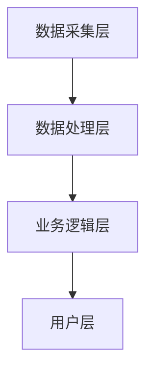
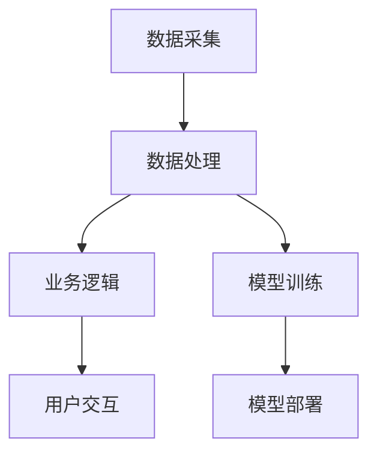
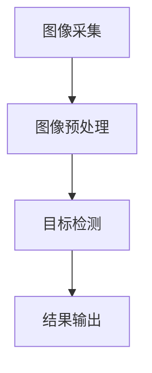

                 


# 构建企业级计算机视觉平台：从质量控制到安全监管的全面应用

> 关键词：企业级计算机视觉平台，质量控制，安全监管，图像处理，目标检测，深度学习

> 摘要：随着人工智能技术的快速发展，企业级计算机视觉平台在各个行业中的应用越来越广泛。本文将从质量控制到安全监管的全面应用角度，系统地介绍企业级计算机视觉平台的构建过程，包括核心概念、算法原理、系统架构设计、项目实战以及最佳实践等方面。通过本文的学习，读者将能够深入了解企业级计算机视觉平台的技术细节，并掌握如何将其应用于实际场景中。

---

## 第1章: 企业级计算机视觉平台概述

### 1.1 计算机视觉的基本概念

#### 1.1.1 计算机视觉的定义与核心概念
计算机视觉（Computer Vision）是一门研究如何让计算机“看”的科学，旨在模拟人类视觉系统的能力，通过对图像或视频数据的处理和分析，实现对现实世界的理解。其核心概念包括图像处理、目标检测、图像分割、目标识别等。

**关键概念对比：**

| 概念 | 描述 |
|------|------|
| 图像处理 | 对图像进行增强、滤波等操作，改善图像质量。 |
| 目标检测 | 在图像中检测并定位特定目标。 |
| 图像分割 | 将图像分割为多个区域，每个区域具有相似的特征。 |
| 目标识别 | 对图像中的目标进行分类和识别。 |

#### 1.1.2 企业级计算机视觉平台的定义
企业级计算机视觉平台是一种基于计算机视觉技术，为企业提供高效、可靠、可扩展的视觉解决方案的平台。它通常包含数据采集、预处理、算法处理、结果输出等模块，能够支持大规模数据处理和多种应用场景。

#### 1.1.3 企业级计算机视觉平台的应用场景
企业级计算机视觉平台广泛应用于各个行业，以下是几个典型场景：

- **质量控制**：在制造业中，用于检测产品的缺陷。
- **安全监管**：在安防领域，用于监控视频分析、人脸识别等。
- **物流与仓储**：用于货物识别、路径规划等。
- **医疗健康**：用于医学图像分析、辅助诊断等。

---

## 第2章: 计算机视觉的核心技术与算法

### 2.1 图像处理基础

#### 2.1.1 图像增强
图像增强是通过调整图像的亮度、对比度、锐化等参数，改善图像质量的过程。常见的图像增强算法包括：

- **直方图均衡化**：通过调整图像的直方图，扩展图像的对比度。
- **高斯滤波**：用于去除图像中的噪声。
- **边缘检测**：通过 Sobel 或 Canny 算子提取图像的边缘信息。

**Python代码示例：**
```python
import cv2
import numpy as np

# 读取图像
img = cv2.imread('input.jpg', cv2.IMREAD_GRAYSCALE)

# 高斯滤波
 blurred = cv2.GaussianBlur(img, (5, 5), 0)

# 边缘检测
 edges = cv2.Canny(img, 100, 200)

# 显示图像
cv2.imshow('Original', img)
cv2.imshow('Blurred', blurred)
cv2.imshow('Edges', edges)
cv2.waitKey(0)
cv2.destroyAllWindows()
```

### 2.2 目标检测与识别

#### 2.2.1 目标检测算法
目标检测是计算机视觉中的重要任务，常见的算法包括：

- **Haar 级联检测器**：基于 haar 特征的级联分类器，常用于人脸检测。
- **HOG 特征检测**：基于水平梯度直方图的特征，用于目标检测。
- **R-CNN 系列算法**：包括 R-CNN、Fast R-CNN、Faster R-CNN 等，用于实时目标检测。

**数学公式：**
目标检测的损失函数通常采用综合定位和分类的损失：
$$ \text{Loss} = \lambda_1 (1 - \text{IoU}) + \lambda_2 (1 - \text{Confidence}) $$

#### 2.2.2 目标识别算法
目标识别是基于图像内容进行分类的任务，常见的算法包括：

- **KNN**：基于最近邻的分类算法，适用于小规模数据集。
- **SVM**：支持向量机，适用于线性可分的数据。
- **CNN**：卷积神经网络，适用于大规模图像数据。

**Python代码示例：**
```python
import keras
from keras.layers import Dense, Conv2D, MaxPooling2D, Flatten

# 构建CNN模型
model = keras.Sequential([
    Conv2D(32, (3,3), activation='relu', input_shape=(64, 64, 3)),
    MaxPooling2D((2,2)),
    Conv2D(64, (3,3), activation='relu'),
    MaxPooling2D((2,2)),
    Flatten(),
    Dense(128, activation='relu'),
    Dense(10, activation='softmax')
])

# 编译模型
model.compile(optimizer='adam', loss='sparse_categorical_crossentropy', metrics=['accuracy'])
```

### 2.3 图像分割与语义分割

#### 2.3.1 图像分割算法
图像分割是将图像划分为多个区域的过程，常见的算法包括：

- **基于阈值的分割**：根据像素值的阈值进行分割。
- **基于边缘检测的分割**：通过检测图像的边缘来分割区域。
- **基于区域的分割**：根据颜色、纹理等特征进行区域划分。

#### 2.3.2 语义分割算法
语义分割是对图像中的每个像素进行分类的过程，常见的算法包括：

- **U-Net**：常用于医学图像分割。
- **Mask R-CNN**：结合目标检测和语义分割的算法。
- **FCN**：全卷积网络，用于端到端的语义分割。

**Python代码示例：**
```python
import tensorflow as tf
from tensorflow.keras.layers import Input, Conv2D, UpSampling2D, Concatenate

# 构建U-Net模型
def unet_model(input_shape):
    inputs = Input(input_shape)
    conv1 = Conv2D(64, (3,3), activation='relu')(inputs)
    conv2 = Conv2D(128, (3,3), activation='relu')(conv1)
    up1 = UpSampling2D((2,2))(conv2)
    up2 = Conv2D(64, (3,3), activation='relu')(up1)
    outputs = Conv2D(1, (1,1), activation='sigmoid')(up2)
    return Model(inputs=inputs, outputs=outputs)
```

---

## 第3章: 企业级计算机视觉平台的系统架构

### 3.1 系统架构设计

#### 3.1.1 分层架构
企业级计算机视觉平台通常采用分层架构，包括数据采集层、数据处理层、业务逻辑层和用户层。

**分层架构图：**


#### 3.1.2 模块划分
系统功能模块划分为：

- 数据采集模块：负责图像的采集和预处理。
- 数据处理模块：包括图像增强、目标检测、语义分割等功能。
- 业务逻辑模块：根据处理结果生成业务逻辑输出。
- 用户交互模块：提供用户界面，展示处理结果。

**系统架构图：**


---

## 第4章: 项目实战

### 4.1 环境安装

#### 4.1.1 安装依赖
```bash
pip install numpy
pip install opencv-python
pip install tensorflow
```

### 4.2 核心代码实现

#### 4.2.1 目标检测实现
```python
import cv2
import numpy as np

# 加载预训练模型
net = cv2.dnn.readNetFromCaffe('model.prototxt', 'model.caffemodel')

# 读取图像
img = cv2.imread('input.jpg')

# 处理图像
blob = cv2.dnn.blobFromImage(img, 1.0, (300, 300), (104.0, 177.0, 123.0))
net.setInput(blob)
detections = net.forward()

# 绘制结果
for detection in detections:
    if detection[2] > 0.5:
        left = detection[3] * img.shape[1]
        top = detection[4] * img.shape[0]
        right = detection[5] * img.shape[1]
        bottom = detection[6] * img.shape[0]
        cv2.rectangle(img, (int(left), int(top)), (int(right), int(bottom)), (0, 255, 0), 2)

cv2.imshow('Result', img)
cv2.waitKey(0)
cv2.destroyAllWindows()
```

### 4.3 案例分析

#### 4.3.1 质量控制案例
在制造业中，企业级计算机视觉平台可以用于检测产品的缺陷。例如，在电子制造中，可以使用目标检测算法检测电路板上的缺陷。

**流程图：**


---

## 第5章: 最佳实践与小结

### 5.1 最佳实践

#### 5.1.1 系统设计
- 采用分层架构，确保系统的可扩展性。
- 使用高效的算法，优化系统的性能。
- 定期更新模型，提高系统的准确性。

#### 5.1.2 项目管理
- 明确项目需求，制定详细的项目计划。
- 采用敏捷开发模式，及时迭代和优化。
- 建立完善的测试和监控机制。

### 5.2 小结

企业级计算机视觉平台的构建是一个复杂而系统的工程，需要综合考虑技术、系统架构和实际应用场景。通过本文的学习，读者可以掌握构建企业级计算机视觉平台的核心技术和方法，为实际项目提供有力的技术支持。

---

作者：AI天才研究院/AI Genius Institute & 禅与计算机程序设计艺术 /Zen And The Art of Computer Programming

