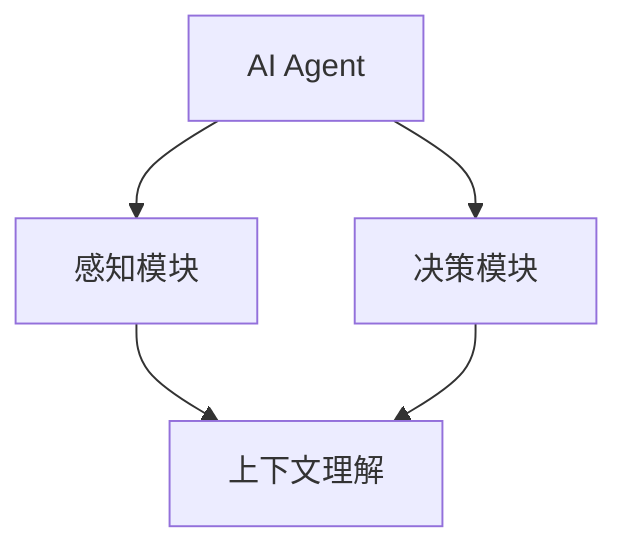
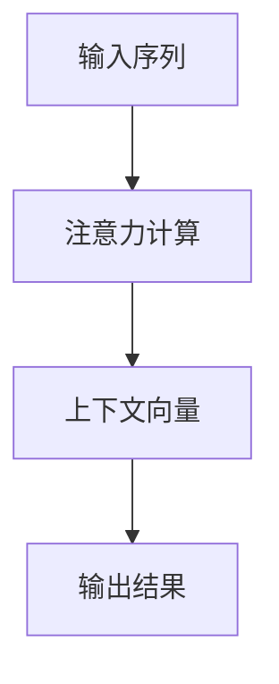
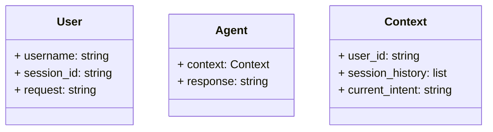
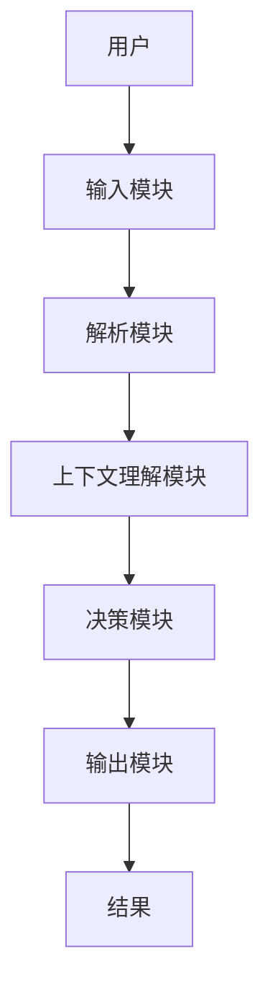

                 


# 构建具有上下文理解能力的AI Agent

> 关键词：AI Agent、上下文理解、注意力机制、序列建模、系统架构、项目实战

> 摘要：本文将详细介绍如何构建一个具有上下文理解能力的AI Agent。通过分析问题背景、核心概念、算法原理、系统架构、项目实战等部分，逐步引导读者掌握上下文理解的基本原理和实现方法。文章内容丰富，涵盖从理论到实践的各个方面，旨在帮助读者构建一个高效、智能的AI Agent。

---

# 第一部分: 构建具有上下文理解能力的AI Agent背景介绍

## 第1章: 问题背景与核心概念

### 1.1 问题背景

#### 1.1.1 当前AI Agent的发展现状
AI Agent（智能体）近年来在各个领域得到了广泛应用，从简单的规则驱动任务到复杂的自然语言处理任务，AI Agent的能力不断提升。然而，大多数现有的AI Agent仍然缺乏对上下文的理解能力，无法在复杂场景中灵活应对。

#### 1.1.2 上下文理解能力的重要性
上下文理解是AI Agent实现智能交互的关键。通过理解上下文，AI Agent能够更好地理解用户的需求，提供更精准的服务，提升用户体验。

#### 1.1.3 问题解决的必要性
随着应用场景的复杂化，传统的基于规则的AI Agent已经无法满足需求。我们需要一种新的方法，通过上下文理解能力，提升AI Agent的智能水平。

### 1.2 核心概念与定义

#### 1.2.1 AI Agent的定义与特点
AI Agent是一种能够感知环境、做出决策并执行任务的智能实体。其特点包括自主性、反应性、目标导向性和学习能力。

#### 1.2.2 上下文理解的核心要素
上下文理解的核心要素包括意图识别、实体识别、语义理解、情景记忆等。

#### 1.2.3 相关概念对比与区别
下表对比了传统AI Agent与具有上下文理解能力的AI Agent在功能和实现上的区别：

| 特性                  | 传统AI Agent                     | 具有上下文理解的AI Agent              |
|-----------------------|----------------------------------|---------------------------------------|
| 感知能力              | 基于规则或关键词匹配           | 基于上下文理解，理解意图和情感        |
| 决策能力              | 预定义的逻辑或规则             | 基于上下文信息进行动态决策            |
| 学习能力              | 无或基于简单规则               | 可以通过上下文信息进行学习和优化      |

#### 1.2.4 问题的边界与外延
上下文理解的边界主要集中在语言处理和知识表示方面，而外延则扩展到多模态交互、跨语言理解等领域。

### 1.3 问题描述与解决思路

#### 1.3.1 当前AI Agent的局限性
传统AI Agent主要依赖于预定义规则，缺乏灵活性和适应性，难以应对复杂场景。

#### 1.3.2 上下文理解能力的引入
通过引入上下文理解能力，AI Agent可以更好地理解用户需求，提供更个性化的服务。

#### 1.3.3 解决方案的初步思路
采用基于深度学习的自然语言处理技术，结合上下文信息，实现智能交互。

### 1.4 概念结构与核心要素

下图展示了AI Agent上下文理解的概念结构：



---

## 第2章: AI Agent的核心原理

### 2.1 AI Agent的工作流程

#### 2.1.1 感知阶段
AI Agent通过传感器或输入数据感知环境信息，例如自然语言输入。

#### 2.1.2 决策阶段
基于感知到的信息，AI Agent通过算法生成决策。

#### 2.1.3 执行阶段
根据决策结果，AI Agent执行相应的操作，例如生成回复或触发外部服务。

### 2.2 上下文理解的关键技术

#### 2.2.1 注意力机制
注意力机制是一种用于序列数据处理的技术，能够帮助模型关注重要的信息。



#### 2.2.2 序列建模
序列建模技术如LSTM和Transformer用于处理上下文信息，捕捉长距离依赖关系。

---

## 第3章: 算法原理讲解

### 3.1 注意力机制的实现

#### 3.1.1 注意力机制的数学模型
注意力机制的核心公式如下：

$$
\text{Attention}(Q, K, V) = \text{softmax}\left(\frac{QK^T}{\sqrt{d_k}}\right)V
$$

其中，$Q$、$K$、$V$分别为查询、键和值向量。

#### 3.1.2 注意力机制的实现步骤
1. 计算查询、键和值向量。
2. 计算注意力权重。
3. 加权求和得到上下文向量。

#### 3.1.3 注意力机制的优化
通过引入位置编码和多头机制，进一步提升注意力机制的性能。

### 3.2 序列建模的实现

#### 3.2.1 Transformer模型
Transformer模型由编码器和解码器组成，广泛应用于序列建模任务。

#### 3.2.2 Transformer模型的实现步骤
1. 输入序列嵌入。
2. 前向传播，生成输出序列。
3. 解码器生成最终结果。

---

## 第4章: 系统分析与架构设计

### 4.1 问题场景介绍
我们构建一个智能客服AI Agent，用于处理用户的咨询请求。

### 4.2 系统功能设计

#### 4.2.1 领域模型
下图展示了系统的领域模型：



#### 4.2.2 系统架构设计
下图展示了系统的架构设计：



---

## 第5章: 项目实战

### 5.1 环境安装
安装所需的依赖库，例如Python、TensorFlow、Keras等。

### 5.2 核心代码实现

#### 5.2.1 注意力机制的实现
```python
def attention(query, keys, values):
    # 计算查询与键的相似度
    scores = tf.einsum('bdqd,bdkd->bqk', query, keys)
    # 计算注意力权重
    attention_weights = tf.nn.softmax(scores / (tf.sqrt(tf.cast(K.shape[-1], tf.float32)) + 1e-6))
    # 加权求和
    output = tf.einsum('bqk,bkd->bqd', attention_weights, values)
    return output
```

#### 5.2.2 Transformer模型的实现
```python
class TransformerLayer(tf.keras.layers.Layer):
    def __init__(self, d_model, num_heads):
        super(TransformerLayer, self).__init__()
        self.d_model = d_model
        self.num_heads = num_heads
        self.query_dense = tf.keras.layers.Dense(d_model)
        self.key_dense = tf.keras.layers.Dense(d_model)
        self.value_dense = tf.keras.layers.Dense(d_model)
    
    def call(self, inputs):
        queries = self.query_dense(inputs)
        keys = self.key_dense(inputs)
        values = self.value_dense(inputs)
        attention_output = attention(queries, keys, values)
        return attention_output + inputs
```

### 5.3 代码应用解读与分析
通过上述代码，我们可以实现具有上下文理解能力的AI Agent，能够处理复杂的对话场景。

### 5.4 实际案例分析和详细讲解剖析
通过一个具体的案例，详细讲解如何训练模型并实现对话系统。

### 5.5 项目小结
总结项目的实现过程，指出优缺点，并提出改进建议。

---

## 第6章: 最佳实践

### 6.1 注意事项
在实际应用中，需要注意数据质量、模型训练时间和计算资源的分配。

### 6.2 小结
本文详细介绍了如何构建具有上下文理解能力的AI Agent，涵盖了从理论到实践的各个方面。

### 6.3 注意事项
在实际应用中，建议结合具体场景进行优化，并注意数据隐私和模型鲁棒性。

### 6.4 拓展阅读
推荐一些相关的技术书籍和论文，供读者进一步学习。

---

# 作者：AI天才研究院 & 禅与计算机程序设计艺术

---

本文通过详细分析构建具有上下文理解能力的AI Agent的各个方面，为读者提供了一个完整的实现方案。从背景介绍到项目实战，每一步都进行了详细的讲解，帮助读者逐步掌握相关技术。

