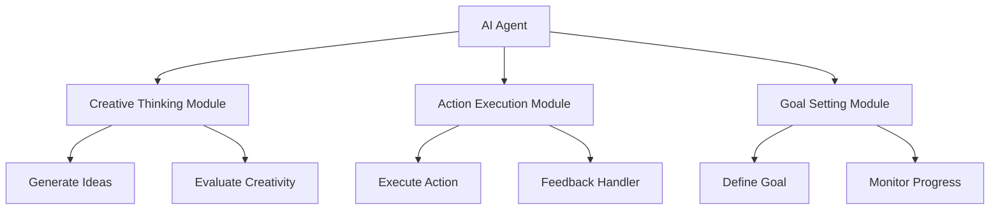

                 


# 构建具有创造力的AI Agent

> 关键词：AI Agent, 创造力, 机器学习, 生成模型, 评估方法

> 摘要：本文将探讨如何构建具有创造力的AI Agent，从背景介绍到系统设计，再到项目实战，详细分析创造力在AI Agent中的实现与应用。文章内容涵盖创造力的定义、生成模型、评估方法以及系统架构设计，通过实际案例展示如何将创造力融入AI Agent的构建过程中。

---

# 构建具有创造力的AI Agent

## 第一部分: 背景与基础

### 第1章: AI Agent概述

#### 1.1 AI Agent的基本概念

##### 1.1.1 什么是AI Agent

人工智能代理（AI Agent）是指能够感知环境并采取行动以实现目标的智能体。AI Agent可以是软件程序、机器人或其他形式的智能系统，其核心目标是通过自主决策和行动来优化特定任务的执行效果。

##### 1.1.2 AI Agent的类型

AI Agent可以根据智能水平、环境类型和应用领域进行分类：

1. **按智能水平**：
   - **反应式AI Agent**：基于当前感知做出反应，不依赖历史信息。
   - **认知式AI Agent**：具备推理、规划和学习能力，能够处理复杂任务。

2. **按环境类型**：
   - **静态环境**：环境在AI Agent行动期间不变。
   - **动态环境**：环境在AI Agent行动期间可能发生变化。

3. **按应用领域**：
   - **服务机器人**：提供客户服务的AI Agent。
   - **自动驾驶系统**：用于自动驾驶汽车的AI Agent。
   - **推荐系统**：根据用户行为推荐内容的AI Agent。

##### 1.1.3 创造力在AI Agent中的重要性

创造力是AI Agent在复杂环境中解决问题和创新的关键能力。通过创造力，AI Agent能够生成新颖的解决方案，适应动态变化的环境，并在各种任务中表现出更高的灵活性和适应性。

---

#### 1.2 创造力的定义与特点

##### 1.2.1 创造力的定义

创造力是指生成新颖、有用、且具有价值的想法或解决方案的能力。在AI Agent中，创造力通常涉及生成新的概念、策略或输出，以应对复杂的任务需求。

##### 1.2.2 创造力的核心特征

1. **新颖性**：输出结果与现有知识或经验不同。
2. **有用性**：输出结果能够解决问题或实现目标。
3. **适应性**：创造力能够根据环境变化进行调整。

##### 1.2.3 创造力与AI Agent的关系

创造力是AI Agent的核心能力之一，能够增强其在复杂环境中的适应性和问题解决能力。通过创造力，AI Agent可以生成多样化的解决方案，并在动态环境中保持灵活性。

---

## 第二部分: 创造力驱动的AI Agent核心算法

### 第2章: 创造力生成模型

#### 2.1 基于生成对抗网络的创造力模型

##### 2.1.1 GAN的基本原理

生成对抗网络（GAN）由生成器和判别器组成。生成器的目标是生成与真实数据相似的样本，而判别器的目标是区分生成样本和真实样本。通过交替训练生成器和判别器，GAN能够生成高质量的数据。

##### 2.1.2 GAN在创造力生成中的应用

GAN可以用于生成文本、图像、音乐等多种形式的内容。例如，生成器可以生成创意文本，而判别器可以评估生成文本的创造性。

##### 2.1.3 GAN的优缺点分析

- **优点**：生成高质量数据，适用于多种任务。
- **缺点**：训练不稳定，生成器和判别器的对抗可能导致训练困难。

#### 2.2 基于Transformer的创造力模型

##### 2.2.1 Transformer的基本结构

Transformer由编码器和解码器组成，采用自注意力机制，能够捕捉序列中的长距离依赖关系。

##### 2.2.2 Transformer在创造力生成中的应用

Transformer可以用于生成创意文本、翻译、摘要等任务。其自注意力机制使其能够生成连贯且具有创造性的输出。

##### 2.2.3 Transformer的创新点与挑战

- **创新点**：自注意力机制，能够捕捉长距离依赖。
- **挑战**：计算复杂度高，需要大量计算资源。

---

### 第3章: 创造力评估算法

#### 3.1 基于相似度的创造力评估

##### 3.1.1 余弦相似度的计算

余弦相似度用于衡量两个向量之间的夹角，值范围为-1到1。余弦相似度越高，表示两个向量越相似。

$$ \text{余弦相似度} = \frac{\vec{a} \cdot \vec{b}}{|\vec{a}| |\vec{b}|} $$

##### 3.1.2 基于向量空间的相似度评估

通过将文本表示为向量，计算向量之间的相似度，评估生成内容的创造性。

##### 3.1.3 相似度评估的局限性

- **局限性**：仅基于向量相似度，无法衡量新颖性。

#### 3.2 基于熵的创造力评估

##### 3.2.1 信息熵的基本概念

信息熵是衡量数据混乱程度的指标，熵越高，数据越随机。

$$ H = -\sum_{i=1}^{n} p_i \log p_i $$

##### 3.2.2 基于熵的创造力评估方法

通过计算生成内容的熵值，评估其创造性。熵值越高，表示内容越新颖。

##### 3.2.3 

---

## 第三部分: 系统设计与实现

### 第4章: 系统架构设计

#### 4.1 领域模型设计

##### 4.1.1 领域模型的类图

```mermaid
classDiagram
    class AI-Agent {
        +creative-thinking-module
        +action-execution-module
        +goal-setting-module
    }
    class Creative-Thinking-Module {
        +generate-ideas
        +evaluate-creativity
    }
    class Action-Execution-Module {
        +execute-action
        +feedback-handler
    }
    class Goal-Setting-Module {
        +define-goal
        +monitor-progress
    }
    AI-Agent <|-- Creative-Thinking-Module
    AI-Agent <|-- Action-Execution-Module
    AI-Agent <|-- Goal-Setting-Module
```



#### 4.2 系统架构设计

##### 4.2.1 系统架构图



---

## 第四部分: 项目实战

### 第5章: 项目实现

#### 5.1 环境配置

- **Python版本**：3.8+
- **依赖库安装**：
  - `transformers`
  - `tensorflow`
  - `scikit-learn`

#### 5.2 系统核心实现源代码

##### 创造力评估代码

```python
from sklearn.metrics.pairwise import cosine_similarity

def calculate_creativity_score(generated_output, reference_output):
    # 将文本表示为向量
    vectorizer = TfidfVectorizer()
    generated_vector = vectorizer.fit_transform([generated_output])
    reference_vector = vectorizer.fit_transform([reference_output])
    similarity = cosine_similarity(generated_vector, reference_vector)
    return similarity[0][0]
```

##### 创造力生成代码

```python
from transformers import AutoTokenizer, AutoModelWithLMHead

tokenizer = AutoTokenizer.from_pretrained('gpt2')
model = AutoModelWithLMHead.from_pretrained('gpt2')

def generate_creative_text(prompt):
    inputs = tokenizer.encode(prompt, return_tensors='pt')
    outputs = model.generate(inputs, max_length=50, temperature=1.2)
    return tokenizer.decode(outputs[0], skip_special_tokens=True)
```

---

## 第五部分: 总结与展望

### 6.1 总结

本文详细探讨了如何构建具有创造力的AI Agent，从背景介绍到系统设计，再到项目实战，全面分析了创造力在AI Agent中的实现与应用。通过生成模型和评估算法的结合，展示了如何将创造力融入AI Agent的构建过程中。

### 6.2 展望

未来，随着人工智能技术的不断发展，创造力在AI Agent中的应用将更加广泛。通过结合更多领域的知识和技术创新，创造力驱动的AI Agent将具备更强的适应性和创新能力，为人类社会带来更多的价值。

---

作者：AI天才研究院/AI Genius Institute & 禅与计算机程序设计艺术 /Zen And The Art of Computer Programming

