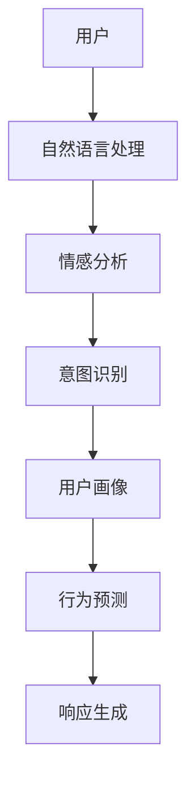
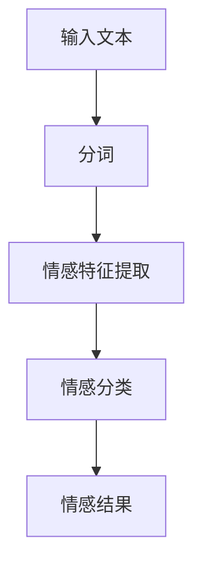
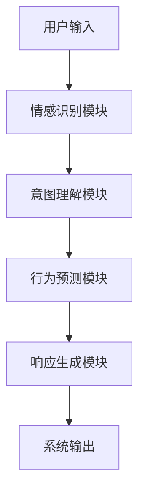
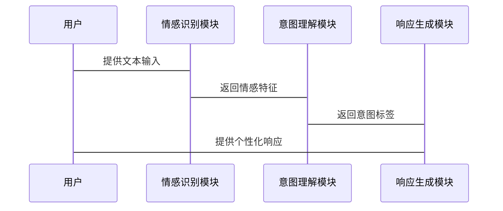

                 


# 构建具有同理心的AI Agent交互系统

## 关键词：AI Agent、同理心、情感计算、人机交互、系统架构、算法原理

## 摘要：  
随着人工智能技术的快速发展，AI Agent（智能体）在人机交互中的应用越来越广泛。然而，现有的AI Agent系统往往缺乏对用户情感和需求的深度理解，导致用户体验不佳。本文将探讨如何构建一个具有同理心的AI Agent交互系统，通过情感计算、意图识别等技术，使AI Agent能够更好地理解用户需求，提供更加个性化的服务。文章从背景、核心概念、算法原理到系统架构设计、项目实战，全面解析构建具有同理心的AI Agent交互系统的方法和实现细节。

---

# 第1章 背景介绍

## 1.1 AI Agent的基本概念  
AI Agent（智能体）是指能够感知环境并采取行动以实现目标的智能系统。它可以是一个软件程序、机器人或其他智能设备。AI Agent的核心特征包括自主性、反应性、目标导向性和社会性。与传统交互系统相比，AI Agent能够主动理解和响应用户的需求，提供更加智能化的服务。

## 1.2 同理心在AI交互系统中的重要性  
同理心是指个体能够理解和共情他人情感的能力。在人机交互中，同理心使得AI Agent能够更准确地理解用户的情感和意图，从而提供更贴心的服务。例如，在客服系统中，一个具有同理心的AI Agent能够识别用户的焦虑情绪，并主动提供安慰和解决方案，显著提升用户体验。

## 1.3 当前AI Agent交互系统的发展现状  
目前，AI Agent在各个领域得到了广泛应用，例如智能音箱、聊天机器人、推荐系统等。然而，大多数系统仍局限于基于规则的响应，缺乏对用户情感和深层需求的理解。这使得用户体验难以达到预期，用户对AI Agent的信任和满意度也受到限制。

## 1.4 本章小结  
本章介绍了AI Agent的基本概念，强调了同理心在人机交互中的重要性，并指出现有系统的不足。接下来，我们将深入探讨同理心AI Agent的核心概念和相关技术。

---

# 第2章 同理心AI Agent的核心概念与联系

## 2.1 同理心计算模型  
同理心计算模型是实现AI Agent具有同理心的关键技术。它通过分析用户的情感、意图和行为，生成相应的响应。

### 2.1.1 情感识别与计算  
情感识别是通过自然语言处理和情感分析技术，识别用户表达的情感（如高兴、生气、悲伤等）。情感计算模型可以将用户的情感强度量化，为后续的响应生成提供依据。

### 2.1.2 意图识别与预测  
意图识别是通过分析用户的语言和行为，预测用户的深层需求。例如，当用户说“我需要帮助”，系统不仅要识别用户的意图，还要预测用户可能需要的具体帮助类型。

### 2.1.3 用户行为分析与情感关联  
用户的行为（如点击、输入内容）可以反映其情感状态。通过分析用户的行为数据，系统可以进一步验证和补充情感计算的结果。

## 2.2 同理心计算的关键技术  
同理心计算涉及多种技术，包括自然语言处理、情感分析、用户画像等。

### 2.2.1 自然语言处理技术  
自然语言处理（NLP）是实现情感识别和意图理解的基础。通过NLP技术，系统能够解析用户的语言内容，提取情感和意图信息。

### 2.2.2 情感分析模型  
情感分析模型是基于机器学习或深度学习的情感计算技术。常用的模型包括支持向量机（SVM）、长短时记忆网络（LSTM）等。

### 2.2.3 用户画像与行为建模  
用户画像是基于用户行为数据构建的用户模型，用于预测用户的偏好和行为。行为建模有助于系统更准确地理解用户的需求。

## 2.3 同理心计算模型的对比分析  
不同同理心计算模型在性能和实现方式上存在差异。下表对比了三种主流模型的优缺点：

| 模型名称       | 优点                           | 缺点                           |
|----------------|--------------------------------|--------------------------------|
| 基于规则的模型 | 实现简单，适用于特定场景       | 灵活性差，难以应对复杂场景     |
| 机器学习模型   | 高度灵活，能够处理复杂场景     | 需要大量数据训练，计算资源消耗大 |
| 深度学习模型   | 高精度，能够捕捉复杂情感特征   | 实现复杂，对硬件要求较高       |

## 2.4 实体关系图（Mermaid流程图）  
以下是一个简单的实体关系图，展示了同理心计算模型的主要组件及其交互关系：



---

# 第3章 同理心AI Agent的算法原理

## 3.1 情感计算算法  
情感计算算法是实现同理心AI Agent的核心技术之一。

### 3.1.1 情感计算的基本原理  
情感计算通过分析用户的情感特征（如语调、语速、关键词等），生成情感强度和情感类型。例如，当用户说“我感到非常失望”，系统可以计算出用户的情感强度为0.8，情感类型为“悲伤”。

### 3.1.2 情感分类算法  
情感分类算法基于机器学习或深度学习模型，将用户的情感表达分类为正面、负面或中性。常用算法包括支持向量机（SVM）、随机森林（Random Forest）和卷积神经网络（CNN）。

### 3.1.3 情感计算的流程图（Mermaid）  
以下是一个情感计算流程图：



### 3.1.4 情感计算的实现代码  
以下是基于Python的情感分类代码示例：

```python
import numpy as np
from sklearn.svm import SVC

# 数据预处理
X = np.array([[0.5, 0.3], [0.7, 0.8], [0.2, 0.4]])
y = np.array([0, 1, 0])  # 0表示负面，1表示正面

# 训练模型
model = SVC()
model.fit(X, y)

# 预测
new_sample = np.array([[0.6, 0.7]])
print(model.predict(new_sample))
```

## 3.2 意图识别算法  
意图识别算法通过分析用户的语言和行为，预测用户的深层需求。

### 3.2.1 意图识别的基本原理  
意图识别通常基于自然语言处理和机器学习技术。系统通过分析用户的语言内容，提取关键词和上下文信息，生成意图标签。

### 3.2.2 意图识别的实现代码  
以下是基于Python的意图识别代码示例：

```python
from sklearn.feature_extraction.text import TfidfVectorizer
from sklearn.naive_bayes import MultinomialNB

# 数据预处理
texts = ["我需要帮助", "你能告诉我时间吗", "请推荐电影"]
labels = ["帮助", "时间", "推荐"]

# 特征提取
vectorizer = TfidfVectorizer()
X = vectorizer.fit_transform(texts)

# 训练模型
model = MultinomialNB()
model.fit(X, labels)

# 预测
new_text = "请给我推荐一部电影"
new_X = vectorizer.transform([new_text])
print(model.predict(new_X))
```

---

# 第4章 同理心AI Agent的系统架构设计

## 4.1 系统功能设计  
同理心AI Agent系统主要包括以下几个功能模块：

1. **情感识别模块**：负责识别用户的情感特征。
2. **意图理解模块**：负责分析用户的意图需求。
3. **行为预测模块**：基于用户行为数据，预测用户的后续行为。
4. **响应生成模块**：根据情感和意图生成个性化的响应。

## 4.2 系统架构设计（Mermaid架构图）  
以下是一个同理心AI Agent系统的架构图：



## 4.3 系统接口设计  
系统接口设计需要考虑模块之间的数据传递和交互方式。例如，情感识别模块和意图理解模块需要通过共享数据结构进行通信。

## 4.4 系统交互流程图（Mermaid序列图）  
以下是一个系统交互流程图：



---

# 第5章 项目实战：构建具有同理心的AI Agent

## 5.1 环境配置  
为了实现同理心AI Agent，我们需要以下环境和工具：

1. **编程语言**：Python
2. **深度学习框架**：TensorFlow或PyTorch
3. **自然语言处理库**：spaCy或NLTK
4. **机器学习库**：scikit-learn

## 5.2 核心代码实现  
以下是同理心AI Agent的核心代码实现：

```python
import numpy as np
from sklearn.svm import SVC
from sklearn.feature_extraction.text import TfidfVectorizer

# 情感识别模块
def sentiment_classifier(X_train, y_train):
    model = SVC()
    model.fit(X_train, y_train)
    return model

# 意图理解模块
def intent_classifier(X_train, y_train):
    model = MultinomialNB()
    model.fit(X_train, y_train)
    return model

# 系统交互模块
def main():
    # 数据预处理
    texts = ["我感到非常失望", "你能告诉我时间吗", "请推荐一部电影"]
    labels_sentiment = [0, 1, 2]  # 0: 悲伤, 1: 中性, 2: 请求
    labels_intent = [0, 1, 2]    # 0: 帮助, 1: 时间, 2: 推荐

    # 特征提取
    vectorizer = TfidfVectorizer()
    X = vectorizer.fit_transform(texts)

    # 训练情感分类模型
    model_sentiment = sentiment_classifier(X, labels_sentiment)

    # 训练意图分类模型
    model_intent = intent_classifier(X, labels_intent)

    # 用户输入
    user_input = "我感到非常悲伤"
    new_X = vectorizer.transform([user_input])

    # 情感识别
    sentiment = model_sentiment.predict(new_X)[0]
    print(f"情感识别结果: {sentiment}")

    # 意图识别
    intent = model_intent.predict(new_X)[0]
    print(f"意图识别结果: {intent}")

if __name__ == "__main__":
    main()
```

## 5.3 案例分析  
以用户输入“我感到非常悲伤”为例，系统首先识别用户的情感为“悲伤”，然后预测用户的意图可能是寻求安慰。最终，系统生成相应的响应，例如：“我能为你做些什么吗？如果你愿意，我很乐意倾听。”

---

# 第6章 最佳实践与小结

## 6.1 最佳实践  
1. **数据质量**：确保训练数据的多样性和代表性。
2. **模型优化**：通过交叉验证和超参数调优提升模型性能。
3. **用户隐私**：在处理用户数据时，确保用户隐私和数据安全。
4. **持续学习**：通过在线学习和反馈机制，不断优化系统性能。

## 6.2 小结  
本文详细介绍了构建具有同理心的AI Agent交互系统的方法和实现细节。通过情感计算和意图识别技术，系统能够更好地理解用户需求，提供更加个性化的服务。未来，随着人工智能技术的不断发展，具有同理心的AI Agent将在更多领域得到广泛应用。

---

# 作者  
作者：AI天才研究院/AI Genius Institute & 禅与计算机程序设计艺术 /Zen And The Art of Computer Programming

