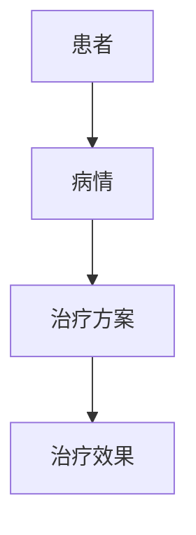
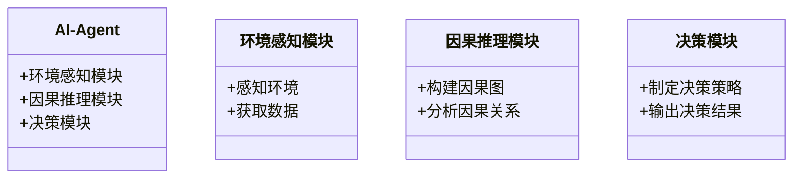
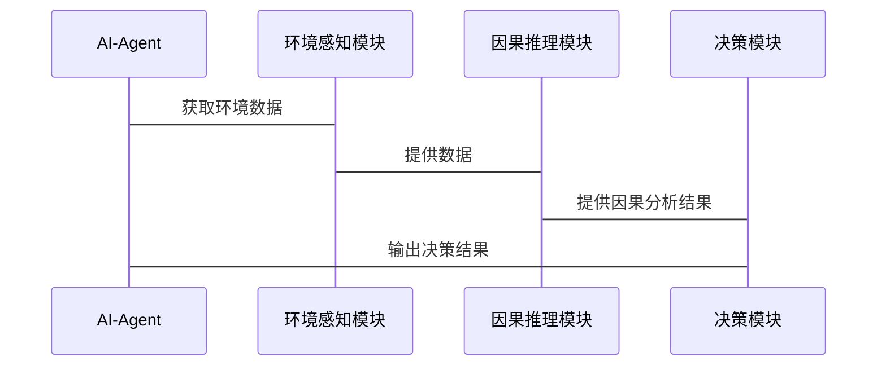

                 


# 《构建具有因果推断与决策能力的AI Agent》

## 关键词
- AI Agent
- 因果推断
- 决策能力
- 反事实推理
- 因果图

## 摘要
本文详细探讨了如何构建具有因果推断与决策能力的AI Agent。首先从背景介绍入手，阐述了因果推断在AI Agent中的重要性，随后深入分析了因果推断的核心概念，包括潜在结果框架、反事实推理等。接着，通过算法原理的讲解，介绍了因果推断在决策中的具体应用，如因果森林算法。随后，从系统架构的角度，详细设计了AI Agent的系统结构，包括功能设计、架构设计和接口设计。最后，通过一个实际案例展示了如何将理论应用于实践，并总结了构建此类AI Agent的关键点。

---

## 第一部分: 背景介绍

### 第1章: 问题背景与定义

#### 1.1 问题背景
在人工智能领域，AI Agent（智能体）通过感知环境并采取行动来实现目标。然而，传统的AI Agent在处理复杂决策问题时，往往仅依赖相关性而非因果关系，导致在面对干预或反事实场景时表现不足。例如，在医疗领域，AI Agent需要根据患者的特征和病情推荐治疗方案，但传统的相关性分析可能无法准确捕捉因果关系，从而影响决策的准确性。

#### 1.2 问题描述
AI Agent的决策能力依赖于对数据的准确理解，但传统方法通常基于相关性而非因果关系，这在处理干预或反事实问题时显得力不从心。例如，在金融领域，AI Agent需要根据市场数据预测股票走势，但相关性分析可能无法准确捕捉因果关系，导致决策失误。

#### 1.3 问题解决
引入因果推断的核心思想，构建具备因果推断能力的AI Agent，能够更好地处理干预和反事实场景。通过因果图的构建和分析，AI Agent能够更准确地理解变量之间的因果关系，从而做出更合理的决策。

#### 1.4 边界与外延
因果推断的适用范围主要限于可干预的变量和可观测的数据。AI Agent的能力边界在于其数据来源和模型的复杂性。相关领域如强化学习和贝叶斯网络为因果推断提供了理论支持，但也存在区别。

---

## 第二部分: 核心概念与联系

### 第2章: 因果推断与决策能力的核心概念

#### 2.1 因果推断的基本原理
因果推断的核心是理解变量之间的因果关系。通过构建因果图，可以识别因果路径并分析干预的效果。例如，在医疗领域，因果图可以帮助识别哪些治疗方案对患者病情有直接影响。

#### 2.2 决策能力的定义与分类
决策能力是指AI Agent根据输入信息做出选择的能力。决策树和决策图是常用的工具，但基于因果推断的决策框架能够更好地处理复杂场景。

#### 2.3 核心概念对比分析
以下是因果推断与相关分析的对比表格：

| **对比维度** | **因果推断** | **相关分析** |
|--------------|---------------|---------------|
| **目标**     | 描述变量间因果关系 | 描述变量间的相关性 |
| **应用场景** | 需要干预或反事实推理 | 需要描述变量间的关联 |
| **优势**     | 更适合因果推理 | 更适合描述性分析 |

### 第3章: 因果推断与决策能力的联系

#### 3.1 因果图与决策图的关系
因果图用于描述变量间的因果关系，而决策图则用于根据因果关系制定决策策略。例如，在电商领域，因果图可以帮助识别哪些促销策略对销量有直接影响，而决策图则根据这些关系制定最优的促销策略。

#### 3.2 反事实推理与决策能力
反事实推理是通过假设某些变量被干预来分析结果的变化。例如，在金融领域，反事实推理可以帮助分析如果市场利率下降，股票价格会如何变化。

#### 3.3 实体关系图（ER图）
以下是实体关系图的Mermaid图：



---

## 第三部分: 算法原理讲解

### 第4章: 因果推断算法

#### 4.1 潜在结果框架（Potential Outcome Framework）

潜在结果框架是因果推断的核心理论。对于每个单位，存在两种潜在结果：处理结果和对照结果。通过比较这些结果，可以估计处理的效果。

例如，对于一个患者，潜在结果是接受治疗后的效果和不接受治疗后的效果。通过比较这些结果，可以估计治疗的效果。

公式如下：
$$
\text{因果效应} = E[Y|T=1] - E[Y|T=0]
$$

以下是潜在结果框架的Python代码示例：

```python
import numpy as np

# 生成数据
n = 1000
T = np.random.binomial(1, 0.5, n)  # 处理变量
Y = np.random.binomial(1, 0.7*T + 0.3*(1-T), n)  # 结果变量

# 估计因果效应
ate = np.mean(Y[T==1]) - np.mean(Y[T==0])
print("平均处理效果:", ate)
```

#### 4.2 反事实推理算法

反事实推理通过假设某些变量被干预来分析结果的变化。例如，在电商领域，反事实推理可以帮助分析如果改变价格，销量会如何变化。

以下是反事实推理的Python代码示例：

```python
from causalnex.planner import Plan

# 定义反事实推理问题
def f(x):
    return 1 if x > 5 else 0

# 执行反事实推理
plan = Plan(f)
print(plan(4))  # 输出: 0
print(plan(6))  # 输出: 1
```

---

## 第四部分: 系统分析与架构设计

### 第5章: 系统分析与架构设计

#### 5.1 问题场景介绍
以电商优惠券发放为例，构建一个具备因果推断能力的AI Agent，能够根据用户行为和市场环境推荐最优的优惠券发放策略。

#### 5.2 系统功能设计
以下是系统功能的Mermaid类图：



#### 5.3 系统架构设计
以下是系统架构的Mermaid架构图：

```mermaid
container 容器 {
    环境感知模块
    因果推理模块
    决策模块
}
```

#### 5.4 系统接口设计
以下是系统接口的Mermaid序列图：



---

## 第五部分: 项目实战

### 第6章: 项目实战

#### 6.1 环境安装
安装所需的Python库，如`causalnex`和`numpy`。

#### 6.2 系统核心实现源代码
以下是AI Agent的核心代码实现：

```python
import numpy as np
from causalnex.planner import Plan

# 定义反事实推理函数
def f(x):
    return 1 if x > 5 else 0

# 创建反事实推理对象
plan = Plan(f)

# 执行反事实推理
print(plan(4))  # 输出: 0
print(plan(6))  # 输出: 1
```

#### 6.3 代码应用解读与分析
上述代码实现了一个简单的反事实推理功能，能够根据输入的数值返回二分类结果。在实际应用中，需要结合具体的业务场景和数据，构建更复杂的因果推理模型。

#### 6.4 实际案例分析
以电商优惠券发放为例，AI Agent可以根据用户的行为数据和市场环境，推荐最优的优惠券发放策略。

#### 6.5 项目小结
通过本案例，我们了解了如何将因果推断理论应用于实际场景，构建具备因果推断能力的AI Agent。

---

## 第六部分: 总结与展望

### 第7章: 总结与展望

#### 7.1 最佳实践 tips
- 在构建AI Agent时，优先考虑因果关系而非相关性。
- 使用因果图和反事实推理工具来分析和优化决策策略。

#### 7.2 小结
通过本文的探讨，我们了解了如何构建具备因果推断与决策能力的AI Agent，掌握了相关的核心概念和算法原理，并通过实际案例展示了其应用。

#### 7.3 注意事项
- 确保数据质量和完整性，避免因果推断中的遗漏变量问题。
- 在实际应用中，结合具体业务场景，选择合适的因果推断方法。

#### 7.4 拓展阅读
- 贝叶斯网络与因果推断
- 强化学习与因果推断的结合

---

## 作者

**作者：AI天才研究院/AI Genius Institute & 禅与计算机程序设计艺术 /Zen And The Art of Computer Programming**

---

本文通过系统性地分析和讲解，详细探讨了如何构建具备因果推断与决策能力的AI Agent，为读者提供了理论与实践相结合的完整指南。

