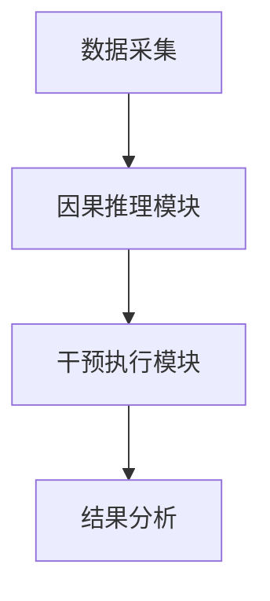

                 


# 构建具有因果推理与干预能力的AI Agent

> 关键词：AI Agent，因果推理，干预能力，因果图，反事实推理

> 摘要：本文将探讨如何构建一个具备因果推理与干预能力的AI Agent。通过分析因果推理的基本概念、数学模型和算法原理，结合系统架构设计和项目实战，详细阐述如何实现一个能够理解因果关系并进行有效干预的AI Agent。本文将从理论到实践，逐步引导读者掌握相关技术。

---

## 第1章 AI Agent与因果推理概述

### 1.1 AI Agent的基本概念

#### 1.1.1 AI Agent的定义与分类
AI Agent（智能体）是指在环境中能够感知并自主行动以实现目标的实体。根据智能体的智能水平，可以分为反应式智能体、基于模型的智能体、效用智能体和学习智能体。AI Agent的核心能力包括感知、决策、行动和学习。

#### 1.1.2 因果推理在AI Agent中的重要性
因果推理是指理解变量之间的因果关系，从而能够推断出因果关系，并基于此进行预测和干预。在AI Agent中，因果推理是实现自主决策和干预能力的关键。传统的相关性分析只能发现变量之间的关联，而无法确定因果关系，因此在复杂环境中，因果推理是必不可少的能力。

#### 1.1.3 干预能力的核心意义
干预能力是指AI Agent能够基于因果推理的结果，主动改变某些变量以达到预期目标的能力。干预能力使得AI Agent不仅仅是一个被动的观察者，而是一个能够主动影响环境的主体。在医疗、金融、交通等领域，干预能力能够显著提升AI Agent的应用效果。

---

### 1.2 问题背景与目标

#### 1.2.1 当前AI Agent的局限性
现有的AI Agent大多基于相关性分析，难以处理复杂的因果关系。在面对干预问题时，往往只能根据相关性进行推测，而无法准确推断因果关系，导致干预效果不稳定。

#### 1.2.2 因果推理与干预的必要性
因果推理与干预能力是提升AI Agent智能水平的关键。通过因果推理，AI Agent能够理解变量之间的因果关系，从而在干预时能够更准确地预测结果。干预能力使得AI Agent能够在复杂环境中主动调整策略，实现更优的目标。

#### 1.2.3 本书的目标与范围
本书旨在介绍如何构建一个具备因果推理与干预能力的AI Agent。通过理论与实践结合，详细讲解因果推理的基本概念、算法原理、系统架构设计以及项目实现。本书适用于AI领域的研究人员、工程师以及对因果推理感兴趣的读者。

---

### 1.3 本书结构与方法论

#### 1.3.1 目录概览
- 第1章：AI Agent与因果推理概述
- 第2章：因果关系的基本概念
- 第3章：干预的基本概念与数学模型
- 第4章：AI Agent的系统架构设计
- 第5章：项目实战：构建具备因果推理与干预能力的AI Agent
- 第6章：总结与展望

#### 1.3.2 方法论与技术路线
本书采用理论与实践相结合的方法，通过数学公式、算法流程图和代码示例，详细讲解因果推理与干预能力的实现过程。技术路线包括：因果关系建模、反事实推理、系统架构设计和项目实现。

#### 1.3.3 预期成果与应用场景
通过本书的学习，读者将能够理解因果推理的核心概念，掌握干预能力的实现方法，并能够将这些技术应用到实际项目中。应用场景包括医疗诊断、金融风险控制、自动驾驶等领域。

---

## 第2章 因果关系的基本概念

### 2.1 因果关系的定义与特征

#### 2.1.1 因果关系的定义
因果关系是指一个事件（原因）导致另一个事件（结果）的发生。因果关系的核心在于“原因导致结果”的内在联系。

#### 2.1.2 因果关系的三大特征
1. **时间顺序**：原因必须在结果之前发生。
2. **相关性**：因果关系必然伴随相关性，但相关性不一定意味着因果关系。
3. **干预可验证性**：可以通过干预实验来验证因果关系。

#### 2.1.3 因果关系与相关关系的区别
相关关系描述变量之间的关联，而因果关系描述变量之间的“原因与结果”关系。相关关系可以通过统计方法（如协方差、相关系数）计算，而因果关系需要通过实验或反事实推理来验证。

---

### 2.2 因果图模型

#### 2.2.1 因果图的基本结构
因果图（Causal Graph）是一种有向图，节点代表变量，边代表因果关系。例如，变量X对变量Y有因果关系，则用一条从X指向Y的边表示。

#### 2.2.2 贝叶斯网络与因果图的关系
贝叶斯网络是一种基于概率的图形化模型，因果图是贝叶斯网络的一种特殊情况，其中所有边的方向都表示因果关系。

#### 2.2.3 因果图的数学表示
因果图可以用概率分布和干预操作来表示。例如，P(Y | do(X)) 表示在干预X的情况下，Y的概率分布。

---

### 2.3 因果推断的基本原理

#### 2.3.1 因果推断的定义
因果推断是指通过数据和因果图模型，推断出变量之间的因果关系。

#### 2.3.2 因果推断的关键步骤
1. 建立因果图模型。
2. 识别因果效应。
3. 估计因果效应。

#### 2.3.3 因果推断的数学模型
因果推断的数学模型包括反事实框架和潜在结果框架。反事实框架通过考虑“如果X被设置为某个值，Y会是什么值”来推断因果效应。

---

## 第3章 干预的基本概念与数学模型

### 3.1 干预的定义与分类

#### 3.1.1 干预的定义
干预是指通过改变某些变量的值，以影响其他变量的结果。例如，在医疗领域，干预可以是给患者开某种药物。

#### 3.1.2 干预的分类
干预可以分为随机干预和确定性干预。随机干预是指在干预时，随机选择干预的值；确定性干预是指在干预时，确定选择干预的值。

#### 3.1.3 干预的数学表示
干预可以用do运算符表示。例如，do(X=x) 表示将变量X设置为x。

---

### 3.2 反事实推理

#### 3.2.1 反事实推理的定义
反事实推理是指在干预的情况下，推断出变量的结果。例如，如果X被设置为x，那么Y会是什么值。

#### 3.2.2 反事实推理的数学模型
反事实推理的数学模型可以表示为P(Y | do(X=x))，即在干预X=x的情况下，Y的概率分布。

#### 3.2.3 反事实推理的应用场景
反事实推理在因果推断和干预能力中广泛应用。例如，在医疗领域，可以通过反事实推理推断出不同药物对患者效果的影响。

---

### 3.3 干预效果的评估与优化

#### 3.3.1 干预效果的评估方法
干预效果可以通过实验数据或观察数据进行评估。实验数据通常通过随机对照试验获得，观察数据则通过统计方法分析。

#### 3.3.2 干预优化的数学模型
干预优化的数学模型可以基于强化学习或优化算法，通过不断调整干预策略，以最大化干预效果。

#### 3.3.3 干预优化的算法实现
干预优化可以通过强化学习算法实现。例如，使用Q-learning算法，通过不断试错，找到最优的干预策略。

---

## 第4章 AI Agent的系统架构设计

### 4.1 系统功能模块划分

#### 4.1.1 数据采集与处理模块
数据采集与处理模块负责从环境中采集数据，并进行预处理，使其适合因果推理和干预能力的实现。

#### 4.1.2 因果推理模块
因果推理模块负责建立因果图模型，并进行因果推断，识别因果关系。

#### 4.1.3 干预执行模块
干预执行模块负责根据因果推理结果，执行干预操作，并观察结果。

---

### 4.2 系统架构设计

#### 4.2.1 系统功能设计
系统功能包括数据采集、因果推理、干预执行和结果分析。通过这些功能的协同工作，实现AI Agent的因果推理与干预能力。

#### 4.2.2 系统架构图
以下是系统架构的Mermaid图：



---

### 4.3 系统接口设计

#### 4.3.1 系统接口
系统接口包括数据输入接口、因果推理接口和干预执行接口。数据输入接口负责接收外部数据，因果推理接口负责返回因果关系，干预执行接口负责执行干预操作。

#### 4.3.2 接口交互流程
1. 数据采集模块通过数据输入接口接收数据。
2. 因果推理模块通过因果推理接口返回因果关系。
3. 干预执行模块通过干预执行接口执行干预操作。
4. 结果分析模块分析干预结果。

---

## 第5章 项目实战：构建具备因果推理与干预能力的AI Agent

### 5.1 环境配置

#### 5.1.1 安装依赖
需要安装以下Python库：
- `networkx`：用于构建因果图。
- `doWhy`：用于因果推理。
- `scikit-learn`：用于机器学习。

#### 5.1.2 环境配置代码
```python
pip install networkx doWhy scikit-learn
```

---

### 5.2 系统核心实现

#### 5.2.1 因果图构建
使用`networkx`库构建因果图。

```python
import networkx as nx

G = nx.DiGraph()
G.add_edges_from([('X', 'Y'), ('Z', 'Y')])
```

#### 5.2.2 因果推断
使用`doWhy`库进行因果推断。

```python
from dowhy import CausalModel

model = CausalModel(
    graph="X -> Y, Z -> Y",
    treatment="X",
    outcome="Y"
)
```

#### 5.2.3 干预执行
执行干预操作并分析结果。

```python
 intervened_data = model.refute_graph()
```

---

### 5.3 实际案例分析

#### 5.3.1 医疗领域案例
在医疗领域，可以通过因果推理和干预能力，推断出不同药物对患者效果的影响。

#### 5.3.2 金融领域案例
在金融领域，可以通过因果推理和干预能力，评估不同投资策略的效果。

---

## 第6章 总结与展望

### 6.1 总结
本文详细介绍了如何构建一个具备因果推理与干预能力的AI Agent。通过因果图模型、反事实推理和系统架构设计，实现了AI Agent的因果推理与干预能力。

### 6.2 展望
未来，随着因果推理和干预能力的不断发展，AI Agent将能够处理更复杂的因果关系，并在更多领域中得到应用。同时，结合强化学习和分布式系统，将进一步提升AI Agent的智能水平。

---

## 作者：AI天才研究院 & 禅与计算机程序设计艺术

---

感谢您的阅读！如需进一步探讨，请随时联系。

