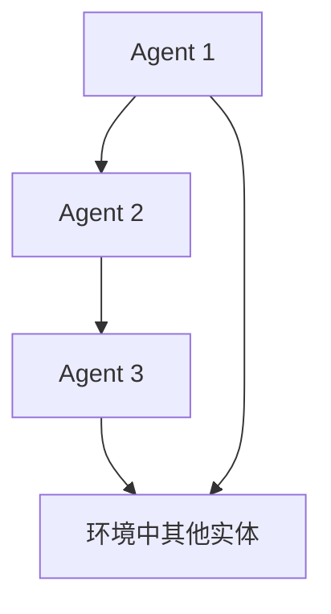
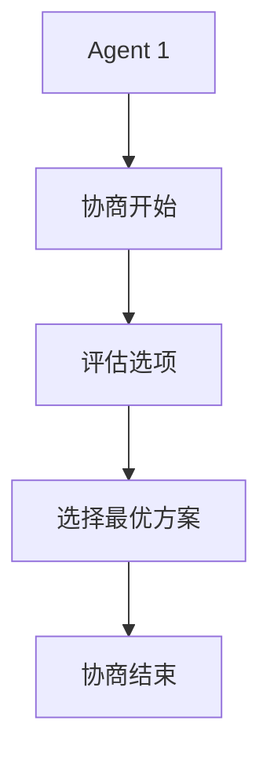

                 


# 构建具有多Agent协同决策能力的系统

## 关键词：多Agent系统、协同决策、分布式计算、人工智能、系统架构设计

## 摘要：  
多Agent协同决策系统是一种基于分布式计算和人工智能技术的高级系统架构，通过多个智能体（Agent）之间的协作和决策，实现复杂任务的高效完成。本文将从多Agent系统的背景与概念出发，深入分析其核心算法原理，结合实际案例，探讨系统架构设计与实现方案，并总结最佳实践。

---

# 第一部分: 多Agent协同决策系统概述

## 第1章: 多Agent系统背景与概念

### 1.1 多Agent系统的发展背景  
#### 1.1.1 从单体系统到分布式系统的发展  
单体系统在早期的软件开发中占据主导地位，但随着业务复杂性和规模的不断扩大，分布式系统的市场需求逐渐增加。多Agent系统的出现，为分布式计算提供了新的解决方案。  

#### 1.1.2 Agent概念的起源与演进  
Agent（智能体）的概念最早可以追溯到人工智能领域的研究，随着分布式系统的发展，Agent的概念逐渐从理论走向实践，形成了多Agent系统的核心基础。  

#### 1.1.3 多Agent系统在现代信息技术中的地位  
在现代信息技术中，多Agent系统已成为分布式计算、人工智能和大数据处理的重要组成部分，广泛应用于自动驾驶、智能城市、分布式任务调度等领域。  

---

### 1.2 多Agent系统的定义与特点  
#### 1.2.1 Agent的基本定义  
Agent是一种能够感知环境并采取行动的实体，具备智能性和反应性。  

#### 1.2.2 多Agent系统的核心特征  
- **智能性**：每个Agent都具备一定的智能性，能够独立决策和行动。  
- **分布式性**：多个Agent分布在不同的节点上，通过通信和协作完成任务。  
- **动态性**：系统环境和任务需求可能动态变化，Agent需要实时调整策略。  

#### 1.2.3 多Agent与传统分布式系统的主要区别  
| 特性 | 多Agent系统 | 传统分布式系统 |  
|------|--------------|-----------------|  
| 协作性 | 高           | 低或无          |  
| 智能性 | 高           | 无或低          |  
| 自适应性 | 强           | 弱              |  

---

### 1.3 多Agent系统的应用场景  
#### 1.3.1 分布式计算中的Agent角色  
在分布式系统中，Agent可以作为任务执行者、资源分配者或协调者，优化系统性能。  

#### 1.3.2 人工智能中的多Agent协同  
人工智能中的多Agent系统可以实现智能体之间的协同推理、学习和决策。  

#### 1.3.3 多Agent在实时系统中的应用  
实时系统中，多Agent可以通过分布式决策提高系统的实时性和可靠性。  

---

### 1.4 多Agent系统的核心问题  
#### 1.4.1 协同决策问题  
多Agent系统的核心问题是如何实现多个Agent之间的高效协同决策。  

#### 1.4.2 Agent之间的通信与协调  
Agent之间的通信和协调是实现协同决策的关键，涉及信息交换、任务分配和冲突解决。  

#### 1.4.3 多Agent系统的复杂性与挑战  
多Agent系统的复杂性主要来源于Agent之间的交互、动态环境的变化以及系统的可扩展性问题。  

---

### 1.5 本章小结  
本章介绍了多Agent系统的发展背景、核心概念和应用场景，并总结了多Agent系统面临的主要挑战。

---

# 第二部分: 多Agent协同决策的核心概念

## 第2章: 多Agent系统中的核心概念与联系

### 2.1 Agent的基本属性与特征  
#### 2.1.1 智能性  
Agent具备感知环境和采取行动的能力，能够根据环境信息做出决策。  

#### 2.1.2 反应性  
Agent能够实时感知环境变化，并迅速做出反应，调整自身的行动策略。  

#### 2.1.3 社会性  
Agent具备与其他Agent或用户进行交互的能力，能够通过通信和协作完成复杂任务。  

---

### 2.2 多Agent系统中的实体关系  
#### 2.2.1 Agent与环境的关系  
Agent通过感知环境信息并采取行动，与环境交互。  

#### 2.2.2 Agent与Agent之间的关系  
Agent之间的关系可以是协作、竞争或中立，具体取决于任务需求和系统设计。  

#### 2.2.3 Agent与任务的关系  
每个Agent都有一个或多个任务目标，任务目标驱动Agent的行为。  

---

### 2.3 多Agent系统的核心要素对比表  
| 要素 | 特性 | 描述 |  
|------|------|------|  
| Agent | 智能性 | 能够感知环境并采取行动 |  
| 任务 | 目标性 | 明确的协同目标 |  
| 通信 | 交互性 | Agent之间的信息交换机制 |  
| 协调 | 合作性 | 多Agent协同完成复杂任务 |  

---

### 2.4 多Agent系统实体关系图  


---

## 第3章: 多Agent协同决策算法概述

### 3.1 基础算法原理  
#### 3.1.1 协同决策的基本流程  
1. **信息收集**：Agent感知环境信息并共享给其他Agent。  
2. **协商与决策**：Agent之间通过协商或拍卖机制确定任务分配。  
3. **行动执行**：根据协商结果，Agent执行相应的任务。  

#### 3.1.2 基于协商的多Agent决策算法  
协商算法通过Agent之间的对话达成一致，解决任务分配问题。  

#### 3.1.3 基于拍卖的多Agent决策算法  
拍卖算法通过竞争机制确定最优任务分配，通常用于资源有限的场景。  

---

### 3.2 协商算法的实现  
#### 3.2.1 协商的基本步骤  
1. **协商开始**：多个Agent发起协商请求。  
2. **评估选项**：Agent评估可能的协商方案。  
3. **选择最优方案**：基于效用函数选择最优方案。  
4. **协商结束**：Agent确认协商结果并执行任务。  

#### 3.2.2 基于Distributed Negotiation的算法  
Distributed Negotiation算法通过局部协商实现全局最优决策。  

#### 3.2.3 协商中的冲突解决机制  
冲突解决机制用于处理协商中的矛盾，确保协商过程顺利进行。  

---

### 3.3 拍卖算法的实现  
#### 3.3.1 拍卖的基本原理  
拍卖算法通过竞争机制确定任务分配，通常用于资源分配问题。  

#### 3.3.2 基于Vickrey拍卖的算法  
Vickrey拍卖是一种密封投标拍卖机制，适用于多Agent环境中的任务分配。  

#### 3.3.3 拍卖中的激励机制  
激励机制用于提高Agent的参与积极性，确保拍卖过程的公平性和有效性。  

---

### 3.4 多Agent协同决策的数学模型  
$$ \text{最大化 } U_i(x) \text{，其中 } U_i \text{ 是 Agent } i \text{ 的效用函数} $$  

---

### 3.5 协商算法的流程图  


---

## 第4章: 多Agent系统中的通信与协调机制

### 4.1 通信协议的设计  
#### 4.1.1 通信协议的基本要求  
通信协议需要支持Agent之间的信息交换和任务协调。  

#### 4.1.2 通信协议的实现  
通过消息队列或事件驱动的方式实现Agent之间的通信。  

---

### 4.2 协调机制的设计  
#### 4.2.1 基于事件的协调机制  
事件驱动的协调机制能够快速响应环境变化，适用于实时系统。  

#### 4.2.2 基于轮询的协调机制  
轮询机制适用于非实时系统，通过周期性检查状态实现协调。  

---

## 第5章: 多Agent系统中的任务分配与调度

### 5.1 任务分配的基本原理  
任务分配是多Agent系统中的核心问题，需要考虑任务的复杂性和资源的分配效率。  

---

### 5.2 任务调度的算法实现  
#### 5.2.1 基于负载均衡的任务调度算法  
负载均衡算法通过动态分配任务，确保系统资源的充分利用。  

#### 5.2.2 基于优先级的任务调度算法  
优先级调度算法适用于任务紧急性不同的场景，确保高优先级任务优先执行。  

---

### 5.3 任务分配的数学模型  
$$ \text{最大化 } \sum_{i=1}^{n} U_i(x_i) \text{，其中 } U_i \text{ 是 Agent } i \text{ 的效用函数，} x_i \text{ 是分配给 Agent } i \text{ 的任务} $$  

---

# 第三部分: 多Agent协同决策系统的架构设计与实现

## 第6章: 系统架构设计

### 6.1 问题场景介绍  
#### 6.1.1 问题背景  
本文将通过一个实际案例，介绍多Agent协同决策系统的架构设计与实现。  

#### 6.1.2 项目介绍  
项目目标是设计一个高效的多Agent协同决策系统，实现任务分配、通信和协调的核心功能。  

---

### 6.2 系统功能设计  
#### 6.2.1 领域模型设计  
领域模型描述了系统的功能模块及其之间的关系，使用Mermaid类图表示。  

#### 6.2.2 系统架构设计  
系统架构设计包括核心组件（如任务管理模块、通信模块、决策模块）及其交互关系，使用Mermaid架构图表示。  

---

### 6.3 系统接口设计  
#### 6.3.1 Agent与环境的接口设计  
Agent需要通过接口感知环境信息并采取行动。  

#### 6.3.2 Agent之间的接口设计  
Agent之间通过通信接口进行信息交换和任务协调。  

---

### 6.4 系统交互设计  
#### 6.4.1 系统交互流程图  
使用Mermaid序列图表示系统交互过程，包括任务分配、通信和执行等步骤。  

---

## 第7章: 项目实战

### 7.1 环境安装与配置  
#### 7.1.1 系统环境要求  
需要安装Python、Java等开发工具，以及相关的库和框架。  

#### 7.1.2 开发环境配置  
配置开发环境，包括代码仓库、依赖管理等。  

---

### 7.2 系统核心实现  
#### 7.2.1 Agent类的实现  
实现一个基本的Agent类，包含感知环境、决策和执行功能。  

#### 7.2.2 任务管理模块的实现  
实现任务管理模块，负责任务分配和调度。  

---

### 7.3 代码实现与解读  
#### 7.3.1 Agent类的代码实现  
```python
class Agent:
    def __init__(self, id):
        self.id = id
        self.environment = None
        self.task = None

    def perceive_environment(self):
        # 实现环境感知逻辑
        pass

    def decide(self):
        # 实现决策逻辑
        pass

    def act(self):
        # 实现行动逻辑
        pass
```

#### 7.3.2 任务管理模块的代码实现  
```python
class TaskManager:
    def __init__(self):
        self.tasks = []
        self.agents = []

    def assign_task(self, task, agent):
        agent.task = task
        self.tasks.remove(task)

    def get_available_agents(self):
        return [agent for agent in self.agents if not agent.task]
```

---

### 7.4 案例分析与详细解读  
#### 7.4.1 案例背景  
通过一个具体案例，介绍多Agent协同决策系统的实际应用。  

#### 7.4.2 系统实现过程  
详细解读系统的实现过程，包括代码编写、调试和优化。  

#### 7.4.3 案例分析  
分析案例的实现效果，总结经验教训。  

---

## 第8章: 最佳实践与小结

### 8.1 最佳实践  
#### 8.1.1 系统设计中的注意事项  
在系统设计中，需要考虑可扩展性、可维护性和性能优化。  

#### 8.1.2 开发中的常见问题及解决方案  
总结开发过程中常见的问题及解决方案，帮助读者避免踩坑。  

---

### 8.2 小结  
本文通过理论与实践相结合的方式，详细介绍了多Agent协同决策系统的构建过程，包括系统架构设计、算法实现和项目实战等内容。  

---

## 作者：AI天才研究院/AI Genius Institute & 禅与计算机程序设计艺术 /Zen And The Art of Computer Programming

