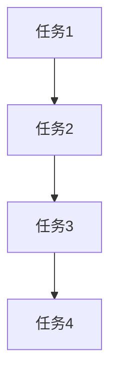
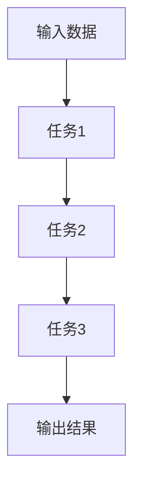
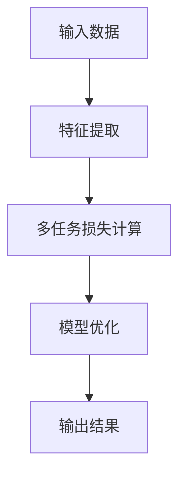
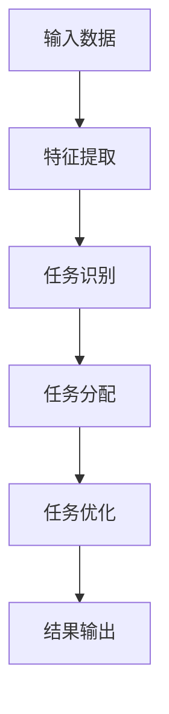
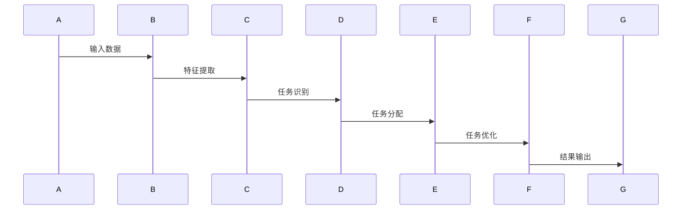

                 

# 构建具有多任务学习能力的AI Agent

> 关键词：多任务学习，AI Agent，人工智能，机器学习，深度学习

> 摘要：本文详细探讨了构建具有多任务学习能力的AI Agent的理论基础、算法实现和系统架构。从多任务学习的基本概念到实际应用，从算法原理到系统设计，从项目实战到最佳实践，为读者提供全面的指导和深入的分析。

---

# 第1章: 多任务学习与AI Agent概述

## 1.1 多任务学习的背景与问题背景

### 1.1.1 多任务学习的定义与核心概念

多任务学习（Multi-Task Learning, MTL）是指让一个模型同时学习多个相关任务，以便在多个任务上实现更好的性能。与单任务学习不同，MTL通过共享参数或特征，能够在多个任务之间产生协同效应，从而提高模型的泛化能力和效率。

### 1.1.2 AI Agent的基本概念与功能

AI Agent（人工智能代理）是指能够感知环境、做出决策并采取行动的智能体。它通常具备感知、推理、规划和执行等功能，能够在复杂环境中自主完成任务。

### 1.1.3 多任务学习在AI Agent中的重要性

在AI Agent中，多任务学习可以帮助代理在同一框架下处理多种任务，如感知、推理和规划，从而提高其综合能力和效率。

---

## 1.2 多任务学习与传统单任务学习的对比

### 1.2.1 单任务学习的局限性

单任务学习专注于单一任务，难以扩展到多个任务，且在处理相关任务时可能需要重新训练模型，效率较低。

### 1.2.2 多任务学习的核心优势

多任务学习通过共享参数和特征，能够在多个任务之间实现知识迁移，提高模型的泛化能力和训练效率。

### 1.2.3 多任务学习与AI Agent的结合

通过多任务学习，AI Agent可以在同一框架下处理多种任务，如视觉识别、语音处理和决策优化，从而实现更复杂的智能行为。

---

## 1.3 多任务学习的数学模型与基本原理

### 1.3.1 多任务学习的数学表达式

多任务学习的目标是最小化多个任务的损失函数之和，数学表达式如下：

$$ \mathcal{L}(\theta) = \sum_{i=1}^{n} \mathcal{L}_i(\theta) $$

其中，$\theta$是模型参数，$\mathcal{L}_i$是第$i$个任务的损失函数。

### 1.3.2 多任务学习的基本假设与约束

多任务学习假设多个任务之间存在某种关系，可以通过共享参数或特征来实现任务间的协同优化。

### 1.3.3 多任务学习的优化目标

多任务学习的目标是在多个任务上实现均衡或最优性能，通常通过加权损失函数来实现：

$$ \mathcal{L}(\theta) = \sum_{i=1}^{n} \lambda_i \mathcal{L}_i(\theta) $$

其中，$\lambda_i$是第$i$个任务的权重系数。

---

## 1.4 多任务学习的应用场景与案例

### 1.4.1 多任务学习在自然语言处理中的应用

例如，在文本分类任务中，可以通过多任务学习同时优化文本理解、情感分析和实体识别等多个任务。

### 1.4.2 多任务学习在计算机视觉中的应用

例如，在图像识别任务中，可以通过多任务学习同时优化目标检测、图像分割和图像生成等多个任务。

### 1.4.3 多任务学习在机器人控制中的应用

例如，在机器人导航任务中，可以通过多任务学习同时优化路径规划、目标识别和运动控制等多个任务。

---

## 1.5 本章小结

本章介绍了多任务学习的基本概念、核心优势和应用场景，为后续章节的深入分析奠定了基础。

---

# 第2章: 多任务学习的核心概念与联系

## 2.1 多任务学习的正则化方法

### 2.1.1 参数共享的正则化方法

参数共享是一种常见的正则化方法，通过共享某些参数，可以减少参数数量并促进任务间的知识共享。

### 2.1.2 任务间关系的正则化方法

任务间关系的正则化方法通过引入任务间关系的约束，如相似性或依赖关系，来优化模型性能。

### 2.1.3 基于权重分配的正则化方法

基于权重分配的正则化方法通过动态调整任务权重，可以在多个任务之间实现均衡优化。

---

## 2.2 多任务学习中的任务间关系分析

### 2.2.1 任务间相似性分析

任务间相似性分析可以通过计算任务之间的相似性度量，如余弦相似性，来确定任务之间的关系。

### 2.2.2 任务间冲突分析

任务间冲突分析用于识别任务之间的冲突，以便在优化过程中进行适当调整。

### 2.2.3 任务间依赖关系分析

任务间依赖关系分析用于确定任务之间的依赖关系，从而优化模型的结构和参数。

---

## 2.3 多任务学习的算法选择与对比

### 2.3.1 基于梯度的多任务学习算法

基于梯度的多任务学习算法通过同时优化多个任务的损失函数，利用梯度下降方法进行优化。

### 2.3.2 基于强化学习的多任务学习算法

基于强化学习的多任务学习算法通过引入强化学习机制，利用奖励函数来优化多个任务的性能。

### 2.3.3 基于分解的多任务学习算法

基于分解的多任务学习算法通过分解任务间的依赖关系，分别优化每个子任务的性能。

---

## 2.4 多任务学习的核心概念与联系

### 2.4.1 多任务学习的实体关系图（ER图）

### 2.4.2 多任务学习的流程图（Mermaid）

### 2.4.3 多任务学习的算法选择与优化

多任务学习的算法选择需要考虑任务之间的关系、模型的复杂度和优化目标等因素。

---

## 2.5 本章小结

本章详细分析了多任务学习的核心概念与任务间关系，为后续章节的算法实现提供了理论支持。

---

# 第3章: 多任务学习的算法原理与数学模型

## 3.1 多任务学习的算法原理

### 3.1.1 多任务学习的算法流程

### 3.1.2 多任务学习的数学模型

多任务学习的数学模型通常包括特征提取、任务损失和模型优化三个部分。

---

## 3.2 多任务学习的数学模型

### 3.2.1 多任务学习的损失函数

多任务学习的损失函数可以表示为多个任务损失函数的加权和：

$$ \mathcal{L}(\theta) = \sum_{i=1}^{n} \lambda_i \mathcal{L}_i(\theta) $$

其中，$\lambda_i$是第$i$个任务的权重系数。

### 3.2.2 多任务学习的优化目标

多任务学习的优化目标是最小化多个任务的损失函数之和：

$$ \min_{\theta} \mathcal{L}(\theta) $$

---

## 3.3 多任务学习的算法实现

### 3.3.1 基于深度学习的多任务学习算法

基于深度学习的多任务学习算法通常使用神经网络模型，通过共享某些层来实现任务间的知识共享。

### 3.3.2 基于强化学习的多任务学习算法

基于强化学习的多任务学习算法通过引入奖励机制，优化多个任务的性能。

### 3.3.3 基于集成学习的多任务学习算法

基于集成学习的多任务学习算法通过集成多个任务的模型，实现综合性能的提升。

---

## 3.4 多任务学习的算法选择与优化

### 3.4.1 算法选择的考虑因素

算法选择需要考虑任务之间的关系、模型的复杂度和优化目标等因素。

### 3.4.2 算法优化的策略

算法优化可以通过调整权重系数、引入正则化项和优化学习率等方式实现。

---

## 3.5 本章小结

本章详细分析了多任务学习的算法原理和数学模型，为构建具有多任务学习能力的AI Agent提供了理论基础。

---

# 第4章: 系统分析与架构设计

## 4.1 系统分析

### 4.1.1 问题场景介绍

在构建具有多任务学习能力的AI Agent时，需要考虑多个任务之间的关系和优化目标。

### 4.1.2 系统功能设计

系统功能设计包括任务识别、任务分配、任务优化和结果输出等部分。

---

## 4.2 系统架构设计

### 4.2.1 系统架构图（Mermaid）

### 4.2.2 系统接口设计

系统接口设计需要定义输入数据格式、任务识别接口和任务优化接口等。

### 4.2.3 系统交互序列图（Mermaid）

---

## 4.3 本章小结

本章详细分析了系统分析与架构设计，为构建具有多任务学习能力的AI Agent提供了实现框架。

---

# 第5章: 项目实战

## 5.1 环境安装

### 5.1.1 安装Python环境

安装Python 3.8及以上版本。

### 5.1.2 安装依赖库

安装PyTorch、TensorFlow和Scikit-learn等依赖库。

---

## 5.2 系统核心实现

### 5.2.1 多任务学习模型实现

实现一个多任务学习模型，包括特征提取、任务识别和任务优化等部分。

### 5.2.2 任务识别代码实现

编写任务识别的代码，使用预训练模型进行特征提取。

### 5.2.3 任务优化代码实现

编写任务优化的代码，使用优化算法进行模型参数调整。

---

## 5.3 代码应用解读与分析

### 5.3.1 代码结构

代码结构包括数据加载、模型定义、任务识别和任务优化等部分。

### 5.3.2 代码实现细节

代码实现细节包括模型参数共享、任务损失计算和优化算法选择等。

---

## 5.4 实际案例分析

### 5.4.1 案例背景

以一个多任务学习任务为例，如同时进行图像分类和目标检测。

### 5.4.2 案例实现

实现一个多任务学习模型，分别优化图像分类和目标检测任务。

### 5.4.3 案例分析

分析模型在多个任务上的性能表现，优化任务权重和模型参数。

---

## 5.5 项目小结

本章通过实际案例分析，展示了如何构建具有多任务学习能力的AI Agent，并提供了详细的代码实现和性能分析。

---

# 第6章: 最佳实践与拓展阅读

## 6.1 本章小结

总结本文的核心内容和主要结论，强调多任务学习在AI Agent中的重要性。

---

## 6.2 最佳实践 tips

### 6.2.1 算法选择建议

根据任务之间的关系和模型的复杂度，选择合适的多任务学习算法。

### 6.2.2 系统设计建议

在系统设计中，需要考虑任务分配、任务优化和结果输出等部分。

### 6.2.3 项目实施建议

在项目实施中，需要注重任务权重的调整和模型参数的优化。

---

## 6.3 注意事项

### 6.3.1 任务权重的调整

任务权重的调整需要根据实际任务的重要性进行动态调整。

### 6.3.2 模型的复杂度控制

模型的复杂度控制需要在任务性能和计算效率之间找到平衡点。

### 6.3.3 系统的可扩展性

系统的可扩展性需要在设计阶段充分考虑，以便后续任务的扩展和优化。

---

## 6.4 拓展阅读

### 6.4.1 多任务学习的最新研究

推荐阅读最新的多任务学习研究论文，了解领域内的最新进展。

### 6.4.2 AI Agent的前沿技术

推荐阅读AI Agent相关的前沿技术，如强化学习和自适应学习等。

### 6.4.3 多任务学习的工具与库

推荐使用PyTorch和TensorFlow等深度学习框架，以及相关的多任务学习工具库。

---

# 作者：AI天才研究院/AI Genius Institute & 禅与计算机程序设计艺术 /Zen And The Art of Computer Programming

---

以上为《构建具有多任务学习能力的AI Agent》的技术博客文章的详细内容。

