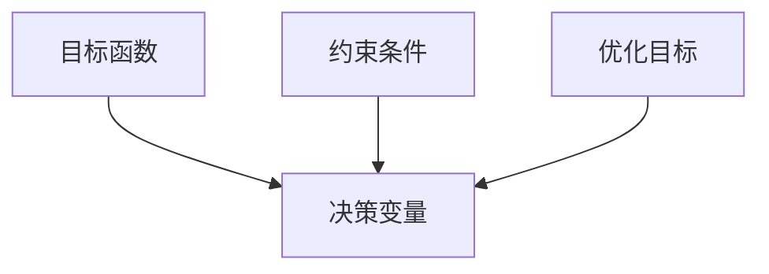
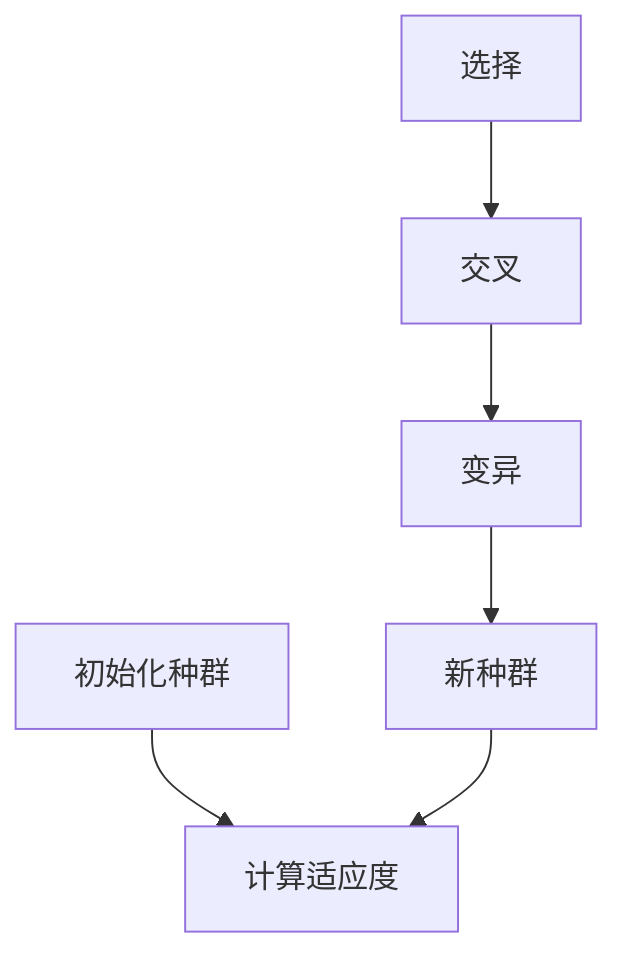
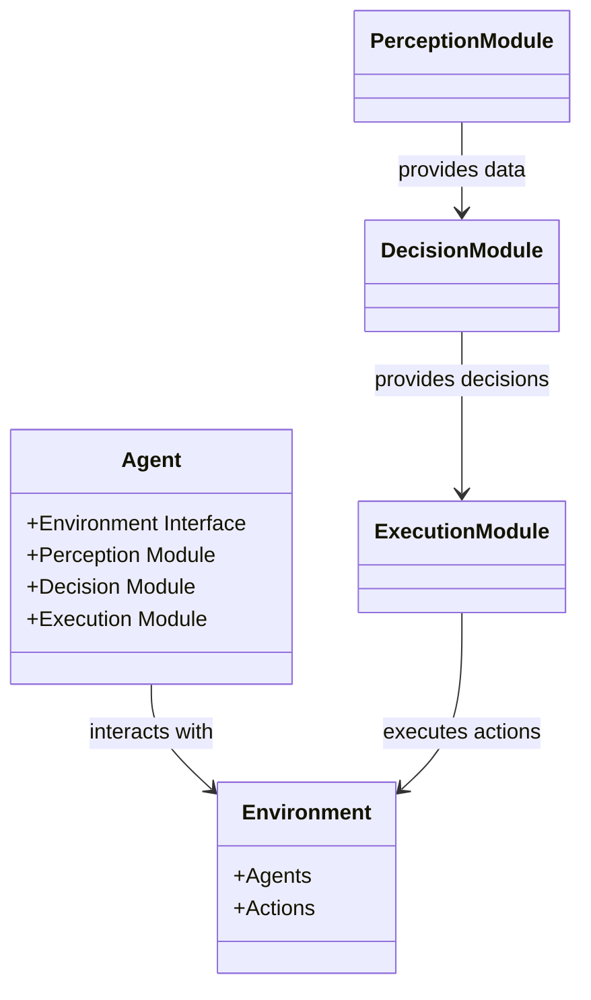

                 


# 构建具有多目标优化能力的AI Agent

> 关键词：多目标优化，AI Agent，算法原理，系统设计，项目实战

> 摘要：本文详细探讨了构建具有多目标优化能力的AI Agent的关键技术与实现方法。从多目标优化的基本概念到AI Agent的设计与实现，文章通过理论与实践相结合的方式，深入分析了多目标优化的核心原理、算法实现、系统架构设计及项目实战案例，帮助读者全面理解并掌握构建此类AI Agent的能力。

---

# 第一部分: 多目标优化与AI Agent基础

## 第1章: 多目标优化与AI Agent概述

### 1.1 多目标优化问题的背景

#### 1.1.1 从单目标优化到多目标优化的演进

单目标优化在传统AI系统中占据主导地位，例如在机器学习中的分类和回归问题。然而，随着应用场景的复杂化，单一目标的优化往往无法满足实际需求。例如，在自动驾驶系统中，不仅要考虑速度，还要考虑安全性和能耗，这就需要多目标优化来平衡这些相互竞争的目标。

#### 1.1.2 多目标优化的核心概念

多目标优化（Multi-Objective Optimization，MOO）是一种在多个相互冲突的目标之间寻找折中的方法。其核心在于找到一个Pareto最优解集，这些解在不损害任何一个目标的情况下无法进一步优化其他目标。

#### 1.1.3 AI Agent与多目标优化的关系

AI Agent（智能体）是指在环境中能够感知并自主决策以实现目标的实体。多目标优化为AI Agent提供了处理复杂决策问题的能力，使其能够在多个目标之间权衡，做出更优的决策。

### 1.2 多目标优化的数学模型与特点

#### 1.2.1 多目标优化的数学模型

多目标优化问题可以表示为：

$$ \min_{x} f_1(x), f_2(x), \dots, f_k(x) $$
$$ \text{subject to } g_1(x) \geq 0, g_2(x) \geq 0, \dots, g_m(x) \geq 0 $$

其中，$f_i(x)$ 是目标函数，$g_j(x)$ 是约束条件。

#### 1.2.2 多目标优化的核心特点

- ** Pareto 优势**： Pareto最优解是在不损害其他目标的情况下无法进一步优化的目标。
- **目标冲突**：多个目标之间通常存在冲突，需要在目标之间进行权衡。
- **解集多样性**：与单目标优化不同，多目标优化通常会生成一个解集，而不是单一最优解。

#### 1.2.3 多目标优化与单目标优化的对比

| 特性                | 单目标优化          | 多目标优化          |
|---------------------|---------------------|---------------------|
| 优化目标            | 单一目标            | 多个目标            |
| 解空间              | 单一最优解          | Pareto最优解集      |
| 应用场景            | 简单决策问题        | 复杂决策问题        |

### 1.3 AI Agent的基本概念与特点

#### 1.3.1 AI Agent的定义

AI Agent是一种能够感知环境、自主决策并采取行动以实现目标的智能实体。它可以是一个软件程序，也可以是一个物理机器人。

#### 1.3.2 AI Agent的核心特点

- **自主性**：能够在没有外部干预的情况下自主运作。
- **反应性**：能够感知环境并实时调整行为。
- **目标导向性**：所有行为都以实现特定目标为导向。

#### 1.3.3 多目标优化在AI Agent中的作用

多目标优化帮助AI Agent在实现多个目标时找到最优平衡点，例如在自动驾驶中平衡速度和安全性。

### 1.4 多目标优化在AI Agent中的应用场景

#### 1.4.1 多目标优化的典型应用场景

- **自动驾驶**：平衡速度、安全性和能耗。
- **智能投资**：在风险和收益之间找到平衡点。
- **机器人路径规划**：在路径长度和能耗之间进行优化。

#### 1.4.2 AI Agent在企业中的应用前景

AI Agent可以在企业资源规划、供应链管理等领域发挥重要作用，通过多目标优化提升企业的运营效率。

#### 1.4.3 多目标优化与AI Agent结合的挑战

- **目标冲突**：如何在多个目标之间找到最优解。
- **计算复杂度**：多目标优化通常比单目标优化复杂。
- **实时性要求**：在实时决策中如何快速找到最优解。

### 1.5 本章小结

本章介绍了多目标优化的基本概念、AI Agent的定义及其特点，并探讨了多目标优化在AI Agent中的应用场景和挑战。

---

## 第2章: 多目标优化的核心概念与联系

### 2.1 多目标优化的核心原理

#### 2.1.1 优化问题的数学表示

多目标优化问题可以表示为：

$$ \min_{x} f_1(x), f_2(x), \dots, f_k(x) $$
$$ \text{subject to } g_1(x) \geq 0, g_2(x) \geq 0, \dots, g_m(x) \geq 0 $$

其中，$f_i(x)$ 是目标函数，$g_j(x)$ 是约束条件。

#### 2.1.2 多目标优化的 Pareto 优化

Pareto优化是指在不损害其他目标的情况下优化一个或多个目标的过程。 Pareto最优解是在无法进一步优化一个目标而不损害其他目标的情况下，对所有目标而言都无法进一步优化的解。

#### 2.1.3 多目标优化与单目标优化的对比

多目标优化与单目标优化的主要区别在于优化目标的数量和处理方式。单目标优化只考虑单一目标，而多目标优化需要在多个目标之间进行权衡。

### 2.2 多目标优化的核心概念对比

| 特性                | 单目标优化          | 多目标优化          |
|---------------------|---------------------|---------------------|
| 优化目标            | 单一目标            | 多个目标            |
| 解空间              | 单一最优解          | Pareto最优解集      |
| 应用场景            | 简单决策问题        | 复杂决策问题        |

### 2.3 多目标优化的 ER 实体关系图



---

## 第3章: 多目标优化算法原理与实现

### 3.1 多目标优化算法的分类

#### 3.1.1 基于权重的优化算法

基于权重的优化算法通过为每个目标分配权重，将多目标问题转化为单目标优化问题。

#### 3.1.2 基于 Pareto 前沿的优化算法

基于 Pareto 前沿的优化算法直接寻找 Pareto最优解集，例如多目标遗传算法（NSGA-II）。

#### 3.1.3 基于分解的优化算法

基于分解的优化算法将多目标问题分解为多个单目标子问题，分别进行优化。

### 3.2 常见多目标优化算法介绍

#### 3.2.1 遗传算法（Genetic Algorithm）

遗传算法是一种基于生物进化原理的优化算法，适用于多目标优化问题。其流程如下：



#### 3.2.2 粒子群优化算法（Particle Swarm Optimization）

粒子群优化算法是一种基于群体智能的优化算法，适用于多目标优化问题。

---

### 3.3 多目标优化算法的数学模型

以 NSGA-II 算法为例，其数学模型如下：

$$ \text{最大化 } f_1(x), f_2(x), \dots, f_k(x) $$
$$ \text{subject to } g_1(x) \leq 0, g_2(x) \leq 0, \dots, g_m(x) \leq 0 $$

---

## 第4章: AI Agent的系统设计

### 4.1 AI Agent的系统架构

AI Agent 的系统架构通常包括感知层、决策层和执行层。

#### 4.1.1 感知层

感知层负责从环境中获取信息，例如通过传感器或API接口获取数据。

#### 4.1.2 决策层

决策层负责对感知到的信息进行分析和处理，生成决策。

#### 4.1.3 执行层

执行层负责根据决策层的指令执行具体操作。

### 4.2 系统架构设计

AI Agent的系统架构设计如下：



---

## 第5章: 项目实战——构建一个多目标优化AI Agent

### 5.1 项目介绍

本项目旨在构建一个多目标优化AI Agent，用于智能投资顾问。

### 5.2 核心代码实现

#### 5.2.1 环境安装

```bash
pip install numpy matplotlib scikit-learn
```

#### 5.2.2 核心代码

```python
import numpy as np
from sklearn.metrics import accuracy_score

# 定义目标函数
def f1(x):
    return x[0]

def f2(x):
    return -x[1]

# 定义约束条件
def g1(x):
    return x[0] + x[1] - 2

# 定义优化问题
problem = {
    'n_vars': 2,
    'n_obj': 2,
    'n_constr': 1,
    '_lb': [0, 0],
    'ub': [2, 2],
    'constraints': [{'type': 'ineq', 'fun': g1}]
}

# 使用NSGA-II算法求解
from nsga import nsga2

pop = nsga2(problem, pop_size=100, generations=100)
pop.run()
```

### 5.3 项目总结

本项目展示了如何使用多目标优化算法构建AI Agent，帮助读者理解理论与实践的结合。

---

## 第6章: 高级主题与未来展望

### 6.1 多目标优化的前沿技术

#### 6.1.1 神经符号优化

神经符号优化结合了神经网络和符号推理，能够处理复杂的多目标优化问题。

#### 6.1.2 多目标强化学习

多目标强化学习是一种结合强化学习和多目标优化的新兴领域，具有广泛的应用前景。

### 6.2 多目标优化与AI Agent的未来发展方向

#### 6.2.1 动态多目标优化

动态多目标优化问题是当前研究的热点，适用于实时变化的环境。

#### 6.2.2 多智能体协作优化

多智能体协作优化是未来的一个重要研究方向，适用于复杂的协作环境。

---

## 第7章: 最佳实践与注意事项

### 7.1 选择合适的算法

选择算法时需要考虑问题的规模、目标数量和约束条件。

### 7.2 处理动态环境

在动态环境中，需要使用适应性优化算法，能够实时调整决策。

### 7.3 拓展阅读

推荐阅读《多目标优化算法与应用》和《AI Agent原理与实践》。

---

## 第8章: 总结

### 8.1 本章回顾

本文详细介绍了多目标优化的核心概念、算法实现、系统设计及项目实战。

### 8.2 未来展望

多目标优化与AI Agent的结合将推动AI技术的发展，未来将有更多的应用场景。

---

## 作者信息

作者：AI天才研究院/AI Genius Institute & 禅与计算机程序设计艺术 /Zen And The Art of Computer Programming

---

感谢您的阅读！希望本文能为您提供有价值的信息和启发！

